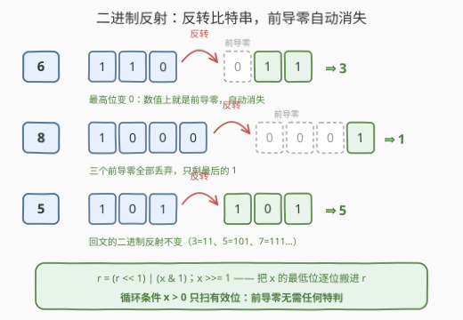
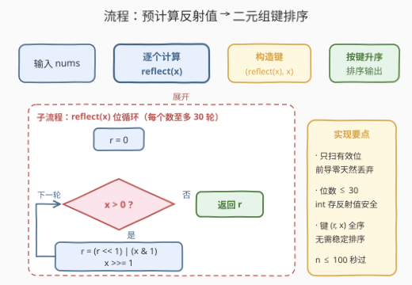

# LeetCode 二进制反射排序 题解

## 1. 题目概述

- **标题 / 题号**：二进制反射排序（#3769，easy）
- **链接**：https://leetcode.cn/problems/sort-integers-by-binary-reflection/
- **难度**：简单
- **标签**：数组、排序、位运算

**题意**：给你一个正整数数组 `nums`。定义**二进制反射**：把一个**正整数**的二进制表示按顺序反转（**忽略前导零**）后，将得到的二进制数转为十进制的结果。

请按每个元素的二进制反射值的**升序**对数组排序；若两个不同的数反射值相同，则**较小**的原始数排在前面。返回排序后的数组。

**示例 1**：

```text
输入：nums = [4,5,4]
输出：[4,4,5]
解释：4 → 100 → 001 → 1；5 → 101 → 101 → 5。
     反射值为 [1, 5, 1]，按 (反射值, 原值) 排序得 [4, 4, 5]。
```

**示例 2**：

```text
输入：nums = [3,6,5,8]
输出：[8,3,6,5]
解释：3 → 11 → 3；6 → 110 → 011 → 3；5 → 101 → 5；8 → 1000 → 0001 → 1。
     反射值为 [3, 3, 5, 1]。3 与 6 反射值同为 3，按原值升序 3 在前。
```

**约束**：

- $1 \le \text{nums.length} \le 100$
- $1 \le \text{nums}[i] \le 10^9$

> 💡 **审题关键**：① 「忽略前导零」说明反转后的串按**数值**解释（`001` 就是 $1$），不必保留定宽；② 平局规则「反射值相同按原值升序」翻译成代码就是排序键取**二元组** $(\mathrm{reflect}(x),\, x)$；③ $10^9 < 2^{30}$，每个数至多 30 个二进制位，$n \le 100$——任何 $O(nW)$ 或 $O(n \log n)$ 的做法都绰绰有余，官方提示也直白写着 "Simulate and sort as described"。

## 2. 解题思路

### 2.1 暴力思路：字符串模拟

最直接的模拟：把 $x$ 转成二进制字符串，整体反转，再按二进制解析回整数。以 Python 为例，一行就能算出反射值：

```python
int(bin(x)[2:][::-1], 2)
```

`bin(6)[2:]` 得到 `"110"`，`[::-1]` 反转成 `"011"`，`int(..., 2)` 解析时前导零自动失效，结果为 $3$。这个写法完全能通过本题（$n \le 100$），但它把「位」绕道「字符」再绕回「位」，每次反射要经历两次进制转换 + 一次字符串分配。面试白板上手写时，进制转换的边界（`bin` 前缀 `0b`、空串、基数参数）也是容易翻车的小坑。

更本质的问题是：**反转一个数的二进制位，本就是位运算的一等公民操作**——不需要经过字符串。

### 2.2 核心观察：位运算反转 + 二元组排序键



**观察一：反射 = 从最低位逐位读出、从高位往低位拼接。**

设 $x$ 的有效二进制位（无前导零）从高到低为 $b_{k-1} b_{k-2} \cdots b_1 b_0$（$b_{k-1} = 1$），则

$$x = \sum_{i=0}^{k-1} b_i \cdot 2^{i}, \qquad \mathrm{reflect}(x) = \sum_{i=0}^{k-1} b_i \cdot 2^{k-1-i}$$

——只是把每个位的**权重** $2^i$ 换成了**镜像权重** $2^{k-1-i}$。逐位实现只需三行：

```text
r = 0
while x > 0:      # 循环条件 x > 0：只扫有效位
    r = (r << 1) | (x & 1)   # 取 x 的最低位，追加到 r 的低位
    x >>= 1
```

每轮把 $x$ 的最低位「搬」到 $r$ 的最低位（$r$ 先左移腾位）：$x$ 从低位到高位逐位出队，$r$ 从高位到低位逐位入队，正好完成反转。**前导零无需任何特判**——循环只在 $x > 0$ 时执行，天然只处理有效位；若反转后最高位恰是 0（如 `110 → 011`），它在数值上本来就是前导零，自动消失。

**观察二：平局规则 = 二元组排序键。**

排序键取 $(\mathrm{reflect}(x),\, x)$，按字典序比较：先比反射值，再比原值。这与题意逐字对应，且键是**全序**——不依赖排序算法的稳定性，任何比较排序都正确。

> 💡 一句话：本题 = 「位运算求反射值」+「二元组 key 排序」两块积木，各三行代码，拼起来就是完整解。

### 2.3 算法流程图



**逻辑执行步骤**：

| 步骤 | 操作 | 说明 |
|------|------|------|
| ① 预计算 | 对每个 $x$ 跑位循环得 $\mathrm{reflect}(x)$ | $O(nW)$，$W \le 30$ |
| ② 构造键 | 每个元素挂上键 $(\mathrm{reflect}(x),\, x)$ | 平局规则在此落地 |
| ③ 排序 | 按键字典序升序排序 | $O(n \log n)$ 次比较，每次 $O(1)$ |
| ④ 还原 | 按排序后的键顺序取出原值 | 相同元素（键全等）顺序任意 |

> ⚠️ 若不预计算、把 `reflect` 直接写进比较器，每次比较都要重算两个反射值，总代价变成 $O(nW \log n)$——本题数据下无伤大雅，但「先算键、再排序」是自定义排序的通用工程习惯，值得固化。

### 2.4 示例演算

**示例 2：`nums = [3, 6, 5, 8]`**

| 原数 $x$ | 二进制 | 反转（前导零消失） | 反射值 $r$ | 排序键 $(r, x)$ |
|---------|--------|-------------------|-----------|----------------|
| 3 | `11` | `11` | 3 | $(3, 3)$ |
| 6 | `110` | `011` | 3 | $(3, 6)$ |
| 5 | `101` | `101` | 5 | $(5, 5)$ |
| 8 | `1000` | `0001` | 1 | $(1, 8)$ |

键的升序：$(1,8) < (3,3) < (3,6) < (5,5)$，故输出 `[8, 3, 6, 5]` ✓——正是 $3$ 与 $6$ 这对反射值相同的数，靠键的第二元分出了先后。

**边界情形**：全部元素相同（如示例 1 的两个 $4$）时键完全相等，输出即输入顺序的排列，结果唯一；$x = 1$（二进制 `1`）反射值仍是 $1$；数组长度为 $1$ 时无需排序，直接返回。

## 3. 参考代码

### C++

```cpp
class Solution {
public:
    int reflect(int x) {
        int r = 0;
        while (x > 0) {
            r = (r << 1) | (x & 1);
            x >>= 1;
        }
        return r;
    }

    vector<int> sortByReflection(vector<int>& nums) {
        int n = nums.size();
        vector<pair<int, int>> keyed;   // (反射值, 原值)
        keyed.reserve(n);
        for (int x : nums) keyed.emplace_back(reflect(x), x);
        sort(keyed.begin(), keyed.end());
        vector<int> ans;
        ans.reserve(n);
        for (auto& [r, x] : keyed) ans.push_back(x);
        return ans;
    }
};
```

> 💡 **写法要点**：
> - 先把每个数算好键存进 `keyed`，再对键排序——比较阶段零次 `reflect` 调用；
> - `pair` 的默认比较就是字典序，`(r, x)` 直接对应平局规则，无需手写比较器；
> - $\mathrm{reflect}(x)$ 的位数不超过 $x$ 本身（$\le 30$ 位），值 $< 2^{30}$，`int` 安全。

### Python

```python
class Solution:
    def sortByReflection(self, nums: List[int]) -> List[int]:
        def reflect(x: int) -> int:
            r = 0
            while x:
                r = (r << 1) | (x & 1)
                x >>= 1
            return r
        return sorted(nums, key=lambda x: (reflect(x), x))
```

> 💡 **写法要点**：
> - `sorted` 的 `key` 返回元组 `(r, x)`，Python 对元组按字典序比较，平局规则一行落地；
> - 每个元素 `key` 只被调用一次（CPython 的装饰-排序-去装饰机制），自带「预计算」效果；
> - 若追求极致简短可用一行式 `int(bin(x)[2:][::-1], 2)`，但位循环版不依赖语言糖、白板可写。

## 4. 复杂度分析

| 维度 | 复杂度 | 说明 |
|------|--------|------|
| **时间** | $O(nW + n \log n)$，$W \le 30$ | 预计算 $n$ 个反射值各 $O(W)$；排序 $O(n \log n)$ 次键比较，每次 $O(1)$。$n = 100$ 时总计约数千次位操作 |
| **空间** | $O(n)$ | 存 $n$ 个二元组键（Python 的 `key` 机制同量级） |
| **量级判断** | $n \le 100$，$10^9 < 2^{30}$ | 数据范围只放过模拟，任何 $O(n \log n)$ 以上量级的多余设计都是负资产 |

## 5. 扩展：固定宽度反转 vs 变长反转

本题的反转是**变长**的：反射值的位宽由原数有效位决定，前导零消失。对照 [190. 颠倒二进制位](https://leetcode.cn/problems/reverse-bits/)的**固定 32 位**反转——`00000000000000000000000000000101` 反转后仍是 32 位、前导零保留在结果里——两者语义完全不同。固定宽度反转有经典的**分治移位**写法：用五轮「折半交换」完成，每轮 mask 一半位与另一半交换（$16 \leftrightarrow 16$、$8 \leftrightarrow 8$、……），$O(\log W)$ 次操作零循环；而本题的变长反转反而更适合朴素的逐位循环，因为位宽事先未知。

另两个小变体：若数组中大量重复元素、且 `reflect` 开销显著（比如位数极长的大整数），可加一层 `memoize` 缓存反射值；若被要求输出「每个数的反射值」而非排序，位循环可进一步改为**打表 + 字节拼接**（预计算 8 位反射表，按字节查表组合），即 190 题的分块查表技巧。

> ⚠️ 变长反转不存在「回文不变」之外的不动点：$\mathrm{reflect}(x) = x$ 当且仅当 $x$ 的二进制表示是回文（如 $5 = 101$、$3 = 11$），这与十进制的回文数判定（[9. 回文数](https://leetcode.cn/problems/palindrome-number/)）思路同源。

## 6. 面试要点

**Q1：为什么位循环不需要处理前导零？**

> 循环条件是 `x > 0`，而 `x` 的二进制表示本身不含前导零，因此循环恰好覆盖全部有效位。反转后若最高位为 0（如 `110 → 011`），该 0 在数值表示中本就是前导零，按整数存储时自动消失——「忽略前导零」是整数的天然属性，不是需要写代码实现的规则。

**Q2：反射值会溢出吗？**

> 不会。$x \le 10^9 < 2^{30}$，反射值的二进制位数不超过原数位数（$\le 30$），故 $\mathrm{reflect}(x) < 2^{30}$，`int` / `int32` 足够。若题目放宽到接近 `INT_MAX` 的数，反射值位数同样不超过原数，仍然安全；只有**固定宽度**反转（如 190 题反转 32 位）才可能把低位 1 顶到符号位之外。

**Q3：平局规则为什么用二元组键而不是依赖稳定排序？**

> 题意是「反射值相同，较小原数在前」——这是一个**显式的次级比较条件**，必须进入键（或比较器）才能保证；稳定排序只能保持**输入顺序**，若输入是 `[6, 3]`，稳定排序会输出 `[6, 3]`，违背题意。键 $(r, x)$ 构成全序，与排序算法是否稳定无关。

**Q4：把 `reflect` 直接写进比较器有什么问题？**

> 正确但低效：比较排序约 $O(n \log n)$ 次比较，每次比较触发两次 `reflect` 计算，总代价 $O(nW \log n)$；预计算键后比较降为 $O(1)$。本题 $n \le 100$ 无感，但这是「装饰-排序-去装饰」（decorate-sort-undecorate）的经典场景：**键计算重、比较次数多，就先算键**。

**Q5：字符串法 `int(bin(x)[2:][::-1], 2)` 与位循环如何取舍？**

> 两者结果恒等。字符串法短、意图直白，适合快速原型；位循环零字符串分配、无进制转换边界坑、语言无关，适合白板与性能敏感场景。面试中说清「反转位序 = 镜像权重 $\sum b_i 2^{k-1-i}$」的数学本质，比背出哪种写法更加分。

> 💡 **一句话总结**：3769 = 位循环求反射（`r = (r<<1) | (x&1)`，前导零天然消失）+ 二元组键 `(reflect(x), x)` 排序。两个带走的知识点：变长位反转的逐位搬运、显式平局规则必须写进排序键。

## 同类练习题

| # | 题目 | 与本题的关联 |
|---|------|-------------|
| 1356 | [根据数字二进制下 1 的数目排序](https://leetcode.cn/problems/sort-integers-by-the-number-of-1-bits/)（[题解](../1301-1400/1356_根据数字二进制下1的数目排序.md)） | 同为「按二进制性质定键、平局按原值」的自定义排序，几乎是本题的姊妹题 |
| 190 | [颠倒二进制位](https://leetcode.cn/problems/reverse-bits/)（[题解](../0101-0200/190_颠倒二进制位.md)） | 固定 32 位宽度的位反转，对照本题「变长、前导零消失」的语义差异 |
| 476 | [数字的补数](https://leetcode.cn/problems/number-complement/)（[题解](../0401-0500/476_数字的补数.md)） | 按有效位数取反，同练「只扫有效位、忽略前导零」的位运算边界感 |
| 2578 | [最小和分割](https://leetcode.cn/problems/split-with-minimum-sum/)（[题解](../2501-2600/2578_最小和分割.md)） | 把数字的数位拆开重排求最值，可视为「数位重排」的十进制版 |
