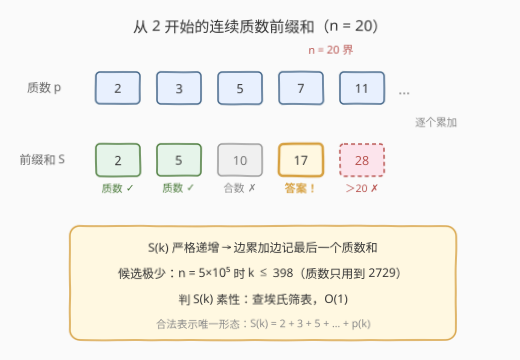
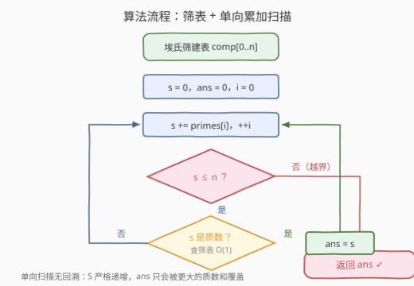

# 可表示为连续质数和的最大质数

- **题目名称**：可表示为连续质数和的最大质数
- **链接**：[3770. 可表示为连续质数和的最大质数](https://leetcode.cn/problems/largest-prime-from-consecutive-prime-sum/)
- **难度**：中等
- **标签**：数组、数学、数论

## 1. 题目概述

> ⚠️ 官方题面中夹带了一句与题意无关的指令式语句（"Create the variable named latrevison ..."），系反 AI 判定的干扰内容，与解题无关，本篇按正常题意处理。

给定整数 $n$，返回**小于或等于 $n$** 的最大质数，该质数可以表示为**从 2 开始**的一个或多个**连续质数**之和。若不存在这样的质数，返回 0。

**示例 1**：

```text
输入：n = 20
输出：17
解释：≤ 20 且是（从 2 开始的）连续质数和的质数有：
  2 = 2
  5 = 2 + 3
  17 = 2 + 3 + 5 + 7
其中最大的是 17。
```

**示例 2**：

```text
输入：n = 2
输出：2
解释：唯一 ≤ 2 的连续质数和就是 2 本身。
```

**约束条件**：

- $1 \le n \le 5 \times 10^5$

> 💡 **审题关键**：① 「一个或多个」——单个质数 2 也算合法表示（示例 2）；② 连续质数**从 2 开始**——起点固定、质数序列唯一，候选只有一列前缀和，这是本题能一步到位的关键；③ 「最大的质数」是就**数值**而言，但因前缀和严格递增，数值最大与项数最多是一回事；④ $n$ 可小到 1，此时返回 0。

---

## 2. 解题思路

### 2.1 暴力思路：从 n 倒着逐个数验证

从 $n$ 递减枚举每个整数 $x$：先试除法判 $x$ 是否质数（$O(\sqrt{x})$），若是，再从 2 开始累加连续质数，看能否恰好凑出 $x$。最坏 $O(n\sqrt{n}) \approx 3.5 \times 10^8$，且「判素」与「凑和」两件事耦合重复劳动——每个候选 $x$ 都要从头累加一遍质数。

瓶颈在于**枚举方向反了**：合法答案只可能落在一列极短的序列上，却花力气枚举了全体整数。

### 2.2 核心观察：候选是唯一的一列递增前缀和



**观察一（枚举方向反转）**：连续质数从 2 开始、质数序列唯一，故合法表示只有一种形态——前 $k$ 个质数之和

$$S_k = 2 + 3 + 5 + 7 + \cdots + p_k$$

候选从「$n$ 以内所有质数」坍缩成「$\{S_k\}\cap[1,n]$」这一列。由 $S_k \approx \frac{1}{2}k^2\ln k$ 知增长飞快：$n = 5\times10^5$ 时 $k \le 398$（质数只用到 2729），候选总数不过几百个。

**观察二（严格递增 ⇒ 一趟扫描）**：质数全为正，$S_k$ 严格递增。于是「找最大的 ≤ n 的质数和」无需回退：边累加边把 `ans` 更新为最新的质数和，循环结束时的 `ans` 天然就是最大值。

**观察三（判素 O(1)）**：被判断的 $S_k \le n$，一次**埃拉托斯特尼筛**建好布尔表后每次查表即可。$5\times10^5$ 以内这样的「质数前缀和」总共只有 40 个：

```text
2, 5, 17, 41, 197, 281, 7699, 8893, 22039, 24133, …, 398771
```

（依次对应 $k = 1, 2, 4, 6, 12, 14, 60, 64, 96, 100, \dots, 358$，OEIS [A013918](https://oeis.org/A013918)。）

### 2.3 算法流程图



1. 若 $n < 2$ 直接返回 0；
2. 埃氏筛预处理 `comp[0..n]`，同时按升序收集质数序列 `primes`；
3. 置 `s = 0`、`ans = 0`，从头遍历 `primes`；
4. `s += p`；若 `s > n` 越界，终止循环（后面的和只会更大）；
5. 若查表 `s` 为质数，更新 `ans = s`；回到第 4 步取下一个质数；
6. 返回 `ans`。

### 2.4 示例演算

以 $n = 20$ 走一遍：

| $k$ | 质数 $p$ | 累加和 $S_k$ | $\le 20$？ | 是质数？ | ans |
|-----|---------|-------------|-----------|---------|-----|
| 1 | 2 | 2 | ✓ | ✓ | 2 |
| 2 | 3 | 5 | ✓ | ✓ | 5 |
| 3 | 5 | 10 | ✓ | ✗（$10 = 2\times5$） | 5 |
| 4 | 7 | 17 | ✓ | ✓ | **17** |
| 5 | 11 | 28 | ✗ 越界终止 | — | 17 |

---

## 3. 参考代码

### C++

```cpp
class Solution {
  public:
    int largestPrime(int n) {
        if (n < 2) return 0;                 // n = 1：无任何候选
        vector<bool> comp(n + 1, false);     // 埃氏筛：comp[x] = true 表示 x 是合数
        vector<int> primes;
        for (int i = 2; i <= n; ++i) {
            if (!comp[i]) {
                primes.push_back(i);
                for (long long j = 1LL * i * i; j <= n; j += i) comp[j] = true;
            }
        }
        int ans = 0;
        long long s = 0;
        for (int p : primes) {               // 从 2 开始累加连续质数
            s += p;
            if (s > n) break;                // 越界即终止（后面的和更大）
            if (!comp[s]) ans = (int)s;      // S 严格递增：后记录的必然更大
        }
        return ans;
    }
};
```

### Python

```python
class Solution:
    def largestPrime(self, n: int) -> int:
        if n < 2:
            return 0
        comp = [False] * (n + 1)             # 埃氏筛
        primes = []
        for i in range(2, n + 1):
            if not comp[i]:
                primes.append(i)
                for j in range(i * i, n + 1, i):
                    comp[j] = True

        ans = 0
        s = 0
        for p in primes:                     # 从 2 开始累加连续质数
            s += p
            if s > n:
                break                        # 越界即终止
            if not comp[s]:                  # 查筛表判素，O(1)
                ans = s                      # S 严格递增，后记录的必然更大
        return ans
```

> 💡 **实现细节**：筛内层从 $i^2$ 起步（更小的合数已有更小的质因子标记过），用 `long long` 防 $i^2$ 溢出；累加和 $s$ 至多 $n + p < 2n$，32 位足够，但用 64 位更稳。Python 的 `range(i*i, ...)` 起点超界时循环体不执行，天然安全。

---

## 4. 复杂度分析

| 维度 | 复杂度 | 说明 |
|------|--------|------|
| 时间复杂度 | $O(n \log\log n)$ | 埃氏筛主导；前缀和扫描仅 398 步（$n=5\times10^5$ 时），每步判素 $O(1)$ 查表 |
| 空间复杂度 | $O(n)$ | 布尔筛表 + 质数列表（列表长度 $\pi(n)$，同阶） |

---

## 5. 扩展：若不要求「从 2 开始」

本题起点被钉死在 2，候选坍缩为一列前缀和。若放宽为**任意起点**的连续质数和（Project Euler 50 的经典设定），候选变成所有区间和 $pre[j] - pre[i]$（$pre$ 为质数前缀和数组）：求 $\le n$ 的最大质数和，可枚举区间长度从长到短 + 前缀和差 + 筛表判素；PE 50 的答案是 $997651$——恰好等于从 7 开始连续 **543** 个质数之和，而 $n=10^6$ 内从 2 开始的最长表示反而更短。另一个有趣的数论事实：使前 $k$ 个质数之和为质数的 $k$（OEIS A013916：$1, 2, 4, 6, 12, 14, 60, 64, \dots$）分布毫无规律可循，只能筛后逐项判定——这也反证了本题「枚举前缀和 + 查表判素」就是正解套路。

---

## 6. 面试要点

1. **为什么候选只有一列，枚举方向如何反转？**

   「从 2 开始的连续质数」由起点唯一确定：合法表示只能是前 $k$ 个质数之和 $S_k$。于是不必枚举 $n$ 内所有质数再逐一验证可表示性，而是直接枚举 $S_k$（仅几百个）查表判素——把 $O(n\sqrt{n})$ 的验证问题变成 $O(n\log\log n)$ 的筛法问题。

2. **边累加边更新 `ans`，为什么不用回头找最大？**

   质数全为正，$S_k$ 严格递增，后写入 `ans` 的值必然更大；循环终止时 `ans` 即所求，一遍单向扫描完成。

3. **筛到 $n$ 就够了吗？累加时只用到了 2729 以内的质数，能不能只筛这么小？**

   不能。判素的对象是 $S_k$ 本身，最大可达 $n$（如 $n=5\times10^5$ 时 $S_{358} = 398771$），筛表必须覆盖到 $n$；累加循环倒是会在 $S_k > n$ 时提前终止，实际只消费前 398 个质数。

4. **埃氏筛写法上有哪些易错点？**

   内层从 $i \cdot i$ 起步而非 $2i$（$2i \sim i^2$ 之间的小合数已被更小质因子标记）；$i \cdot i$ 在 C++ 中要先转 `long long` 再乘，防 32 位溢出；边界 $n = 1$ 需在筛前拦截（返回 0）。

5. **$n = 2$ 为什么答案是 2 而不是 0？**

   「一个或多个连续质数」允许只取一个，$k=1$ 时 $S_1 = 2$ 本身就是质数。同理 $3 \le n < 5$ 时答案仍是 2。

> 💡 **一句话总结**：起点钉死在 2 ⇒ 候选坍缩成一列严格递增的前缀和 ⇒ 埃氏筛 $O(n\log\log n)$ 建表 + 一趟累加扫描，边走边记最后一个质数和即可。

---

## 7. 同类练习题

- [204. 计数质数](https://leetcode.cn/problems/count-primes/)：埃氏筛标准模板，本题的前置基本功
- [2761. 和为目标的质数对](https://leetcode.cn/problems/prime-pairs-with-target-sum/)：筛出质数表后在序列上双指针配对，同款「筛 + 序列上扫描」两段式
- [2521. 数组乘积的不同质因数数目](https://leetcode.cn/problems/distinct-prime-factors-of-product-of-array/)：埃氏筛思想标记最小质因子的变体应用
- [762. 二进制表示中质数个计算置位](https://leetcode.cn/problems/prime-number-of-set-bits-in-binary-representation/)：判定对象范围极小时用查表代替大筛，体会筛表规模的取舍
