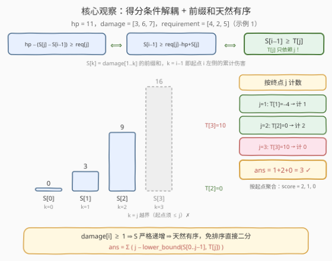
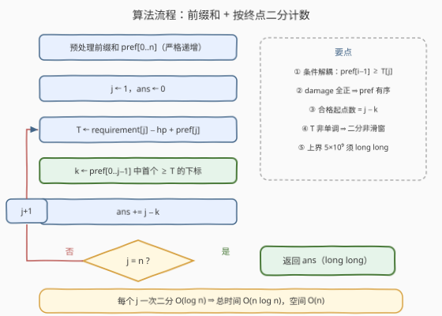

# 探索地牢的得分

- **题目名称**：探索地牢的得分
- **链接**：[3771. 探索地牢的得分](https://leetcode.cn/problems/total-score-of-dungeon-runs/)
- **难度**：中等
- **标签**：数组、前缀和、二分查找

## 1. 题目概述

给定一个正整数 `hp` 和两个正整数数组 `damage` 与 `requirement`，数组下标从 1 开始。地牢中有 $n$ 个陷阱房间，编号 $1$ 到 $n$：进入房间 $i$ 会使生命值减少 $\text{damage}[i]$；减少之后，若剩余生命值**至少**为 $\text{requirement}[i]$，则可以从该房间获得 1 分。

定义 $\text{score}(j)$ 为从房间 $j$ 出发、依次进入房间 $j, j+1, \dots, n$ 时能获得的总分。返回 $\text{score}(1) + \text{score}(2) + \dots + \text{score}(n)$，即从所有起点出发的分数总和。

注意：不能跳过房间；即使生命值降为非正数，也仍然可以继续进入房间。

**示例 1**：

```text
输入：hp = 11, damage = [3,6,7], requirement = [4,2,5]
输出：3
解释：score(1) = 2, score(2) = 1, score(3) = 0，总分 2 + 1 + 0 = 3。
      从房间 1 出发：进 1 剩 8 ≥ 4 得 1 分；进 2 剩 2 ≥ 2 得 1 分；进 3 剩 −5 < 5 不得分。
```

**示例 2**：

```text
输入：hp = 2, damage = [10000,1], requirement = [1,1]
输出：1
解释：score(1) = 0（进 1 剩 −9998 < 1，进 2 剩 −9999 < 1）；score(2) = 1（进 2 剩 1 ≥ 1 得分）。
```

**约束条件**：

- $1 \le \text{hp} \le 10^9$
- $1 \le n = \text{damage.length} = \text{requirement.length} \le 10^5$
- $1 \le \text{damage}[i], \text{requirement}[i] \le 10^4$

> 💡 **审题关键**：① 从 $i$ 出发只会向右走到 $n$，一次「出发—在某房间判分」恰好对应一个子数组区间 $[i, j]$——问题本质是**统计满足条件的区间对 $(i, j)$ 的个数**，上界 $\frac{n(n+1)}{2} \approx 5 \times 10^9$，超出 32 位整数；② $\text{damage}$ 全为正 ⇒ 生命值**只减不增**，走到 $j$ 时的剩余生命值只由「出发位置左侧的累计伤害」决定；③ 生命值非正也能继续走，没有「死亡」终止条件，判分只是纯数值比较。

---

## 2. 解题思路

### 2.1 暴力思路：逐起点模拟

老老实实按定义算：对每个起点 $i$，从 $i$ 扫到 $n$，边走边扣血、判分、累计——双重循环 $O(n^2) = 10^{10}$，必然超时。

瓶颈在于**按起点枚举**：大量重叠区间 $[i, j]$ 被不同起点反复重走，且「走到 $j$ 能否得分」这一判定被埋在模拟流程里逐次重算。若能把判定条件改写成「只含 $i$ 的量」与「只含 $j$ 的量」的比较，就可以切换枚举维度、按终点批量计数。

### 2.2 核心观察：条件解耦 + 前缀和天然有序



记 $S_k = \text{damage}[1..k]$ 的前缀和（$S_0 = 0$）。从 $i$ 出发、依次进入房间 $i..j$ 后，剩余生命值为 $\text{hp} - (S_j - S_{i-1})$，于是「房间 $j$ 能得分」等价于：

$$\text{hp} - (S_j - S_{i-1}) \ge \text{requirement}[j] \iff S_{i-1} \ge \underbrace{\text{requirement}[j] - \text{hp} + S_j}_{=: \, T_j}$$

三个观察依次浮出水面：

**观察一（条件解耦）**：移项后，不等式左边 $S_{i-1}$ **只含起点 $i$**，右边 $T_j$ **只含终点 $j$**——二维条件被拍扁成「左值 ≥ 右阈值」的一维比较，$i$ 与 $j$ 彻底解耦。

**观察二（按终点计数）**：答案就是所有满足条件的对数：

$$\text{ans} = \sum_{1 \le i \le j \le n} [\,S_{i-1} \ge T_j\,] = \sum_{j=1}^{n} \#\{\, k \in [0, j-1] : S_k \ge T_j \,\}$$

（其中 $k = i - 1$。）对每个终点 $j$，数一数它左边有多少个起点「扛得住走到 $j$ 还能得分」即可。这正是官方 hints 的口径：初始总分 $\frac{n(n+1)}{2}$，再减去不满足 $S_{i-1} \ge \text{requirement}[j] - \text{hp} + S_j$ 的子数组。

**观察三（天然有序 ⇒ 免排序二分）**：$\text{damage}[i] \ge 1 > 0$ ⇒ $S$ **严格递增** ⇒ $S[0..j-1]$ 自带有序！无需排序、无需平衡树，直接在数组上二分出**第一个 $\ge T_j$ 的下标 $k$**，满足条件的起点恰有 $j - k$ 个（下标 $k..j-1$ 的前缀值全部 $\ge T_j$）。每步 $O(\log n)$，总计 $O(n \log n)$。

> ⚠️ **为什么不能双指针？** $T_j = \text{requirement}[j] - \text{hp} + S_j$ 并不单调：$\text{requirement}$ 的波动可达 $\pm 10^4$，完全可能压过 $\text{damage}$ 的步进，阈值时升时降，指针无法单向推进——二分只依赖**被查找数组** $S$ 有序，不依赖阈值单调，所以用二分而不是滑动窗口。

### 2.3 算法流程图



1. 计算前缀和数组 $S[0..n]$（严格递增）；
2. $j$ 从 $1$ 到 $n$：令 $T = \text{requirement}[j] - \text{hp} + S[j]$；
3. 在 $S[0..j-1]$ 上二分找第一个 $\ge T$ 的下标 $k$；
4. `ans += j − k`；
5. 循环结束返回 `ans`（注意用 64 位整数）。

### 2.4 示例演算

以示例 1（hp = 11）走一遍，$S = [0, 3, 9, 16]$：

| $j$ | $T_j = \text{req}[j] - \text{hp} + S_j$ | 候选 $S[0..j-1]$ | $\ge T_j$ 的个数 | 贡献 |
|-----|----------------------------------------|------------------|-----------------|------|
| 1 | $4 - 11 + 3 = -4$ | $\{0\}$ | $S_0 = 0 \ge -4$ → 1 个 | 1 |
| 2 | $2 - 11 + 9 = 0$ | $\{0, 3\}$ | $0, 3$ 均 $\ge 0$ → 2 个 | 2 |
| 3 | $5 - 11 + 16 = 10$ | $\{0, 3, 9\}$ | 全部 $< 10$ → 0 个 | 0 |

合计 $1 + 2 + 0 = 3$ ✓。按起点把同一批 $(i, j)$ 对重新聚合，恰好就是 $\text{score}(1) = 2$、$\text{score}(2) = 1$、$\text{score}(3) = 0$——**按终点计数与按起点求和只是同一批对的两种切分方式**。

---

## 3. 参考代码

### C++

```cpp
class Solution {
  public:
    long long totalScore(int hp, vector<int>& damage, vector<int>& requirement) {
        int n = damage.size();
        vector<long long> pref(n + 1);
        for (int i = 0; i < n; ++i) pref[i + 1] = pref[i] + damage[i];

        long long ans = 0;
        for (int j = 1; j <= n; ++j) {
            long long threshold = (long long)requirement[j - 1] - hp + pref[j];
            // pref[0..j-1] 严格递增，二分找第一个 >= threshold 的下标
            int k = lower_bound(pref.begin(), pref.begin() + j, threshold) - pref.begin();
            ans += j - k;
        }
        return ans;
    }
};
```

### Python

```python
from bisect import bisect_left

class Solution:
    def totalScore(self, hp: int, damage: List[int], requirement: List[int]) -> int:
        n = len(damage)
        pref = [0] * (n + 1)
        for i, d in enumerate(damage):
            pref[i + 1] = pref[i] + d

        ans = 0
        for j in range(1, n + 1):
            threshold = requirement[j - 1] - hp + pref[j]
            k = bisect_left(pref, threshold, 0, j)   # pref[0..j-1] 严格递增，直接二分
            ans += j - k
        return ans
```

> ⚠️ **溢出提醒**：答案上界 $\frac{n(n+1)}{2} \approx 5 \times 10^9$，超出 32 位 `int`；前缀和最大 $10^5 \times 10^4 = 10^9$ 虽勉强压线 `int`，但 $T_j$ 的中间运算含 $-\text{hp}$（最大 $10^9$），C++ 中建议全链路 `long long` 防边界翻车；Python 整数无限精度无虞。

---

## 4. 复杂度分析

| 维度 | 复杂度 | 说明 |
|------|--------|------|
| 时间复杂度 | $O(n \log n)$ | 前缀和一遍 $O(n)$；每个 $j$ 在长度 $j$ 的有序前缀上二分一次 $O(\log n)$ |
| 空间复杂度 | $O(n)$ | 前缀和数组 $S[0..n]$ |

---

## 5. 扩展：前缀和无序时怎么办

本题能「免排序直接二分」，完全仰仗 $\text{damage}[i] \ge 1$ 保证了前缀和严格递增。若放宽约束，解法需要升级：

- **damage 可为 0**：前缀和变为非降序列，`bisect_left` / `lower_bound` 找「第一个 $\ge T_j$」的口径依然正确（重复值不影响计数），算法原样适用；
- **damage 可为负**：前缀和失去单调性，二分失效，退化为更一般的武器——**归并排序计数**（归并过程中统计跨块的对数，与 [327. 区间和的个数](https://leetcode.cn/problems/count-of-range-sum/) 完全同构）或**树状数组**（离散化 $S$ 值后，处理 $j$ 前先插入 $S_{j-1}$，再查询值域 $[T_j, +\infty)$ 内已插入个数），复杂度仍是 $O(n \log n)$；Python 也可直接上 `SortedList`，写法最省事、常数稍大。

> 💡 官方 hints 给出的另一口径——「总分 = $\frac{n(n+1)}{2}$ − 不达标子数组数」——与本文「正向数达标起点」完全等价：二分返回的 $k$ 恰好就是终点 $j$ 左侧**不达标**的起点数，$\text{ans} = \frac{n(n+1)}{2} - \sum_j k_j$，读者可自行对照。

---

## 6. 面试要点

1. **为什么可以直接在 pref 上二分，而不用先排序？**

   $\text{damage}[i] \ge 1 > 0$ 保证前缀和严格递增，$S[0..j-1]$ 天然有序。条件是 $S_{i-1} \ge T_j$，`lower_bound` / `bisect_left` 返回第一个 $\ge T_j$ 的下标 $k$，则 $[k, j-1]$ 内的全部起点都满足，个数恰为 $j - k$。

2. **按起点枚举慢在哪？换成按终点为什么就快了？**

   按起点模拟要 $O(n^2)$ 地重走所有重叠区间；而得分条件移项后解耦成 $S_{i-1} \ge T_j$——左边只含 $i$、右边只含 $j$，对每个 $j$ 批量数左边的合格起点即可，一次二分 $O(\log n)$ 代替一整趟扫描。

3. **能否用双指针把二分也省掉？**

   不能。$T_j = \text{requirement}[j] - \text{hp} + S_j$ 中 requirement 的波动可达 $\pm 10^4$，可能压过 damage 的步进，阈值序列非单调，双指针的单向推进性质被破坏；二分只要求**被查找数组**有序，与阈值是否单调无关。

4. **哪些量会溢出？**

   答案上界 $\frac{n(n+1)}{2} \approx 5 \times 10^9 > \text{int32}$，累加变量与返回值必须 `long long`；前缀和最大 $10^9$ 勉强在 `int` 内，但 $T_j$ 运算建议也统一 `long long`，避免贴边翻车。

5. **如果 damage 允许 0 或负数，算法还能用吗？**

   为 0 时前缀和非降，二分口径（$\ge$）依然正确；为负时前缀和无序，须退化为归并计数 / BIT / `SortedList`，复杂度不变，对应 [327. 区间和的个数](https://leetcode.cn/problems/count-of-range-sum/) 的一般情形。

> 💡 **一句话总结**：把「走到 $j$ 还能得分」移项成 $S_{i-1} \ge T_j$，$i$ 与 $j$ 解耦；damage 全正使前缀和天然有序，每个终点一次二分数清合格起点，$O(n \log n)$ 收工。

---

## 7. 同类练习题

- [560. 和为 K 的子数组](https://leetcode.cn/problems/subarray-sum-equals-k/)：前缀和条件的另一种计数形态（等值比较用哈希代替二分）
- [327. 区间和的个数](https://leetcode.cn/problems/count-of-range-sum/)：前缀和**无序**时的区间对计数，归并/BIT——本题去掉 damage > 0 约束后的一般化
- [1712. 将数组分成三个子数组的方案数](https://leetcode.cn/problems/ways-to-split-array-into-three-subarrays/)：在有序前缀和上二分数分割点，与本题「数满足条件的起点」同款手感
- [2389. 和有限的最长子序列](https://leetcode.cn/problems/longest-subsequence-with-limited-sum/)：有序前缀 + 二分找上界的入门练习
- [3026. 最大好子数组和](https://leetcode.cn/problems/maximum-good-subarray-sum/)：前缀和 + 哈希维护最值，子数组条件的又一种查询结构
