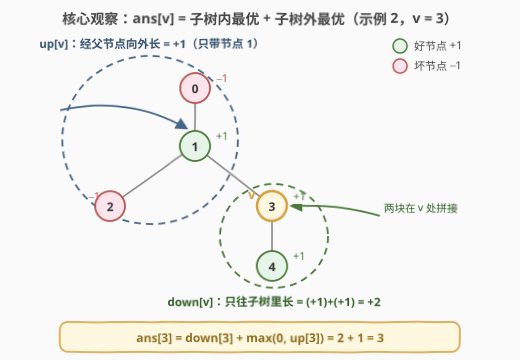
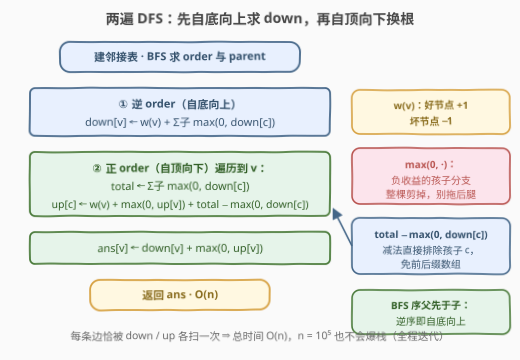

# 树中子图的最大得分

- **题目名称**：树中子图的最大得分
- **链接**：[3772. 树中子图的最大得分](https://leetcode.cn/problems/maximum-subgraph-score-in-a-tree/)
- **难度**：困难
- **标签**：树、深度优先搜索、数组、动态规划

## 1. 题目概述

**题意**：给定一棵含 $n$ 个节点（编号 $0 \sim n-1$）的无向树（由 $n-1$ 条边 `edges` 描述）与数组 $good$（$good[i] = 1$ 为好节点，$0$ 为坏节点）。定义子图的**得分**为「好节点数 − 坏节点数」。对每个节点 $i$，求**包含 $i$ 的所有连通子图**中的最大得分，返回长度为 $n$ 的答案数组。

**示例 1**：

```text
输入：n = 3, edges = [[0,1],[1,2]], good = [1,0,1]
输出：[1,1,1]
解释：对每个节点，包含它的最优连通子图都是整棵树：2 个好节点 − 1 个坏节点 = 1。
```

**示例 2**：

```text
输入：n = 5, edges = [[1,0],[1,2],[1,3],[3,4]], good = [0,1,0,1,1]
输出：[2,3,2,3,3]
解释：节点 0 取 {0,1,3,4}：3 − 1 = 2；节点 1、3、4 取 {1,3,4}：3 − 0 = 3；
　　　节点 2 取 {1,2,3,4}：3 − 1 = 2。
```

**示例 3**：

```text
输入：n = 2, edges = [[0,1]], good = [0,0]
输出：[-1,-1]
解释：带上对方只会多扣 1 分，最优是只留自己，得分为 −1。
```

**约束条件**：

- $2 \le n \le 10^5$
- 输入保证 `edges` 构成一棵有效的树
- $good[i] \in \{0, 1\}$

> 💡 **审题关键**：① 树上的**连通子图就是连通点集**——得分只与选了哪些点有关，等价于选一棵「子树形状」的块；② 要对**每个点**都回答一次「包含它的最优块」——这是**换根 DP** 的标志特征；③ $n$ 达 $10^5$，链状树下递归会爆栈，且「逐点重新 DP」的 $O(n^2)$ 必须避免。

---

## 2. 解题思路

### 2.1 暴力思路：逐点做树形 DP

把点权写成 $w(v) = +1$（好）/ $-1$（坏），则任意点集 $S$ 的得分就是 $\sum_{v \in S} w(v)$。

最直接的思路：固定根后做一次树形 DP，求出「包含根的最优连通块」；对每个点 $i$ 把根换成 $i$ 再做一遍——每次 $O(n)$，总计 $O(n^2) \approx 10^{10}$，超时。

> 💡 暴力的浪费在于：把根从 $v$ 挪到相邻的孩子 $c$ 时，$c$ 子树内的答案**一点没变**，却被整套重算。真正的增量只有「$v$ 一侧（子树外）的信息」——把它顺着边**下传**即可。

### 2.2 核心观察：换根 DP（down / up 双数组）



**观察一（方向独立性）**：任取根把树定向。包含 $v$ 的连通块，按「离开 $v$ 的方向」天然拆成互不干扰的三部分：

$$\text{ans}[v] = \underbrace{w(v)}_{\text{自己}} + \sum_{\text{孩子 } c} \max(0, \text{down}[c]) + \max(0, \text{up}[v])$$

- 每个方向**可选可不做**（$\max(0, \cdot)$），选了就取该方向的**最优块**；
- 方向之间只共享 $v$ 这一个点，贡献**可加**——三个方向各自取最优时整体恰好最优。

**观察二（down：自底向上）**：$\text{down}[v]$ = 只用 $v$ 子树内的点、包含 $v$ 的连通块的最大得分：

$$\text{down}[v] = w(v) + \sum_{\text{孩子 } c} \max(0, \text{down}[c])$$

负收益的孩子分支整棵剪掉——这正是 [124. 二叉树中的最大路径和](../0101-0200/124_二叉树中的最大路径和.md) 的 $\max(0, \cdot)$ 技巧搬到多叉树上。

**观察三（up：自顶向下换根）**：$\text{up}[v]$ = 完全不碰 $v$ 的子树、包含 $\text{parent}(v)$ 的连通块的最大得分。把根从 $p$ 换给孩子 $c$ 时，$c$ 眼中「子树外」的世界 = $p$ 自己 + $p$ 的父亲方向 + $p$ 的**其他**孩子方向：

$$\text{up}[c] = w(p) + \max(0, \text{up}[p]) + \Big(\text{total}_p - \max(0, \text{down}[c])\Big)$$

其中 $\text{total}_p = \sum_{p \text{ 的所有孩子}} \max(0, \text{down}[\cdot])$。**减法排除**：从 $p$ 的全部孩子贡献里减去 $c$ 自己那份，就得到「其余孩子」的贡献和——因为孩子贡献是**求和**而非取 max，无需前后缀数组。

**收尾**：$\text{ans}[v] = \text{down}[v] + \max(0, \text{up}[v])$，根节点 $\text{up} = 0$。

### 2.3 算法流程图



**文字版步骤**：

| 步骤 | 操作 | 说明 |
|------|------|------|
| ① 建图定序 | 建邻接表；从 0 出发 BFS 得 `order` 与 `parent` | BFS 序保证**父先于子** |
| ② 自底向上 | 逆序遍历：$\text{down}[v] \leftarrow w(v) + \sum_{\text{子}} \max(0, \text{down})$ | 逆 BFS 序即孩子先于父亲 |
| ③ 自顶向下 | 正序遍历到 $v$：先算 $\text{total}_v$，再对每个孩子 $c$ 下传 $\text{up}[c]$ | 换根核心一步 |
| ④ 汇总 | $\text{ans}[v] \leftarrow \text{down}[v] + \max(0, \text{up}[v])$ | 根的 up 视为 0 |
| ⑤ 返回 | 输出 `ans` | 全程迭代，无爆栈风险 |

### 2.4 示例演算

以示例 2（$w = [-1, +1, -1, +1, +1]$，边 0-1、1-2、1-3、3-4）走一遍。BFS 序 `order = [0,1,2,3,4]`，`parent = [-1,0,1,1,3]`。

**第一遍：逆序 4 → 3 → 2 → 1 → 0 求 down**

| 节点 | 计算 | down |
|------|------|------|
| 4 | $+1$ | $+1$ |
| 3 | $+1 + \max(0, \text{down}[4]) = 1 + 1$ | $+2$ |
| 2 | $-1$ | $-1$ |
| 1 | $+1 + \max(0, -1) + \max(0, 2)$ | $+3$ |
| 0 | $-1 + \max(0, 3)$ | $+2$ |

**第二遍：正序 0 → 1 → 2 → 3 → 4 换根**（$\text{total}_0 = 3$，$\text{total}_1 = 0 + 2 = 2$，$\text{total}_3 = 1$）

| 节点 | up 的来历 | up | ans = down + max(0, up) |
|------|-----------|-----|--------------------------|
| 0 | 根，无子树外 | $0$ | $2 + 0 = 2$ ✓ |
| 1 | $w(0) + 0 + (3 - 3)$ | $-1$ | $3 + 0 = 3$ ✓ |
| 2 | $w(1) + \max(0,\text{up}[1]) + (2 - 0)$ | $+3$ | $-1 + 3 = 2$ ✓ |
| 3 | $w(1) + 0 + (2 - 2)$ | $+1$ | $2 + 1 = 3$ ✓ |
| 4 | $w(3) + \max(0, 1) + (1 - 1)$ | $+2$ | $1 + 2 = 3$ ✓ |

得 $[2, 3, 2, 3, 3]$，与示例一致。注意节点 1 的 up 为 $-1$：对节点 1 而言「往父亲 0 的方向再带点人」是亏的（$\max(0, \cdot)$ 剪掉），但节点 2 的 up 经由节点 1 时**不带着 0 玩**——换根公式的减法正是为此保留自由度。

---

## 3. 参考代码

### C++

```cpp
class Solution {
  public:
    vector<int> maxSubgraphScore(int n, vector<vector<int>>& edges, vector<int>& good) {
        vector<vector<int>> adj(n);
        for (auto& e : edges) {
            adj[e[0]].push_back(e[1]);
            adj[e[1]].push_back(e[0]);
        }

        // BFS 定序：父先于子；order 逆序即"孩子先于父亲"
        vector<int> order, parent(n, -1);
        vector<char> vis(n, 0);
        order.reserve(n);
        order.push_back(0);
        vis[0] = 1;
        for (int i = 0; i < n; ++i) {
            int v = order[i];
            for (int u : adj[v])
                if (!vis[u]) {
                    vis[u] = 1;
                    parent[u] = v;
                    order.push_back(u);
                }
        }

        vector<int> down(n), up(n, 0), ans(n);

        // 第一遍：逆序（自底向上）求 down[v]
        for (int i = n - 1; i >= 0; --i) {
            int v = order[i], s = good[v] ? 1 : -1;
            for (int u : adj[v])
                if (u != parent[v] && down[u] > 0) s += down[u];   // 负收益分支剪掉
            down[v] = s;
        }

        // 第二遍：正序（自顶向下）换根
        for (int i = 0; i < n; ++i) {
            int v = order[i];
            ans[v] = down[v] + max(0, up[v]);
            int total = 0;                                          // v 的全部孩子贡献和
            for (int u : adj[v])
                if (u != parent[v] && down[u] > 0) total += down[u];
            int base = (good[v] ? 1 : -1) + max(0, up[v]);          // v + 父亲方向
            for (int u : adj[v])                                    // 把根"换"给每个孩子 u
                if (u != parent[v])
                    up[u] = base + total - max(0, down[u]);         // 减法排除 u 自己
        }
        return ans;
    }
};
```

### Python

```python
class Solution:
    def maxSubgraphScore(self, n: int, edges: List[List[int]], good: List[int]) -> List[int]:
        adj = [[] for _ in range(n)]
        for a, b in edges:
            adj[a].append(b)
            adj[b].append(a)

        # BFS 定序：父先于子；order 逆序即"孩子先于父亲"
        order = [0]
        parent = [-1] * n
        vis = [False] * n
        vis[0] = True
        for v in order:                              # 迭代中追加，即为 BFS
            for u in adj[v]:
                if not vis[u]:
                    vis[u] = True
                    parent[u] = v
                    order.append(u)

        down = [0] * n
        # 第一遍：逆序（自底向上）求 down[v]
        for v in reversed(order):
            s = 1 if good[v] else -1
            p = parent[v]
            for u in adj[v]:
                if u != p and down[u] > 0:           # 负收益分支剪掉
                    s += down[u]
            down[v] = s

        up = [0] * n
        ans = [0] * n
        # 第二遍：正序（自顶向下）换根
        for v in order:
            p = parent[v]
            total = sum(down[u] for u in adj[v] if u != p and down[u] > 0)
            ans[v] = down[v] + max(0, up[v])
            base = (1 if good[v] else -1) + max(0, up[v])   # v + 父亲方向
            for u in adj[v]:                                # 把根"换"给每个孩子 u
                if u != p:
                    up[u] = base + total - max(0, down[u])  # 减法排除 u 自己
        return ans
```

> 💡 **写法要点**：
> - **全程迭代**：$n \le 10^5$ 的链状树递归深度 $10^5$，Python 必爆、C++ 也悬。BFS 序 + 两遍循环，连显式栈的进/出事件都不需要——逆序遍历天然就是自底向上。
> - `parent` 初始化为 $-1$ 与节点号不冲突（节点号非负）。
> - 第二遍里 `total` 与 `base` 只依赖已算好的 `down` 与 `up[v]`，先算谁都行。

---

## 4. 复杂度分析

| 维度 | 复杂度 | 说明 |
|------|--------|------|
| **时间复杂度** | $O(n)$ | 建图、BFS、两遍遍历各扫全部邻接表一次，$\sum \deg = 2(n-1)$ |
| **空间复杂度** | $O(n)$ | 邻接表、`order`/`parent`/`down`/`up`/`ans` 均为线性 |

---

## 5. 扩展：换根 DP 的两种「排除一个孩子」

换根时最常用的一步是求「$p$ 的孩子中**去掉 $c$ 之后**的聚合结果」，按聚合方式分两类：

- **求和型（本题）**：孩子贡献直接相加，$\text{total}_p - \max(0, \text{down}[c])$ 一步减出，无需额外结构。
- **取 max 型**：如「经过每个点的最长路径」类题（[2246](../2201-2300/2246_相邻字符不同的最长路径.md)），孩子贡献要取前两大——必须**前后缀 max 数组**（或维护最大/次大）才能 $O(\deg)$ 求出「除 $c$ 外的最优」，直接减法无意义。

**变体**：

- 若 $w(v)$ 是任意整数（不止 $\pm 1$），算法原样适用；若只求全树「得分最大的连通块」（不指定包含哪个点），一次树形 DP 取 $\max_v \text{ans}[v]$ 即可。
- 若要求连通块**恰好含 $k$ 个点**且得分最大，退化为树上背包 $O(n \cdot k)$，需要按 size 剪枝保证复杂度。

---

## 6. 面试要点

**Q1：为什么「包含 $v$ 的最优连通块」能拆成 down 与 up 两段独立求最优？**

> 把包含 $v$ 的连通块中沿边 $(v, \text{parent}(v))$ 切开：不含 $v$ 的那一侧必须是「包含 $\text{parent}(v)$、且不碰 $v$ 子树」的连通块（树上路径唯一，绕不进 $v$ 子树），其最优值恰是 $\text{up}[v]$ 的定义；含 $v$ 一侧同理是 $\text{down}[v]$。两侧只共享切边两端、互不约束，贡献可加，各自最优则整体最优。

**Q2：$\max(0, \text{down}[c])$ 剪枝为什么安全？负的 down 会不会在「必须连通」时被迫带上？**

> 连通块只需包含 $v$ 自身，每个孩子方向的分支是**可选**的——不带这个孩子，块依然连通。因此负收益分支整棵丢弃、取 0；这与「必须经过某点」的路径题不同，本题没有强制经过的孩子。

**Q3：up 的减法公式为什么减 $\max(0, \text{down}[c])$ 而不是 $\text{down}[c]$？**

> $\text{total}_p$ 是各孩子贡献 $\max(0, \text{down}[\cdot])$ 之和——孩子 $c$ 在其中**实际记入的**就是 $\max(0, \text{down}[c])$。排除 $c$ 应减去它被记入的份额；若减 $\text{down}[c]$（可能为负），会把没记过的负数再扣一遍，$\text{up}$ 被系统性高估。

**Q4：为什么不能对每个点各做一次树形 DP？换根到底省在哪？**

> 逐点 DP 是 $O(n^2)$，链/菊花图都退化。换根的关键：把根从 $p$ 挪到孩子 $c$ 时，$c$ 子树内的一切不变，只有「$p$ 视角的子树外」变成「$c$ 视角的子树外」——增量恰好是一层信息，用 $\text{up}$ 顺着 BFS 序下传，每个点只花 $O(\deg)$，总 $O(n)$。

**Q5：为什么递归有风险，BFS 序又为什么够用？**

> $n = 10^5$ 的链树递归深度 $10^5$：Python 默认上限 1000 直接爆，C++ 也可能栈溢出。BFS 序保证父先于子：正序遍历时 `up[v]` 必已就绪（自顶向下），逆序遍历时 `down` 的孩子必已就绪（自底向上）——两遍线性扫描即可，无需 DFS 的时间戳。

---

## 7. 同类练习题

- [834. 树中距离之和](https://leetcode.cn/problems/sum-of-distances-in-tree/)（[题解](../0801-0900/834_树中距离之和.md)）：换根 DP 的开山经典——down/up 两遍 DFS 的同款框架，距离版的「增量换根」
- [310. 最小高度树](https://leetcode.cn/problems/minimum-height-trees/)（[题解](../0301-0400/310_最小高度树.md)）：把根挪到邻居，高度如何增量更新——换根思想的最简入门
- [124. 二叉树中的最大路径和](https://leetcode.cn/problems/binary-tree-maximum-path-sum/)（[题解](../0101-0200/124_二叉树中的最大路径和.md)）：$\max(0, \cdot)$ 剪掉负收益分支——本题 down 转移的核心技巧源头
- [2246. 相邻字符不同的最长路径](https://leetcode.cn/problems/longest-path-with-different-adjacent-characters/)（[题解](../2201-2300/2246_相邻字符不同的最长路径.md)）：孩子贡献需取前两大，必须前后缀/次大值分解——对照本题「求和可减法」的实现差异
- [968. 监控二叉树](https://leetcode.cn/problems/binary-tree-cameras/)（[题解](../0901-1000/968_监控二叉树.md)）：树形 DP 的状态设计入门——先掌握「只看子树内」的单遍 DP，再升级到换根
