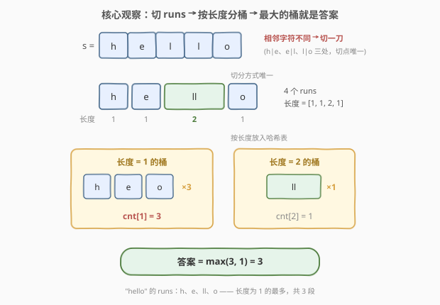
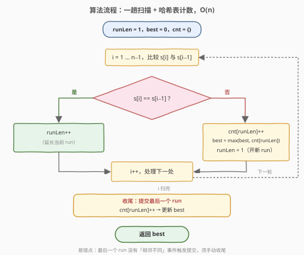

# LeetCode 最大等长连续字符组 题解

## 1. 题目概述

- **标题 / 题号**：最大等长连续字符组（#3773，medium）
- **链接**：https://leetcode.cn/problems/maximum-number-of-equal-length-runs/
- **难度**：中等
- **标签**：哈希表、字符串、计数

> ⚠️ 本题为 LeetCode 付费题，题意描述根据官方示例用例（`jsonExampleTestcases`：`"hello"`、`"aaabaaa"`）与官方 hints（「在相邻字符不同处切分构成 runs」「用哈希表按 run 长度分组」）重建，示例输出由题意自洽推得，可能与官方题面有出入。函数签名 `maxSameLengthRuns(s) -> int` 取自官方接口 `metaData`，可信度较高。

**题意**：给定一个字符串 `s`。把 `s` 切分成若干**连续字符组**（run）：每段由**连续相同的字符**组成，且不能再向两边延长。切分方式天然唯一——在每处「相邻字符不同」的位置切开即可。

在此基础上，返回**长度相同**的连续字符组**最多有多少个**。换言之：设所有 runs 的长度为 $l_1, l_2, \dots, l_k$，求出现次数最多的那个长度出现了几次。

**示例 1**：

```text
输入：s = "hello"
输出：3
解释：runs 为 "h"、"e"、"ll"、"o"，长度依次为 1、1、2、1。长度为 1 的 run 有 3 个（"h"、"e"、"o"），长度为 2 的只有 1 个（"ll"），故答案为 3。
```

**示例 2**：

```text
输入：s = "aaabaaa"
输出：2
解释：runs 为 "aaa"、"b"、"aaa"，长度依次为 3、1、3。长度为 3 的 run 有 2 个，长度为 1 的只有 1 个，故答案为 2。
```

**约束条件**（按同类题惯例推断）：

- `1 <= s.length <= 10^5`
- `s` 仅由小写英文字母组成（示例均为小写；下述解法不依赖字符集大小）

> 💡 题目看似在「切分字符串」，实则切分**唯一确定**——真正要解的，是对长度数组的**计数**问题。

## 2. 解题思路

### 2.1 暴力思路：对每个长度重新数一遍

第一步没有分歧：一趟扫描，在相邻字符不同的位置切割，得到长度数组 $L = [l_1, \dots, l_k]$（$k$ 为 run 个数）。

暴力卡在第二步：对每个 $i$，重新扫一遍整个 $L$，数出等于 $l_i$ 的元素个数，取最大——双重循环 $O(k^2)$。最坏情形 `s = "ababab…"`（交替字符串），每个 run 长度都是 1，此时 $k = n = 10^5$，比较次数达 $10^{10}$ 量级，必然超时。

> 💡 顺带一提：这里**不存在「枚举所有切分方式」的暴力维度**——run 的定义自带「极大性」，切点完全由 `s` 决定，切分唯一。所以优化空间只剩计数这一步。

### 2.2 核心观察：哈希表按长度分桶，一趟计数



把暴力中「数一遍等于某值的元素个数」换成哈希表的原生操作，问题迎刃而解：

- **观察 1（切分唯一）**：runs 由 `s` 完全确定，问题没有任何「选」的成分；
- **观察 2（答案即最大频数）**：答案 $= \max_{L} \mathrm{cnt}[L]$，其中 $\mathrm{cnt}[L]$ 是长度为 $L$ 的 run 个数——这正是长度数组的**众数的频数**；
- **观察 3（可流式处理）**：无需先存下整个 $L$ 再计数——扫到一个 run 结束（或到达字符串结尾）就立刻提交它的长度、更新最大值，全程只需保留「当前 run 长度」一个状态。

于是总代价：切分 $O(n)$ + 计数 $O(k)$，一趟完成。

### 2.3 算法流程图



流程要点：

1. 维护 `runLen`（当前 run 的已扫长度）与哈希表 `cnt`；
2. 若 `s[i] == s[i-1]`：当前 run 延长，`runLen++`；
3. 否则上一个 run 在 `i-1` 处结束：`cnt[runLen]++`，用新频数更新 `best`，随后 `runLen = 1` 开新 run；
4. **收尾陷阱**：循环结束后，**最后一个 run 没有任何「相邻不同」事件来触发提交**，必须手动 `cnt[runLen]++` 并更新 `best`——这是本题最容易写错的地方。

### 2.4 示例演算

以 `s = "aaabaaa"` 为例：

| 事件 | `runLen` | 提交 | `cnt` | `best` |
|------|----------|------|-------|--------|
| 初始 | 1 | — | `{}` | 0 |
| `i=1`：`a == a` | 1 → 2 | — | `{}` | 0 |
| `i=2`：`a == a` | 2 → 3 | — | `{}` | 0 |
| `i=3`：`b ≠ a` | 3 → 1 | `cnt[3]++` | `{3:1}` | 1 |
| `i=4`：`a ≠ b` | 1 → 1 | `cnt[1]++` | `{3:1, 1:1}` | 1 |
| `i=5`：`a == a` | 1 → 2 | — | `{3:1, 1:1}` | 1 |
| `i=6`：`a == a` | 2 → 3 | — | `{3:1, 1:1}` | 1 |
| 扫描结束（收尾） | — | `cnt[3]++` | `{3:2, 1:1}` | **2** |

返回 `best = 2`，与示例 2 一致。同理 `"hello"` 得 `cnt = {1:3, 2:1}`，返回 3。特别注意：若漏掉收尾提交，`"aaabaaa"` 的 `cnt[3]` 只会是 1，将错误地返回 1。

## 3. 参考代码

### C++

```cpp
class Solution {
  public:
    int maxSameLengthRuns(string s) {
        int n = s.size();
        unordered_map<int, int> cnt;
        int best = 0, runLen = 1;
        for (int i = 1; i < n; i++) {
            if (s[i] == s[i - 1]) {
                runLen++;                        // 当前 run 延长
            } else {
                best = max(best, ++cnt[runLen]); // 提交刚结束的 run
                runLen = 1;                      // 开新 run
            }
        }
        best = max(best, ++cnt[runLen]);         // 收尾：最后一个 run
        return best;
    }
};
```

### Python

```python
class Solution:
    def maxSameLengthRuns(self, s: str) -> int:
        cnt = Counter()
        best = 0
        run_len = 1
        for i in range(1, len(s)):
            if s[i] == s[i - 1]:
                run_len += 1
            else:
                cnt[run_len] += 1
                best = max(best, cnt[run_len])
                run_len = 1
        cnt[run_len] += 1          # 收尾：最后一个 run
        best = max(best, cnt[run_len])
        return best
```

> 💡 两个示例都很短，真正的考点是**边界处理**（收尾提交）与**把「切分」正确理解为确定性过程**——代码短不等于好写对。

## 4. 复杂度分析

| 维度 | 复杂度 | 说明 |
|------|--------|------|
| 时间复杂度 | $O(n)$ | 一趟扫描，每个字符一次比较；哈希表操作均摊 $O(1)$ |
| 空间复杂度 | $O(\sqrt{n})$ | 哈希表键数 = 不同 run 长度个数 $m$，由 $1 + 2 + \dots + m \le n$ 得 $m = O(\sqrt{n})$ |

> 💡 空间上界值得多说一句：若所有 run 长度互不相同，则这些长度至少是 $1, 2, \dots, m$，其和不超过 $n$，故 $m \le \sqrt{2n} \approx 447$（当 $n = 10^5$）——哈希表永远不会存很多键，实践中甚至可用数组替代。

## 5. 扩展：游程编码（RLE）视角与变体

**RLE 视角**：本题第一步（切 runs）就是**游程编码**（Run-Length Encoding）——把字符串压缩成 `(字符, 长度)` 序列。RLE 是一大类字符串题的标准前置步骤，识别信号词：*连续、相同、极大段、交替*。先 RLE，再在压缩序列上做二次统计，往往能把问题降一个数量级。

**一行解（Python）**：用 `itertools.groupby` 把「按连续相同字符分组」直接表达出来：

```python
from itertools import groupby

class Solution:
    def maxSameLengthRuns(self, s: str) -> int:
        return max(Counter(len(list(g)) for _, g in groupby(s)).values())
```

**变体方向**：

- **按 run 计贡献**：[1759. 统计同质子字符串的数目](https://leetcode.cn/problems/count-number-of-homogenous-substrings/) 中每个长度为 $L$ 的 run 贡献 $\frac{L(L+1)}{2}$ 个子串——把「按长度分桶计数」换成「按长度求和」；
- **按字符分桶 run**：[2981. 找出现一次的最长特殊子字符串 I](https://leetcode.cn/problems/find-longest-special-substring-that-occurs-thrice-i/) 对每个字符分别收集其 run 长度再统计——本题「按长度分桶」的双层版本；
- **环形字符串**：若 `s` 首尾相接成环且 `s[0] == s[n-1]`，收尾的 run 会与开头的 run **拼接**成一个，需要特判合并——是「收尾陷阱」的加强版。

## 6. 面试要点

1. **为什么切分方式是唯一的？这题真的没有「最优划分」吗？**

   run 的定义要求「极大」：一段连续相同字符只要还能向任一侧延长就不算 run。因此每个切点恰好是相邻字符不同的位置，由 `s` 唯一确定。题目中的「切分」是**描述性**的（定义对象），不是**选择性**的（搜索方案）——识别这一点能避免掉进枚举划分的弯路。

2. **暴力 $O(k^2)$ 慢在哪里？哈希表为什么刚好治它？**

   暴力对每个长度都重新扫一遍数组数个数；而「统计每个值出现的次数」正是哈希表的原生操作——一次遍历里 `cnt[L]++` 均摊 $O(1)$，把「重复计数」变成「增量计数」。

3. **本题最容易出错的边界是什么？**

   收尾提交：最后一个 run 之后不再有「相邻不同」事件来触发 `cnt[runLen]++`，循环结束后必须手动提交一次。反例：`s = "aaabaaa"` 若漏收尾，`cnt[3]` 只会等于 1，错误地返回 1。

4. **哈希表最多存多少个键？**

   $O(\sqrt{n})$ 个。所有 run 长度之和为 $n$，若长度互异则至少为 $1 + 2 + \dots + m = \frac{m(m+1)}{2}$，解得 $m = O(\sqrt{n})$。$n = 10^5$ 时至多约 447 个键，可用数组代替哈希表进一步提速。

5. **如果字符串以流式到达（无法随机访问、长度未知）怎么办？**

   解法天然流式：只需记住「上一个字符」与「当前 run 长度」两个状态，逐字符转移即可；流结束时同样别忘了提交最后一个 run。

> 💡 **一句话总结**：切分是虚晃一枪——runs 由 `s` 唯一确定，答案只是「长度数组的最大频数」；一趟扫描 + 哈希表 + 记得收尾，$O(n)$ 收工。

## 同类练习题

| # | 题目 | 与本题的关联 |
|---|------|-------------|
| 1446 | [连续字符](https://leetcode.cn/problems/consecutive-characters/) | 单字符串上求**最长 run** 的长度——RLE 前置步骤的最简应用 |
| 1869 | [哪种连续子字符串更长](https://leetcode.cn/problems/longer-contiguous-segments-of-ones-than-zeros/) | 分别求 0 与 1 的最长 run 再比较大小，两套 RLE 状态并行维护 |
| 1759 | [统计同质子字符串的数目](https://leetcode.cn/problems/count-number-of-homogenous-substrings/) | 每个长度为 $L$ 的 run 贡献 $\frac{L(L+1)}{2}$，把本题的「按长度计数」换成「按长度求和」 |
| 2981 | [找出现一次的最长特殊子字符串 I](https://leetcode.cn/problems/find-longest-special-substring-that-occurs-thrice-i/) | 按字符收集 run 长度、再按出现次数筛选，是本题的双层计数加强版 |
| 467 | [环绕字符串中唯一的子字符串](https://leetcode.cn/problems/unique-substrings-in-wraparound-string/) | 以「每个字符结尾的最长连续段」去重计数，同属 run 计数家族 |
