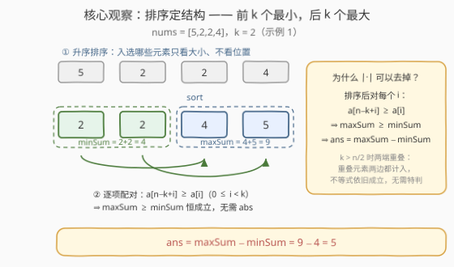
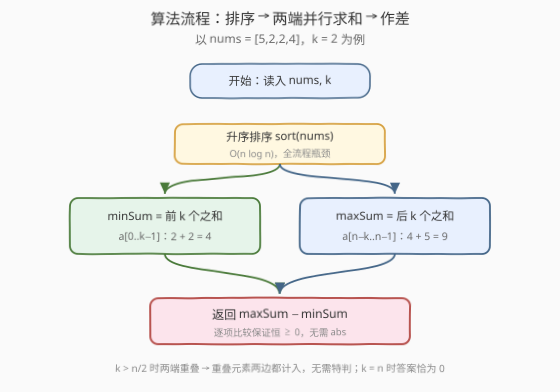

# 最大和最小K个元素的绝对差

- **题目名称**：最大和最小K个元素的绝对差
- **链接**：[3774. 最大和最小 K 个元素的绝对差](https://leetcode.cn/problems/absolute-difference-between-maximum-and-minimum-k-elements/)
- **难度**：简单
- **标签**：数组、排序

## 1. 题目概述

给你一个整数数组 `nums` 和一个整数 $k$。请计算以下两者的绝对差值：

- 数组中 $k$ 个**最大**元素的**总和**；
- 数组中 $k$ 个**最小**元素的**总和**。

返回表示此差值的整数。

**示例 1**：

```text
输入：nums = [5,2,2,4], k = 2
输出：5
解释：k = 2 个最大的元素是 4 和 5，总和 4 + 5 = 9；
      k = 2 个最小的元素是 2 和 2，总和 2 + 2 = 4；
      绝对差值是 abs(9 - 4) = 5。
```

**示例 2**：

```text
输入：nums = [100], k = 1
输出：0
解释：最大的元素是 100，最小的元素也是 100，绝对差值 abs(100 - 100) = 0。
```

**约束条件**：

- $1 \le n = \text{nums.length} \le 100$
- $1 \le \text{nums}[i] \le 100$
- $1 \le k \le n$

> 💡 **审题关键**：① 「$k$ 个最大 / $k$ 个最小」按**元素值**选取，与下标无关；值相同的元素可各自计入（示例 1 中两个 2 同时入选最小侧），但**每个下标只能用一次**；② $k \le n$ 保证两侧选法总是存在，无需特判；③ $k > n/2$ 时「最大 $k$ 个」与「最小 $k$ 个」会在数组中段**重叠**，这是正常现象而非 bug（见 2.2）；④ 本题 $n$、值域均 $\le 100$，$k$ 个元素之和不超过 $10^4$，`int` 毫无压力。

---

## 2. 解题思路

### 2.1 暴力思路

两种朴素的暴力：

1. **枚举子集**：枚举所有大小为 $k$ 的子集，分别求其中「$k$ 个最大之和」与「$k$ 个最小之和」。组合数 $\binom{n}{k}$ 指数级，不可行。
2. **模拟取牌**：每轮扫一遍数组找当前最大值累加进 `maxSum` 并移除，再找当前最小值累加进 `minSum` 并移除，各做 $k$ 轮。时间 $O(nk)$，本题 $n \le 100$ 也能过，但纯属「没有结构地反复扫描」。

瓶颈在于：没有意识到**哪些元素入选完全由大小次序决定**——排序一次，两个问题同时定死。

### 2.2 核心观察：排序定结构——最小取前缀，最大取后缀



设排序后数组 $a_0 \le a_1 \le \cdots \le a_{n-1}$，则：

- **最小的 $k$ 个元素**必然是前缀 $a_0, \dots, a_{k-1}$。若某个 $a_j\ (j \ge k)$ 入选而某个 $a_i\ (i < k)$ 落选，用 $a_i$ 替换 $a_j$ 总和只会变小——交换论证，故最优入选集合就是前缀。
- **最大的 $k$ 个元素**必然是后缀 $a_{n-k}, \dots, a_{n-1}$，同理。

**绝对值可以直接去掉**：对每个 $i \in [0, k)$ 都有 $n - k + i \ge i$，结合有序性得 $a_{n-k+i} \ge a_i$，逐项相加：

$$\max_k \;=\; \sum_{i=0}^{k-1} a_{n-k+i} \;\ge\; \sum_{i=0}^{k-1} a_i \;=\; \min_k$$

即「最大 $k$ 个之和」**恒不小于**「最小 $k$ 个之和」，答案直接写 $\max_k - \min_k$，无需 `abs`。

**重叠无碍**：当 $k > n/2$ 时前缀与后缀会在中段重叠（极端如示例 2，$n = k = 1$，同一个 100 既算最大又算最小），重叠元素在两侧**同时计入**，上面的逐项比较不等式不受任何影响；$k = n$ 时前后缀都是整个数组，答案恰为 $0$。全程无需特判。

### 2.3 算法流程图



1. 将 `nums` 升序排序；
2. `minSum` = 前 $k$ 个元素（下标 $0 \sim k-1$）之和；
3. `maxSum` = 后 $k$ 个元素（下标 $n-k \sim n-1$）之和；
4. 返回 `maxSum - minSum`。

### 2.4 示例演算

以示例 1 `nums = [5,2,2,4]`、$k = 2$ 走一遍：

| 步骤 | 内容 | 结果 |
|------|------|------|
| 排序 | $[5,2,2,4] \to [2,2,4,5]$ | — |
| 前 $k=2$ 个 | $2 + 2$ | $\text{minSum} = 4$ |
| 后 $k=2$ 个 | $4 + 5$ | $\text{maxSum} = 9$ |
| 作差 | $9 - 4$ | $\text{ans} = 5$ |

对照示例 2：`nums = [100]`、$k = 1$，前 1 个与后 1 个是同一个元素，$100 - 100 = 0$。

---

## 3. 参考代码

### C++

```cpp
class Solution {
  public:
    int absDifference(vector<int>& nums, int k) {
        sort(nums.begin(), nums.end());
        int n = nums.size();

        int minSum = 0;                       // 前 k 个之和
        for (int i = 0; i < k; ++i) minSum += nums[i];

        int maxSum = 0;                       // 后 k 个之和
        for (int i = n - k; i < n; ++i) maxSum += nums[i];

        return maxSum - minSum;               // 恒 >= 0，无需 abs
    }
};
```

### Python

```python
class Solution:
    def absDifference(self, nums: List[int], k: int) -> int:
        nums.sort()
        return sum(nums[-k:]) - sum(nums[:k])   # 恒 >= 0，无需 abs
```

---

## 4. 复杂度分析

| 维度 | 复杂度 | 说明 |
|------|--------|------|
| 时间复杂度 | $O(n \log n)$ | 排序是瓶颈，两趟求和共 $O(n)$ |
| 空间复杂度 | $O(\log n)$ | 排序递归栈开销；Python 切片写法额外 $O(k)$ |

---

## 5. 扩展：值域小到 100 时，计数排序可到 O(n + V)

本题 $\text{nums}[i] \in [1, 100]$，可用**计数排序**绕开比较排序：统计每个值的出现次数，从小到大凑足 $k$ 个得 `minSum`，从大到小凑足 $k$ 个得 `maxSum`。时间 $O(n + V)$（$V = 101$），且不改原数组。对 $n \le 100$ 而言与排序版没有实际差别，但若 $n$ 放大到 $10^7$ 级、值域仍然很小，这就是标准做法：

```python
class Solution:
    def absDifference(self, nums: List[int], k: int) -> int:
        cnt = Counter(nums)

        def take(values) -> int:            # 按给定次序凑足 k 个
            s, need = 0, k
            for v in values:
                take_v = min(need, cnt[v])
                s += take_v * v
                need -= take_v
                if need == 0:
                    break
            return s

        return take(range(100, 0, -1)) - take(range(1, 101))
```

另一条免排序路线是**快速选择**（quickselect）平均 $O(n)$ 地把数组按第 $k$ 小划开，再对两侧求和；但要同时处理「前 $k$」与「后 $k$」且 $k > n/2$ 时两段重叠，边界远比排序版繁琐——数据范围这么小，不值得。

---

## 6. 面试要点

1. **为什么排序后前 $k$ 个一定是「最小的 $k$ 个」？**

   交换论证：若入选集合里有 $a_j\ (j \ge k)$ 而缺席某个 $a_i\ (i < k)$，用 $a_i$ 换掉 $a_j$ 总和不增，故最优入选集合必为排序后的前缀；后缀同理。

2. **绝对值为什么可以直接去掉？**

   逐项比较：对每个 $i \in [0, k)$ 有 $n - k + i \ge i$，数组有序 ⇒ $a_{n-k+i} \ge a_i$，求和得 $\text{maxSum} \ge \text{minSum}$ 恒成立，直接返回差值即可。

3. **$k > n/2$ 时前后两段重叠，会算错吗？**

   不会。重叠元素在 `maxSum` 与 `minSum` 中**同时计入**，逐项比较的不等式不受影响；$k = n$ 时答案恰为 $0$，$n = k = 1$（示例 2）即为重叠极端。

4. **能否不排序做到线性？**

   平均可以：quickselect 平均 $O(n)$ 按第 $k$ 值划分数组后两侧求和，但两端各取 $k$ 个且可能重叠，边界繁琐；值域很小时计数排序 $O(n + V)$ 最省心。

5. **数据范围放大后要注意什么？**

   本题和 $\le 10^4$，`int` 足够；若放大到 $n \le 10^5$、$\text{nums}[i] \le 10^9$，$k$ 个元素之和可达 $10^{14}$，C++ 需全程 `long long`，Python 天然安全。

> 💡 **一句话总结**：升序排序后，最小 $k$ 个就是前缀、最大 $k$ 个就是后缀；逐项比较保证 $\text{maxSum} \ge \text{minSum}$ 恒成立，绝对值直接去掉，$O(n \log n)$ 两端求和作差收工。

---

## 7. 同类练习题

- [215. 数组中的第K个最大元素](https://leetcode.cn/problems/kth-largest-element-in-an-array/)：本题的「单点」版本——不求前 $k$ 之和只定位第 $k$ 大，练快速选择与堆
- [414. 第三大的数](https://leetcode.cn/problems/third-maximum-number/)：一次遍历维护前 3 大（去重），体会不排序维护 top-k 的写法
- [561. 数组拆分](https://leetcode.cn/problems/array-partition/)：同款「排序定结构、取定长片段」的贪心，最小化 $\sum \min(a_i, b_i)$
- [628. 三个数的最大乘积](https://leetcode.cn/problems/maximum-product-of-three-numbers/)：排序后只在数组两端挑数（乘积需讨论符号），与本题「两端取数」的直觉一脉相承
