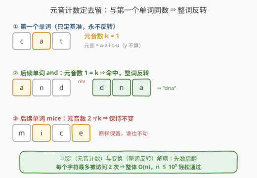
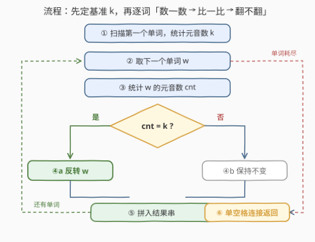

# LeetCode 反转元音数相同的单词 题解

## 1. 题目概述

- **标题 / 题号**：反转元音数相同的单词（#3775，medium）
- **链接**：https://leetcode.cn/problems/reverse-words-with-same-vowel-count/
- **难度**：中等
- **标签**：字符串、双指针、模拟

**题意**：给你一个字符串 `s`，它由小写的英文单词组成，每个单词之间用一个空格隔开。

请确定**第一个单词**中的元音字母数。然后，对于每个**后续单词**，如果它们的元音字母数与第一个单词相同，则将它们**反转**。其余单词保持不变。

返回处理后的结果字符串。

元音字母包括 `'a'`、`'e'`、`'i'`、`'o'` 和 `'u'`。

**示例 1**：

```text
输入：s = "cat and mice"
输出："cat dna mice"
解释：第一个单词 "cat" 包含 1 个元音字母；"and" 也有 1 个元音字母，反转为 "dna"；
      "mice" 有 2 个元音字母，保持不变。
```

**示例 2**：

```text
输入：s = "book is nice"
输出："book is ecin"
解释：第一个单词 "book" 包含 2 个元音字母；"is" 只有 1 个，保持不变；
      "nice" 有 2 个元音字母，反转为 "ecin"。
```

**示例 3**：

```text
输入：s = "banana healthy"
输出："banana healthy"
解释：第一个单词 "banana" 包含 3 个元音字母；"healthy" 只有 2 个，保持不变。
```

**约束**：

- $1 \le \text{s.length} \le 10^5$
- `s` 仅由小写英文字母和空格组成
- `s` 中的单词由**单个空格**隔开，不含前导或尾随空格

> 💡 **审题关键**：① **第一个单词只用来定基准**，它自身从不参与"反转判定"——规则原文是"对于每个**后续**单词"；② 元音集合是 $\{a, e, i, o, u\}$，`'y'` 不算；③ 单空格分隔 + 无前后置空格，意味着**单词边界结构极规则**，既不需要 `split` 后担心多余空白，C++ 也可以直接在原串上双指针定位；④ $n \le 10^5$ 的量级暗示线性模拟即预期解，不需要任何预处理数据结构。

## 2. 解题思路

### 2.1 朴素思路：按题面直译

最直接的翻译是：切出单词列表 → 对每个后续单词独立地"数元音、比基准、决定翻不翻" → 拼回去。有人会担心每个词要"数一遍 + 翻一遍"两趟扫描是否浪费，但核算一下总量：设所有词长之和为 $n$，计数一趟 $O(n)$、反转/拷贝一趟 $O(n)$，加起来仍是**线性**——而输出本身就有 $\Omega(n)$，所以直译模拟已经是量级最优，没有更快的做法可找。

另有一种"绕路"写法：对每个词先无脑反转、同时数元音，若元音数对不上再翻回来。由于 2.2 的不变量（反转不改变元音个数），这种写法逻辑自洽，但白做一遍反转工，且代码更绕——不如"先判后翻"干净。

> ⚠️ **最常见的 WA 点**：把第一个单词也丢进判定循环。第一个词的元音数当然等于基准 $k$（自己和自己比），于是它会被反转——示例 1 会错误地输出 `"tac dna mice"`。基准词必须排除在判定之外。

### 2.2 核心观察：计数与变换解耦



两个性质支撑起整个解法：

- **判定是标量函数**：单词 $w$ 是否被反转，只由一个整数 $V(w) = \lvert\{c \in w : c \in \{a,e,i,o,u\}\}\rvert$ 决定，与字母的排列顺序毫无关系。所以"数元音"和"反转"是两件独立的事，可以分两趟做。
- **反转的不变量**：反转只是字符的重排列，$V(\mathrm{rev}(w)) = V(w)$ 恒成立。因此"先数后翻"与"先翻后数"等价，顺序怎么排都不会弄脏判定条件。

于是算法就是清爽的两阶段：

$$k = V(w_1) \qquad\Rightarrow\qquad \text{ans}_i = \begin{cases} \mathrm{rev}(w_i) & V(w_i) = k \\ w_i & V(w_i) \ne k \end{cases},\quad i \ge 2$$

工作量核算：第一个词扫 1 遍，每个后续词至多扫 2 遍（计数 + 反转），$\sum \le 2n$，整体 $O(n)$。

> 💡 一句话：单词的"去留"只看一个数字，"变换"只是整词倒序——先数后翻、两趟线性，别把基准词也卷进去。

### 2.3 算法流程图



**逻辑执行步骤**：

| 步骤 | 操作 | 说明 |
|------|------|------|
| ① 定基准 | 扫描第一个单词，统计元音数 $k$ | 扫到首个空格即停；第一个词**不反转** |
| ② 取词 | 取下一个单词 $w$ | 单空格分隔，词边界由空格唯一确定 |
| ③ 计数 | 统计 $w$ 的元音数 $\text{cnt}$ | 一次线性扫过该词 |
| ④ 判定 | $\text{cnt} = k$ ? | 是 → 整词反转；否 → 原样保留 |
| ⑤ 拼接 | 把处理后的词追加进结果串 | 单词长度与空格位置全程不变 |
| ⑥ 返回 | 单词耗尽后，按单空格连接输出 | 即处理后的完整字符串 |

> ⚠️ 步骤 ② 有一个隐含出口：没有后续单词时（整个 `s` 只有一个词），循环体一次都不执行，原样返回——单词语料下这本身就是正确答案。

### 2.4 示例演算

**示例 1：`s = "cat and mice"`，基准 $k = 1$**：

| 单词 | 元音 | 元音数 | 与 $k$ 比较 | 动作 | 结果 |
|------|------|--------|------------|------|------|
| `cat` | `a` | 1 | （基准） | 不参与判定 | `cat` |
| `and` | `a` | 1 | 相等 | 整词反转 | `dna` |
| `mice` | `i`, `e` | 2 | 不等 | 保持 | `mice` |

拼接得 `"cat dna mice"` ✓

**示例 2 / 3 快速核对**：`"book is nice"` 中 $k = 2$（两个 `o`），`is` 计 1 不动、`nice` 计 2 反转成 `ecin`；`"banana healthy"` 中 $k = 3$（三个 `a`），`healthy` 计 2（`e`、`a`）不动。

**边界情形**：单单词串（如 `"a"`）无后续词，原样返回；长度为 1 的词（如 `"e"`）反转等于自身；全部后续词都命中时，除首词外全反转。另外注意 `"x y z"` 这类 $k = 0$ 的情形——零元音也是合法基准，`"y"`、`"z"` 计数同为 0 会被"反转"，但单字母反转后不变，输出仍为 `"x y z"`。

## 3. 参考代码

### C++

```cpp
class Solution {
public:
    string reverseWords(string s) {
        auto isVowel = [](char c) {
            return c == 'a' || c == 'e' || c == 'i' || c == 'o' || c == 'u';
        };
        int n = s.size();
        int k = 0, i = 0;
        while (i < n && s[i] != ' ') k += isVowel(s[i++]);

        int st = i;
        while (st < n) {
            if (s[st] == ' ') { ++st; continue; }
            int en = st;
            while (en < n && s[en] != ' ') ++en;
            int cnt = 0;
            for (int j = st; j < en; ++j) cnt += isVowel(s[j]);
            if (cnt == k) reverse(s.begin() + st, s.begin() + en);
            st = en;
        }
        return s;
    }
};
```

> 💡 **写法要点**：
> - **原地修改、$O(1)$ 额外空间**：反转只发生在词区间 $[st, en)$ 内部，单词长度与空格位置全程不动，直接改 `s` 再返回即可——这正是标签 **Two Pointers** 的用意；
> - 第一个循环结束后 `i` 停在首个空格（或 $n$），它天然把基准词 $[0, i)$ 排除在后续循环之外，无须特判"跳过第一个词"；
> - `st = en` 落在空格上，下一轮 `continue` 跳过——同一套"跳空格 → 吃单词"的节奏走完全串；
> - 单单词串时 `st = n`，循环不进，直接返回原串。

### Python

```python
class Solution:
    def reverseWords(self, s: str) -> str:
        words = s.split(' ')
        k = sum(c in 'aeiou' for c in words[0])
        out = [words[0]]
        out += [w[::-1] if sum(c in 'aeiou' for c in w) == k else w
                for w in words[1:]]
        return ' '.join(out)
```

> 💡 **写法要点**：
> - `c in 'aeiou'` 是 5 次字符比较的短路写法，比建 `set` 更快（串长 5，常数极小）；
> - `sum(...)` 里布尔值按 1 累加，是统计满足条件字符数的惯用法；
> - 首词单独放进 `out`、列表推导只遍历 `words[1:]`，把"基准词不判定"这个最易错的点显式写死在结构里；
> - 题目保证单空格分隔，`split(' ')` 与 `join(' ')` 严格互逆，不会产生多余空白。

## 4. 复杂度分析

| 维度 | 复杂度 | 说明 |
|------|--------|------|
| **时间** | $O(n)$ | 基准词扫 1 遍 + 每个后续词"计数 + 反转"至多 2 遍，$\sum \le 2n$；输出本身 $\Omega(n)$，已达理论下界 |
| **空间** | C++ $O(1)$ / Python $O(n)$ | C++ 双指针原地反转，仅常数变量；Python 的切片与列表切分必然复制 |
| **量级判断** | $n \le 10^5$ | 线性模拟约 $2 \times 10^5$ 次字符级操作，毫秒级完成 |

## 5. 扩展：元音判断的位掩码与一行流

**位掩码判元音**：`isVowel` 的 5 次比较可以压成一次移位。把 $a, e, i, o, u$ 对应到 26 位掩码的第 $0, 4, 8, 14, 20$ 位：

$$\text{mask} = 2^0 + 2^4 + 2^8 + 2^{14} + 2^{20} = \texttt{0x104111}$$

判断一行搞定：`(0x104111 >> (c - 'a')) & 1`。内层被调用 $n$ 次时，这个常数优化有真实收益（约省一半比较）；若还要更快，可以预生成 `bool vow[26]` 查表。

**Python 一行流**：利用"计数与反转解耦"，主逻辑可压成两条表达式：

```python
class Solution:
    def reverseWords(self, s: str) -> str:
        ws = s.split(' ')
        k = sum(c in 'aeiou' for c in ws[0])
        return ' '.join([ws[0]] + [w[::-1] if sum(c in 'aeiou' for c in w) == k else w for w in ws[1:]])
```

**变体思考**：若判定条件从"元音个数相同"改成"元音多重集合相同"（如 `ate` 与 `tea` 都含 $\{a, e\}$），标量计数失效，可对每个词维护 5 维计数或 26 位字母位掩码做键；改成"元音占比相同"则要带上词长做约分比较。不变的是那条主心骨——**先抽出与判定相关的特征，再决定变换**。

## 6. 面试要点

**Q1：为什么整体复杂度是 $O(n)$？还能更快吗？**

> 设词长之和为 $n$：基准词计数 1 遍，每个后续词计数 1 遍 + 至多反转 1 遍，总访问次数 $\le 2n$。输出串长度为 $n$，构造它就要 $\Omega(n)$，因此线性已是下界，"更快"无从谈起。

**Q2：第一个单词会被反转吗？为什么这是个易错点？**

> 不会。规则只作用于"后续单词"，第一个词的唯一职责是提供基准 $k$。若把它也放进判定循环，它的元音数必然等于 $k$（自己和自己比），会被错误反转——示例 1 会输出 `"tac dna mice"`。这是本题最高频的 WA。

**Q3：先计数后反转、先反转后计数，顺序可以交换吗？**

> 可以。反转是字符的重排列，元音集合与个数都不变，即 $V(\mathrm{rev}(w)) = V(w)$。判定条件在反转前后取值一致，因此两趟的先后不影响正确性——但"先数后翻"少做无用功，是自然的选择。

**Q4：C++ 如何做到 $O(1)$ 额外空间？**

> 不切子串、不建结果串：双指针在原串上定位每个词的区间 $[st, en)$（`en` 停在空格或末尾），计数后若命中就 `reverse(s.begin()+st, s.begin()+en)`。反转发生在词内部，词长与空格位置全程不变，最终整个 `s` 就是答案。

**Q5：实现上还有哪些小坑？**

> ① `y` 不属于元音，判定集合固定为 `aeiou`；② 单空格分隔是题设保证，`split`/双指针都可以放心假设边界规则，不必防御多余空白；③ $k = 0$ 是合法基准（第一个词全是辅音），此时所有零元音的后续词都要反转；④ 长度为 1 的词反转等于自身，别在结果里"看起来没变"就怀疑逻辑错了。

> 💡 **一句话总结**：3775 = 「基准词定 $k$ + 后续词两趟线性处理（数元音、比基准、命中才翻）」。三个要点带走：判定与变换解耦（标量函数 + 排列不变量）、基准词不进循环（最常见 WA）、C++ 原地双指针可做到 $O(1)$ 空间。

## 同类练习题

| # | 题目 | 与本题的关联 |
|---|------|-------------|
| 345 | [反转字符串中的元音字母](https://leetcode.cn/problems/reverse-vowels-of-a-string/)（[题解](../0301-0400/345_反转字符串中的元音字母.md)） | 元音判定 + 双指针反转——本题"元音"与"反转"两个零件的独立基础版 |
| 557 | [反转字符串中的单词 III](https://leetcode.cn/problems/reverse-words-in-a-string-iii/)（[题解](../0501-0600/557_反转字符串中的单词III.md)） | 无条件反转每个单词，即本题去掉"元音数相同"判定后的退化版 |
| 917 | [仅仅反转字母](https://leetcode.cn/problems/reverse-only-letters/)（[题解](../0901-1000/917_仅仅反转字母.md)） | 双指针按条件选择性反转，练"哪些字符参与交换"的手感 |
| 1119 | [删去字符串中的元音](https://leetcode.cn/problems/remove-vowels-from-a-string/)（[题解](../1101-1200/1119_删去字符串中的元音.md)） | 元音过滤入门，对照体会"元音判定"单独出现时的写法 |
| 151 | [反转字符串中的单词](https://leetcode.cn/problems/reverse-words-in-a-string/)（[题解](../0101-0200/151_反转字符串中的单词.md)） | 单词级反转 + 空白清洗，练"词边界定位与拼接"的完整工况 |
