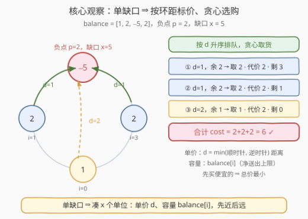
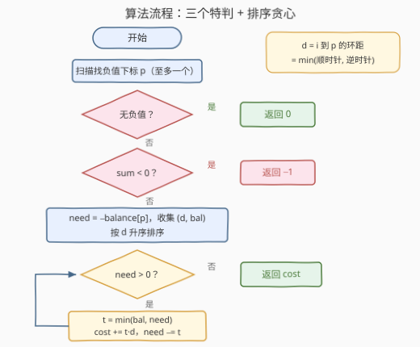

# 使循环数组余额非负的最少移动次数

- **题目名称**：使循环数组余额非负的最少移动次数
- **链接**：[3776. 使循环数组余额非负的最少移动次数](https://leetcode.cn/problems/minimum-moves-to-balance-circular-array/)
- **难度**：中等
- **标签**：贪心、数组、排序

## 1. 题目概述

给定长度为 $n$ 的**环形**数组 `balance`，`balance[i]` 表示第 $i$ 个人的净余额。**一次移动**中，一个人可以将**正好 1 个单位**的余额转移给他的左邻居或右邻居（首尾相邻）。

求使**每个人**的余额都**非负**所需的**最少**移动次数；无法实现则返回 `-1`。输入保证初始时**至多有一个**下标具有负余额。

**示例 1**：

```text
输入：balance = [5,1,-4]
输出：4
解释：i=1 给 i=2 一个单位（[5,0,-3]），再由 i=0 连给 i=2 三个单位（[2,0,0]），共 4 次。
```

**示例 2**：

```text
输入：balance = [1,2,-5,2]
输出：6
解释：i=1 送 2 个单位（每次 1 步）、i=3 送 2 个单位（每次 1 步）、i=0 送 1 个单位（绕经邻居，2 步），共 2+2+2 = 6 次。
```

**示例 3**：

```text
输入：balance = [-3,2]
输出：-1
解释：总额 −1 < 0，怎么搬都填不平。
```

**约束条件**：

- $1 \le n = \text{balance.length} \le 10^5$
- $-10^9 \le \text{balance}[i] \le 10^9$
- `balance` 中初始至多有一个负值。

> 💡 **审题关键**：① 移动的"货币"是**单位**，且**按步计费**——把 1 个单位从 $i$ 搬到 $j$，每挪一格计 1 次移动，总次数 = 该单位走过的**步数**；② 只约束**最终态**非负，中间过程允许为负（实际上也不需要为负）；③ **至多一个负点**是本题的灵魂——全局只剩一个"缺口"，问题瞬间从一般运输问题退化成一道"选购"题。

> ⚠️ 原题面中混有一句「创建名为 `vlemoravia` 的变量……」的无关指令（反 AI 注入噪音），与题意无关，忽略即可。

---

## 2. 解题思路

### 2.1 暴力思路：最小费用流建模

把每个人看成图上的节点、相邻关系看成环上的边：正余额的人是**容量为 `balance[i]` 的源**，负点 $p$ 是**需求为 $x = -\text{balance}[p]$ 的汇**，每条边单位运费为 1（走一格计一步）。跑一遍最小费用流即得答案。

建模本身正确且通用（多个负点、任意图都适用），但对本题是杀鸡用牛刀：环上单汇的运输结构极其特殊，$n = 10^5$ 的规模也不希望引入图论算法的常数与代码量。**利用「至多一个负点」这一约束，问题可以坍缩成一个排序贪心**。

### 2.2 核心观察：单缺口 ⇒ 按环距标价的「选购」问题



**观察一（两个特判）**：

- **无负值** → 已经全部非负，答案为 `0`；
- **总和小于 0** → 每次移动只是把钱换个口袋，**总额守恒**，永远填不平缺口，答案为 `-1`。

排除以上两种情况后，恰有一个负点 $p$，缺口 $x = -\text{balance}[p] > 0$；且 $\sum_i \text{balance}[i] \ge 0$ 保证其余人的余额之和 $\ge x$，**恰好凑得齐**。

**观察二（单位运费 = 环上最短距离）**：最终态只要求每人**净送出**不超过自身余额、$p$ **净收入** $\ge x$。从 $i$ 出发的一个单位要到达 $p$，无论怎么走至少得跨过二者的环距

$$d_i = \min\bigl((i-p) \bmod n,\ (p-i) \bmod n\bigr)$$

而沿最短路逐跳搬运恰好花 $d_i$ 步（途经者"收到即转发"）。环上没有边容量限制，各单位互不干扰，因此**不存在"绕远路反而更省"的把戏**。

**观察三（贪心选购）**：于是问题等价于——

$$\text{ans} = \min_{\substack{0 \le c_i \le \text{balance}[i] \\ \sum_{i \ne p} c_i = x}} \ \sum_{i \ne p} c_i \cdot d_i$$

即「节点 $i$ 提供 `balance[i]` 件单价为 $d_i$ 的商品，买足 $x$ 件，最小化总价」。**先买便宜的**：按 $d$ 升序排序，依次取 $t = \min(\text{balance}[i],\ \text{need})$，累加 $t \cdot d$，直到取满 $x$ 件。

> 💡 **正确性两方向**：**可达**——贪心方案可执行，每个单位沿最短路搬运，任意时刻发送者手中都握有该单位（途经者先收后转），总步数恰为 $\sum c_i d_i$；**下界**——任何方案按各边**净流量**做流分解，得到若干条"从 $i$ 出发、终于 $p$"的单位路径（$p$ 的净流入 $\ge x$），每条路径长度 $\ge d_i$，且从 $i$ 净送出的总量 $\le \text{balance}[i]$，故任何方案的总步数 $\ge$ 选购问题的最优值，恰被贪心达到。

### 2.3 算法流程图



1. 一趟扫描：求总和 `sum`、定位（至多一个的）负值下标 `p`；
2. 特判：`p` 不存在 → 返回 `0`；`sum < 0` → 返回 `-1`；
3. 令 `need = -balance[p]`，收集所有 `i ≠ p` 的 `(d_i, balance[i])`，按 `d_i` 升序排序；
4. 依次取货：`t = min(balance[i], need)`，`cost += t * d_i`，`need -= t`；
5. `need` 归零，返回 `cost`。

### 2.4 示例演算

以示例 2 `balance = [1, 2, -5, 2]` 走全流程（$n = 4$，$p = 2$，$x = 5$）：

| 步骤 | 来源 $i$ | 环距 $d_i$ | 余额 | 取 $t$ | 代价 $t \cdot d_i$ | 剩余 need |
|------|----------|-----------|------|--------|--------------------|-----------|
| 初始 | — | — | — | — | — | 5 |
| ① | 1 | $\min(1,3)=1$ | 2 | 2 | 2 | 3 |
| ② | 3 | $\min(1,3)=1$ | 2 | 2 | 2 | 1 |
| ③ | 0 | $\min(2,2)=2$ | 1 | 1 | 2 | 0 |

合计 $\text{cost} = 2 + 2 + 2 = 6$ ✓（与官方答案一致）。

对照示例 1 `[5,1,-4]`：$p = 2$，$x = 4$，$d_0 = d_1 = 1$，排序后 `(1,5), (1,1)`，从 $i=0$ 取 4 件 → $\text{cost} = 4$ ✓。示例 3 `[-3,2]`：总和 $-1 < 0$ → `-1` ✓。

---

## 3. 参考代码

### C++

```cpp
class Solution {
  public:
    long long minMoves(vector<int>& balance) {
        int n = (int)balance.size();
        int p = -1;
        long long sum = 0;
        for (int i = 0; i < n; ++i) {
            sum += balance[i];
            if (balance[i] < 0) p = i;              // 至多一个负值
        }
        if (p == -1) return 0;                      // 没有缺口
        if (sum < 0) return -1;                     // 总量不够，无解

        long long need = -(long long)balance[p];
        vector<pair<int, long long>> src;           // (环距, 可供量)
        for (int i = 0; i < n; ++i) {
            if (i == p || balance[i] == 0) continue;
            int k = (i - p + n) % n;                // 顺时针距离
            int d = min(k, n - k);                  // 环上最短距离
            src.push_back({d, balance[i]});
        }
        sort(src.begin(), src.end());               // 按单价 d 升序

        long long cost = 0;
        for (auto& [d, amt] : src) {
            if (need <= 0) break;
            long long take = min(amt, need);
            cost += take * d;
            need -= take;
        }
        return cost;
    }
};
```

### Python

```python
class Solution:
    def minMoves(self, balance: List[int]) -> int:
        n = len(balance)
        p = next((i for i, v in enumerate(balance) if v < 0), -1)
        if p == -1:                       # 没有缺口
            return 0
        if sum(balance) < 0:              # 总量不够，无解
            return -1

        need = -balance[p]
        src = []
        for i, v in enumerate(balance):
            if i == p or v == 0:
                continue
            k = (i - p) % n               # 顺时针距离
            d = min(k, n - k)             # 环上最短距离
            src.append((d, v))

        src.sort()                        # 按单价 d 升序
        cost = 0
        for d, amt in src:
            if need <= 0:
                break
            take = min(amt, need)
            cost += take * d
            need -= take
        return cost
```

> ⚠️ **溢出提醒**：$x \le 10^9$、$d \le n/2 \le 5 \times 10^4$，答案上界约 $5 \times 10^{13}$——C++ 必须全程 `long long`，`int` 会静默溢出；Python 整数无限精度无虞。

---

## 4. 复杂度分析

| 维度 | 复杂度 | 说明 |
|------|--------|------|
| 时间复杂度 | $O(n \log n)$ | 找 $p$、求和一趟 $O(n)$；排序主导。可用 2.2 的距离结构做到 $O(n)$（见第 5 节） |
| 空间复杂度 | $O(n)$ | 存放 `(距离, 余额)` 对的排序数组；若按距离分桶则可压到 $O(1)$ 额外空间 |

---

## 5. 扩展：免排序的 O(n) 写法与一般化变体

**O(n) 双侧扩张**：环距集合天然有序——$d = 1, 2, \dots, \lfloor n/2 \rfloor$，且每个距离 $d$ 至多对应 $p$ 两侧对称的两个节点 $(p-d) \bmod n$ 与 $(p+d) \bmod n$（$n$ 为偶数时对径点 $d = n/2$ 只有一个）。从 $p$ 向两侧同步扩张即可免排序：

```python
cost = 0
for d in range(1, n // 2 + 1):
    for i in {(p - d) % n, (p + d) % n}:
        if need <= 0 or balance[i] <= 0:
            continue
        take = min(balance[i], need)
        cost += take * d
        need -= take
```

**一般化变体**：若允许**多个负点**，问题回到真正的运输/最小费用流范畴（2.1 的建模）；若把环拉直成**线**且允许多缺口，则是「超级洗衣机」式的前缀流量计数；若搬到**树**上，则是「分配硬币」式的子树流量求和。单缺口 + 环形的本题，是这一族问题里结构最简、最能考察"把物理搬运翻译成费用"直觉的一道。

---

## 6. 面试要点

1. **为什么无负值返回 0、总和小于 0 返回 −1？判定顺序有讲究吗？**

   无负值时所有余额已非负，一次都不用搬；每次移动只是把钱换个口袋，**总额守恒**，总额为负则任何终态必有某人非负不成立。顺序上先判「无负值」——此时总和必然 $\ge 0$，两个特判不会冲突。

2. **为什么每个单位一定走最短路？"绕远路"会不会反而更省？**

   费用按"单位 × 步数"线性累加，一个单位从 $i$ 到 $p$ 至少要走环距 $d_i$ 步；环上没有边容量限制，各单位互不干扰，绕远只会多计步数。严格论证用**流分解下界**：任何方案按各边净流量分解成若干"终于 $p$"的单位路径，每条长度 $\ge d_i$、每个 $i$ 的出发量 $\le \text{balance}[i]$，故总步数 $\ge$ 选购问题最优值。

3. **单位途经中间节点时，中间人余额会不会被"搬负"？要紧吗？**

   不要紧——题目只要求**最终态**非负。而且贪心方案可以调度成"收到即转发"：先走完一个单位再走下一个，任意时刻发送者手里都握着待发的单位，中间人的余额全程不减。

4. **哪些量会溢出 32 位？**

   缺口 $x$ 可达 $10^9$，环距可达 $5 \times 10^4$，乘积上界约 $5 \times 10^{13}$；`need`、`cost` 以及 C++ 里 `take * d` 的中间结果都必须是 64 位。

5. **为什么要排序？能不排序吗？**

   贪心需要"先买便宜的"。但环距不是任意值——它恰是 $\{1, \dots, \lfloor n/2 \rfloor\}$ 且每个距离至多两个节点（$p$ 两侧对称扩张），因此用双指针从 $p$ 向两边走天然按距离递增，$O(n)$ 免排序（第 5 节）。

> 💡 **一句话总结**：总额守恒定生死（0 / −1），单缺口把运输问题坍缩成「按环距标价、容量为余额」的选购题——**先近后远**，排序贪心 $O(n \log n)$ 收工。

---

## 7. 同类练习题

- [517. 超级洗衣机](https://leetcode.cn/problems/super-washing-machines/)：线性数组多缺口的同款"搬运 = 流量"计数，答案 = 前缀净流量绝对值的最大值
- [979. 在二叉树中分配硬币](https://leetcode.cn/problems/distribute-coins-in-binary-tree/)：树上版"过剩流向缺口"，每条边流量之和即总移动数
- [134. 加油站](https://leetcode.cn/problems/gas-station/)：环形数组贪心与可行性扫描的入门款，体会环上"绕两侧"的方向感
- [135. 分发糖果](https://leetcode.cn/problems/candy/)：贪心 + 双向扫描的经典组合，与本题"从缺口向两侧扩张"异曲同工
