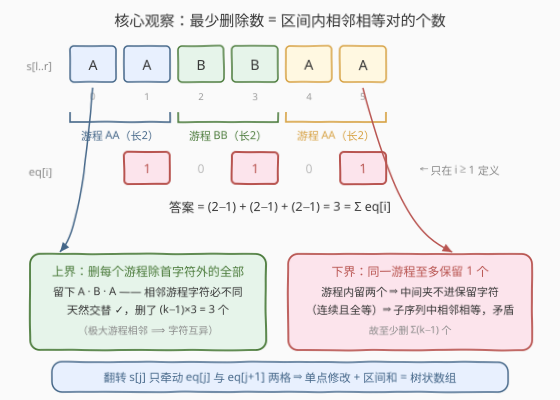
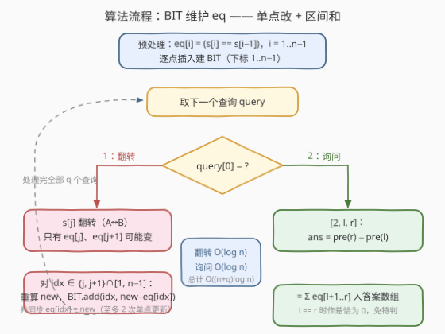

# LeetCode 使子字符串变交替的最少删除次数 题解

## 1. 题目概述

- **标题 / 题号**：使子字符串变交替的最少删除次数（#3777，hard）
- **链接**：https://leetcode.cn/problems/minimum-deletions-to-make-alternating-substring/
- **难度**：困难
- **标签**：树状数组、线段树、字符串

**题意**：给你一个长度为 $n$ 的字符串 $s$，其中仅包含字符 `'A'` 和 `'B'`。另给你一个长度为 $q$ 的二维整数数组 $\text{queries}$，每个 $\text{queries}[i]$ 是以下形式之一：

- `[1, j]`：**翻转** $s$ 中下标为 $j$ 的字符（`'A'` 变 `'B'`，反之亦然），此操作会修改 $s$ 并影响后续查询；
- `[2, l, r]`：计算使子字符串 $s[l..r]$ 变成**交替字符串**所需的最小删除数。此操作不修改 $s$。

**交替字符串**：子字符串中不存在两个相邻字符相等；长度为 1 的子字符串始终交替。返回所有类型 2 查询的答案数组。

**示例 1**：

```text
输入：s = "ABA", queries = [[2,1,2],[1,1],[2,0,2]]
输出：[0,2]
解释："BA" 已交替 → 0；翻转 s[1] 后 s = "AAA"，删两个 'A' 得 "A" → 2
```

**示例 2**：

```text
输入：s = "ABB", queries = [[2,0,2],[1,2],[2,0,2]]
输出：[1,0]
解释："ABB" 删一个 'B' 得 "AB" → 1；翻转 s[2] 后 s = "ABA" 已交替 → 0
```

**示例 3**：

```text
输入：s = "BABA", queries = [[2,0,3],[1,1],[2,1,3]]
输出：[0,1]
解释："BABA" 已交替 → 0；翻转 s[1] 后 s = "BBBA"，子串 "BBA" 删一个 'B' 得 "BA" → 1
```

**约束**：

- $1 \le n = s.length \le 10^5$
- $s[i]$ 要么是 `'A'`，要么是 `'B'`
- $1 \le q = \text{queries.length} \le 10^5$
- `queries[i] == [1, j]`（$0 \le j \le n-1$）或 `queries[i] == [2, l, r]$`（$0 \le l \le r \le n-1$）

> 💡 **审题关键**：① 类型 2 问的是「最少删除多少字符后子串**交替**」——删除后剩余的是**子序列**（保序、可不连续），而非连续子串；② 类型 1 的翻转会**持久改变** $s$，后续查询都基于新串；③ 只有两种字符，但「交替」的判定只与**相邻是否相等**有关，与具体是哪个字母无关——这一点是后文把问题坍缩成计数的桥梁。

## 2. 解题思路

### 2.1 暴力思路：逐查询全量重扫

对每个类型 2 查询 `[2, l, r]`，扫一遍子串数出需要删除的字符：维护「上一个保留字符」，遇到与它相等的就删，否则保留。单次 $O(r - l + 1)$，最坏 $O(n)$；类型 1 翻转 $O(1)$。总计最坏 $O(nq) = 10^{10}$，$n, q$ 均为 $10^5$ 时不可行。

瓶颈在于：**同一个子串被反复询问，而每次翻转只改动一个字符**——整段重扫把 $99\%$ 未受影响的部分反复重算。

### 2.2 核心观察：答案 = 区间内「相邻相等对」的个数



定义辅助数组：

$$\text{eq}[i] = \begin{cases} 1, & i \ge 1 \text{ 且 } s[i] = s[i-1] \\ 0, & \text{否则} \end{cases}$$

**结论**：查询 `[2, l, r]` 的答案 $= \sum_{i=l+1}^{r} \text{eq}[i]$，即子串内**相邻相等对**的个数。

**证明**（游程视角）：把 $s[l..r]$ 划分成极大相等**游程**（run），设各游程长为 $k_1, k_2, \dots, k_m$，则相邻相等对总数 $= \sum_j (k_j - 1)$。

- **下界**：同一游程内任意两个被保留的字符，中间不可能夹进其他保留字符（游程是**连续且全等**的一段），于是它们在剩余子序列中相邻且相等，违反交替。故每个游程**至多保留 1 个**字符，至少删 $\sum_j (k_j - 1)$ 个；
- **上界**：删掉每个游程除首字符外的全部字符，保留的恰是「各游程首字符」——相邻游程是极大的，相邻游程字符必不同，故剩余子序列交替 ✓，删除数恰为 $\sum_j (k_j - 1)$。

两个界重合，答案精确等于 $\sum_{i=l+1}^{r} \text{eq}[i]$。以 `"AABBAA"` 为例：三个游程各贡献 $2-1=1$，共删 $3$ 个得 `"ABA"`。

**问题的形态由此确定**：静态时这是前缀和 $O(1)$ 查询；但**翻转 $s[j]$ 会改变 $s[j-1..j]$ 与 $s[j..j+1]$ 两处比较的结果**，即只牵动 $\text{eq}[j]$ 与 $\text{eq}[j+1]$ 两个格子——**单点修改 + 区间求和**，正是树状数组（BIT）的裸形态。

### 2.3 算法流程图



1. **预处理**：一趟扫描建 $\text{eq}[1..n-1]$，逐点插入 BIT（下标 $1..n-1$）；
2. **查询 `[1, j]`**：翻转 $s[j]$；对 $idx \in \{j,\, j+1\} \cap [1, n-1]$ 逐一重算 $\text{new} = (s[idx] = s[idx-1])$，若与旧值不同则 `BIT.add(idx, new − eq[idx])` 并同步 $\text{eq}[idx] \leftarrow \text{new}$——至多 **2 次单点更新**；
3. **查询 `[2, l, r]`**：输出 $\text{pre}(r) - \text{pre}(l)$，即 $\sum_{i=l+1}^{r} \text{eq}[i]$。$l = r$ 时作差恰为 $0$（长度 1 恒交替），无需特判；
4. 收集全部类型 2 答案返回。

### 2.4 示例演算

以示例 3 `s = "BABA"` 走一遍（初始 $\text{eq}[1..3] = [0, 0, 0]$，全无相邻相等）：

| 查询 | 状态变化 | eq 数组 | 计算 | 答案 |
|------|----------|---------|------|------|
| `[2,0,3]` | — | `[0, 0, 0]` | $\text{pre}(3) - \text{pre}(0) = 0$ | 0 |
| `[1,1]` | $s \to$ `"BBBA"` | $\text{eq}[1]{:}0{\to}1$（B=B），$\text{eq}[2]{:}0{\to}1$（B=B），$\text{eq}[3]$ 不变（A≠B） | 2 次单点更新 | — |
| `[2,1,3]` | — | `[1, 1, 0]` | $\text{pre}(3) - \text{pre}(1) = 2 - 1 = 1$ | 1 |

得 `[0, 1]` ✓。示例 1 同法：翻转 $s[1]$ 后 `"AAA"` 的 $\text{eq}[1] = \text{eq}[2] = 1$，$\text{pre}(2) - \text{pre}(0) = 2$ ✓。

## 3. 参考代码

### C++

```cpp
class Solution {
  public:
    vector<int> minDeletions(string s, vector<vector<int>>& queries) {
        int n = s.size();
        vector<int> eq(n, 0);                 // eq[i] = 1 ⟺ i≥1 且 s[i]==s[i-1]
        for (int i = 1; i < n; ++i) eq[i] = (s[i] == s[i - 1]);

        vector<int> tree(n + 1, 0);           // BIT，下标 1..n
        auto add = [&](int i, int d) {        // 单点更新 eq[i] += d
            for (; i <= n; i += i & (-i)) tree[i] += d;
        };
        auto pre = [&](int i) {               // eq[1..i] 之前缀和
            int t = 0;
            for (; i > 0; i -= i & (-i)) t += tree[i];
            return t;
        };
        for (int i = 1; i < n; ++i)           // 建树
            if (eq[i]) add(i, 1);

        vector<int> ans;
        for (auto& q : queries) {
            if (q[0] == 1) {                  // 翻转 s[j]
                int j = q[1];
                s[j] = (s[j] == 'A') ? 'B' : 'A';
                for (int idx : {j, j + 1}) {  // 只有 eq[j]、eq[j+1] 可能变
                    if (1 <= idx && idx <= n - 1) {
                        int ne = (s[idx] == s[idx - 1]);
                        if (ne != eq[idx]) {  // 差量更新，并同步历史值
                            add(idx, ne - eq[idx]);
                            eq[idx] = ne;
                        }
                    }
                }
            } else {                          // [2, l, r]：sum(eq[l+1..r])
                ans.push_back(pre(q[2]) - pre(q[1]));
            }
        }
        return ans;
    }
};
```

### Python

```python
class Solution:
    def minDeletions(self, s: str, queries: List[List[int]]) -> List[int]:
        n = len(s)
        s = list(s)
        eq = [0] * n                          # eq[i] = 1 ⟺ i≥1 且 s[i]==s[i-1]
        for i in range(1, n):
            if s[i] == s[i - 1]:
                eq[i] = 1

        tree = [0] * (n + 1)
        def add(i, d):                        # 单点更新 eq[i] += d
            while i <= n:
                tree[i] += d
                i += i & (-i)
        def pre(i):                           # eq[1..i] 之前缀和
            t = 0
            while i > 0:
                t += tree[i]
                i -= i & (-i)
            return t
        for i in range(1, n):
            if eq[i]:
                add(i, 1)

        ans = []
        for t, *rest in queries:
            if t == 1:                        # 翻转 s[j]
                j = rest[0]
                s[j] = 'B' if s[j] == 'A' else 'A'
                for idx in (j, j + 1):        # 只有 eq[j]、eq[j+1] 可能变
                    if 1 <= idx <= n - 1:
                        ne = 1 if s[idx] == s[idx - 1] else 0
                        if ne != eq[idx]:     # 差量更新，并同步历史值
                            add(idx, ne - eq[idx])
                            eq[idx] = ne
            else:                             # [2, l, r]：sum(eq[l+1..r])
                l, r = rest
                ans.append(pre(r) - pre(l))
        return ans
```

> ⚠️ **易错点**：① BIT 里存的是**历史值**，翻转后必须用「新值 − $\text{eq}[idx]$」的**差量**更新，并同步 $\text{eq}[idx]$，否则下一次翻转的差量就错了；② $\text{eq}[0]$ 无定义、$\text{eq}[n]$ 越界，$j = 0$ 与 $j = n-1$ 时靠 `1 ≤ idx ≤ n−1` 的边界判断天然排除；③ Python 中 `s` 需先转 `list` 才能按下标修改。

## 4. 复杂度分析

| 维度 | 复杂度 | 说明 |
|------|--------|------|
| 时间复杂度 | $O((n + q) \log n)$ | 建树 $O(n \log n)$（可 $O(n)$ 线性建树）；每次翻转至多 2 次单点更新、每次询问 2 次前缀查询，各 $O(\log n)$ |
| 空间复杂度 | $O(n)$ | $\text{eq}$ 数组与 BIT 各 $O(n)$ |

## 5. 扩展：换个引擎、换个问法

- **换数据结构**：线段树（单点改 + 区间和）完全等价；若还想知道「区间内最长交替前缀/后缀」这类不可减信息，线段树可维护合并信息（左端交替长度、右端交替长度、区间内部相邻相等数），BIT 做不到——BIT 依赖前缀可减性；
- **退化形态**：若没有类型 1 查询（纯静态），一遍前缀和 $O(1)$ 应答即可（即 303 题骨架）；本题相当于 307 题的「单点改 + 区间和」套了一层数学转化；
- **字符集泛化**：把 `'A'/'B'` 换成任意 $k$ 个字母，结论一字不改——交替 $\iff$ 相邻全不等，$\text{eq}$ 只看相等性、与字母身份无关。

## 6. 面试要点

1. **为什么最少删除数恰等于相邻相等对的个数？**

   游程论证双向夹逼。下界：同一极大游程内保留两个字符，中间夹不进其他保留字符（游程连续且全等），它们在子序列中相邻且相等，违反交替，故每游程至多留 1 个；上界：删每个游程除首字符外的全部，相邻游程首字符必不同（极大性），剩余天然交替。两界同为 $\sum (k_j - 1)$ = 相邻相等对数。

2. **为什么翻转 $s[j]$ 只需更新两个位置？**

   $\text{eq}[i]$ 只依赖比较 $s[i]$ 与 $s[i-1]$，含 $s[j]$ 的比较仅有 $i = j$ 与 $i = j+1$ 两处，其余全部不受影响——一次翻转的影响是**严格局部**的，这是本题能 $O(\log n)$ 应答的根基。

3. **BIT 更新时为什么必须同步维护 eq 数组？**

   BIT 是聚合结构，单点更新需要知道**变化量** $\Delta = \text{new} - \text{old}$，而 $\text{old}$ 只能从 $\text{eq}$ 数组读出。若不同步，下一次翻转同一下标时差量就会算错。

4. **$l = r$、$j = 0$、$j = n-1$ 这些边界怎么处理？**

   $l = r$：求和区间 $[l+1, r]$ 为空，$\text{pre}(r) - \text{pre}(l) = 0$ 天然正确（长度 1 恒交替）；$j = 0$ 时 $\text{eq}[0]$ 无定义、$j = n-1$ 时 $\text{eq}[n]$ 越界，统一用 $1 \le idx \le n-1$ 的判断排除，不需要 if 特判分支。

5. **这题的答案会溢出吗？**

   不会。答案 $\le n - 1 < 10^5$，32 位 `int` 绰绰有余——与逆序对族（$\binom{n}{2} \approx 5 \times 10^9$）不同，计数对象是相邻对而非任意对，只有 $n-1$ 个。

> 💡 **一句话总结**：删成交替 $\iff$ 每个相等游程至多留一个 $\iff$ 答案 = 区间内相邻相等对数；翻转单字符只牵动两个 eq 格子，于是「数学坍缩 + BIT 单点改区间和」$O((n+q)\log n)$ 收工。

## 同类练习题

| # | 题目 | 与本题的关联 |
|---|------|-------------|
| 307 | [区域和检索 - 数组可修改](https://leetcode.cn/problems/range-sum-query-mutable/) | 单点改 + 区间和的 BIT 裸模板，本题的数据结构骨架 |
| 303 | [区域和检索 - 数组不可变](https://leetcode.cn/problems/range-sum-query-immutable/) | 无修改版前缀和 $O(1)$ 查询，对照「修改带来什么代价」 |
| 978 | [最长湍流子数组](https://leetcode.cn/problems/longest-turbulent-subarray/) | 同样由「相邻比较符号」定义的交替结构，静态滑窗维护 |
| 376 | [摆动序列](https://leetcode.cn/problems/wiggle-subsequence/) | 相邻差符号交替的子序列问题，贪心/DP 视角 |
| 926 | [将字符串翻转到单调递增](https://leetcode.cn/problems/flip-string-to-monotone-increasing/) | 前缀和维护 0/1 计数求解「变成目标形态」类问题 |
