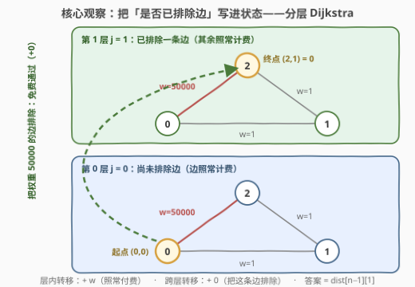
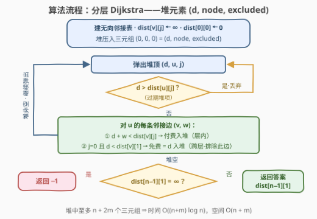

# 排除一个最大权重边的最小距离

- **题目名称**：排除一个最大权重边的最小距离
- **链接**：[3778. 排除一个最大权重边的最小距离](https://leetcode.cn/problems/minimum-distance-excluding-one-maximum-weighted-edge/)
- **难度**：中等
- **标签**：图、最短路、Dijkstra、堆（优先队列）

## 1. 题目概述

> ⚠️ 本题为 LeetCode 付费题（撰写时官方题面未公开），题意描述根据官方示例用例与 hints 重建，可能与官方题面有出入。

**题意**：给定 $n$ 个节点（编号 $0 \sim n-1$）的带权无向图，`edges[i] = [u, v, w]` 表示 $u$ 与 $v$ 之间有一条权重为 $w$ 的边。从节点 $0$ 出发走到节点 $n-1$，一条路径的**距离**定义为：路径上所有边权之和，**排除（不计入）其中权重最大的一条边**——即恰好有一条边免费通过。求从 $0$ 到 $n-1$ 的最小距离；若无法到达，返回 $-1$。

官方 hints 原文（题意重建依据）：

1. Use Dijkstra（用 Dijkstra）
2. The problem is the same as finding the minimum path from $0$ to $n-1$ with one edge excluded（本题等价于求 $0$ 到 $n-1$「排除一条边」的最小路径）
3. Use states $(dist, node, excluded)$ as your Dijkstra elements（Dijkstra 用 $(dist, node, excluded)$ 三元组做堆元素/状态）

**示例 1**：

```text
输入：n = 5, edges = [[0,1,2],[1,2,7],[2,3,7],[3,4,4]]
输出：13
解释：唯一通路 0→1→2→3→4 的边权之和为 2+7+7+4 = 20，
      排除其中权重最大的边（权重 7），距离为 20 − 7 = 13。
```

**示例 2**：

```text
输入：n = 3, edges = [[0,1,1],[1,2,1],[0,2,50000]]
输出：0
解释：直接走边 0→2，它正是该路径上权重最大的边，被排除后距离为
      50000 − 50000 = 0；比绕行 0→1→2（排除一条权重 1 的边后为 2−1=1）更小。
```

**约束条件**（官方约束未公开，按示例与同类题推测）：

- $2 \le n \le 10^5$
- $1 \le \text{edges.length} \le 2 \times 10^5$
- $0 \le u, v < n$，$1 \le w \le 10^5$（示例 2 出现 $50000$）
- 图可能不连通；可能存在重边与自环
- 边权之和可达 $2 \times 10^{10}$，返回值需 64 位整数

> 💡 **审题关键**：① 「排除」指**不计入距离**（免费通过），不是把边从图中删掉——hint 2 的 "with one edge excluded" 即此意；② 被排除的边在最优解中必然是**路径上权重最大**的那条（固定路径时排除大边更划算），这正是题名「排除一个最大权重边」的由来；③ hint 3 明示把「是否已排除过边」写进 Dijkstra 状态——**分层最短路**；④ 排除哪条边与走哪条路**耦合**：为排除一条更大的边而绕远路可能更优（示例 2 就是反直觉的例子），不能拆成两步贪心。

---

## 2. 解题思路

### 2.1 暴力思路：枚举被排除的边

最直接的想法：枚举每条边 $e = (u, v)$ 作为被排除（免费）的那条边。此时最优路径必然是「$0 \to u$ 的普通最短路」+「免费通过 $e$」+「$v \to n-1$ 的普通最短路」。若每枚举一条边就重跑 Dijkstra，代价 $O(m \cdot (m+n)\log n)$——$m = 2\times10^5$ 时约 $10^{12}$ 量级，必然超时。

> 💡 暴力的浪费在于：$0 \to u$ 与 $v \to n-1$ 的最短路和「排除哪条边」无关，却被整套重算了 $m$ 次。正解有两条路：要么正反各跑一次 Dijkstra 再 $O(m)$ 枚举边（见第 5 节）；要么更彻底——把「是否已排除」压缩进状态，一次 Dijkstra 同时算出所有选择（2.2）。

### 2.2 核心观察：分层 Dijkstra——把「是否已排除边」写进状态



**观察一（等价性：「最大边」约束不绑定）**：固定路径 $P$ 时，排除哪条边最划算？显然是权重最大的那条。于是

$$\min_{P}\Big(\text{sum}(P) - \max_{e \in P} w(e)\Big) \;=\; \min_{P,\; e \in P}\Big(\text{sum}(P) - w(e)\Big)$$

即「排除路径上最大权重的边」与「任选一条边不计费」的最优值**完全相同**——hint 2 说的 "the problem is the same as finding the minimum path with one edge excluded" 正是这个等价：把「排除哪条边」从人为决策降级为优化变量，最优解会自己挑出最大边。

**观察二（状态设计）**：把每个节点 $v$ 拆成两个状态 $(v, 0)$ 与 $(v, 1)$：

- $(v, 0)$：**尚未**排除任何边，走到 $v$ 的最小距离；
- $(v, 1)$：**已经**排除过一条边（它免费通过），走到 $v$ 的最小距离。

转移规则（沿原图的边 $(u, v, w)$）：

- **层内**：$(u, j) \xrightarrow{+w} (v, j)$——照常付费；
- **跨层**：$(u, 0) \xrightarrow{+0} (v, 1)$——**通过这条边的同时把它排除**，一次性机会用掉，之后永远停在层 $1$。

**观察三（终点取值）**：答案是 $\text{dist}[n-1][1]$。由于 $0 \ne n-1$ 时任何到达 $n-1$ 的普通最短路至少含一条边，把其最大边免费后仍是合法的第 $1$ 层路径，故 $\text{dist}[n-1][1] \le \text{dist}[n-1][0]$ 恒成立——「恰好排除一条」与「至多排除一条」的答案相同，无需对两层取 $\min$。

**正确性**：分层图本质就是一张普通图——$2n$ 个节点，每条原图边对应 $2$ 条层内边（双向）与 $1$ 条跨层边，全部边权非负（跨层边权为 $0$）。边权非负时 Dijkstra 的贪心性质原样成立，堆里存官方 hint 3 的三元组 $(dist, node, excluded)$ 即可。

### 2.3 算法流程图



**文字版步骤**：

| 步骤 | 操作 | 说明 |
|------|------|------|
| ① 建图 | 无向邻接表 `adj`；`dist[v][j] = ∞`，`dist[0][0] = 0` | $j \in \{0, 1\}$ 两层 |
| ② 初始化堆 | 压入 $(0, 0, 0)$ | $(d, node, excluded)$ 三元组 |
| ③ 弹堆 | 取出 $(d, u, j)$；若 $d > \text{dist}[u][j]$ 则丢弃 | 懒删除过期堆项 |
| ④ 层内松弛 | 对每条邻接边 $(u,v,w)$：若 $d + w < \text{dist}[v][j]$，更新并入堆 | 照常付费 |
| ⑤ 跨层松弛 | 若 $j = 0$ 且 $d < \text{dist}[v][1]$：置 $\text{dist}[v][1] = d$ 并入堆 | 把边 $(u,v)$ 排除（免费通过），仅一次机会 |
| ⑥ 收尾 | 堆空后：$\text{dist}[n-1][1] = \infty$ 返回 $-1$，否则返回它 | 答案取**第 1 层**终点 |

### 2.4 示例演算

以示例 2（$n=3$，边 $0\text{-}1$ 权 $1$、$1\text{-}2$ 权 $1$、$0\text{-}2$ 权 $50000$）走一遍：

| 步骤 | 弹出 | 松弛动作 | dist 表（只列变化） |
|------|------|----------|---------------------|
| 初始 | — | $(0,0,0)$ 入堆 | $\text{dist}[0][0]=0$ |
| ① | $(0, 0, 0)$ | 边 $(0,1,1)$：付费 → $(1,0)=1$；排除 → $(1,1)=0$ | $\text{dist}[1][0]=1$，$\text{dist}[1][1]=0$ |
| | | 边 $(0,2,50000)$：付费 → $(2,0)=50000$；**排除 → $(2,1)=0$** | $\text{dist}[2][0]=50000$，$\text{dist}[2][1]=0$ |
| ② | $(0, 1, 1)$ | 边 $(1,2,1)$：付费候选 $0+1=1 > 0$，不更新 | — |
| ③ | $(0, 2, 1)$ | 已达终点第 1 层状态，$\text{dist}[2][1] = 0$ 定格 | 后续弹出均无法更优 |

答案 $0$——一步就把权重 $50000$ 的「巨边」排除掉，这正是贪心两步走（先普通最短路再减最大边）永远算不出的结果。

再验证示例 1（链 $0\text{-}1\text{-}2\text{-}3\text{-}4$，权 $2,7,7,4$）：分层 Dijkstra 最终 $\text{dist}[4][1] = 13 = 20 - 7$，与「总和减最大边」的口算一致——链上没有绕路空间，排除哪条边最优一目了然。

---

## 3. 参考代码

> 函数签名按示例用例（`n` 与 `edges` 两个参数、答案超 `int`）推测为 `minimumDistance(n, edges) -> long long`。

### C++

```cpp
class Solution {
  public:
    long long minimumDistance(int n, vector<vector<int>>& edges) {
        if (n == 1) return 0;                    // 起点即终点，无边可排除
        vector<vector<pair<int, int>>> adj(n);
        for (auto& e : edges) {
            adj[e[0]].push_back({e[1], e[2]});
            adj[e[1]].push_back({e[0], e[2]});   // 无向图；若有向图删去此行
        }

        const long long INF = LLONG_MAX / 4;
        vector<array<long long, 2>> dist(n, {INF, INF});
        dist[0][0] = 0;
        priority_queue<tuple<long long, int, int>,
                       vector<tuple<long long, int, int>>,
                       greater<>> pq;             // (d, node, excluded) —— hint 3 的三元组
        pq.emplace(0, 0, 0);

        while (!pq.empty()) {
            auto [d, u, j] = pq.top();
            pq.pop();
            if (d > dist[u][j]) continue;         // 懒删除：过期堆项
            for (auto [v, w] : adj[u]) {
                if (d + w < dist[v][j]) {         // 层内：照常付费
                    dist[v][j] = d + w;
                    pq.emplace(d + w, v, j);
                }
                if (j == 0 && d < dist[v][1]) {   // 跨层：把这条边排除（免费通过）
                    dist[v][1] = d;
                    pq.emplace(d, v, 1);
                }
            }
        }
        return dist[n - 1][1] >= INF ? -1 : dist[n - 1][1];
    }
};
```

### Python

```python
class Solution:
    def minimumDistance(self, n: int, edges: List[List[int]]) -> int:
        if n == 1:                                # 起点即终点，无边可排除
            return 0
        adj = [[] for _ in range(n)]
        for u, v, w in edges:
            adj[u].append((v, w))
            adj[v].append((u, w))                 # 无向图；若有向图删去此行

        INF = float('inf')
        dist = [[INF, INF] for _ in range(n)]
        dist[0][0] = 0
        pq = [(0, 0, 0)]                          # (d, node, excluded) —— hint 3 的三元组

        while pq:
            d, u, j = heapq.heappop(pq)
            if d > dist[u][j]:                    # 懒删除：过期堆项
                continue
            for v, w in adj[u]:
                if d + w < dist[v][j]:            # 层内：照常付费
                    dist[v][j] = d + w
                    heapq.heappush(pq, (d + w, v, j))
                if j == 0 and d < dist[v][1]:     # 跨层：把这条边排除（免费通过）
                    dist[v][1] = d
                    heapq.heappush(pq, (d, v, 1))

        return -1 if dist[n - 1][1] == INF else dist[n - 1][1]
```

> 💡 **写法要点**：
> - 跨层松弛只在 $j=0$ 时做且候选值就是 $d$（边权整个不算），层 $1$ 内部只能层内转移——「恰好排除一条」的语义由状态机保证；
> - 懒删除写法与普通 Dijkstra 完全同款，只是距离多了第二维；
> - 无向图双向建边；若实际为有向图，删去反向建边那一行即可，算法不变。

---

## 4. 复杂度分析

| 维度 | 复杂度 | 说明 |
|------|--------|------|
| **时间复杂度** | $O((n + m) \log n)$ | 分层图 $2n$ 个点、每条原图边产生 $2$ 条层内边 + $1$ 条跨层边，堆操作 $O(n + 2m)$ 次、每次 $O(\log n)$ |
| **空间复杂度** | $O(n + m)$ | 邻接表 $O(n + m)$，`dist` 数组 $O(2n)$，堆中至多 $O(n + 2m)$ 个三元组 |

---

## 5. 扩展：正反双 Dijkstra + 枚举被排除的边

把 2.1 暴力里「重复计算的部分」抽出来共享，得到另一种 $O((n+m)\log n)$ 解法：

1. 正向跑一次 Dijkstra 得 $d_0[v]$ = $0 \to v$ 的普通最短路；
2. 反向（从 $n-1$ 出发，无向图直接跑即可）得 $d_T[v]$ = $v \to n-1$ 的普通最短路；
3. 枚举被排除的边 $e = (u, v, w)$：路径拆成「$0 \to u$ 最短路」+「免费通过 $e$」+「$v \to n-1$ 最短路」，候选 $d_0[u] + d_T[v]$（及对称方向 $d_0[v] + d_T[u]$）：

$$\text{ans} = \min_{(u,v,w) \in E}\; d_0[u] + d_T[v] \;=\; \text{dist}[n-1][1]$$

两法答案相同的证明很顺：任何一条「排除边 $e$（$a \to b$ 方向通过）」的路径都能拆成前后两段，前段 $\ge d_0[a]$、后段 $\ge d_T[b]$；反之两个最短路拼上免费的 $e$ 恰是合法解。这也是分层 Dijkstra $\text{dist}[n-1][1]$ 的另一视角——第 $1$ 层路径恰好在被排除的边处切开。

**更多变体**：

- **允许排除至多 $k$ 条边**：状态扩成 $(v, j)$，$j \in [0, k]$ 共 $k+1$ 层，时间 $O(k(n+m)\log(kn))$；答案对 $j \le k$ 层取 $\min$（「恰好 $k$ 条」时注意最优路径可能不足 $k$ 条边，须取 $\min_{j \le k}$ 而非只看第 $k$ 层）。
- **「删边」而非「免费」**：若题意改为「从图中删去一条边后求最短路」，则删不在最短路上的边毫无收益、答案退化为普通最短路（或 $-1$），解题前务必分清「排除计费」与「删除」——本题 hint 2/3 明确是前者。

---

## 6. 面试要点

**Q1：为什么「排除路径上最大权重的边」可以等价成「任选一条边不计费」？**

> 固定路径 $P$ 时，排除边 $e$ 的收益恰为 $w(e)$，最优选择必是 $P$ 上权重最大的边。因此 $\min_P (\text{sum}(P) - \max_{e \in P} w(e)) = \min_{P, e \in P} (\text{sum}(P) - w(e))$——把「排除哪条边」交给优化过程自由决定，最优解自动挑出最大边，题目名称里的「最大权重边」约束在最优化意义下**不绑定**。

**Q2：为什么不能「先跑普通 Dijkstra 求最短路，再减去该路径上的最大边权」？**

> 排除边的选择与路径选择**耦合**：多花路费换取一条更大的可排除边可能整体更优。反例即示例 2：普通最短路 $0 \to 1 \to 2$ 花费 $2$、减最大边 $1$ 得 $1$；但直接走 $0 \to 2$ 并把这条权重 $50000$ 的边排除，距离为 $0$。两步贪心只考虑了「最便宜的路径」，漏掉了「为更大的免费边绕路」的方案。

**Q3：分层 Dijkstra 为什么正确？答案为什么取 $\text{dist}[n-1][1]$ 而不是两层取 $\min$？**

> 分层图是一张 $2n$ 个节点、边权非负（跨层边权为 $0$）的普通图，Dijkstra 的贪心性质原样成立，堆元素就是官方 hint 3 的 $(dist, node, excluded)$ 三元组。至于取值：$0 \ne n-1$ 时任何到达 $n-1$ 的第 $0$ 层路径至少含一条边，将其最大边改为免费即得一条第 $1$ 层路径，故 $\text{dist}[n-1][1] \le \text{dist}[n-1][0]$，两层取 $\min$ 结果不变——「恰好排除一条」与「至多排除一条」等价。

**Q4：边权为零或为负时，这套解法还成立吗？**

> 边权为 $0$：Dijkstra 依旧正确，只是「排除最大边」的收益可能为 $0$，结论不受影响。边权为**负**：Dijkstra 的贪心性质失效（弹出堆顶时不能保证定型），须换 Bellman-Ford/SPFA 并把「层」作为松弛维度；本题示例权重全为正，标准堆优化 Dijkstra 即可。

**Q5：与 [787. K 站中转内最便宜的航班](https://leetcode.cn/problems/cheapest-flights-within-k-stops/)的分层思想有何异同？**

> 同：都是把一个「全局只用一次的资源」（787 是中转次数上限 $k$，本题是排除一条边的机会）编码进状态 $(node, j)$，在扩大的状态图上跑普通最短路，避免枚举资源的使用位置。异：787 的层数语义是「已用的资源数不得超过 $k$」，答案在所有 $j \le k$ 层取 $\min$；本题资源必须恰好用一次，且跨层转移的代价是 $+0$（而非付边权）——答案只看第 $1$ 层（见 Q3，两种口径在本题数值相同）。

---

## 7. 同类练习题

- [743. 网络延迟时间](https://leetcode.cn/problems/network-delay-time/)（[题解](../0701-0800/743_网络延迟时间.md)）：堆优化 Dijkstra 的模板题——本题分层版的地基
- [787. K 站中转内最便宜的航班](https://leetcode.cn/problems/cheapest-flights-within-k-stops/)（[题解](../0701-0800/787_K站中转内最便宜的航班.md)）：$(node, j)$ 分层最短路的入门经典——把「资源用量」写进状态的同款思想
- [2045. 到达目的地的第二短时间](https://leetcode.cn/problems/second-minimum-time-to-reach-destination/)（[题解](../2001-2100/2045_到达目的地的第二短时间.md)）：分层 BFS 求「次短」——另一维状态编码「第几优」的对照练习
- [1631. 最小体力消耗路径](https://leetcode.cn/problems/path-with-minimum-effort/)（[题解](../1601-1700/1631_最小体力消耗路径.md)）：路径聚合函数从「求和」换成「取最大」——与本题「求和再减最大」互为镜像，练 Dijkstra 换聚合函数的手感
- [1928. 规定时间内到达终点的最小花费](https://leetcode.cn/problems/minimum-cost-to-reach-destination-in-time/)（[题解](../1901-2000/1928_规定时间内到达终点的最小花费.md)）：把额外约束（剩余时间）写进状态的最短路——状态设计维度的进阶应用
