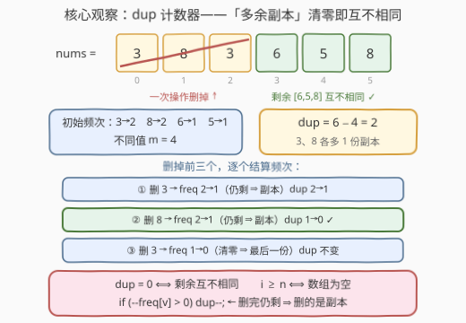
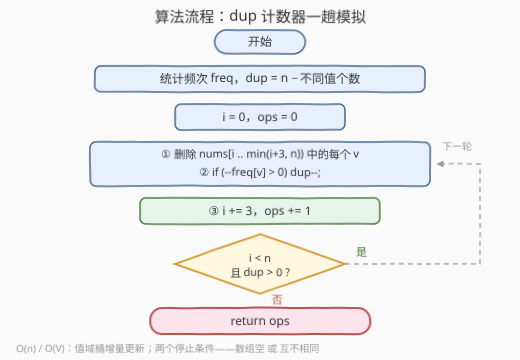

# LeetCode 得到互不相同元素的最少操作次数 题解

## 1. 题目概述

- **标题 / 题号**：得到互不相同元素的最少操作次数（#3779，medium）
- **链接**：https://leetcode.cn/problems/minimum-number-of-operations-to-have-distinct-elements/
- **难度**：中等
- **标签**：数组、哈希表、计数

**题意**：给你一个整数数组 `nums`。一次操作中，你需要移除当前数组的**前三个元素**；如果剩余元素少于三个，则移除**所有**剩余元素。重复此操作，直到数组为空或不包含任何重复元素为止。返回所需的操作次数。

**示例 1**：

```text
输入：nums = [3,8,3,6,5,8]
输出：1
解释：第一次操作移除前三个元素，剩余 [6,5,8] 互不相同，停止。仅需一次操作。
```

**示例 2**：

```text
输入：nums = [2,2]
输出：1
解释：元素少于三个，一次操作后数组为空，满足停止条件。
```

**示例 3**：

```text
输入：nums = [4,3,5,1,2]
输出：0
解释：所有元素已经互不相同，不需要任何操作。
```

**约束**：

- $1 \le \text{nums.length} \le 10^5$
- $1 \le \text{nums}[i] \le 10^5$

> 💡 **审题关键**：① 只从**头部**删、每次删 3 个（不足 3 个则删光）——所以操作序列是**完全确定**的，不存在任何决策，答案只取决于数组本身；② 停止条件是「空 **或** 互不相同」，两者取先到者；③ $n \le 10^5$ 暗示需要 $O(n)$ 或 $O(n \log n)$ 的算法，逐轮重建判重的 $O(n^2)$ 会超时。

## 2. 解题思路

### 2.1 暴力思路

最直接的模拟：每轮先用哈希集合检查整个剩余数组是否互不相同（$O(n)$），不是则砍掉前三个元素再进入下一轮。每轮删除 3 个元素、至多 $\lceil n/3 \rceil$ 轮，总代价 $O(n^2/3) \approx 3.3 \times 10^9$（$n = 10^5$ 时），超时。

浪费在哪？每轮只删 3 个元素，剩余数组相对上一轮**只少了 3 个值**，却重新判定全部元素。互不相同与否是一个**可增量维护**的量——这正是哈希表计数的用武之地。

### 2.2 核心观察：dup 计数器——「多余副本」清零即互不相同



三步拆解：

**① 头部删除 ⟹ 剩余永远是后缀**。操作只砍前缀，任何时刻剩余数组都是 `nums[i:]`（`i` 为已删个数，每次 +3）。「数组为空」即 $i \ge n$，「互不相同」即后缀 `nums[i:]` 无重复值——两个停止条件都只依赖这个后缀。

**② 互不相同 ⟺ dup = 0**。定义**多余副本数**：

$$\text{dup} = (\text{剩余元素个数}) - (\text{剩余不同值的个数}) = \sum_v \max(\text{freq}[v] - 1,\ 0)$$

后缀互不相同，当且仅当每个值的出现次数都 $\le 1$，即 `dup = 0`。这一步把「整段判重」坍缩成**一个整型计数器**。

**③ 删一个元素只动一个频次**。删除元素 $v$ 时 `freq[v]` 自减：

- 减之前 $\text{freq}[v] \ge 2$：删掉的是多余副本，`dup -= 1`；
- 减之前 $\text{freq}[v] = 1$：删掉的是该值最后一份，值直接消失，`dup` 不变。

合并成一行：`if (--freq[v] > 0) dup--;`——删完后频次仍非零，说明刚才删的必是副本。

于是主循环极简：**`while (i < n && dup > 0)`，每轮删前三个、`i += 3`、`ops++`**。初始化时对全数组数一遍频次得到 `dup`，之后每个元素至多被「删除」一次，全程 $O(n)$。

> ⚠️ 注意停止条件必须**同时**判 `i < n`（空了也得停）和 `dup > 0`（示例 2 中 `[2,2]` 删完后数组为空而不是互不相同，靠 `i >= n` 退出）；而示例 3 是 `dup` 初始即为 0，循环一次都不进，答案 0。

### 2.3 算法流程图



**逻辑执行步骤**：

| 步骤 | 操作 | 说明 |
|------|------|------|
| ① 建频次表 | 统计 `freq[v]`，得不同值个数 $m$ | 值域 $10^5$，计数数组或哈希表皆可 |
| ② 初始化 | $\text{dup} = n - m$，$i = 0$，$\text{ops} = 0$ | 多余副本数 |
| ③ 循环判定 | $i < n$ **且** $\text{dup} > 0$？ | 空 / 互不相同任一成立即停 |
| ④ 删前三个 | 对 $j \in [i,\ \min(i+3,\ n))$ 执行 `if (--freq[nums[j]] > 0) dup--` | 不足 3 个删光 |
| ⑤ 步进 | $i \mathrel{+}= 3$，$\text{ops} \mathrel{+}= 1$ | 回到 ③ |
| ⑥ 返回 | `ops` | |

### 2.4 示例演算

**示例 1**：`nums = [3,8,3,6,5,8]`。初始频次 $\{3{:}2,\ 8{:}2,\ 6{:}1,\ 5{:}1\}$，不同值 $m = 4$，$\text{dup} = 6 - 4 = 2$：

| 操作 | 删除元素 | 频次变化 | dup | 判定 |
|------|---------|---------|-----|------|
| — | （初始） | 3:2, 8:2, 6:1, 5:1 | 2 | dup > 0，继续 |
| 1 | 3, 8, 3 | 3: 2→1（dup−1）、8: 2→1（dup−1）、3: 1→0 | **0** | dup = 0，剩余 [6,5,8] 互不相同，停止 |

答案 `ops = 1` ✓。

**示例 2**：`nums = [2,2]`。初始 $\text{dup} = 2 - 1 = 1$。操作 1 删除 `2, 2`：第一个 2 使 freq 2→1、dup→0；第二个 2 使 freq 1→0、dup 不变。此时 $i = 3 \ge 2$ 数组已空，循环结束，答案 1 ✓。

**示例 3**：全互不相同，$\text{dup} = 0$，循环不执行，答案 0 ✓。

## 3. 参考代码

### 方法一：dup 计数器模拟（推荐）

### C++

```cpp
class Solution {
  public:
    int minimumOperations(vector<int>& nums) {
        int n = nums.size();
        vector<int> freq(100001, 0);       // 1 <= nums[i] <= 1e5，直接用值域桶
        int distinct = 0;
        for (int v : nums)
            if (freq[v]++ == 0) distinct++; // 首次出现，不同值 +1
        int dup = n - distinct;             // 多余副本数

        int ops = 0;
        for (int i = 0; i < n && dup > 0; i += 3, ++ops)
            for (int j = i; j < min(i + 3, n); ++j) // 不足 3 个删光
                if (--freq[nums[j]] > 0) dup--;     // 删完仍剩 ⇒ 删的是副本
        return ops;
    }
};
```

> 💡 **写法要点**：
> - `freq[v]++ == 0` 利用自增返回旧值，「入桶 + 数不同值」一趟完成；
> - `min(i + 3, n)` 兜住尾部不足 3 个的情形（示例 2），不必特判；
> - `--freq[...] > 0` 先减后比：删完后频次仍为正，说明刚才删的是多余副本；
> - 主循环 `i < n && dup > 0` 两个条件缺一不可——前者管「空」，后者管「互不相同」。

### Python

```python
class Solution:
    def minimumOperations(self, nums: List[int]) -> int:
        n = len(nums)
        freq = Counter(nums)
        dup = n - len(freq)                 # 多余副本数
        ops, i = 0, 0
        while i < n and dup > 0:
            for v in nums[i:i + 3]:         # 切片天然兜住不足 3 个
                freq[v] -= 1
                if freq[v] > 0:
                    dup -= 1
            i += 3
            ops += 1
        return ops
```

### 方法二：最长互不相同后缀 + $\lceil k/3 \rceil$ 封闭形式

换个视角：设 $k$ 为使后缀 `nums[k:]` 互不相同的最小前缀删除长度（即**最长互不相同后缀**的起点）。由 2.2 的单调性——$k$ 越大后缀越短、越容易互不相同——从右往左扫描，遇到第一个「已见过的值」即停，停住的位置就是 $k$。操作每次删 3 个，故：

$$\text{ans} = \left\lceil \frac{k}{3} \right\rceil = \left\lfloor \frac{k+2}{3} \right\rfloor$$

### C++

```cpp
class Solution {
  public:
    int minimumOperations(vector<int>& nums) {
        vector<char> seen(100001, 0);
        int k = nums.size();
        for (int i = (int)nums.size() - 1; i >= 0; --i) {
            if (seen[nums[i]]) break;       // 右起第一个重复值挡住去路
            seen[nums[i]] = 1;
            k = i;                          // [i:] 目前互不相同
        }
        return (k + 2) / 3;                 // ceil(k/3)，k=0 时恰为 0
    }
};
```

### Python

```python
class Solution:
    def minimumOperations(self, nums: List[int]) -> int:
        seen = set()
        k = len(nums)
        for i in range(len(nums) - 1, -1, -1):
            if nums[i] in seen:
                break
            seen.add(nums[i])
            k = i
        return (k + 2) // 3
```

> 💡 两法同构：方法一从左往右「删到 dup 清零」，方法二从右往左「保住最长去重后缀」，答案都是「必须删掉的最短前缀 $k$」除以 3 向上取整。方法二少一个 dup 计数器、常数更小；方法一更贴近题面模拟、可直接推广到「每轮删前 $t$ 个」以外的变形（如删除代价不同）。

## 4. 复杂度分析

| 维度 | 方法 | 复杂度 | 说明 |
|------|------|--------|------|
| 时间复杂度 | dup 计数器模拟 | $O(n)$ | 建频次一趟 + 每个元素至多被删一次 |
| 空间复杂度 | dup 计数器模拟 | $O(V)$ | $V = 10^5$ 值域桶；哈希表则为 $O(\min(n, V))$ |
| 时间复杂度 | 倒序找后缀 + $\lceil k/3 \rceil$ | $O(n)$ | 至多右到左扫一趟 |
| 空间复杂度 | 倒序找后缀 + $\lceil k/3 \rceil$ | $O(V)$ | seen 标记数组 |
| 对比暴力 | 判重模拟 | $O(n^2/3) \to O(n)$ | 逐轮 $O(n)$ 重建判重坍缩为计数器 $O(1)$ 增量更新 |

## 5. 扩展：$k$ 的单调性、变体与工程细节

**为什么 $k$ 有单调性**：后缀 `nums[k:]` 互不相同关于 $k$ **单调**——$k$ 变大后缀变短，删元素只会消灭重复、不会制造重复。所以合法 $k$ 构成一段后缀区间，最小合法 $k$ 唯一，从右往左第一个「撞见已见值」的位置一次锁定，也正因为单调性，理论上还可二分 + 哈希判重 $O(n \log n)$，但线性扫显然更优。

**变体：每轮删前 $t$ 个**。答案从 $\lceil k/3 \rceil$ 变为 $\lceil k/t \rceil$，主循环步进改 $t$ 即可——方法一的骨架原样保留。

**变体：删前缀代价不是均匀的**（例如删第 $i$ 个元素花费 $w_i$，求最小花费使剩余互不相同）：这就不只是数操作次数，须对每个「右端保留区间」算前缀代价，用 2.2 的倒序扫描找到所有可行 $k$ 后取 $\min\{\text{cost}[0..k]\}$——前缀和 $O(1)$ 查询即可，仍是线性。

**值域桶 vs 哈希表**：$1 \le \text{nums}[i] \le 10^5$ 且查询只有「自增 / 自减 + 与 0 比较」，定长 `int` 数组（C++ `vector<int> freq(100001)`）比 `unordered_map` 快数倍且无哈希抖动；Python 直接 `Counter` / `set` 更省心。若值域放大到 $10^9$，C++ 换 `unordered_map`、或离散化后仍用桶，复杂度不变。

**与「滑窗去重」的关系**：本题的倒序扫描和 [3. 无重复字符的最长子串](https://leetcode.cn/problems/longest-substring-without-repeating-characters/)（[题解](../0001-0100/3_无重复字符的最长子串.md)）共享同一块基石——「无重复 ⟺ 每个值出现次数 $\le 1$ ⟺ 频次表增量维护」。3 题是滑窗伸缩，这里是后缀单向往左收缩，本质都是频次表上每次只动一个值。

## 6. 面试要点

**Q1：为什么这道题没有任何「贪心 / DP」成分？**

> 操作序列完全被题面规定：每次必须删前三个（不足删光），没有选择余地。所以答案不是「最优策略」而是**确定过程的计数**——先想清楚「没有决策」这一点，就不会往贪心 DP 上绕远路。

**Q2：dup 为什么等于「元素个数 − 不同值个数」？它何时减？**

> $\text{dup} = \sum_v (\text{freq}[v] - 1)^+ = n - m$（$m$ 为不同值个数）。删除元素 $v$ 时若删后 `freq[v]` 仍 $\ge 1$，说明该值还有存货、刚删的是多余副本，`dup -= 1`；若删的是该值最后一份，值消失、不同值个数与元素个数同步减一，差不变。`dup = 0` ⟺ 所有余下值频次 $\le 1$ ⟺ 互不相同。

**Q3：主循环为什么必须同时判 `i < n` 和 `dup > 0`？**

> 两个停止条件对应题面两句话：「数组为空」（`i >= n`）与「不含重复元素」（`dup == 0`），谁先到都停。漏判 `i < n` 会在全删光后继续越界访问；漏判 `dup > 0`（比如写成 for 定长循环）会在已互不相同时多删几轮，示例 3 直接翻车。

**Q4：不足三个元素的尾段怎么处理？**

> 删除范围写成 $[i, \min(i+3, n))$ 即可：够 3 个删 3 个，不够删光。注意 `i` 仍按 `+= 3` 步进（或直接 `break`），且这最后一轮**也算一次操作**——示例 2 `[2,2]` 只删两个也计 1 次。

**Q5：能否不模拟、直接给出封闭形式？**

> 能。求最长互不相同后缀起点 $k$（从右往左哈希扫描，撞见已见值即停），答案 $= \lceil k/3 \rceil$。正确性依赖后缀互不相同的单调性：`ops` 次操作后恰删 $\min(3\cdot\text{ops}, n)$ 个，需要删掉的量跨过 $k$ 的最小 ops 即 $\lceil k/3 \rceil$；$k = 0$（本来就互不相同）对应 0 次操作。

> 💡 **一句话总结**：3779 = 「头部删除 ⟹ 后缀判定」+「互不相同坍缩成 dup 计数器」+「删一个值只动一个频次的增量维护」，$O(n^2)$ 判重模拟坍缩 $O(n)$；封闭形式 $\lceil k/3 \rceil$ 是同一事实的倒序视角。带走三点：没有决策的模拟题先找**不变量**（后缀）、判重条件找**可减计数器**（dup）、停止条件**成对出现**（空 / 去重）。

## 同类练习题

| # | 题目 | 与本题的关联 |
|---|------|-------------|
| 945 | [使数组唯一的最小增量](https://leetcode.cn/problems/minimum-increment-to-make-array-unique/)（[题解](../0901-1000/945_使数组唯一的最小增量.md)） | 同样追求「互不相同」的最少操作，改值与删元素的对照练习 |
| 2670 | [找出不同元素数目差数组](https://leetcode.cn/problems/find-the-distinct-difference-array/)（[题解](../2601-2700/2670_找出不同元素数目差数组.md)） | 前后缀不同值计数，本题「后缀互不相同」判定的亲戚 |
| 2260 | [必须拿起的最小连续卡牌数](https://leetcode.cn/problems/minimum-consecutive-cards-to-pick-up/)（[题解](../2201-2300/2260_必须拿起的最小连续卡牌数.md)） | 找最近的重复对，即「最长无重复前缀」的对偶问题 |
| 219 | [存在重复元素 II](https://leetcode.cn/problems/contains-duplicate-ii/)（[题解](../0201-0300/219_存在重复元素II.md)） | 哈希表判重的滑窗基础模板 |
| 287 | [寻找重复数](https://leetcode.cn/problems/find-the-duplicate-number/)（[题解](../0201-0300/287_寻找重复数.md)） | 重复值检测的进阶玩法（Floyd 判圈 / 位计数） |
