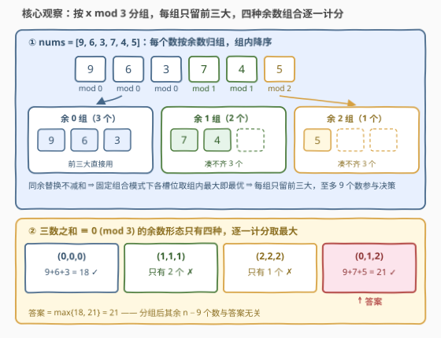
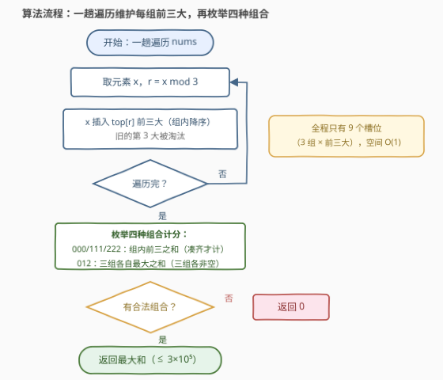

# 能被 3 整除的三元组最大和

- **题目名称**：能被 3 整除的三元组最大和
- **链接**：[3780. 能被 3 整除的三元组最大和](https://leetcode.cn/problems/maximum-sum-of-three-numbers-divisible-by-three/)
- **难度**：中等
- **标签**：贪心、数组、排序、堆（优先队列）

## 1. 题目概述

给你一个整数数组 $nums$，你的任务是从中选择**恰好三个**整数（三个不同的下标），使得它们的**和能被 3 整除**。

返回这类三元组可能产生的**最大**和。如果不存在这样的三元组，返回 $0$。

**示例 1**：

```text
输入：nums = [4,2,3,1]
输出：9
解释：总和能被 3 整除的有效三元组为 (4,2,3)，和为 9；(2,3,1)，和为 6。答案为 9。
```

**示例 2**：

```text
输入：nums = [2,1,5]
输出：0
解释：没有三元组的和能被 3 整除，返回 0。
```

**约束条件**：

- $3 \le nums.length \le 10^{5}$
- $1 \le nums[i] \le 10^{5}$

> 💡 **审题关键**：① **恰好三个**、不可重复使用同一元素（相同值不同下标算不同元素）；② $nums[i] \ge 1$ **全为正数**——它保证了「同余替换不减和」的直觉成立，也让代码能用 $-1$ 哨兵判「组内凑不凑得齐」；③ $n \le 10^{5}$ 时 $\binom{n}{3} \approx 1.7\times10^{14}$，暴力枚举三元组是死路，必须按**余数**压缩决策空间。

---

## 2. 解题思路

### 2.1 暴力思路

枚举所有 $\binom{n}{3}$ 个三元组，逐个检查和能否被 3 整除，取最大——$n = 10^{5}$ 时约 $1.7\times10^{14}$ 次检查，完全不可行。

暴力里其实藏着优化方向的信号：**判定「和能否被 3 整除」根本不需要三个数本身，只需要它们除以 3 的余数**。把 $x$ 换成任何与它同余的数，判定结果不变——值只用来比大小，余数才用来判定合法。顺着这条缝拆下去就是正解。

### 2.2 核心观察：按余数分组，四种组合逐一试



三步推理：

**第一步：合法的余数组合只有四种。** 设三个数的余数为 $a, b, c \in \{0,1,2\}$，「和被 3 整除」即 $a+b+c \equiv 0 \pmod 3$。枚举 $3^3 = 27$ 种有序组合，能过关的多重集只有：

$$\{0,0,0\},\quad \{1,1,1\},\quad \{2,2,2\},\quad \{0,1,2\}$$

分别对应三个余 $0$（和 $0$）、三个余 $1$（和 $3$）、三个余 $2$（和 $6$）、三种余数各一个（和 $3$）；其余如 $\{0,0,1\}$、$\{0,2,2\}$ 的余数和分别是 $1$、$4$，均不过关。

**第二步：同余替换不减和。** 固定某一种组合模式后（比如 $(0,1,2)$），把模式里某个槽位上的数换成**同余数中更大的数**，余数组合不破坏、和不减。因此**每种模式的最优取法就是各槽位取对应组的最大值**——$(r,r,r)$ 取余 $r$ 组的前三大之和，$(0,1,2)$ 取三组各自最大之和。

**第三步：每组只需前三大。** 于是整趟决策只用到「余 $0$ / 余 $1$ / 余 $2$ 三组各自的降序前三」，**至多 9 个数**，其余 $n-9$ 个数与答案无关——一趟遍历加 9 个槽位即可，连整体排序都不必做。

### 2.3 算法流程图



**逻辑执行步骤**：

| 步骤 | 操作 | 说明 |
|------|------|------|
| ① 遍历 | 对每个 $x$ 算 $r = x \bmod 3$ | 归组 |
| ② 维护前三 | 插入排序式更新 $top[r]$（组内降序三槽） | 新值大于第 $k$ 大则顶替，旧值下沉继续比 |
| ③ 枚举 $(r,r,r)$ | $r = 0,1,2$：组内凑齐 3 个才计 $top[r][0]+top[r][1]+top[r][2]$ | 凑不齐则该模式无效 |
| ④ 枚举 $(0,1,2)$ | 三组各非空才计 $top[0][0]+top[1][0]+top[2][0]$ | 缺任一组则该模式无效 |
| ⑤ 汇总 | 四种模式的合法得分取最大 | 全部无效 → 返回 $0$ |

### 2.4 示例演算

**示例 1**：`nums = [4,2,3,1]`，分组（降序）：余 $0$ 组 $[3]$、余 $1$ 组 $[4,1]$、余 $2$ 组 $[2]$。

| 组合模式 | 取值 | 结果 |
|----------|------|------|
| $(0,0,0)$ | 余 0 组只有 1 个，凑不齐 | ✗ |
| $(1,1,1)$ | 余 1 组只有 2 个，凑不齐 | ✗ |
| $(2,2,2)$ | 余 2 组只有 1 个，凑不齐 | ✗ |
| $(0,1,2)$ | $3 + 4 + 2 = 9$ | ✓ |

唯一合法的模式得 9，答案 $9$。

**示例 2**：`nums = [2,1,5]`，分组：余 $0$ 组 $[\,]$、余 $1$ 组 $[1]$、余 $2$ 组 $[5,2]$。$(0,1,2)$ 缺余 $0$ 组，三个 $(r,r,r)$ 全都凑不齐——四种模式全灭，返回 $0$。

---

## 3. 参考代码

### C++

```cpp
class Solution {
public:
    int maximumSum(vector<int>& nums) {
        int top[3][3];
        for (auto& row : top) row[0] = row[1] = row[2] = -1;

        for (int x : nums) {
            int r = x % 3;
            for (int k = 0; k < 3; ++k) {
                if (x > top[r][k]) swap(x, top[r][k]);
            }
        }

        int ans = 0;
        for (int r = 0; r < 3; ++r) {
            if (top[r][2] > 0)
                ans = max(ans, top[r][0] + top[r][1] + top[r][2]);
        }
        if (top[0][0] > 0 && top[1][0] > 0 && top[2][0] > 0)
            ans = max(ans, top[0][0] + top[1][0] + top[2][0]);
        return ans;
    }
};
```

> 💡 **写法要点**：
> - 插入技巧：`if (x > top[r][k]) swap(x, top[r][k])`——$x$ 一路下沉，被顶出来的旧值继续与更小的槽位比较，一趟维护好组内前三；
> - $nums[i] \ge 1$ 保证合法值恒 $> 0$，用 $-1$ 当「不存在」哨兵，于是 `top[r][2] > 0` 即「组内凑得齐 3 个」、`top[r][0] > 0` 即「组非空」；
> - 三个数的和至多 $3\times10^{5}$，`int` 绰绰有余。

### Python

```python
class Solution:
    def maximumSum(self, nums: List[int]) -> int:
        top = [[-1, -1, -1] for _ in range(3)]
        for x in nums:
            r = x % 3
            for k in range(3):
                if x > top[r][k]:
                    top[r][k], x = x, top[r][k]

        ans = 0
        for r in range(3):
            if top[r][2] > 0:
                ans = max(ans, sum(top[r]))
        if top[0][0] > 0 and top[1][0] > 0 and top[2][0] > 0:
            ans = max(ans, top[0][0] + top[1][0] + top[2][0])
        return ans
```

> 💡 **写法要点**：
> - `top[r][k], x = x, top[r][k]` 是同一套「交换下沉」，被挤出的 $x$ 继续与后面的槽位比较；
> - 嫌手写三槽啰嗦的话，可对每组挂一个大小为 3 的小顶堆（题目标签里的 Heap 解法），语义完全等价——「流式维护前 $k$ 大」的通用套路。

---

## 4. 复杂度分析

| 维度 | 复杂度 | 说明 |
|------|--------|------|
| **时间** | $O(n)$ | 一趟遍历（每元素至多 3 次比较）+ $O(1)$ 组合计分；整体排序版 $O(n\log n)$ 同样能过 |
| **空间** | $O(1)$ | $3$ 组 $\times$ $3$ 槽 = 9 个变量，与 $n$ 无关 |
| **对比** | 暴力 $O(n^3) \approx 1.7\times10^{14}$ | 余数把决策空间从 $\binom{n}{3}$ 压缩到 4 种组合 |

---

## 5. 扩展：亲戚题 1262 与「恰好 k 个」的推广

- **[1262. 可被三整除的最大和](https://leetcode.cn/problems/greatest-sum-divisible-by-three/)** 是本题的「任意多个数」版：不再限定选 3 个，DP（$dp[r]$ = 和 $\bmod 3 = r$ 的最大和）或「总和减去最小调整」的贪心更顺手。**恰好 3 个**反而是更受限的形态——模式固定，组合枚举比 DP 直接。
- 真想写 DP 也行：$dp[j][r]$ = 已选 $j$ 个数（$j \le 3$）、和 $\bmod 3 = r$ 的最大和，转移 $O(9n)$。它的好处是可无缝推广到「**恰好选 $k$ 个**」——$j$ 维扩到 $k$ 即可，而组合枚举会随 $k$ 组合爆炸。两种形态如何取舍，是本题最有营养的思考。
- **含负数会怎样？** 同余替换引理不依赖正负（固定模式下换更大的数总不减），贪心框架原样成立；要改的只是工程细节：$-1$ 哨兵失效，改用显式计数判「组内够不够」，且「无解返回 $0$」与「最大和可能为负」要分开处理。
- **鸽笼小结论**：$n \ge 5$ 时答案必大于 $0$——无解要求 $(0,1,2)$ 失败（某组为空）且三个 $(r,r,r)$ 全失败（每组 $\le 2$ 个），两个非空组至多 $4$ 个元素，与 $n \ge 5$ 矛盾。

---

## 6. 面试要点

**Q1：合法的余数组合为什么恰有四种？**

> 三个余数 $a,b,c \in \{0,1,2\}$，要求 $a+b+c \equiv 0 \pmod 3$。有序枚举 $27$ 种，多重集意义下只有 $\{0,0,0\}$（和 $0$）、$\{1,1,1\}$（和 $3$）、$\{2,2,2\}$（和 $6$）、$\{0,1,2\}$（和 $3$）过关；其余如 $\{0,0,1\}$ 和为 $1$、$\{0,2,2\}$ 和为 $4$，均不被 3 整除。

**Q2：为什么每组只需前三大？**

> 同余替换：固定组合模式后，把某槽位换成同余数中更大的数，合法性不变、和不减。故每个模式的最优解取各组顶部——$(r,r,r)$ 取组内前三之和、$(0,1,2)$ 取三组最大之和，全部决策至多涉及 9 个数，一趟 $O(n)$ 扫描即可收集齐。

**Q3：全为正数这个条件用在哪？**

> 两处：① 代码用 $-1$ 做哨兵、`top[r][2] > 0` 判「凑得齐」，依赖合法值 $\ge 1$；② 保证有解时答案必为正，与「无解返回 $0$」语义不冲突。算法主干（分组 + 四组合 + 取顶部）本身不依赖正负。

**Q4：$n \ge 5$ 时为什么必有解？**

> 反证：无解 ⇒ $(0,1,2)$ 不成立（某组为空）且每个 $(r,r,r)$ 不成立（每组至多 2 个）⇒ 至多两个非空组、每组至多 2 个 ⇒ $n \le 4$，与 $n \ge 5$ 矛盾。故 $n \ge 5$ 时四种模式至少有一种合法。

**Q5：标签里的堆（优先队列）怎么用？**

> 「每组维护前三大」= 每组挂一个大小为 3 的小顶堆：新元素大于堆顶则弹出堆顶、压入新元素。与手写三槽等价，$O(n\log 3) = O(n)$；这是「流式维护 top-$k$」的通用武器（如 [414. 第三大的数](https://leetcode.cn/problems/third-maximum-number/)）。

> 💡 **一句话总结**：3780 = 按 $x \bmod 3$ 分组 + 每组前三大 + 枚举 $000/111/222/012$ 四种组合取最大——同余替换保证「取顶部即最优」，一趟 $O(n)$、9 个槽位收官。

---

## 7. 同类练习题

- [1262. 可被三整除的最大和](https://leetcode.cn/problems/greatest-sum-divisible-by-three/)（[题解](../1201-1300/1262_可被三整除的最大和.md)）：任意多个数的 mod-3 形态，DP/贪心与本题组合枚举的对照
- [628. 三个数的最大乘积](https://leetcode.cn/problems/maximum-product-of-three-numbers/)（[题解](../0601-0700/628_三个数的最大乘积.md)）：同为「恰好选 3 个」，按极值组合（前三 / 前一后二）枚举的近亲
- [414. 第三大的数](https://leetcode.cn/problems/third-maximum-number/)（[题解](../0401-0500/414_第三大的数.md)）：三槽维护前三大技巧的单点练习
- [2894. 分类求和并作差](https://leetcode.cn/problems/divisible-and-non-divisible-sums-difference/)（[题解](../2801-2900/2894_分类求和并作差.md)）：mod 3 整除性的热身小题
