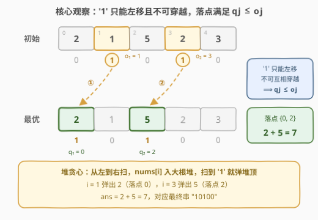
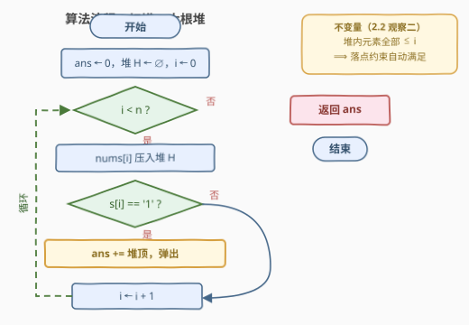

# 二进制交换后的最大分数

- **题目名称**：二进制交换后的最大分数
- **链接**：[3781. 二进制交换后的最大分数](https://leetcode.cn/problems/maximum-score-after-binary-swaps/)
- **难度**：中等
- **标签**：贪心、数组、字符串、堆（优先队列）

## 1. 题目概述

**题意**：给定长度为 $n$ 的整数数组 $nums$ 与等长的二进制串 $s$。**分数按最终的 $s$ 计算**：每个 $s[i] = $ `'1'` 的下标 $i$ 为分数贡献 $nums[i]$。可以执行**任意次**（含零次）操作：选择下标 $i$（$0 \le i < n-1$）满足 $s[i] = $ `'0'` 且 $s[i+1] = $ `'1'`，交换这两个字符（效果是某个 `'1'` 左移一格）。求可获得的**最大分数**。

**示例 1**：

```text
输入：nums = [2,1,5,2,3], s = "01010"
输出：7
解释：i = 0 处交换 "01010" → "10010"；i = 2 处交换 "10010" → "10100"。
　　　最终 '1' 位于下标 0 和 2，得分 nums[0] + nums[2] = 2 + 5 = 7。
```

**示例 2**：

```text
输入：nums = [4,7,2,9], s = "0000"
输出：0
解释：没有 '1'，无法执行任何交换，分数为 0。
```

**约束条件**：

- $1 \le n \le 10^5$
- $1 \le nums[i] \le 10^9$
- $s[i] \in \{0, 1\}$

> 💡 **审题关键**：① 分数跟着**位置**走而不是跟着 `'1'` 走——`'1'` 挪到哪里，就收哪里的 $nums$，所以「挪 `'1'`」本质是在**挑落点**；② 操作形态固定为 `"01" → "10"`，`'1'` 只能**往左**移，且两个 `'1'` 永远无法穿越彼此；③ $k$ 个 `'1'` 全取 $10^9$ 时答案达 $10^{14}$，需要 64 位整数。

---

## 2. 解题思路

### 2.1 暴力思路：先刻画「`'1'` 能到哪」

操作只允许左 `'0'` 右 `'1'` 时交换，所以**`'1'` 只能左移、永远无法右移**；两个 `'1'` 相邻时（`"11"`）任何一端都不满足操作前提，**彼此无法穿越**。于是设初始 `'1'` 从左到右位于 $o_1 < o_2 < \dots < o_k$，最终位于 $q_1 < q_2 < \dots < q_k$：

$$\text{可达} \iff q_j \le o_j \quad (\forall j = 1, \dots, k)$$

- **必要性**：一次交换把某个 `'1'` 从 $i+1$ 挪到 $i$，任何前缀 $[0, t]$ 内的 `'1'` 计数**单调不降**；初始时 $[0, o_j]$ 内已有 $j$ 个 `'1'`，最终也至少 $j$ 个，即 $q_j \le o_j$。
- **充分性**：从最左的 `'1'` 开始逐个左移到目标位（沿途全是 `'0'`，归纳可证）。

**问题转化**：从 $n$ 个格子中选 $k$ 个位置 $q_1 < \dots < q_k$（满足 $q_j \le o_j$），最大化 $\sum_j nums[q_j]$。

- 暴力 ①：枚举全部 $\binom{n}{k}$ 个组合逐一检验——指数级；
- 暴力 ②：DP $f(i, j)$ =「前 $i$ 个格子放 $j$ 个 `'1'`」的最大权和，$O(nk)$——$n, k$ 均可达 $10^5$，最坏 $10^{10}$ 仍然超时。

> 💡 暴力 DP 的浪费：每一步都在重新权衡所有格子的取舍，而约束 $q_j \le o_j$ 其实是**前缀式**的——第 $j$ 个 `'1'` 只关心「它左边还剩多少格子可用」，这个结构可以被贪心直接利用。

### 2.2 核心观察：大根堆贪心——扫到 `'1'` 就领走当前最大格子



**观察一（落点是一个集合）**：`'1'` 之间彼此无差别，分数只取决于**落点集合** $Q$。约束 $q_j \le o_j$ 等价于前缀计数条件：对每个 $j$，$|Q \cap [0, o_j]| \ge j$。

**观察二（贪心不变量——永远可行）**：从左往右扫描，维护「已见过但未被占用」的格子**大根堆**。每到一个位置 $i$ 先把 $nums[i]$ 入堆；若 $s[i] = $ `'1'`，弹出堆顶累加。第 $j$ 次弹出发生在 $i = o_j$，此时堆内元素全部 $\le o_j$，故**前 $j$ 个落点全部 $\le o_j$**——前缀计数条件自动满足，贪心无需任何可行性检查（堆也必非空：$[0, o_j]$ 有 $o_j + 1 \ge j$ 个格子，减去已占 $j-1$ 个仍有剩）。

**观察三（交换论证——最优）**：设 $m$ 是 $[0, o_1]$ 中权值最大的格子。任一可行解 $Q$ 必含某个 $p \le o_1$（否则 $|Q \cap [0, o_1]| = 0 < 1$），且 $w(p) \le w(m)$。把 $p$ 换成 $m$：两者都落在每个 $[0, o_j]$ 内，**所有前缀计数不变**，仍可行，权和不减——故**存在包含 $m$ 的最优解**。贪心取走 $m$ 后，剩余问题同构（`'1'` 剩 $k-1$ 个，约束变为 $|Q' \cap [0, o_j]| \ge j-1$），归纳即得贪心最优。

> 💡 **一句话**：把每个 `'1'` 看成「截止时间为 $o_j$ 的空任务」、格子权值看成收益——扫到截止时间就必须落子，那就领走**当前见过的最大收益**。这正是带截止时间调度类问题的贪心套路（对照 [630. 课程表 III](../0601-0700/630_课程表III.md)）。

### 2.3 算法流程图



**文字版步骤**：

| 步骤 | 操作 | 说明 |
|------|------|------|
| ① 初始化 | 大根堆 $H \leftarrow \varnothing$，$ans \leftarrow 0$ | Python 用小根堆存 $-nums[i]$ |
| ② 扫描 | $i$ 从左到右遍历 | 顺序保证堆内元素 $\le i$ |
| ③ 入堆 | $nums[i]$ 压入 $H$ | 格子「报到」 |
| ④ 落子 | 若 $s[i] = $ `'1'`：$ans \mathrel{+}=$ 堆顶，弹出 | 第 $j$ 个 `'1'` 领走当前最大格子 |
| ⑤ 返回 | 扫描结束输出 $ans$ | 落点集合被隐式确定 |

### 2.4 示例演算

以示例 1（$nums = [2,1,5,2,3]$，$s = $ `"01010"`，`'1'` 位于 $o = \{1, 3\}$）走一遍：

| $i$ | 入堆后堆内容 | $s[i]$ | 动作 | $ans$ | 落点集合 |
|------|-------------|--------|------|-------|----------|
| 0 | $\{2\}$ | `0` | — | $0$ | $\varnothing$ |
| 1 | $\{1, 2\}$ | `1` | 弹出 $2$（位置 0） | $2$ | $\{0\}$ |
| 2 | $\{1, 5\}$ | `0` | — | $2$ | $\{0\}$ |
| 3 | $\{1, 2, 5\}$ | `1` | 弹出 $5$（位置 2） | $7$ | $\{0, 2\}$ |
| 4 | $\{1, 2, 3\}$ | `0` | — | $7$ | $\{0, 2\}$ |

得 $ans = 7$，落点 $\{0, 2\}$ 对应最终串 `"10100"`，与示例一致。注意 $i = 4$ 的格子 $3$ 虽入了堆，但后面再无 `'1'` 来取——**作废的格子留在堆里不结算**，这正是贪心「只用当前截止时间之前的资源」的体现。

---

## 3. 参考代码

### C++

```cpp
class Solution {
  public:
    long long maximumScore(vector<int>& nums, string s) {
        long long ans = 0;
        priority_queue<int> pq;                 // 大根堆：已报到、未占用的格子
        for (int i = 0; i < (int)nums.size(); ++i) {
            pq.push(nums[i]);
            if (s[i] == '1') {                  // 第 j 个 '1' 到达截止时间
                ans += pq.top();                // 领走当前最大格子
                pq.pop();
            }
        }
        return ans;
    }
};
```

### Python

```python
class Solution:
    def maximumScore(self, nums: List[int], s: str) -> int:
        ans = 0
        heap = []                               # 小根堆存负数 = 大根堆
        for v, c in zip(nums, s):
            heapq.heappush(heap, -v)
            if c == '1':                        # 第 j 个 '1' 到达截止时间
                ans -= heapq.heappop(heap)      # 领走当前最大格子
        return ans
```

> 💡 **写法要点**：
> - 答案必须 `long long`：$10^5 \times 10^9 = 10^{14}$ 远超 32 位上限；Python 原生 int 无此问题。
> - 无需显式维护落点；若要输出方案，堆里改存 `(nums[i], i)` 即可。
> - `zip(nums, s)` 一次配对，避免下标越界的隐患。

---

## 4. 复杂度分析

| 维度 | 复杂度 | 说明 |
|------|--------|------|
| **时间复杂度** | $O(n \log n)$ | 每个格子至多入堆、出堆各一次，单次 $O(\log n)$ |
| **空间复杂度** | $O(n)$ | 堆内元素峰值可达 $n$ 个（尾部全是 `'0'` 时） |

---

## 5. 扩展：变体与拟阵视角

- **`'1'` 可双向移动的变体**：若 `"01" \to "10"` 与 `"10" \to "01"` 都合法，`'1'` 可重排到任意位置（仍不能穿越，但 `'1'` 无差别），答案退化为 $nums$ 的**前 $k$ 大之和**（$k$ 为 `'1'` 个数），排序或 `nth_element` 一次搞定。
- **求最小分数**：对称地，扫到 `'1'` 时改弹**小顶**——交换论证原样成立（把最优解中 $\le o_1$ 的格子换成 $[0, o_1]$ 的最小权格子，权和不增）。
- **拟阵视角**：可行落点集合恰是「格子—`'1'`」二分匹配对应的**横贯拟阵（transversal matroid）**的基，按权值贪心对任何拟阵都最优——这给本题堆贪心提供了一个可迁移的正确性证明模板。

---

## 6. 面试要点

**Q1：为什么 `'1'` 不能右移、两个 `'1'` 不能交换次序？**

> 操作前提固定为「左 `'0'` 右 `'1'`」，被交换的 `'1'` 只会向左挪一格。要右移就得出现「左 `'1'` 右 `'0'`」的交换，不在操作集内。两个 `'1'` 相邻时任何一端都不满足前提，故相对次序是**不变量**。形式化：任何前缀 $[0, t]$ 内 `'1'` 的计数在操作下单调不降，由此推出 $q_j \le o_j$。

**Q2：扫到 `'1'` 时堆为什么一定非空？**

> 第 $j$ 个 `'1'` 位于 $o_j \ge j - 1$（下标从 0 起、互异递增），$[0, o_j]$ 至少有 $j$ 个格子；此前只弹出了 $j - 1$ 个，剩下至少一个在堆里。代码里甚至不需要判空。

**Q3：贪心最优性论证的关键一步是什么？**

> 交换论证：任何可行解必含某个 $\le o_1$ 的格子 $p$（前缀计数条件 $j = 1$），把它换成 $[0, o_1]$ 的最大权格子 $m$ 后，**所有前缀计数不变**（两者同在每个前缀内），可行性保持、权和不减。于是存在包含 $m$ 的最优解，取走 $m$ 后剩余问题同构，归纳完成。

**Q4：本题与「课程表 III」这类反悔贪心有何异同？**

> 同：都是「截止时间约束 + 扫描 + 大根堆」。异：课程表 III 的决策（选课）事后可反悔——踢掉最长的那门换收益；本题落子后**无需反悔**，因为约束天然前缀化（后面的 `'1'` 只能用 $\le o_j$ 的格子，早领走大格子不会挤占后面的可行性——前缀计数不被破坏）。

**Q5：如果面试官追问「能不能做到 $O(n)$」？**

> 堆的 log 来自「动态取当前最大」。$nums$ 值域 $10^9$ 无法计数排序；若把所有格子按权值预排序并配并查集「跳到左侧最近未占用格子」，理论均摊 $O(n \alpha(n))$，但常数与实现复杂度不划算——$n \le 10^5$ 下 $O(n \log n)$ 就是标准解。

---

## 7. 同类练习题

- [630. 课程表 III](https://leetcode.cn/problems/course-schedule-iii/)（[题解](../0601-0700/630_课程表III.md)）：截止时间约束下调度 + 大根堆**反悔**——本题贪心的近亲，多了「踢掉最长课程」的撤销决策
- [1353. 最多可以参加的会议数目](https://leetcode.cn/problems/maximum-number-of-events-that-can-be-attended/)（[题解](../1301-1400/1353_最多可以参加的会议数目.md)）：按天扫描 + 小根堆按截止时间取——同款「扫描 + 堆」骨架
- [1642. 可以到达的最远建筑](https://leetcode.cn/problems/furthest-building-you-can-reach/)（[题解](../1601-1700/1642_可以到达的最远建筑.md)）：大根堆反悔贪心经典——免费名额留给最大开销，与本题「领走当前最大」互为镜像
- [502. IPO](https://leetcode.cn/problems/ipo/)（[题解](../0501-0600/502_IPO.md)）：两个堆协同的贪心——同样用堆维护「当前可用收益」的候选池
