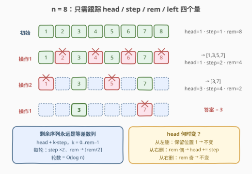
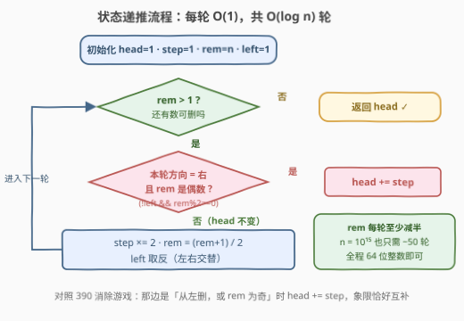

# 交替删除操作后最后剩下的整数

- **题目名称**：交替删除操作后最后剩下的整数
- **链接**：[3782. 交替删除操作后最后剩下的整数](https://leetcode.cn/problems/last-remaining-integer-after-alternating-deletion-operations/)
- **难度**：困难
- **标签**：数学、递归

## 1. 题目概述

给你一个整数 $n$。将 $1$ 到 $n$ 的整数按从左到右的顺序排成一个序列，然后**交替**执行以下两种操作直到只剩一个整数，从操作 1 开始：

- **操作 1**：从左侧开始，隔一个数删除一个数（保留第 1 个，删除第 2 个，保留第 3 个……）；
- **操作 2**：从右侧开始，隔一个数删除一个数（保留倒数第 1 个，删除倒数第 2 个……）。

返回最后剩下的那个整数。

**示例 1**：

```text
输入：n = 8
输出：3
解释：[1,2,3,4,5,6,7,8] --操作1--> [1,3,5,7] --操作2--> [3,7] --操作1--> [3]
```

**示例 2**：

```text
输入：n = 5
输出：1
解释：[1,2,3,4,5] --操作1--> [1,3,5] --操作2--> [1,5] --操作1--> [1]
```

**示例 3**：

```text
输入：n = 1
输出：1
解释：序列只有一个数，无需删除。
```

**约束条件**：

- $1 \le n \le 10^{15}$

> 💡 **审题关键**：① 操作 1 保留的是从左数的**奇数位置**（第 1、3、5…个），第 1 个数**不删**——这点与 [390. 消除游戏](https://leetcode.cn/problems/elimination-game/)恰好相反（390 从左删时第 1 个数必被删）；② $n$ 高达 $10^{15}$，任何需要显式构造序列（哪怕 $O(n)$ 空间）的做法都直接出局，必须找到**序列的结构不变量**，让每轮删除 $O(1)$ 完成在"纸面上"完成；③ 官方 hints 给得很直白：divide and conquer + 维护 start / remaining length / direction。

---

## 2. 解题思路

### 2.1 暴力思路：数组模拟

最朴素的做法是老老实实维护序列：`a = [1..n]`，用一个方向标志交替执行 `a = a[0::2]`（从左删，保留奇数下标）与从右等价的删除，直到 `len(a) == 1`。逻辑无误，但两个维度都崩：

- **时间**：每轮删除后长度约减半，总删除次数恰为 $n-1$，每轮还要整体搬移存活元素，总量 $O(n)$ 起步；
- **空间**：光初始数组就要 $O(n)$。

$n = 10^{15}$ 意味着**连数组都存不下**（约 800 TB）。暴力不是"慢一点"，是物理上不可行——这逼着我们回答一个问题：**每轮删除后，剩下的序列长什么样？**

### 2.2 核心观察：等差数列 + 四变量状态机



**观察一：剩余序列永远是等差数列。**

初始序列 $[1, 2, \cdots, n]$ 是公差为 $1$ 的等差数列。从左（或从右）隔一个删一个，保留的都是**原位置的奇（或偶）下标子列**——等差数列的下标等距子列仍是等差数列，且：

- 新公差 $=$ 旧公差 $\times 2$（相邻保留元素在原序列中隔着两个步长）；
- 新长度 $= \lceil \text{旧长度} / 2 \rceil$。

于是整个删除过程无需存序列，只需四个量：**首元素 `head`、公差 `step`、剩余个数 `rem`、下一轮方向 `left`**。序列本身随时可以按 $\text{head} + k \cdot \text{step}$（$k = 0, \cdots, \text{rem}-1$）还原出来。

**观察二：`head` 只在一种情形下移动。**

- **从左删**（保留位置 $1, 3, 5, \dots$）：位置 $1$ 永远保留，**`head` 不变**；
- **从右删**（保留从右数的奇数位置）：
  - `rem` 为**偶**数：保留的是从左数的偶数位置 $\{2, 4, \dots\}$，位置 $1$ 被删，**`head += step`**；
  - `rem` 为**奇**数：保留的是从左数的奇数位置 $\{1, 3, \dots\}$，位置 $1$ 保留，**`head` 不变**。

合并成一行判断：**仅当「本轮方向为右」且「`rem` 为偶数」时 `head += step`**。

用示例 1（$n=8$）过一遍状态机：$(\text{head}, \text{step}, \text{rem})$ 从 $(1,1,8)$ 出发，左删得 $(1,2,4)$（序列 $[1,3,5,7]$），右删（`rem=4` 偶）得 $(3,4,2)$（序列 $[3,7]$），左删得 $(3,8,1)$——只剩 $3$，与示例吻合。

> 💡 一句话：**删除操作杀不死等差数列，只改它的首项与公差**——跟踪 $(\text{head}, \text{step}, \text{rem}, \text{left})$ 四个数，$10^{15}$ 长度的序列被压缩成 $O(1)$ 状态。

### 2.3 算法流程图



**逻辑执行步骤**：

| 步骤 | 操作 | 说明 |
|------|------|------|
| ① 初始化 | `head=1, step=1, rem=n, left=True` | 序列 $[1..n]$ 的等差数列描述 |
| ② 终止判断 | `rem > 1`？ | 否 → 返回 `head` |
| ③ 首项判定 | 若 `not left` 且 `rem` 偶 → `head += step` | 本轮从右删且偶数长度才动首项 |
| ④ 状态推进 | `step *= 2`；`rem = (rem+1)//2`；`left` 取反 | 进入下一轮 |
| ⑤ 循环 | 回到 ② | 每轮 `rem` 至少减半，共约 $\log_2 n$ 轮 |

> ⚠️ `rem` 的更新用 $\lceil \text{rem}/2 \rceil$（即 `(rem+1)//2`）对两个方向**统一成立**：从左删保留奇数位置共 $\lceil r/2 \rceil$ 个；从右删无论 $r$ 奇偶，保留个数同样是 $\lceil r/2 \rceil$。不必为方向写两个分支。

### 2.4 示例演算

**示例 2：`n = 5`**

| 轮次 | 方向 | 操作前序列 | 删除 | 操作后序列 | head | step | rem |
|------|------|-----------|------|-----------|------|------|-----|
| 1 | 左（操作1） | $[1,2,3,4,5]$ | $2, 4$ | $[1,3,5]$ | 1（不变） | 2 | 3 |
| 2 | 右（操作2） | $[1,3,5]$ | $3$ | $[1,5]$ | 1（rem=3 奇，不变） | 4 | 2 |
| 3 | 左（操作1） | $[1,5]$ | $5$ | $[1]$ | 1（不变） | 8 | 1 |

`rem = 1`，返回 `head = 1` ✓。注意第 2 轮从右删时 `rem = 3` 是奇数——从右数保留 $5$、删 $3$、保留 $1$，位置 1（数值 1）安然无恙，正对应"`rem` 奇则 head 不变"的规则。

**边界情形**：$n = 1$ 时循环体一次都不执行，直接返回 $1$；$n = 2$ 时一轮左删删掉 $2$，返回 $1$。

---

## 3. 参考代码

### C++

```cpp
class Solution {
public:
    long long lastRemaining(long long n) {
        long long head = 1, step = 1, rem = n;
        bool left = true;
        while (rem > 1) {
            if (!left && rem % 2 == 0) {
                head += step;
            }
            step *= 2;
            rem = (rem + 1) / 2;
            left = !left;
        }
        return head;
    }
};
```

> 💡 **写法要点**：
> - $n \le 10^{15}$ 超出 `int` 范围，参数与返回值用 `long long`；`step` 最大约 $2^{50}$，同样在 64 位安全域内；
> - 判断条件只有一行，其余都是固定的状态推进——没有数组、没有递归栈，$O(1)$ 空间；
> - `(rem + 1) / 2` 对正数即 $\lceil \text{rem}/2 \rceil$，两个方向共用。

### Python

```python
class Solution:
    def lastRemaining(self, n: int) -> int:
        head, step, rem, left = 1, 1, n, True
        while rem > 1:
            if not left and rem % 2 == 0:
                head += step
            step *= 2
            rem = (rem + 1) // 2
            left = not left
        return head
```

> 💡 **写法要点**：
> - Python 原生大整数，无需担心溢出；
> - `not left` 的括号语义：先取方向反（本轮是"从右删"），再与 `rem` 奇偶做与——写代码时最容易把 `not left and rem % 2 == 0` 误写成 `not (left and rem % 2 == 0)`，两者真值表不同，注意优先级。

---

## 4. 复杂度分析

| 维度 | 复杂度 | 说明 |
|------|--------|------|
| **时间** | $O(\log n)$ | 每轮 `rem` 至少减半（$\lceil r/2 \rceil \le (r+1)/2$），循环次数 $\le \lceil \log_2 n \rceil + 1$；$n = 10^{15}$ 时约 50 轮 |
| **空间** | $O(1)$ | 只维护 `head / step / rem / left` 四个标量，与 $n$ 无关 |
| **量级判断** | $n \le 10^{15}$ | 数据范围明确宣判模拟死刑、只放行对数级数学解；这也是本题标"困难"的唯一原因——状态转移本身不难 |

---

## 5. 扩展：与 390 消除游戏互为镜像象限

本题与 [390. 消除游戏](https://leetcode.cn/problems/elimination-game/)是同一套状态机的两种相位：390 的操作是「从左删**掉**第 1 个再隔一个删」（保留偶数位置），本题是「从左**保留**第 1 个再隔一个删」（保留奇数位置）。反映在 `head` 的更新条件上：

| | 从左删 | 从右删，rem 奇 | 从右删，rem 偶 |
|------|--------|---------------|---------------|
| **390** | `head += step` | `head += step` | 不变 |
| **3782** | 不变 | 不变 | `head += step` |

三个象限的取值恰好互补。390 的经典判据是 `if left or rem % 2 == 1: head += step`，本题则是 `if not left and rem % 2 == 0: head += step`——记住一个，另一个取反象限即可。

**递归写法**（对应官方 hints 的 divide and conquer）：把状态机改写成 $f(\text{head}, \text{step}, \text{rem}, \text{left})$，`rem == 1` 时返回 `head`，否则按同样的首项规则与 `step ×2, rem → ⌈rem/2⌉` 递归一层。迭代与递归完全等价，迭代版少一层函数调用且无栈深顾虑（虽然深度也只有 $\log n$）。

**一个有趣的对照**：两题答案之间**没有**简单的镜像关系（如 $\text{ans}_{3782}(n) = n + 1 - \text{ans}_{390}(n)$）。$n = 8$ 时恰好成立（$3 = 9 - 6$），但 $n = 5$ 时 $390$ 返回 $2$、$9 - 2 = 7 \ne 1$——镜像变换会把左右操作互换，从而打乱交替顺序，巧合不能当规律。

---

## 6. 面试要点

**Q1：为什么从右删时，`rem` 的奇偶性决定 `head` 是否移动？**

> 从右删保留的是"从右数的奇数位置"。把视角换回从左数：`rem` 为偶数时，从右数的奇数位置恰好是从左数的偶数位置 $\{2, 4, \dots\}$，位置 1 被删，新首项是老首项的下一个存活元素 `head + step`；`rem` 为奇数时，从右数的奇数位置对应从左数的奇数位置 $\{1, 3, \dots\}$，位置 1 保留，`head` 不动。一句话：**奇偶性决定位置 1 落在"保留集"还是"删除集"**。

**Q2：为什么不用约瑟夫环式的下标递推？**

> 约瑟夫环的递推（如 $f(n) = (f(n-1) + k) \bmod n$）依赖"环"的周期结构，每消去一个数推一步，共 $n$ 步。本题每轮**批量**消去约一半元素，且方向交替导致下标基准频繁换向——逐个消去的递推既无必要（等差数列结构更强）也不划算（$O(n)$ 步）。真正同构的不是约瑟夫环，而是 390 题的**等差数列状态机**。

**Q3：`rem` 的更新为什么是 $\lceil \text{rem}/2 \rceil$ 而不是 $\lfloor \text{rem}/2 \rfloor$？**

> 从左删保留位置 $1, 3, 5, \dots$，个数为 $\lceil r/2 \rceil$（$r$ 为奇数时最后一位保留）。从右删时：$r$ 偶保留 $\{2,4,\dots,r\}$ 共 $r/2$ 个，$r$ 奇保留 $\{1,3,\dots,r\}$ 共 $(r+1)/2$ 个——两种情况都等于 $\lceil r/2 \rceil$。若误写成 $r/2$，奇数长度轮次会把本该保留的末位算丢，答案错位。

**Q4：`step` 会溢出吗？C++ 里各变量该用什么类型？**

> $n \le 10^{15} < 2^{50}$，循环轮数 $\le 51$，`step` 最大约 $2^{51}$；`head` 始终是某个原序列元素值 $\le n \le 10^{15}$。全部落在 `long long`（约 $9.2 \times 10^{18}$）安全范围内。用 `int` 存 `n` 或 `head` 会直接溢出——本题的第一处坑就是数据范围。

**Q5：能否先模拟小 $n$ 找规律、猜闭式公式？**

> 不建议作为主线。这类交替删除的答案对 $n$ 的二进制结构敏感，不存在简洁闭式；可靠的"找规律"方式是写出状态机后**对拍验证**（小 $n$ 暴力模拟 vs 状态机），确认转移正确后直接交给 $O(\log n)$ 循环。面试中展示"等差数列不变量 → 四变量状态机 → 对拍验证"的推导链，比背一个不存在的公式有说服力得多。

> 💡 **一句话总结**：3782 = 「剩余序列恒为等差数列」+「仅右删遇偶数长度时 `head += step`」的四变量状态机。两个带走的知识点：隔一删一保持等差结构（首项/公差/长度三要素描述一切）；方向交替的删除题先画四个象限（方向 × 奇偶）查 `head` 是否移动。

---

## 7. 同类练习题

- [390. 消除游戏](https://leetcode.cn/problems/elimination-game/)（[题解](../0301-0400/390_消除游戏.md)）：同款等差数列状态机的姊妹题，删除相位相反，`head` 更新条件互补
- [1823. 找出游戏的获胜者](https://leetcode.cn/problems/find-the-winner-of-the-circular-game/)（[题解](../1801-1900/1823_找出游戏的获胜者.md)）：循环报数删除，练"不模拟序列、只递推下标"的同款思想
- [剑指 Offer 62. 圆圈中最后剩下的数字](https://leetcode.cn/problems/yuan-quan-zhong-zui-hou-sheng-xia-de-shu-zi-lcof/)：约瑟夫环经典版，对照理解"环上逐个删"与"线上批量删"两类递推的差异
- [319. 灯泡开关](https://leetcode.cn/problems/bulb-switcher/)（[题解](../0301-0400/319_灯泡开关.md)）：另一道"大范围删除只留数学结论"的找规律题
- [400. 第 N 位数字](https://leetcode.cn/problems/nth-digit/)（[题解](../0301-0400/400_第N位数字.md)）：用等差/等比分段跳过整段数据，同练"不显式构造、靠结构直接定位"的量级思维
