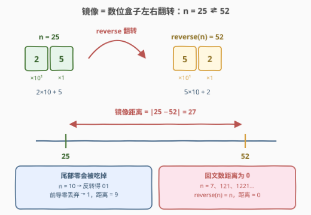
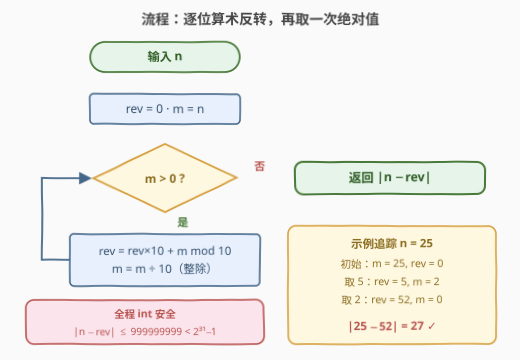

# 整数的镜像距离

- **题目名称**：整数的镜像距离
- **链接**：[3783. 整数的镜像距离](https://leetcode.cn/problems/mirror-distance-of-an-integer/)
- **难度**：简单
- **标签**：数学

## 1. 题目概述

给你一个整数 $n$。定义它的**镜像距离**为 $\text{abs}(n - \text{reverse}(n))$，其中 $\text{reverse}(n)$ 表示将 $n$ 的数字反转后形成的整数。返回 $n$ 的镜像距离。

**示例 1**：

```text
输入：n = 25
输出：27
解释：reverse(25) = 52，答案为 abs(25 - 52) = 27。
```

**示例 2**：

```text
输入：n = 10
输出：9
解释：reverse(10) = 01，即 1，答案为 abs(10 - 1) = 9。
```

**示例 3**：

```text
输入：n = 7
输出：0
解释：reverse(7) = 7，答案为 abs(7 - 7) = 0。
```

**约束条件**：

- $1 \le n \le 10^9$

> 💡 **审题关键**：① 反转是**十进制数位**反转，不是二进制位反转（对照 190 颠倒二进制位）；② **尾部零反转后成为前导零，直接丢弃**——示例 2 的 `reverse(10) = 01 = 1` 明示了这一点；③ $n \le 10^9$ 且 $\text{reverse}(n) \le 999999999$，差值不超过 $999999999 < 2^{31}-1$，C++ 全程 `int` 无溢出风险（与第 7 题整数反转的防溢出形成对照）。

---

## 2. 解题思路

### 2.1 暴力思路：字符串反转

最直接的做法是把数字当字符串处理：

```python
abs(n - int(str(n)[::-1]))
```

一行搞定，逻辑完全正确：`str(n)[::-1]` 反转数位，`int()` 自动丢弃前导零（示例 2 的 `01 → 1` 天然成立），最后取绝对值。时间 $O(d)$、空间 $O(d)$，其中 $d \le 10$ 是位数——**这个复杂度已经是渐进最优**，任何解法至少要读一遍每一位。

所以"暴力"与"最优"的差距不在复杂度，而在**工程气质**：字符串转换底层要走编码、分配、解析一整套流程，而面试官出这道题（标签只有 Math）想看的往往是**纯算术的逐位反转**——不借助字符串、$O(1)$ 额外空间、模板可推广到任意进制（见第 5 节）。

### 2.2 核心观察：逐位算术反转



**观察一：反转 = 从低位开始逐位"摘下来、拼上去"。**

用两个变量就能完成整场戏：`rev` 收集已反转的低位，`m` 是还没处理的剩余高位。每一轮做两件事：

- **摘最低位**：`m % 10`；
- **拼到 rev 右侧**：`rev = rev * 10 + m % 10`——原来已收集的数位整体左移一位（权重 ×10），腾出的个位留给新摘的数字。

这正是"数位盒子左右翻转"的算术化身：$n = 25$ 的 $2\times10 + 5$ 翻转成 $5\times10 + 2$，权重 $10^1$ 与 $10^0$ 恰好对调。

**观察二：循环不变式。**

> 每轮结束后：`rev` = $n$ 的**低 $k$ 位**的反转值，`m` = $n$ 去掉低 $k$ 位后的剩余部分（$k$ 为已执行轮数）。

用 $n = 25012$ 验证：三轮后 `rev = 210`（低三位 `012` 的反转），`m = 25`。循环至 `m = 0` 时 `rev` 即完整的 $\text{reverse}(n)$。

**观察三：尾部零天然消化，无需特判。**

$n = 10$ 的末位是 $0$：第一轮 `rev = 0×10 + 0 = 0`，第二轮 `rev = 0×10 + 1 = 1`。前导零"应该"出现的位置被 `rev` 从 $0$ 起步的累乘**自然吸收**——算术版不需要任何"去前导零"的分支，这是它比字符串版更优雅的地方。

> 💡 **附赠自检彩蛋**：$n \equiv$ 数位和 $\pmod 9$，而反转不改变数位和，所以 $n \equiv \text{reverse}(n) \pmod 9$——**镜像距离必是 9 的倍数**。$27 = 9\times3$、$9 = 9\times1$、$0$，三个示例全部命中，可作写完后的秒级验算（证明见第 5 节）。

### 2.3 算法流程图



**逻辑执行步骤**：

| 步骤 | 操作 | 说明 |
|------|------|------|
| ① 初始化 | `rev = 0, m = n` | `rev` 收集反转结果，`m` 是待处理剩余位 |
| ② 终止判断 | `m > 0`？ | 否 → 跳到 ④ |
| ③ 摘位拼接 | `rev = rev*10 + m%10`；`m //= 10` | 最低位摘下拼进 `rev`，`m` 右移一位 |
| ④ 收尾 | 返回 `abs(n - rev)` | 至此 `rev = reverse(n)` |

循环次数恰为 $n$ 的位数 $d = \lfloor \log_{10} n \rfloor + 1 \le 10$。

### 2.4 示例演算

**示例 2：`n = 10`（含尾部零的坑位）**

| 轮次 | m（处理前） | 摘下的位 | rev（处理后） | m（处理后） |
|------|------------|---------|--------------|------------|
| 1 | 10 | 0 | $0\times10 + 0 = 0$ | 1 |
| 2 | 1 | 1 | $0\times10 + 1 = 1$ | 0 |

`m = 0` 退出，返回 $\text{abs}(10 - 1) = 9$ ✓。

**边界情形**：

- $n = 7$（一位数）：循环执行一次，`rev = 7`，距离 $0$；
- $n = 10^9 = 1000000000$（唯一可能的十位数）：九轮摘的全是 $0$（`rev` 保持 $0$），第十轮 `rev = 1`，返回 $999999999$——全程不溢出。

---

## 3. 参考代码

### C++

```cpp
class Solution {
public:
    int mirrorDistance(int n) {
        int rev = 0;
        for (int m = n; m > 0; m /= 10) {
            rev = rev * 10 + m % 10;
        }
        return abs(n - rev);
    }
};
```

> 💡 **写法要点**：
> - `for` 循环把"取模摘位 + 整除右移"合并进推进表达式，循环体只剩一行拼接；
> - `abs` 对 `int` 调用的是 `<cstdlib>` 的重载（LeetCode 环境已包含），$|n - \text{rev}| \le 999999999$ 无溢出；
> - 想更"数学"一点可把 `abs(n - rev)` 写成 `n >= rev ? n - rev : rev - n`，两者等价。

### Python

```python
class Solution:
    def mirrorDistance(self, n: int) -> int:
        rev, m = 0, n
        while m > 0:
            rev = rev * 10 + m % 10
            m //= 10
        return abs(n - rev)
```

> 💡 **写法要点**：
> - `//=` 整除赋值，`%` 取余——Python 对正数的两者语义与 C++ 一致（`m` 恒为正，无负数取模歧义）；
> - 一行流版本 `abs(n - int(str(n)[::-1]))` 同样可通过，但面试建议展示算术版，再口头补充字符串版作为对照。

---

## 4. 复杂度分析

| 维度 | 复杂度 | 说明 |
|------|--------|------|
| **时间** | $O(\log_{10} n)$ | 循环次数 = 位数 $d \le 10$，每轮 $O(1)$；读入每一位是信息论下界，已最优 |
| **空间** | $O(1)$ | 只维护 `rev / m` 两个标量；字符串版需 $O(d)$ 存字符序列 |
| **量级判断** | $n \le 10^9$ | 位数至多 10，任何实现都在微秒级出结果；本题考察点是模板正确性与边界（尾部零、一位数、$10^9$），不是性能 |

---

## 5. 扩展：9 的倍数性质与 1089 魔术

**性质：镜像距离必是 9 的倍数。**

证明一行：设 $S(n)$ 为数位和，由 $10 \equiv 1 \pmod 9$ 得 $n \equiv S(n) \pmod 9$；反转只重排数位，$S(\text{reverse}(n)) = S(n)$，故

$$n - \text{reverse}(n) \equiv S(n) - S(n) \equiv 0 \pmod 9.$$

这解释了三个示例的 $27, 9, 0$ 全是 9 的倍数——也是赛时最快的对拍自检。

**更细的分位数结构**：按位数拆开看，距离的因子结构更强：

| 位数 | 展开 | 距离结构 |
|------|------|---------|
| 2 位 $= 10a+b$ | $10b+a$ | $9\lvert a-b \rvert$，取值 $\{9, 18, \dots, 81\}$ |
| 3 位 $= 100a+10b+c$ | $100c+10b+a$ | $99\lvert a-c \rvert$（中间位 $b$ 完全消去！） |

**1089 魔术**正是 3 位情形的衍生：任取首尾数字不同的三位数，算出 $\lvert n - \text{reverse}(n) \rvert$（不足三位补前导零，如 $99$ 写成 $099$），再把**这个差也反转**并相加，结果恒为 $1089$。例：$732 \to \lvert 732 - 237 \rvert = 495 \to 495 + 594 = 1089$。根源就是上表的 $99\lvert a-c \rvert$：设 $\lvert a-c\rvert = k$，差为 $99k$，其数位结构（$k=1$ 时 $099$，$k \ge 2$ 时百位 $k-1$、个位 $10-k$）恰好保证与自身反转相加各位全部凑成 $9$，和为 $999 + 90 = 1089$。

**任意进制推广**：把 `10` 换成基数 $B$，同一模板即完成 $B$ 进制反转——$B = 2$ 时就是 [190. 颠倒二进制位](https://leetcode.cn/problems/reverse-bits/)（注意那是**固定位宽**反转，需先补齐 32 位再翻转），取模除法骨架则与 [504. 七进制数](https://leetcode.cn/problems/base-7/) 的进制转换同源。

---

## 6. 面试要点

**Q1：尾部零（如 $n = 10$、$n = 100$）反转后怎么处理？需要特判吗？**

> 算术版**不需要任何特判**：`rev` 从 $0$ 起步，摘下的末位 $0$ 使 `rev = rev×10 + 0` 保持不变，前导零在累乘中天然消失。$n = 100$ 三轮后 `rev` 仍是 $0$，再拼上最后的 $1$ 得 $1$。字符串版则靠 `int()` 自动丢弃前导零。两种写法殊途同归，但算术版把这条规则"免费"内化进了循环。

**Q2：C++ 里会溢出吗？`rev` 最大到多少？**

> 不会。$n \le 10^9$ 时唯一的十位数是 $10^9$ 本身（反转得 $1$）；其余 $n$ 至多九位，`rev` 至多 $999999999$；循环中 `rev×10 + m%10` 的中间值也不超过最终的 `rev`。距离 $\le 999999999 < 2^{31}-1$，全程 `int` 安全。**对照第 7 题整数反转**：那题输入可到 $2^{31}-1$，反转可能越界，必须中途判 `rev > INT_MAX/10`——本题数据范围刻意避开了这个坑。

**Q3：循环不变式怎么表述？如何在面试中快速自证正确性？**

> "每轮结束后，`rev` 等于 $n$ 的低 $k$ 位反转值，`m` 等于 $n$ 右移 $k$ 位（十进制）"。归纳证明：新一轮摘下 $m$ 的末位 $d$，此时 $n$ 的低 $k+1$ 位反转值 $= d \cdot 10^k + (\text{低 } k \text{ 位反转值})$，而 `rev×10 + d` 恰好把旧 `rev` 的权重抬到 $10^k$ 再加上 $d$。退出时 $m = 0$，低 $d$ 位就是全部位。

**Q4：为什么镜像距离一定是 9 的倍数？怎么用？**

> $10 \equiv 1 \pmod 9 \Rightarrow n \equiv S(n) \pmod 9$；反转不改变数位和，故 $n \equiv \text{reverse}(n) \pmod 9$，差被 $9$ 整除。用途：本地对拍时给随机答案加一道 `assert(ans % 9 == 0)` 滤网，能在提交前抓住几乎所有的实现笔误（摘位方向写反、位数差一等错误都会破坏同余性……严格说同余性只筛"算错数位"类错误，但配合样例三重点覆盖尾部零即可）。

**Q5：这题和第 7 题（整数反转）、第 9 题（回文数）是什么关系？**

> 一母同胞的**数位算术族**：第 7 题是反转本体（附加溢出防护），第 9 题判定 `reverse(n) == n`（即本题距离为 $0$ 的情形，可优化为只反转一半），本题在反转之上加一步 `abs` 差值。三题共享同一个 `rev = rev*10 + m%10` 循环骨架——把这个模板写到肌肉记忆，三题通吃。

> 💡 **一句话总结**：3783 = 「`rev = rev×10 + m%10; m //= 10`」+「`abs(n - rev)`」。两个带走的知识点：尾部零被从 $0$ 起步的累乘天然吸收；数位重排不改变 $\bmod\ 9$ 的余数，镜像距离必是 9 的倍数。

---

## 7. 同类练习题

- [7. 整数反转](https://leetcode.cn/problems/reverse-integer/)（[题解](../0001-0100/7_整数反转.md)）：同款逐位反转模板的原型题，额外考察 32 位溢出的中途判停
- [9. 回文数](https://leetcode.cn/problems/palindrome-number/)（[题解](../0001-0100/9_回文数.md)）：本题"距离为 0"的判定版，练只反转一半数位的省事写法
- [258. 各位相加](https://leetcode.cn/problems/add-digits/)（[题解](../0201-0300/258_各位相加.md)）：同用 $n \equiv S(n) \pmod 9$ 的同余性质，数位族的核心引理
- [190. 颠倒二进制位](https://leetcode.cn/problems/reverse-bits/)（[题解](../0101-0200/190_颠倒二进制位.md)）：同一反转模板搬到二进制域，注意固定位宽的补齐差异
- [504. 七进制数](https://leetcode.cn/problems/base-7/)（[题解](../0501-0600/504_七进制数.md)）：取模除法逐位剥离的骨架同源，练进制推广
