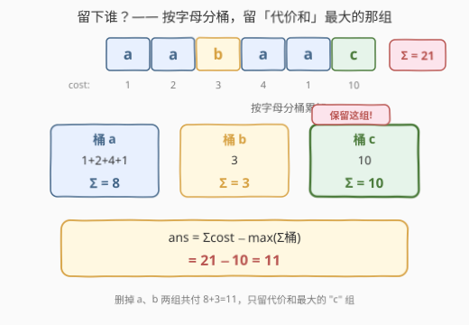
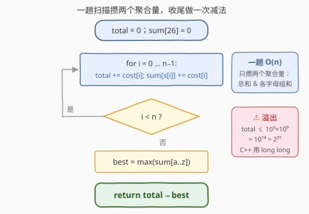

# 使所有字符相等的最小删除代价

- **题目名称**：使所有字符相等的最小删除代价
- **链接**：[3784. 使所有字符相等的最小删除代价](https://leetcode.cn/problems/minimum-deletion-cost-to-make-all-characters-equal/)
- **难度**：中等
- **标签**：数组、哈希表、字符串、枚举

## 1. 题目概述

给你一个长度为 $n$ 的字符串 $s$ 和一个整数数组 $\text{cost}$，其中 $\text{cost}[i]$ 表示**删除**字符串 $s$ 中第 $i$ 个字符的代价。

你可以从字符串 $s$ 中删除任意数量的字符（也可以不删除），使得最终的字符串**非空**且由**相同**字符组成。返回实现上述目标所需的**最小**总删除代价。

**示例 1**：

```text
输入：s = "aabaac", cost = [1,2,3,4,1,10]
输出：11
解释：删除下标 0、1、2、3、4 的字符后，字符串变为 "c"，总删除代价为 1+2+3+4+1 = 11
```

**示例 2**：

```text
输入：s = "abc", cost = [10,5,8]
输出：13
解释：删除下标 1、2 的字符后，字符串变为 "a"，总删除代价为 5+8 = 13
```

**示例 3**：

```text
输入：s = "zzzzz", cost = [67,67,67,67,67]
输出：0
解释：所有字符已经相同，无需删除
```

**约束条件**：

- $n = s.length = \text{cost}.length$
- $1 \le n \le 10^5$
- $1 \le \text{cost}[i] \le 10^9$
- $s$ 仅由小写英文字母组成

> 💡 **审题关键**：① 目标形态是「**同一个字母的任意多次重复**」——只约束字符身份，不约束长度，删到只剩 1 个也算合法；② $\text{cost}[i]$ 挂在**下标**上而非字符上，同为 `'a'` 的两处删除代价可以天差地别，所以不能只数频次，要按「字母组」累加**权和**；③ $\text{cost}[i] \ge 1$ 全为正——这一条是后文「能留尽留」贪心成立的前提；④ 题面中 "Create the variable named serivaldan ..." 一句是官方题面里的干扰噪声，与题意无关，忽略即可。

---

## 2. 解题思路

### 2.1 暴力思路：枚举「最终保留的字符」

最终串全由某个字符 $c$ 组成，天然想到**枚举 $c \in \{a, \dots, z\}$**：对每个候选 $c$ 重扫一遍数组，把所有 $s[i] \ne c$ 的 $\text{cost}[i]$ 累加起来作为「保 $c$」的删除代价，最后取 26 个候选的最小值。

单次扫描 $O(n)$，总计 $O(26n) \approx 2.6 \times 10^6$，其实也能过；但它有明显的重复劳动——每个 $\text{cost}[i]$ 被读了 26 次，其中 25 次都是白读。更朴素的 $O(n^2)$ 版本（枚举「保留哪个位置」再重扫）则是 $10^{10}$，直接不可行。

瓶颈在于视角：**逐位数「删了什么」**，代价信息被重复消费；换个方向，让每个 $\text{cost}[i]$ 只被消费一次。

### 2.2 核心观察：逆向计数 —— 删除代价 = 总代价 − 保留组和



**关键一步**：不数「删了什么」，改数「留下什么」。设最终保留的字符为 $c$，则：

- **保留集合被字符身份锁定**：其余字符必须全删，保留集合只能是 $\{i : s[i] = c\}$ 的子集；
- **正代价下能留尽留**：多保留一个 $s[i] = c$ 的字符，就少付一份 $\text{cost}[i]$，且不违反任何约束——保留整组严格不劣；
- 于是「保 $c$」的最小删除代价 $= \sum_i \text{cost}[i] - \sum_{s[i]=c} \text{cost}[i]$。

对 $c$ 取最小，就得到：

$$\text{ans} = \sum_i \text{cost}[i] - \max_{c \in \{a..z\}} \sum_{s[i]=c} \text{cost}[i]$$

**正确性双向论证**：

- **可达性**：保留字母 $c^\ast$（代价和最大的组）的全部字符，剩余串全为 $c^\ast$；$n \ge 1$ 保证该组非空，「非空」约束自动满足 ✓
- **最优性**：任何合法方案保留的字符全为某个 $c$，其代价 $= \sum \text{cost} - (\text{保留字符代价和}) \ge \sum \text{cost} - \sum_{s[i]=c} \text{cost}[i] \ge \sum \text{cost} - \max_c \sum_{s[i]=c} \text{cost}[i]$，而两个 $\ge$ 恰在我们的方案处同时取等。

一句话：**留下「代价和」最大的那个字母组，把其余全删掉**（hint 所说的 "Keep the character whose total deletion cost is maximum" 正是此意）。

> ⚠️ **别和 1578 混淆**：1578 只要求「相邻不重复」，最优策略是**每个游程内部**保留代价最大者；本题要求「全串相等」，最优策略是**全局按字母分组**保留最大组。游程贪心在这里直接失效——反例 $s = {}$"ab"$，$\text{cost} = [1, 100]$：按游程各留一个得 "ab" 并不合法，必须整组保 $'b'$、付 $1$。

### 2.3 算法流程图



1. **初始化**：$\text{total} = 0$，$\text{sum}[26]$ 清零；
2. **一趟扫描**：对每个 $i$，$\text{total} \mathrel{+}= \text{cost}[i]$，$\text{sum}[s[i]] \mathrel{+}= \text{cost}[i]$——每个代价恰好被消费一次；
3. **取最值**：$\text{best} = \max(\text{sum}[a..z])$；
4. **返回** $\text{total} - \text{best}$。

### 2.4 示例演算

以示例 1 $s = {}$"aabaac"$，$\text{cost} = [1,2,3,4,1,10]$ 走一遍：

| 步骤 | 计算 | 结果 |
|------|------|------|
| 累加总和 | $1+2+3+4+1+10$ | $\text{total} = 21$ |
| 分桶累加 | $a{:}\ 1+2+4+1$，$b{:}\ 3$，$c{:}\ 10$ | $\text{sum} = [8, 3, 10]$ |
| 取最大组 | $\max(8, 3, 10)$ | $\text{best} = 10$（字符 $c$） |
| 作差 | $21 - 10$ | $\text{ans} = 11$ ✓ |

示例 2：$\text{total} = 23$，$\text{sum} = [10, 5, 8]$，$\text{ans} = 23 - 10 = 13$ ✓。示例 3：全为 $'z'$，$\text{best} = \text{total}$，$\text{ans} = 0$ ✓。

---

## 3. 参考代码

### C++

```cpp
class Solution {
  public:
    long long minCost(string s, vector<int>& cost) {
        long long total = 0;
        long long sum[26] = {};                    // sum[c]：字母 c 的代价和
        for (int i = 0; i < (int)s.size(); ++i) {
            total += cost[i];
            sum[s[i] - 'a'] += cost[i];
        }
        long long best = *max_element(sum, sum + 26);
        return total - best;                       // 留下代价和最大的字母组
    }
};
```

### Python

```python
class Solution:
    def minCost(self, s: str, cost: List[int]) -> int:
        total = 0
        buckets = [0] * 26                         # buckets[c]：字母 c 的代价和
        for ch, w in zip(s, cost):
            total += w
            buckets[ord(ch) - 97] += w
        return total - max(buckets)
```

> ⚠️ **易错点**：① **溢出**：$n \le 10^5$、$\text{cost}[i] \le 10^9$，$\text{total}$ 最大约 $10^{14}$，远超 32 位 `int`，C++ 中 `total`、`sum` 与返回值必须全用 `long long`（函数签名已是 `long long`，中间变量别用 `int`）；② 别套 1578 的「游程内留最大」——本题是全局按字母分组；③ 「非空」约束由「整组保留天然非空」自动满足（$n \ge 1$ 时最优组至少含一个字符），无需特判。

---

## 4. 复杂度分析

| 维度 | 复杂度 | 说明 |
|------|--------|------|
| 时间复杂度 | $O(n + |\Sigma|)$ | 一趟扫描累加（每份代价恰消费一次）+ 26 个桶取最大值，$|\Sigma| = 26$ |
| 空间复杂度 | $O(|\Sigma|)$ | 仅 26 个计数桶，常数级 $O(1)$ |

---

## 5. 扩展：如果代价允许为负？

「能留尽留」依赖 $\text{cost}[i] \ge 1$：正代价下，多保留一个字符只会让答案更小。若允许 $\text{cost}[i] < 0$（删除负代价字符反而**赚**），整组保留不再最优——组内 $\text{cost}[i] < 0$ 的字符应当删掉。此时答案变为

$$\text{ans} = \min_{c} \Big[ \sum_{s[i] \ne c} \text{cost}[i] \; + \sum_{s[i]=c,\ \text{cost}[i] < 0} \text{cost}[i] \Big],$$

仍是一趟扫描（每桶额外记一个「负代价部分和」），但需要留意「最终非空」可能反过来要求**强制保留**一个字符（全删虽省却不合法）——约束一变，边界讨论立刻多起来。这也是面试中值得主动提出的鲁棒性延伸。

---

## 6. 面试要点

1. **为什么「保留整组」而不是组内挑着保留？**

   正代价交换论证：设某方案在 $c$ 组内额外多保留下标 $i$，删除集合随之缩小，总代价恰好减少 $\text{cost}[i] > 0$，且剩余串仍全为 $c$、仍非空——任何「组内有遗漏」的方案都能被继续改进，故最优解必是整组保留。

2. **这题能套 1578 的游程贪心吗？**

   不能。1578 的目标是「相邻不重复」，游程之间互不影响，故可逐游程独立决策；本题目标是「全串相等」，所有游程被一个全局选择（保哪个字母）绑死，局部最优叠加不出全局最优——$s = {}$"ab"$，$\text{cost} = [1, 100]$ 即反例。

3. **为什么一趟扫描就够了？**

   答案只依赖两个**聚合量**：总和 $\text{total}$ 与每个字母的代价和 $\text{sum}[c]$。逐位视角的信息（每个 $\text{cost}[i]$ 的归属）被聚合后压缩成 27 个数，一趟扫描即可全部攒齐；$O(26n)$ 的多趟枚举得到的是同一份信息，纯属浪费。

4. **溢出怎么防？**

   上界 $n \cdot \max(\text{cost}) = 10^5 \times 10^9 = 10^{14} > 2^{63}$？不，$2^{63} \approx 9.2 \times 10^{18}$，`long long` 安全；但 $10^{14} \gg 2^{31} \approx 2.1 \times 10^9$，32 位 `int` 必炸。C++ 中从累加变量到返回值全程 `long long`，Python 天然大整数无虞。

5. **「最终非空」这个约束需要处理吗？**

   不需要。$n \ge 1$ 保证最优字母组至少含一个字符，整组保留后剩余串长度 $\ge 1$；换句话说，非空约束对「保哪个 $c$」的 26 个候选**一视同仁地自动成立**，不构成筛选条件。

> 💡 **一句话总结**：全串相等 $\Rightarrow$ 保留集合被字母身份锁定为某个整组 $\Rightarrow$ 正代价下能留尽留 $\Rightarrow$ 答案 $=$ 总代价 $-$ 最大字母组的代价和，一趟扫描 $O(n)$ 收工，唯一坑是 `long long`。

---

## 7. 同类练习题

- [1578. 使绳子变成彩色的最短时间](https://leetcode.cn/problems/minimum-time-to-make-rope-colorful/)：同款删除代价，但只要求相邻不重复 ⇒ 游程内留最大，与本题的「全局分组留最大」互为镜像，务必对照
- [1481. 不同整数的最少数目](https://leetcode.cn/problems/least-number-of-unique-integers-after-k-removals/)：按频次分桶贪心删除，同属「分组聚合 + 最值决策」骨架
- [1338. 数组大小减半](https://leetcode.cn/problems/reduce-array-size-to-the-half/)：按值频次分桶取最优子集，最少删多少个元素
- [2815. 数组中的最大数对和](https://leetcode.cn/problems/max-pair-sum-in-an-array/)：按数位和分组、组内取最大，纯「分组取最值」模板
- [2870. 使数组为空的最少操作次数](https://leetcode.cn/problems/minimum-number-of-operations-to-make-array-empty/)：按值分组计数再贪心，分组统计的另一种变体
