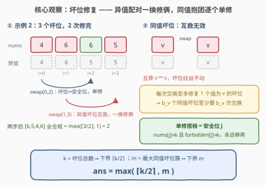

# 避免禁用值的最小交换次数

- **题目名称**：避免禁用值的最小交换次数
- **链接**：[3785. 避免禁用值的最小交换次数](https://leetcode.cn/problems/minimum-swaps-to-avoid-forbidden-values/)
- **难度**：困难
- **标签**：贪心、数组、哈希表、计数

## 1. 题目概述

**题意**：给定两个长度为 $n$ 的整数数组 $nums$ 和 $forbidden$。可以执行以下操作**任意次**（含零次）：选择两个**不同**下标 $i$、$j$，交换 $nums[i]$ 与 $nums[j]$。求使**每个**下标 $i$ 都满足 $nums[i] \ne forbidden[i]$ 所需的**最小**交换次数；若无论如何都无法满足，返回 $-1$。

**示例 1**：

```text
输入：nums = [1,2,3], forbidden = [3,2,1]
输出：1
解释：交换下标 0 和 1，nums = [2,1,3]，此后每个下标都满足 nums[i] != forbidden[i]。
```

**示例 2**：

```text
输入：nums = [4,6,6,5], forbidden = [4,6,5,5]
输出：2
解释：先交换 (0,2) 得 [6,6,4,5]，再交换 (1,3) 得 [6,5,4,6]，全部合规。
```

**示例 3**：

```text
输入：nums = [7,7], forbidden = [8,7]
输出：-1
解释：n = 2 而值 7 在两数组中共出现 3 次，怎么交换都堵不住下标 1。
```

**示例 4**：

```text
输入：nums = [1,2], forbidden = [2,1]
输出：0
解释：初始已全部合规，无需交换。
```

**约束条件**：

- $1 \le n = nums.length = forbidden.length \le 10^5$
- $1 \le nums[i], forbidden[i] \le 10^9$

> 💡 **审题关键**：① 交换是**任意位置**交换（不是相邻交换），一次交换可以同时处理两个「坏位」；② 判定只与**逐位**约束 $nums[i] \ne forbidden[i]$ 有关，与值的大小、顺序无关——本质是**计数问题**；③ 先判无解（$-1$），再数坏位。

---

## 2. 解题思路

称下标 $i$ 为**坏位**，若 $nums[i] = forbidden[i]$。记：

- $k$：坏位总数；
- $b_v$：值为 $v$ 的坏位个数（即 $nums[i] = forbidden[i] = v$ 的下标数），$m = \max_v b_v$；
- $c_n(v)$ / $c_f(v)$：值 $v$ 在 $nums$ / $forbidden$ 中的出现次数。

### 2.1 暴力思路

交换不改变 $nums$ 的**多重集**，因此最终态是 $nums$ 的某个重排 $T$，且须满足 $T[i] \ne forbidden[i]$（合法目标）。从初始排列到**固定**目标 $T$ 的最小任意交换次数有经典公式——**置换环分解**，等于 $n - (\text{环数})$（等值元素可任意对应，取环数最多的匹配）。

- 暴力 ①：BFS 枚举所有可达排列——状态空间 $n!$；
- 暴力 ②：枚举每个合法目标 $T$，逐个算置换环数——目标组合爆炸。

两者都不可行。破局点：**根本不需要知道 $T$ 长什么样**——最小交换次数只由坏位的两个统计量 $(k, m)$ 决定。

### 2.2 核心观察：坏位计数——配对 + 单修



**观察一（无解判据——鸽笼）**：值 $v$ 的 $c_n(v)$ 个副本只能落在 $forbidden[j] \ne v$ 的位置上，这样的位置只有 $n - c_f(v)$ 个。若

$$c_n(v) + c_f(v) \ge n + 1 \iff c_n(v) > n - c_f(v)$$

则 $v$ 必然放不下，返回 $-1$。示例 3 正是如此：$c_n(7) + c_f(7) = 3 \ge n + 1 = 3$。

> 反之，若所有值都满足 $c_n(v) + c_f(v) \le n$，观察三的构造必然走通——所以这个**单值条件**既必要又充分。为什么不像一般匹配问题那样要查所有子集的 Hall 条件？因为每个位置只禁止**一个**值，任何含 $\ge 2$ 个值的集合，其可用位置就是全集（见第 5 节）。

**观察二（两个下界）**：

- **下界 A**：一次交换只触碰两个位置，至多修复两个坏位 $\Rightarrow ans \ge \lceil k/2 \rceil$。
- **下界 B**：一次交换至多修复**一个**值为 $v$ 的坏位。要修复 $v$ 坏位必须给它送来非 $v$ 的值；若一次交换同时修复两个 $v$ 坏位，两个位置必须都参与交换，但它们互换的是 $v \leftrightarrow v$——等于没换。$\Rightarrow ans \ge b_v$，对 $v$ 取最大得 $ans \ge m$。

**观察三（构造恰好达到 $\max(\lceil k/2 \rceil, m)$）**：

- **配对阶段**：任取两个**异值**坏位 $i$（值为 $v$）、$j$（值为 $w$，$v \ne w$）。交换后 $i$ 收到 $w \ne v$、$j$ 收到 $v \ne w$，**双双修复**且不产生新坏位——一换修俩。
- **单修阶段**：若剩下的坏位全是同一个值 $v$，逐个与**安全位**交换。安全位 $j$ 满足 $nums[j] \ne v$ 且 $forbidden[j] \ne v$：交换后坏位收到 $nums[j] \ne v$ 修复，$j$ 收到 $v \ne forbidden[j]$ 保持好位——一换修一。
- **安全位永远够用**：设当前 $v$ 坏位有 $t$ 个。持有 $v$ 的位置恒有 $c_n(v)$ 个（多重集不变），$forbidden$ 为 $v$ 的位置恒有 $c_f(v)$ 个，两者并集大小 $= c_n(v) + c_f(v) - t \le n - t$，故**安全位个数 $\ge t$**；每次单修恰消耗一个安全位、坏位减一，不变量始终保持。
- **次数结算**：若 $m \le k/2$，把坏位按值排序后第 $i$ 个与第 $i + \lfloor k/2 \rfloor$ 个配对即全是异值对（最大簇不超过一半），至多剩 1 个单修，总次数 $= \lceil k/2 \rceil$；若 $m > k/2$，先用 $k - m$ 个非 $v$ 坏位与 $v$ 坏位配对（一换修俩），再单修剩下的 $2m - k$ 个，总次数 $= (k - m) + (2m - k) = m$。两种情况都恰为 $\max(\lceil k/2 \rceil, m)$。

> 💡 **一句话**：交换像「床位交换」——两个住错房的**异值**客人互换直接双赢（一换修俩）；**同值**客人挤在一起怎么换都没用，只能逐个找**空床位**（安全位）换出去（一换修一）。

### 2.3 算法流程图

![算法流程：合并计数判无解、统计坏位 k 与 bad[v]、套公式 max(⌈k/2⌉, m)](../images/p3785_algorithm_flow.svg)

**文字版步骤**：

| 步骤 | 操作 | 说明 |
|------|------|------|
| ① 合并计数 | $freq[v] = c_n(v) + c_f(v)$ | 两数组同扫一遍哈希表 |
| ② 判无解 | 任一 $freq[v] > n$ → 返回 $-1$ | 鸽笼：$v$ 的副本放不下 |
| ③ 数坏位 | $k \leftarrow \#\{i : nums[i] = forbidden[i]\}$，$bad[v]$ 同步计数 | 只统计不构造 |
| ④ 特判 | $k = 0$ → 返回 $0$ | 空 $bad$ 不能取 max |
| ⑤ 套公式 | 返回 $\max(\lceil k/2 \rceil, \max_v bad[v])$ | 两个下界都被构造达到 |

### 2.4 示例演算

以示例 2（$nums = [4,6,6,5]$，$forbidden = [4,6,5,5]$）走一遍：

| 阶段 | $nums$ | 坏位 | 说明 |
|------|--------|------|------|
| 初始 | $[4,6,6,5]$ | $\{0,1,3\}$（值 $4,6,5$） | $k = 3$，$m = 1$，公式 $= \max(2,1) = 2$ |
| swap(0,2) | $[6,6,4,5]$ | $\{1,3\}$（值 $6,5$） | 坏位 0 与安全位 2 单修：$nums[2]=6 \ne 4$ 且 $forbidden[2]=5 \ne 4$ |
| swap(1,3) | $[6,5,4,6]$ | $\varnothing$ | 异值坏位 1（值 6）与 3（值 5）互救，一换修俩 |

2 次交换收官，与公式一致。示例 1（$k=1, m=1$）得 $\max(1,1)=1$；示例 4（$k=0$）直接得 $0$。

---

## 3. 参考代码

### C++

```cpp
class Solution {
  public:
    int minSwaps(vector<int>& nums, vector<int>& forbidden) {
        int n = nums.size();
        unordered_map<int, int> freq;              // 合并计数：v 在两数组中的总次数
        for (int i = 0; i < n; ++i) {
            ++freq[nums[i]];
            ++freq[forbidden[i]];
        }
        for (auto& [v, c] : freq)
            if (c > n) return -1;                  // 鸽笼：v 的副本放不下

        int k = 0;                                  // 坏位总数
        unordered_map<int, int> bad;                // 同值坏位计数 bad[v]
        for (int i = 0; i < n; ++i)
            if (nums[i] == forbidden[i]) {
                ++bad[nums[i]];
                ++k;
            }
        if (k == 0) return 0;

        int m = 0;                                  // 最大同值坏位簇
        for (auto& [v, c] : bad) m = max(m, c);
        return max((k + 1) / 2, m);
    }
};
```

### Python

```python
class Solution:
    def minSwaps(self, nums: List[int], forbidden: List[int]) -> int:
        n = len(nums)
        freq = Counter(nums) + Counter(forbidden)   # 合并计数
        if max(freq.values()) >= n + 1:
            return -1                               # 鸽笼：v 的副本放不下

        bad = Counter(x for x, f in zip(nums, forbidden) if x == f)
        k = sum(bad.values())                       # 坏位总数
        if k == 0:
            return 0

        return max((k + 1) // 2, max(bad.values())) # ⌈k/2⌉ 与最大同值簇取大
```

> 💡 **写法要点**：
> - 无解判据是 $freq[v] \ge n + 1$，代码写 `c > n`，别手滑写成 `c >= n`；
> - Python 直接用 `Counter` 相加完成合并计数；
> - $k = 0$ 必须提前返回——空 `bad` 上取 `max` 会报错；
> - 全程只计数、不构造方案：最小交换次数仅由 $(k, m)$ 两个统计量决定。

---

## 4. 复杂度分析

| 维度 | 复杂度 | 说明 |
|------|--------|------|
| **时间复杂度** | $O(n)$ | 两趟线性扫描 + 哈希计数；值域 $10^9$ 只能用哈希表不能开桶 |
| **空间复杂度** | $O(n)$ | `freq` 与 `bad` 两个哈希表，键数至多分别为 $2n$ 与 $n$ |

---

## 5. 扩展：Hall 定理视角与置换环视角

- **Hall 定理视角**：合法性判定本质是二分匹配——值 $v$（左侧，$c_n(v)$ 个副本）匹配到 $forbidden[j] \ne v$ 的位置（右侧）。一般 Hall 条件要对**所有**值子集 $S$ 验证 $\sum_{v \in S} c_n(v) \le |N(S)|$；但本题每个位置只禁止**一个**值，当 $|S| \ge 2$ 时任何位置总能容纳 $S$ 中某个值（至多被 $S$ 内一个值挡住），$N(S) = $ 全部 $n$ 个位置，条件自动成立。于是 Hall 只剩单值条件 $c_n(v) \le n - c_f(v)$——一次计数即可，无需真正跑匹配。这也解释了观察三的构造为何必然走通。
- **置换环视角**：固定目标 $T$ 后，最小任意交换次数 $= n - (\text{环数})$（对照 [765. 情侣牵手](https://leetcode.cn/problems/couples-holding-hands/)、[3551. 数位和排序需要的最小交换次数](https://leetcode.cn/problems/minimum-swaps-to-sort-by-digit-sum/)）。本题目标不唯一，答案是对**所有**合法目标取最小环数距离；坏位计数公式绕开了对 $T$ 的枚举——下界 A 正是「每个坏位必落在长 $\ge 2$ 的环里、长 $L$ 的环花 $L-1$ 次交换」的推论。
- **相邻交换版本**：若只许交换相邻元素（如 [3587. 最小相邻交换至奇偶交替](https://leetcode.cn/problems/minimum-adjacent-swaps-to-alternate-parity/)、[2340. 生成有效数组的最少交换次数](https://leetcode.cn/problems/minimum-adjacent-swaps-to-make-a-valid-array/)），代价模型变成位移和 / 逆序对，「一换修俩」不复存在，须另行分析。
- **变体**：若 $forbidden$ 是一个全局禁值集合（所有位置共享同一批禁值），则不再有逐位绑定，问题退化为多重集的排除分配，贪心口径完全不同。

---

## 6. 面试要点

**Q1：为什么 $freq[v] > n$ 直接无解？只查单个值为什么就够？**

> $v$ 只能进 $forbidden[j] \ne v$ 的 $n - c_f(v)$ 个位置，需要 $c_n(v) \le n - c_f(v)$。又因为每个位置只禁止一个值，Hall 条件对 $|S| \ge 2$ 的子集自动成立，只剩单值条件——一次计数即可完成无解判定，不必跑二分匹配。

**Q2：两个下界 $\lceil k/2 \rceil$ 与 $m$ 分别怎么来的？**

> 前者：一次交换只触两位，至多修两个坏位。后者：修复 $v$ 坏位必须送来非 $v$ 值，两个 $v$ 坏位同在一次交换里只会互换 $v \leftrightarrow v$，等于没换——故每换至多修一个 $v$ 坏位，$b_v$ 个至少 $b_v$ 次，取最大簇即 $m$。

**Q3：为什么 $\max(\lceil k/2 \rceil, m)$ 恰好可达？**

> 异值坏位两两配对一换修俩（$v \ne w$ 时互换后双双合规）；剩余同值坏位逐个与安全位（$nums[j] \ne v$ 且 $forbidden[j] \ne v$）单修。安全位个数 $= n - (c_n(v) + c_f(v) - t) \ge t$（$t$ 为当前 $v$ 坏位数），恒够用。两阶段总次数在 $m \le k/2$ 时为 $\lceil k/2 \rceil$，否则为 $m$。

**Q4：与「置换环 $n - $ 环数」的最小交换公式是什么关系？**

> 那个公式适用于**目标确定**的场合；本题目标是合法排列的**集合**，答案是对集合取最小。坏位计数给出了这个最小值的闭式——下界 A 可由「坏位必落在长 $\ge 2$ 的环、每环 $L$ 个点花 $L-1$ 换」重新推出，是环公式在「目标任选」下的坍缩。

**Q5：实现上有哪些坑？**

> ① 无解判据是 $freq[v] \ge n + 1$（代码写 `> n`），不是 $\ge n$；② $k = 0$ 提前返回，避免对空容器取 `max`；③ 值域 $10^9$ 必须用哈希表；④ 答案上界 $n \le 10^5$，`int` 安全，无需 `long long`。

---

## 7. 同类练习题

- [765. 情侣牵手](https://leetcode.cn/problems/couples-holding-hands/)（[题解](../0701-0800/765_情侣牵手.md)）：任意交换最小次数的置换环经典（$n -$ 环数），与本题下界 $\lceil k/2 \rceil$ 同根——环长 $L$ 花 $L-1$ 换、每换至多安置 2 个错位元素
- [3551. 数位和排序需要的最小交换次数](https://leetcode.cn/problems/minimum-swaps-to-sort-by-digit-sum/)（[题解](../3501-3600/3551_数位和排序需要的最小交换次数.md)）：目标排列固定的最小任意交换——置换环分解模板题，与本题「目标不唯一」互为对照
- [3587. 最小相邻交换至奇偶交替](https://leetcode.cn/problems/minimum-adjacent-swaps-to-alternate-parity/)（[题解](../3501-3600/3587_最小相邻交换至奇偶交替.md)）：相邻交换版镜像——「一换修俩」消失，代价坍缩为保序配对的位移和
- [2340. 生成有效数组的最少交换次数](https://leetcode.cn/problems/minimum-adjacent-swaps-to-make-a-valid-array/)（[题解](../2301-2400/2340_生成有效数组的最少交换次数.md)）：相邻交换把极值挪到两端的位移和——对照本题任意交换的纯计数口径
