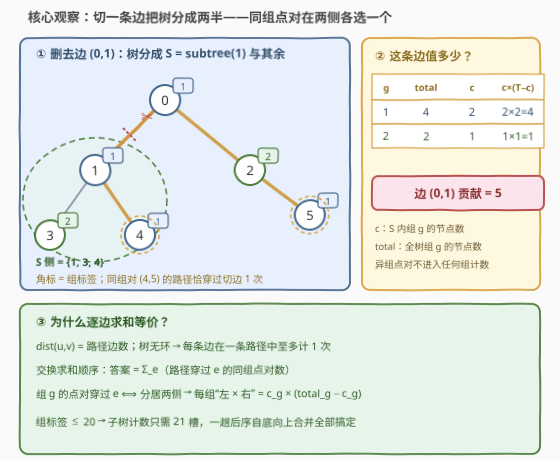
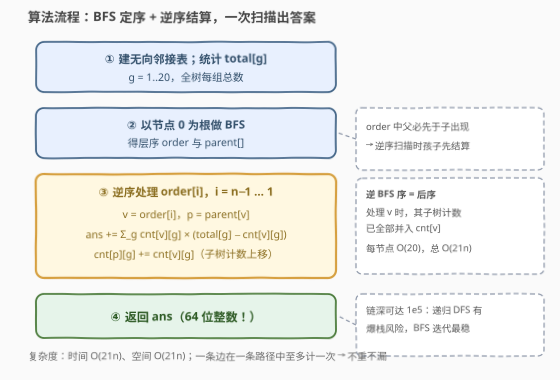

# LeetCode 树组的交互代价总和 题解

## 1. 题目概述

- **标题 / 题号**：树组的交互代价总和（#3786，hard）
- **链接**：https://leetcode.cn/problems/total-sum-of-interaction-cost-in-tree-groups/
- **难度**：困难
- **标签**：树、深度优先搜索、数组

**题意**：给你一个整数 $n$ 和一棵包含 $n$ 个节点（编号 $0 \sim n-1$）的无向树，边由长度为 $n-1$ 的二维数组 $edges$ 给出，$edges[i] = [u_i, v_i]$ 表示 $u_i$ 与 $v_i$ 之间有一条无向边。

再给定长度为 $n$ 的整数数组 $group$，$group[i]$ 是节点 $i$ 的组标签。若 $group[u] = group[v]$，则认为节点 $u$ 和 $v$ 属于同一组。**交互代价**定义为节点 $u$、$v$ 之间唯一路径上的**边数**。

返回所有满足 $u \ne v$ 且 $group[u] = group[v]$ 的**无序**节点对 $(u, v)$ 的交互代价之和；若不存在这样的点对，返回 $0$。

**示例 1**：

```text
输入：n = 3, edges = [[0,1],[1,2]], group = [1,1,1]
输出：4
解释：(0,1) 距离 1，(1,2) 距离 1，(0,2) 距离 2，合计 4。
```

**示例 2**：

```text
输入：n = 3, edges = [[0,1],[1,2]], group = [3,2,3]
输出：2
解释：只有节点 0、2 同属组 3，距离为 2；节点 1 独属组 2，无同组点对。
```

**示例 3**：

```text
输入：n = 4, edges = [[0,1],[0,2],[0,3]], group = [1,1,4,4]
输出：3
解释：组 1 的 (0,1) 距离 1；组 4 的 (2,3) 距离 2。合计 3。
```

**示例 4**：

```text
输入：n = 2, edges = [[0,1]], group = [9,8]
输出：0
解释：两节点组标签不同，无同组点对。
```

**约束**：

- $1 \le n \le 10^{5}$
- $edges.length = n - 1$，$0 \le u_i, v_i \le n-1$，输入保证 $edges$ 表示一棵有效的树
- $1 \le group[i] \le 20$

> 💡 **审题关键**：① **组标签只有 $1 \sim 20$**——至多 20 个组是复杂度的命门：子树内「每组各有多少点」只需一个 21 槽计数向量，一次 DFS 同时服务所有组；② 同组点对最多 $\binom{10^5}{2} \approx 5\times10^{9}$ 对、链形树距离可达 $10^5$，答案量级约 $10^{14}$，**必须用 64 位整数**；③ 树上任意两点路径唯一——「点对距离之和」可以换元成「每条边被多少条同组路径穿过」，这是全题的破局点。

## 2. 解题思路

### 2.1 暴力思路

对每个节点 BFS 一遍求出全源距离，再枚举所有同组点对累加——$O(n^2)$ 的时间与空间，$n = 10^5$ 时约 $10^{10}$ 次基本操作，不可行。即便用 LCA 把单次距离查询压到 $O(1)$，$5\times10^9$ 对的枚举本身就已超时。

暴力困境的根源在于**以点对为计数单位**；而距离的定义「路径上的边数」暗示了另一套统计口径——**以边为计数单位**。顺着这条缝拆下去就是正解。

### 2.2 核心观察：逐边贡献（换元统计）



三步推理：

**第一步：距离和可以「按边」重写。** $\mathrm{dist}(u,v)$ 等于路径上的边数，即

$$\mathrm{dist}(u,v) \;=\; \sum_{e \in E} \big[\,e \text{ 在 } u \to v \text{ 的路径上}\,\big]$$

树无环，每条边在一条路径中**至多出现一次**。把「对点对求和、对边判定」交换求和顺序，得到

$$\text{答案} \;=\; \sum_{e \in E} \#\{\text{同组点对}:\ \text{路径穿过 } e\}$$

**第二步：单条边的贡献是好算的。** 以任意节点为根，考察边 $e = (v, \mathrm{parent}(v))$：删掉它，树分成「子树 $S = \mathrm{subtree}(v)$」与「其余部分」两侧。组 $g$ 的点对路径穿过 $e$，当且仅当两点**分居两侧**——一端在 $S$ 内（$c_g$ 个）、另一端在外（$\mathrm{total}_g - c_g$ 个）：

$$\mathrm{contrib}(e) \;=\; \sum_{g=1}^{20} c_g \times (\mathrm{total}_g - c_g)$$

其中 $c_g$ 是子树内组 $g$ 的节点数，$\mathrm{total}_g$ 是全树组 $g$ 的总数。异组点对天然不计分——它们根本不进入任何一组的计数。

**第三步：$group \le 20$ 让计数一次到位。** 子树的组计数向量只有 21 个槽，**后序**自底向上合并：处理完 $v$ 的全部孩子后，先按上式结算边 $(v, \mathrm{parent}(v))$ 的贡献，再把 $\mathrm{cnt}[v]$ 并入 $\mathrm{cnt}[\mathrm{parent}(v)]$。每个节点 $O(20)$，一棵树一趟扫描收官。顺带验证：图中那棵树五条边的贡献依次为 $5+4+1+3+3 = 16$，与逐对枚举 $\mathrm{dist}$ 的结果完全一致。

### 2.3 算法流程图



**逻辑执行步骤**：

| 步骤 | 操作 | 说明 |
|------|------|------|
| ① 建图 | 无向邻接表；统计 $\mathrm{total}[g]$ | 组标签 $1 \sim 20$，计数表 21 槽 |
| ② 定序 | 以 $0$ 为根 BFS，记录 $\mathrm{order}$ 与 $\mathrm{parent}$ | 层序保证父先于子 |
| ③ 结算 | 逆序遍历 $\mathrm{order}[i]$（$i = n-1 \dots 1$） | 逆 BFS 序 = 后序：孩子的计数已全部并入 |
| ③a 计分 | $\mathrm{ans} \mathrel{+}= \sum_{g} \mathrm{cnt}[v][g] \times (\mathrm{total}[g] - \mathrm{cnt}[v][g])$ | 即边 $(v, \mathrm{parent}(v))$ 的贡献 |
| ③b 合并 | $\mathrm{cnt}[\mathrm{parent}(v)][g] \mathrel{+}= \mathrm{cnt}[v][g]$ | 子树计数上移 |
| ④ 返回 | $\mathrm{ans}$（64 位） | $n = 1$ 时循环体不执行，自然返回 0 |

### 2.4 示例演算

**示例 3**：$n = 4$，星形树（$0$ 为中心），$group = [1,1,4,4]$，$\mathrm{total}[1] = 2$、$\mathrm{total}[4] = 2$。BFS 得 $\mathrm{order} = [0,1,2,3]$，节点 $1,2,3$ 的父皆为 $0$，逆序结算：

| $i$ | $v$ | 子树 $S$ | $\mathrm{cnt}[v]$ | 该边贡献 |
|-----|------|----------|-------------------|----------|
| 3 | 3 | $\{3\}$ | 组4：1 | $1 \times (2-1) = 1$ |
| 2 | 2 | $\{2\}$ | 组4：1 | $1 \times (2-1) = 1$ |
| 1 | 1 | $\{1\}$ | 组1：1 | $1 \times (2-1) = 1$ |

合计 $1+1+1 = 3$ ✓。

**示例 1**（链 $0-1-2$，全组 1，$\mathrm{total}[1] = 3$）：边 $(1,2)$ 贡献 $1 \times 2 = 2$，边 $(0,1)$ 贡献 $2 \times 1 = 2$，合计 $4$ ✓——注意贡献式的对称性：同一条边从哪一侧统计都是 $c \times (\mathrm{total} - c)$。

## 3. 参考代码

### C++

```cpp
class Solution {
public:
    long long totalSumOfInteractionCost(int n, vector<vector<int>>& edges, vector<int>& group) {
        vector<vector<int>> adj(n);
        for (auto& e : edges) {
            adj[e[0]].push_back(e[1]);
            adj[e[1]].push_back(e[0]);
        }

        int total[21] = {};
        for (int g : group) total[g]++;

        vector<int> parent(n, -1), order;
        order.reserve(n);
        order.push_back(0);
        for (int i = 0; i < (int)order.size(); ++i) {      // BFS：父先于子
            int u = order[i];
            for (int v : adj[u])
                if (v != parent[u]) {
                    parent[v] = u;
                    order.push_back(v);
                }
        }

        vector<array<int, 21>> cnt(n);                     // cnt[v][g]
        for (int i = 0; i < n; ++i) cnt[i][group[i]] = 1;

        long long ans = 0;
        for (int i = n - 1; i >= 1; --i) {                 // 逆 BFS 序 = 后序
            int v = order[i], p = parent[v];
            for (int g = 1; g <= 20; ++g) {
                int c = cnt[v][g];
                ans += (long long)c * (total[g] - c);      // 先结算边 (v, p)
                cnt[p][g] += c;                            // 再把计数上移
            }
        }
        return ans;
    }
};
```

> 💡 **写法要点**：
> - 「结算」与「合并」放在同一循环里：合并写的是 `cnt[p]`，不影响正在读的 `cnt[v]`；
> - 单边贡献 $c \times (\mathrm{total} - c)$ 最大约 $\left(\frac{n}{2}\right)^2 = 2.5\times10^{9}$，超出 32 位——`(long long)` 强转不能省；
> - `vector<array<int,21>> cnt(n)` 值初始化为全零；$n = 1$ 时循环体不执行，直接返回 0。

### Python

```python
class Solution:
    def totalSumOfInteractionCost(self, n: int, edges: List[List[int]], group: List[int]) -> int:
        total = [0] * 21
        for g in group:
            total[g] += 1

        adj = [[] for _ in range(n)]
        for u, v in edges:
            adj[u].append(v)
            adj[v].append(u)

        parent = [-1] * n
        order = [0]
        for u in order:                        # BFS：边遍历边追加
            for v in adj[u]:
                if v != parent[u]:
                    parent[v] = u
                    order.append(v)

        cnt = [[0] * 21 for _ in range(n)]
        for i, g in enumerate(group):
            cnt[i][g] = 1

        ans = 0
        for i in range(n - 1, 0, -1):          # 逆 BFS 序 = 后序
            v = order[i]
            cv, cp = cnt[v], cnt[parent[v]]
            for g in range(1, 21):
                c = cv[g]
                if c:
                    ans += c * (total[g] - c)  # 先结算边 (v, p)
                    cp[g] += c                 # 再把计数上移
        return ans
```

> 💡 **写法要点**：
> - `for u in order:` 在追加中继续迭代，是 Python 里最省事的显式 BFS 写法；
> - Python 无溢出之忧，但 $10^5$ 深的链会让**递归** DFS 直接 `RecursionError`——显式 BFS 序从一开始就是更稳的路线。

## 4. 复杂度分析

| 维度 | 复杂度 | 说明 |
|------|--------|------|
| **时间** | $O(21n)$ | BFS $O(n)$；每个非根节点结算 + 合并各至多 20 次 |
| **空间** | $O(21n)$ | 计数表 `cnt[n][21]`（C++ `int` 约 8.4 MB）+ 邻接表 $O(n)$ |
| **对比** | 暴力 $O(n^2) \approx 10^{10}$ | 换元成逐边贡献后，全部点对信息被压进每子树 21 个计数槽 |

## 5. 扩展：如果组标签不止 20 种

- **按组建虚树**：对每个组 $g$ 把组内节点抽出建虚树，组内两两距离和同样用「逐边 $c \times (|S_g| - c)$」结算。由于 $\sum_g |S_g| \le n$，排序建树的总代价为 $O(n \log n)$——这是组数无上限时的标准替代品。
- **点分治**：每层在重心处对每个组维护「节点数 + 距离和」两个桶，逐子树合并统计穿过重心的同组点对，总复杂度 $O(n \log n)$，与组数无关（组需用哈希表存）。
- **边权推广**：若「交互代价 = 边数」换成「边权之和」，逐边贡献公式一字不改——把「穿过次数」乘上边权即可。这也是树上统计题里判断该不该用贡献法的试金石：只要目标量能拆成「路径上每条边的贡献之和」，贡献法就适用。

## 6. 面试要点

**Q1：逐边贡献法为什么正确？**

> $\mathrm{dist}(u,v) = \sum_e [e \in \mathrm{path}(u,v)]$，且树无环保证每条边在一条路径中至多计一次。交换求和顺序后，答案 $= \sum_e$（路径穿过 $e$ 的同组点对数）。「按点对数边」与「按边数点对」一一对偶，不重不漏。

**Q2：单条边的贡献公式怎么来的？**

> 删去边 $(v, \mathrm{parent}(v))$，树分成子树侧与其余侧。组 $g$ 的点对穿过该边 ⟺ 两端分居两侧，组合数为 $c_g \times (\mathrm{total}_g - c_g)$；对 $g = 1 \dots 20$ 求和即该边贡献。公式对称，从哪一侧统计结果相同。

**Q3：$group \le 20$ 这个条件用在哪？**

> 它把「每个子树对每个组的计数」压成一个 21 槽向量，一次后序合并同时服务所有组，总时间 $O(21n)$。若组 id 可达 $n$，需按组建虚树或点分治（见第 5 节），复杂度升到 $O(n \log n)$ 且代码量大增——一个小约束省掉一整套数据结构。

**Q4：哪些量必须用 64 位整数？**

> 答案本身：链形树、全同组时 $\sum \mathrm{dist} \approx n^3/6 \approx 1.7\times10^{14}$。单边贡献 $c \times (\mathrm{total} - c)$ 最大约 $2.5\times10^{9}$，同样超 32 位。C++ 里计数用 `int` 即可，乘法前强转 `long long`。

**Q5：为什么用 BFS 序而不是递归 DFS？**

> $n = 10^5$ 的链使递归深度达 $10^5$：Python 直接 `RecursionError`，C++ 也有栈溢出风险。BFS 序天然满足「父先于子」，**逆序**处理等价于后序——处理 $v$ 时其子树计数已全部并入，`cnt[v]` 恰好就绪。

> 💡 **一句话总结**：3786 = 距离和换元成逐边贡献 $c_g \times (\mathrm{total}_g - c_g)$ + 组标签 $\le 20$ 的 21 槽计数向量 + 逆 BFS 序一趟后序扫描——$O(21n)$ 收官。

## 同类练习题

| # | 题目 | 与本题的关联 |
|---|------|-------------|
| 1519 | [子树中标签相同的节点数](https://leetcode.cn/problems/number-of-nodes-in-the-sub-tree-with-the-same-label/)（[题解](../1501-1600/1519_带给定标签的二叉树中的节点数.md)） | 同一招「子树按标签计数、自底向上合并」的入门版 |
| 834 | [树中距离之和](https://leetcode.cn/problems/sum-of-distances-in-tree/)（[题解](../0801-0900/834_树中距离之和.md)） | 全树两两距离和，换根 DP 与逐边贡献的对照 |
| 2867 | [统计树中的合法路径数目](https://leetcode.cn/problems/count-valid-paths-in-a-tree/)（[题解](../2801-2900/2867_统计树中的合法路径数目.md)） | 逐边/逐点贡献统计路径条数的实战 |
| 2421 | [好路径的数目](https://leetcode.cn/problems/number-of-good-paths/)（[题解](../2401-2500/2421_好路径的数目.md)） | 树上同值点对计数的另一形态（按值分层 + 并查集） |
