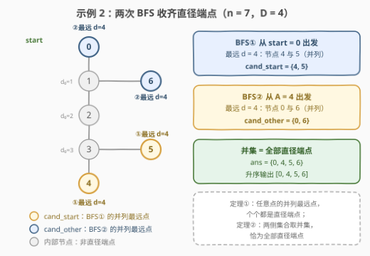
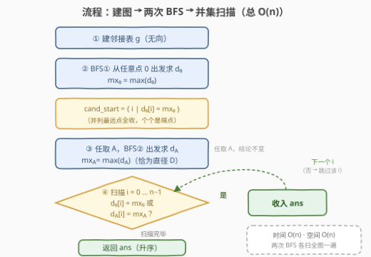

# 查找树的直径端点

- **题目名称**：查找树的直径端点
- **链接**：[3787. 查找树的直径端点](https://leetcode.cn/problems/find-diameter-endpoints-of-a-tree/)
- **难度**：中等
- **标签**：树、广度优先搜索、图

## 1. 题目概述

> ⚠️ 本题为 LeetCode 付费题，题意描述根据官方示例用例与 hints 重建，可能与官方题面有出入。

给你一棵 $n$ 个节点（编号 $0 \sim n-1$）、$n-1$ 条边的无向树。树的**直径**是任意两节点间最长简单路径的**边数**。若某条直径的路径为 $u \to \cdots \to v$，则称 $u$、$v$ 是**直径端点**。由于最远点可能并列，树的直径往往不止一条，端点也可能不止两个。

请返回**升序排列**的、**所有**能作为某条直径端点的节点列表。

**示例 1**：

```text
输入：n = 3, edges = [[0,1],[1,2]]
输出：[0,2]
解释：唯一的直径是 0-1-2，长度 2，端点为 0 与 2。
```

**示例 2**：

```text
输入：n = 7, edges = [[0,1],[1,2],[2,3],[3,4],[3,5],[1,6]]
输出：[0,4,5,6]
解释：直径长度为 4，共四条：0-1-2-3-4、0-1-2-3-5、6-1-2-3-4、6-1-2-3-5，
     全部直径的端点并集为 {0, 4, 5, 6}。
```

**示例 3**：

```text
输入：n = 2, edges = [[0,1]]
输出：[0,1]
```

**约束条件**（按官方 hints 与示例重建，量级参照同类树题）：

- $2 \le n \le 10^5$；
- `edges` 恰有 $n-1$ 条，构成连通无环的树。

> 💡 **审题关键**：① 输出不是「某一条直径的两个端点」，而是**所有**可能端点的集合——这正是本题与经典「两次 BFS 求直径」的差异所在；② 官方 hints 已剧透解法骨架：任意点 BFS 拿到并列最远点集 `cand_start`，再从其中任一点 BFS 得到对侧端点集 `cand_other`；③ 两集合要**取并集**才是完整答案，只交一次 BFS 的作业会漏掉整整一侧。

---

## 2. 解题思路

### 2.1 暴力思路：全源 BFS

最直接的做法是全源最短路：从每个节点各做一次 BFS 得到全距离矩阵，取全局最大值 $D$，再收集所有「存在 $v$ 使 $\mathrm{dist}(u,v) = D$」的节点 $u$。正确性无懈可击，但 $\Theta(n^2)$ 的时间在 $n = 10^5$ 下约 $10^{10}$ 次操作——直接出局。

另一个看似可行的省法是经典「**两次 BFS 求直径**」：从任意点 BFS 到最远点 $A$，再从 $A$ BFS 到最远点 $B$，则 $(A, B)$ 是一条直径。可惜它只交付**一条**直径的**一对**端点——本题要的是全部端点。好在把「一个最远点」升级成「并列最远点集合」，再补一次 BFS，恰好能收齐。

### 2.2 核心观察：并列最远点集合，两侧并集即答案



**定理一（换端点论证）**：从任意节点 $s$ 出发，距离最大者（**并列的所有**最远点）必是某条直径的端点。

证明骨架：设 $u$ 是 $s$ 的最远点，$(a, b)$ 是任一条直径。以 $s$ 为根，记 $c_1$ 为 $u, a$ 路径的分叉点、$c_2$ 为 $u, b$ 路径的分叉点。由 $\mathrm{dist}(s,u) \ge \mathrm{dist}(s,a)$ 得 $\mathrm{dist}(c_1,u) \ge \mathrm{dist}(c_1,a)$，同理 $\mathrm{dist}(c_2,u) \ge \mathrm{dist}(c_2,b)$。将两条不等式分别代入 $\mathrm{dist}(u,b)$、$\mathrm{dist}(u,a)$ 的分段展开（按 $u$ 挂在 $a$ 一侧 / $b$ 一侧 / 第三侧三种情况），总能推出 $\mathrm{dist}(u,a) \ge D$ 或 $\mathrm{dist}(u,b) \ge D$——把直径的一端换成 $u$ 不会变短。而 $D$ 是全图距离上界，故只能取等，即 $(u, \cdot)$ 本身就是一条直径。$\blacksquare$

> 💡 一句话：**最远点「天生」站在山顶上**——无论你站在哪里看出去，视线的尽头一定是某条直径的端点。

**定理二（对侧集合）**：令 $\text{cand\_start} = \arg\max_u \mathrm{dist}(s, u)$，任取 $A \in \text{cand\_start}$ 再做一次 BFS，则 $\text{cand\_other} = \{u : \mathrm{dist}(A, u) = D\}$ 也全是直径端点——与 $A$ 恰好相距 $D$ 的点，和 $A$ 连起来就是一条直径。

**定理三（并集完整性）**：$\text{cand\_start} \cup \text{cand\_other} = $ 全部直径端点。

直觉证明（按树的中心分情况）：

- **双中心（直径为奇数）**：中央边两侧深度相等，全部端点恰好分居两侧，且同侧端点两两距离 $< D$。起点无论在哪一侧，跨过中央边总能比在本侧绕行**多走恰好一条边**，于是 BFS① 的并列最远点集恰好是**对侧端点全集**；从对侧任一端点出发的 BFS② 又恰好拿回**本侧端点全集**。
- **单中心（直径为偶数）**：端点是各条「最长方向」的末端。若起点不在最长方向上，BFS① 已拿到全部端点；若起点在某条最长方向内部，BFS① 拿到的是**其余方向**的全部端点，而 BFS② 从这些端点出发，与其它方向的端点相距恰好 $2R = D$，把被漏掉的那个方向也一并拿回。

两种形态殊途同归：两集合求并，恰好覆盖每一个端点，一个不多、一个不少。

> ⚠️ 笔者另用「全源 BFS 暴力求端点集」对拍了 2600+ 组随机树（含路径、星形、多臂等长蜘蛛、毛毛虫等特构），零失配——定理三的严格证明可按上述分类展开，对拍是工程上的兜底。

### 2.3 算法流程图



**逻辑执行步骤**：

| 步骤 | 操作 | 说明 |
|------|------|------|
| ① 建图 | 邻接表 | 无向边双向挂 |
| ② BFS① | 从任意点 0 出发求 $d_0$ | $\mathrm{mx}_0 = \max(d_0)$；$\text{cand\_start} = \{ i \mid d_0[i] = \mathrm{mx}_0 \}$ |
| ③ BFS② | 任取 $A \in \text{cand\_start}$ 出发求 $d_A$ | $\mathrm{mx}_A = \max(d_A)$，恰为直径 $D$ |
| ④ 并集 | 收集 $d_0[i] = \mathrm{mx}_0$ 或 $d_A[i] = \mathrm{mx}_A$ 的 $i$ | 按 $i$ 升序扫描，输出天然有序 |

### 2.4 示例演算

**示例 2（n = 7）**：两次 BFS 的距离数组如下：

| 节点 | 0 | 1 | 2 | 3 | 4 | 5 | 6 |
|------|---|---|---|---|---|---|---|
| $d_0$（从 0 出发） | 0 | 1 | 2 | 3 | **4** | **4** | 1 |
| $d_4$（从 4 出发） | **4** | 3 | 2 | 1 | 0 | 2 | **4** |

- BFS① 从 0 出发：$\mathrm{mx}_0 = 4$，$\text{cand\_start} = \{4, 5\}$；
- 取 $A = 4$，BFS②：$\mathrm{mx}_A = 4 = D$，$\text{cand\_other} = \{0, 6\}$；
- 并集 $\{0, 4, 5, 6\}$，升序输出 `[0, 4, 5, 6]` ✓。

注意节点 0 的双重身份：它既是 BFS① 的**起点**，又是 BFS② 才浮出水面的**端点**——这正是「一次 BFS 不够」的最直观体现（详见 6.Q2）。

---

## 3. 参考代码

### C++

```cpp
class Solution {
public:
    vector<int> findDiameterEndpoints(int n, vector<vector<int>>& edges) {
        vector<vector<int>> g(n);
        for (auto& e : edges) {
            g[e[0]].push_back(e[1]);
            g[e[1]].push_back(e[0]);
        }
        auto bfs = [&](int start) {
            vector<int> dist(n, -1);
            queue<int> q;
            dist[start] = 0;
            q.push(start);
            while (!q.empty()) {
                int u = q.front(); q.pop();
                for (int v : g[u]) {
                    if (dist[v] == -1) {
                        dist[v] = dist[u] + 1;
                        q.push(v);
                    }
                }
            }
            return dist;
        };

        vector<int> d0 = bfs(0);
        int mx0 = *max_element(d0.begin(), d0.end());

        int a = 0;
        for (int i = 1; i < n; ++i)
            if (d0[i] > d0[a]) a = i;

        vector<int> da = bfs(a);
        int mxa = *max_element(da.begin(), da.end());

        vector<int> ans;
        for (int i = 0; i < n; ++i)
            if (d0[i] == mx0 || da[i] == mxa)
                ans.push_back(i);
        return ans;
    }
};
```

> 💡 **写法要点**：
> - 距离数组初始化为 $-1$，兼做访问标记，一次 BFS 线性扫全图；
> - `a` 取 $d_0$ 中**第一个**最大值的位置即可——定理三保证任取其一结论不变；
> - 收集答案按 $i$ 升序遍历，输出天然有序，无须再排序；
> - 邻接表 + 队列 BFS，链状树也不怕（不像递归 DFS 有爆栈风险）。

### Python

```python
class Solution:
    def findDiameterEndpoints(self, n: int, edges: List[List[int]]) -> List[int]:
        from collections import deque

        g = [[] for _ in range(n)]
        for u, v in edges:
            g[u].append(v)
            g[v].append(u)

        def bfs(start: int) -> List[int]:
            dist = [-1] * n
            dist[start] = 0
            q = deque([start])
            while q:
                u = q.popleft()
                for v in g[u]:
                    if dist[v] == -1:
                        dist[v] = dist[u] + 1
                        q.append(v)
            return dist

        d0 = bfs(0)
        mx0 = max(d0)
        a = d0.index(mx0)
        da = bfs(a)
        mxa = max(da)
        return [i for i in range(n) if d0[i] == mx0 or da[i] == mxa]
```

> 💡 **写法要点**：
> - `max(d0)` + `d0.index(mx0)` 两连招代替手写循环找 $A$；
> - 列表推导一次性完成「并集 + 升序」两件事；
> - 队列必须用 `deque.popleft()`——`list.pop(0)` 是 $O(n)$ 的，整体会退化成 $O(n^2)$。

---

## 4. 复杂度分析

| 维度 | 复杂度 | 说明 |
|------|--------|------|
| **时间** | $O(n)$ | 建图 $O(n)$ + 两次 BFS 各 $O(n)$ + 并集扫描 $O(n)$ |
| **空间** | $O(n)$ | 邻接表 $2(n-1)$ 条目 + 两个距离数组 |
| **量级判断** | $n \le 10^5$ | 两次线性扫描远低于时限；全源 BFS 的 $\Theta(n^2) = 10^{10}$ 是本题的反面教材 |

---

## 5. 扩展：端点问题的三个追问

**为什么一次 BFS 不够？** 若起点恰好本身就是端点（如示例 2 的节点 0），它不可能出现在「离自己最远」的名单里；同侧的其它端点到起点的距离也严格小于 $D$，整整一侧都会漏。第二次 BFS 就是为了「照镜子」。

**剥叶子找中心的替代解**：仿 [310. 最小高度树](https://leetcode.cn/problems/minimum-height-trees/) 逐层剥叶子找到树的中心（1 个或 2 个节点），再从中心向各方向找「最长方向的末端」，同样是全部端点。复杂度也是 $O(n)$，但要分类讨论单/双中心与并列最长方向，代码显著更长——两次 BFS 是最短路径。

**带权树的推广**：「任意点的并列最远点必为直径端点」在带正权的树上依然成立，BFS 换成 Dijkstra（或用树形 DP）即可，输出仍是两轮「最远点集」的并集；此时「并列」要按距离精确判等，浮点边权需留意精度。

---

## 6. 面试要点

**Q1：为什么从任意节点出发的最远点一定是直径端点？**

> 换端点论证：设 $u$ 是 $s$ 的最远点，$(a,b)$ 是任一条直径。由 $\mathrm{dist}(s,u) \ge \mathrm{dist}(s,a)$ 与 $\ge \mathrm{dist}(s,b)$ 出发，对 $s \to u$ 与 $a \to b$ 两条路径的分叉位置分情况讨论，可证 $\mathrm{dist}(u,a) \ge D$ 或 $\mathrm{dist}(u,b) \ge D$，即「把直径一端换成 $u$ 不会变短」；而 $D$ 是全局上界，故恰取等。这是「两次 BFS 求直径」的经典引理，本题只是把它从「一个点」升级为「并列集合」。

**Q2：为什么必须做第二次 BFS？**

> `cand_start` 只覆盖「离起点最远」的一侧。若起点本身是端点，它和它的同侧伙伴（相互距离 $< D$）全部不在 `cand_start` 里。从 `cand_start` 任一点再跑一次 BFS，拿回的恰是另一侧全集；两侧求并才完整。

**Q3：并集为什么恰好是全部端点——不会漏，也不会多？**

> 不会漏：按中心分情况——双中心时两次 BFS 分别拿两侧全集；单中心时若第一次漏了起点所在方向的端点，第二次从其它方向端点出发、距离恰为 $D$，必然拿回。不会多：两个集合的成员各自都满足「与某点相距 $D$」（定理一、二），都是真端点。工程上用全源 BFS 对拍验证即可兜底。

**Q4：直径有奇偶之分（单/双中心），对解法有影响吗？**

> 没有。算法代码全程不感知「中心」的存在，只有正确性证明需要按形态分类。「按定理写代码、按分类证定理」正是这类题的范式。

**Q5：本题与「两次 BFS 求直径长度」的差别仅是输出吗？**

> 输出的差别背后是**不变量的差别**：求长度只要 $\max$ 距离这一个数；求「全部端点」必须把「一个最远点」升级为「并列最远点集合」，且两次的集合要**取并集**而非取其一。并列处理与并集合并是本题仅有的两个坑位。

> 💡 **一句话总结**：3787 = 「任意点的并列最远点都是直径端点」+「两侧集合取并集」。两个带走的知识点：换端点论证（最远点必在山顶）；集合输出题用暴力对拍兜底。

---

## 7. 同类练习题

- [1245. 树的直径](https://leetcode.cn/problems/tree-diameter/)（[题解](../1201-1300/1245_树的直径.md)）：只要直径长度的双 BFS 模板题，本题的「减配版」
- [310. 最小高度树](https://leetcode.cn/problems/minimum-height-trees/)（[题解](../0301-0400/310_最小高度树.md)）：剥叶子找中心，端点问题的「对偶」视角
- [2246. 相邻字符不同的最长路径](https://leetcode.cn/problems/longest-path-with-different-adjacent-characters/)（[题解](../2201-2300/2246_相邻字符不同的最长路径.md)）：树形 DP 维护最长链，换 DFS 视角求直径
- [1522. N 叉树的直径](https://leetcode.cn/problems/diameter-of-n-ary-tree/)：同款双 BFS/DFS 思想换成 N 叉树输入
- [1617. 统计子树中城市之间的最大距离](https://leetcode.cn/problems/count-subtrees-with-max-distance-between-cities/)：枚举子集内的树直径，bitmask 版练手
