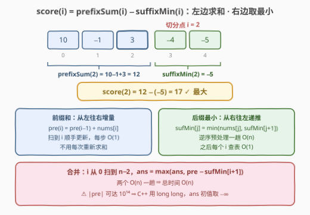

# LeetCode 分割的最大得分 题解

## 1. 题目概述

- **标题 / 题号**：分割的最大得分（#3788，medium）
- **链接**：https://leetcode.cn/problems/maximum-score-of-a-split/
- **难度**：中等
- **标签**：数组、前缀和

**题意**：给定长度为 $n$ 的整数数组 $nums$，选出下标 $i$（$0 \le i < n-1$）将数组**分割**为左右两部分。记

- $prefixSum(i) = nums[0] + nums[1] + \dots + nums[i]$（左半段的和）；
- $suffixMin(i) = \min(nums[i+1], \dots, nums[n-1])$（右半段的最小值）。

分割得分定义为 $\text{score}(i) = prefixSum(i) - suffixMin(i)$。返回所有合法分割下标中的**最大**得分。

**示例 1**：

```text
输入：nums = [10,-1,3,-4,-5]
输出：17
解释：最优分割下标 i = 2，score(2) = (10 + (−1) + 3) − (−5) = 17。
```

**示例 2**：

```text
输入：nums = [-7,-5,3]
输出：-2
解释：最优分割下标 i = 0，score(0) = (−7) − (−5) = −2。
```

**示例 3**：

```text
输入：nums = [1,1]
输出：0
解释：唯一合法分割下标 i = 0，score(0) = 1 − 1 = 0。
```

**约束**：

- $2 \le n \le 10^5$
- $-10^9 \le nums[i] \le 10^9$

> 💡 **审题关键**：① $i$ 的取值范围是 $[0, n-2]$——右半段**至少留一个元素**，$suffixMin$ 永远非空；② 得分可正可负（示例 2 全负数组），`ans` 初值必须取 $-\infty$ 而不是 $0$；③ $|prefixSum|$ 上界 $10^5 \times 10^9 = 10^{14}$，C++ 必须 `long long`。

## 2. 解题思路

### 2.1 暴力思路：枚举分割点，两侧现算

枚举每个 $i \in [0, n-2]$，对每个 $i$ 重新累加左半段求和、重新扫右半段取最小：

```text
for i in 0 .. n-2:
    score = sum(nums[0..i]) − min(nums[i+1..n-1])   # 两侧各 O(n)
```

总时间 $O(n^2)$，$n = 10^5$ 时约 $10^{10}$ 次运算，必然超时。

**瓶颈**：$prefixSum$ 与 $suffixMin$ 被反复重算。但前者是「**从左到右**的累积量」——右移一格只多加一个元素；后者是「**从右到左**的累积量」——左移一格只多看一个元素。两者各自只依赖一个方向的扫描顺序，天然可以**增量维护**。

### 2.2 核心观察：两个方向各扫一遍，每步 O(1)



**观察一（前缀和可增量）**：

$$pre(i) = pre(i-1) + nums[i]$$

$i$ 从左到右扫一遍，`pre` 顺手累加，每个分割点 $O(1)$ 得到 $prefixSum(i)$，无需重新求和。

**观察二（后缀最小可递推）**：

$$sufMin[j] = \min(nums[j],\ sufMin[j+1])$$

$j$ 从 $n-1$ 往左预处理一趟。之后对任意分割点 $i$，右半段 $[i+1, n-1]$ 的最小值就是查表 $sufMin[i+1]$，$O(1)$。

**合成**：再从左到右扫一遍 $i \in [0, n-2]$，每步计算 $score = pre - sufMin[i+1]$ 取最大值即可——**两个线性扫描拼成总时间 $O(n)$**。

> 💡 「**前缀和 + 后缀最值**」是分段统计题的通用骨架：凡是被分割点一分为二、两侧各自做聚合（和 / 最值 / 计数）的题，都先想「两边各扫一遍、各自增量维护」。对照 [238. 除自身以外数组的乘积](https://leetcode.cn/problems/product-of-array-except-self/)（前缀积 × 后缀积）、[724. 寻找数组的中心下标](https://leetcode.cn/problems/find-pivot-index/)（前缀和 vs 总和减前缀和）。

### 2.3 算法流程图

![算法流程：逆序预处理 sufMin，再正序扫描 i∈[0,n−2] 增量更新 pre 并取 max](../images/p3788_split_score_flow.svg)

**文字版步骤**：

| 步骤 | 操作 | 说明 |
|------|------|------|
| ① 预处理 | $j$ 从 $n-1$ 到 $0$：$sufMin[j] \leftarrow \min(nums[j], sufMin[j+1])$ | 哨兵 $sufMin[n] = +\infty$，逆序一趟 |
| ② 初始化 | $pre \leftarrow 0$，$ans \leftarrow -\infty$ | 全负数组得分为负，勿取 0 |
| ③ 扫描 | $i$ 从 $0$ 到 $n-2$ | $i \le n-2$ 保证右半段非空 |
| ④ 增量 | $pre \leftarrow pre + nums[i]$ | $pre$ 即 $prefixSum(i)$ |
| ⑤ 打分 | $ans \leftarrow \max(ans,\ pre - sufMin[i+1])$ | 查表 $O(1)$ |
| ⑥ 返回 | 扫描结束输出 $ans$ | — |

### 2.4 示例演算

以示例 1（$nums = [10, -1, 3, -4, -5]$）走一遍：

| $i$ | $pre = prefixSum(i)$ | $sufMin[i+1]$ | $score(i)$ | 说明 |
|-----|---------------------|---------------|------------|------|
| 0 | $10$ | $\min(-1,3,-4,-5) = -5$ | $10-(-5) = 15$ | |
| 1 | $9$ | $\min(3,-4,-5) = -5$ | $9-(-5) = 14$ | |
| 2 | $12$ | $\min(-4,-5) = -5$ | $12-(-5) = \mathbf{17}$ | ★ 最优 |
| 3 | $8$ | $-5$ | $8-(-5) = 13$ | |

得 $ans = 17$，与示例一致。注意本例中 $-5$ 一直是「垫底」的后缀最小值——**后缀最小在右端被更小的元素刷新后，向左传播不变**，这正是观察二递推的直观体现。

## 3. 参考代码

### C++

```cpp
class Solution {
  public:
    long long maximumScore(vector<int>& nums) {
        int n = nums.size();
        vector<long long> sufMin(n + 1, LLONG_MAX);      // 哨兵 +∞
        for (int j = n - 1; j >= 0; --j)                 // 逆序预处理后缀最小
            sufMin[j] = min((long long)nums[j], sufMin[j + 1]);

        long long ans = LLONG_MIN, pre = 0;              // 全负数组 ⇒ 初值 −∞
        for (int i = 0; i + 1 < n; ++i) {                // i ∈ [0, n−2]
            pre += nums[i];                              // 增量前缀和
            ans = max(ans, pre - sufMin[i + 1]);
        }
        return ans;
    }
};
```

### Python

```python
class Solution:
    def maximumScore(self, nums: List[int]) -> int:
        n = len(nums)
        suf_min = [inf] * (n + 1)                 # 哨兵 +∞
        for j in range(n - 1, -1, -1):            # 逆序预处理后缀最小
            suf_min[j] = min(suf_min[j + 1], nums[j])

        ans, pre = -inf, 0                        # 全负数组 ⇒ 初值 −∞
        for i in range(n - 1):                    # i ∈ [0, n−2]
            pre += nums[i]                        # 增量前缀和
            ans = max(ans, pre - suf_min[i + 1])
        return ans
```

> 💡 **写法要点**：
> - `pre`、`ans` 必须 64 位：$|pre|$ 可达 $10^{14}$；Python 原生 int 无此问题。
> - `ans` 初值取 $-\infty$（`LLONG_MIN` / `-inf`），取 `0` 会挂掉示例 2 这类全负数组。
> - 循环条件写成 `i + 1 < n`（C++）或 `range(n - 1)`（Python），天然保证右半段非空。

## 4. 复杂度分析

| 维度 | 复杂度 | 说明 |
|------|--------|------|
| **时间复杂度** | $O(n)$ | 逆序预处理一趟 + 正序扫描一趟，每步 $O(1)$ |
| **空间复杂度** | $O(n)$ | `sufMin` 数组；可优化到 $O(1)$（见第 5 节） |

## 5. 扩展：O(1) 空间——用 total − sufSum 反推前缀和

`sufMin` 数组可以不存：**从右往左单趟扫描**，同时维护右侧元素和 `sufSum` 与右侧最小值 `sufMin`，则分割点 $i$（即当前列的左邻）满足：

$$prefixSum(i) = total - sufSum,\qquad suffixMin(i) = sufMin$$

```cpp
class Solution {
  public:
    long long maximumScore(vector<int>& nums) {
        long long total = accumulate(nums.begin(), nums.end(), 0LL);
        long long sufSum = 0, sufMin = LLONG_MAX, ans = LLONG_MIN;
        for (int i = (int)nums.size() - 1; i >= 1; --i) {   // 右边界从 n−1 收到 1
            sufSum += nums[i];
            sufMin = min(sufMin, (long long)nums[i]);
            ans = max(ans, (total - sufSum) - sufMin);      // 分割点 i−1 的得分
        }
        return ans;
    }
};
```

```python
class Solution:
    def maximumScore(self, nums: List[int]) -> int:
        total = sum(nums)
        suf_sum, suf_min, ans = 0, inf, -inf
        for i in range(len(nums) - 1, 0, -1):        # 右边界从 n−1 收到 1
            suf_sum += nums[i]
            suf_min = min(suf_min, nums[i])
            ans = max(ans, (total - suf_sum) - suf_min)  # 分割点 i−1 的得分
        return ans
```

**其他变体**（面试常追问）：

- **求最小得分**：把 `max` 换成 `min` 即可，骨架不变；
- **suffixMax / suffixSum 版本**：右半段聚合量换成最大值或和，只需改递推一行——「两侧各扫一遍」的模板完全复用。

## 6. 面试要点

**Q1：为什么暴力会超时，优化的关键性质是什么？**

> 暴力对每个分割点重算两侧聚合量，$O(n^2)$。关键性质是两个聚合量**方向相反、各自可增量**：前缀和随 $i$ 右移只多加一个元素，后缀最小随右边界左移只多看一个元素。于是两个 $O(n)$ 扫描替代 $n$ 次 $O(n)$ 重算。

**Q2：`ans` 初值为什么不能取 0？**

> 得分可能恒为负（示例 2 的 $[-7,-5,3]$ 最优值是 $-2$）。取 0 会把「全负」错误地报告成 0。凡是「最大值可能为负」的题，初值一律 $-\infty$；反之求最小值且可能全正时对称取 $+\infty$。

**Q3：什么时候必须警惕整数溢出？**

> 本题 $n \le 10^5$、$|nums[i]| \le 10^9$，前缀和上界 $10^{14}$、得分再减去 $-10^9$ 仍是 $10^{14}$ 量级，超出 32 位 int（约 $2.1 \times 10^9$）四个数量级。C++ 里 `pre`、`ans`、`sufMin`（比较时强转）都要 `long long`；函数签名返回 `long long` 已经提示了这一点。

**Q4：能不能做到 $O(1)$ 额外空间？怎么做？**

> 能。先求总和 `total`，再从右往左单趟维护 `sufSum` 与 `sufMin`，用 $prefixSum(i) = total - sufSum$ 反推左侧和（见第 5 节）——这正是 [724. 寻找数组的中心下标](https://leetcode.cn/problems/find-pivot-index/) 的「总和减前缀」技巧的镜像。

**Q5：这道题的套路能迁移到哪类问题？**

> 「分割点两侧各自聚合」的题都吃这一套：和×和（724 中心下标、1013 三等分）、积×积（238 除自身以外数组的乘积）、和×最值（本题）、计数×计数（560 子数组和）。先问自己：**两侧聚合量分别依赖哪个方向的扫描顺序？能否各自 O(1) 递推？**

## 同类练习题

| # | 题目 | 与本题的关联 |
|---|------|-------------|
| 724 | [寻找数组的中心下标](https://leetcode.cn/problems/find-pivot-index/)（[题解](../0701-0800/724_寻找数组的中心下标.md)） | 前缀和 + 总和反推后缀和——本题 O(1) 空间版的技巧原型 |
| 238 | [除自身以外数组的乘积](https://leetcode.cn/problems/product-of-array-except-self/)（[题解](../0201-0300/238_除自身以外数组的乘积.md)） | 前缀积 + 后缀积——同款「两侧各扫一遍」骨架在乘法上的翻版 |
| 560 | [和为 K 的子数组](https://leetcode.cn/problems/subarray-sum-equals-k/)（[题解](../0501-0600/560_和为K的子数组.md)） | 前缀和 + 哈希——前缀和家族的计数分支 |
| 1013 | [将数组分成和相等的三个部分](https://leetcode.cn/problems/partition-array-into-three-parts-with-equal-sum/) | 选分割点 + 前缀和判等——同样是「分割点驱动、聚合量预处理」 |
