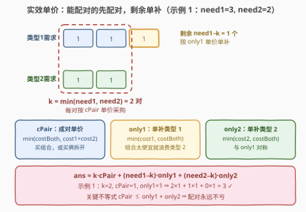
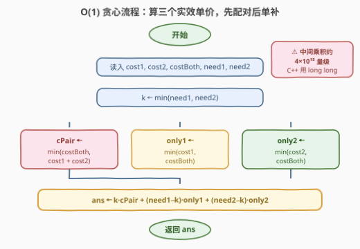

# 采购的最小花费

- **题目名称**：采购的最小花费
- **链接**：[3789. 采购的最小花费](https://leetcode.cn/problems/minimum-cost-to-acquire-required-items/)
- **难度**：中等
- **标签**：贪心、数学

## 1. 题目概述

**题意**：给定五个整数 $cost1$, $cost2$, $costBoth$, $need1$, $need2$。有三种物品可以购买：

- **类型 1** 物品花费 $cost1$，满足类型 1 的需求 1 个单位；
- **类型 2** 物品花费 $cost2$，满足类型 2 的需求 1 个单位；
- **类型 3**（组合）物品花费 $costBoth$，**同时**满足类型 1 和类型 2 的需求各 1 个单位。

要求购买足够的物品，使类型 1 的总满足量**至少**为 $need1$、类型 2 的总满足量**至少**为 $need2$，返回**最小**总花费。

**示例 1**：

```text
输入：cost1 = 3, cost2 = 2, costBoth = 1, need1 = 3, need2 = 2
输出：3
解释：买 3 个组合物品花费 3×1 = 3，类型 1 满足 3 ≥ 3，类型 2 满足 3 ≥ 2。
```

**示例 2**：

```text
输入：cost1 = 5, cost2 = 4, costBoth = 15, need1 = 2, need2 = 3
输出：22
解释：组合太贵，分开买：2×5 + 3×4 = 22。
```

**示例 3**：

```text
输入：cost1 = 5, cost2 = 4, costBoth = 15, need1 = 0, need2 = 0
输出：0
解释：无需求，不买。
```

**约束条件**：

- $1 \le cost1, cost2, costBoth \le 10^6$
- $0 \le need1, need2 \le 10^9$

> 💡 **审题关键**：① 「至少为 need」意味着允许**多买**——组合物品即使另一半需求已经满足，也可以继续买来单侧"蹭便宜"（浪费另一半）；② 答案上界约 $2 \times 10^9 \times 10^6 = 2 \times 10^{15}$，C++ 必须 `long long`；③ $need$ 高达 $10^9$，任何逐单位的模拟/DP 都不可行，必须推出 $O(1)$ 公式。

---

## 2. 解题思路

### 2.1 暴力思路：枚举组合物品的数量

设买 $x$ 个类型 1、$y$ 个类型 2、$z$ 个组合物品。约束为 $x + z \ge need1$、$y + z \ge need2$，最小化 $x \cdot cost1 + y \cdot cost2 + z \cdot costBoth$。

由于三种单价都是**正数**，最优解里单类物品不会多买，即 $x = \max(0,\ need1 - z)$、$y = \max(0,\ need2 - z)$。于是只需枚举组合数量 $z \in [0, \max(need1, need2)]$：

```text
for z in 0 .. max(need1, need2):
    cost = z*costBoth + max(0, need1−z)*cost1 + max(0, need2−z)*cost2
    ans = min(ans, cost)
```

总时间 $O(\max(need1, need2))$，$need$ 达 $10^9$ 时循环 $10^9$ 次（Python 必超时，C++ 也游走在时限边缘），不可接受。

**瓶颈**：答案由一个**可以解析表达**的函数决定——这类「枚举一个整数变量求最值」的问题，若目标函数关于该变量有良好的结构（本题是**分段线性**），就能直接算出最优位置，把 $O(10^9)$ 压成 $O(1)$。

### 2.2 核心观察：三种「实效单价」，先配对后单补



把三类物品的**采购动作**按"满足什么"重新归类，得到三种**实效单价**：

| 实效单价 | 定义 | 含义 |
|---------|------|------|
| $cPair = \min(costBoth,\ cost1 + cost2)$ | 同时满足一对 (1, 1) 需求 | 直接买组合，或者买一个类型 1 + 一个类型 2 拆开凑一对 |
| $only1 = \min(cost1,\ costBoth)$ | 单独满足 1 个类型 1 需求 | 买类型 1，或者组合太便宜时买组合**浪费**类型 2 那一半 |
| $only2 = \min(cost2,\ costBoth)$ | 单独满足 1 个类型 2 需求 | 与 $only1$ 对称 |

**贪心策略**：先成对满足 $k = \min(need1, need2)$ 对需求（每对花 $cPair$），再单补剩余的 $need1 - k$ 个类型 1（每个花 $only1$）和 $need2 - k$ 个类型 2（每个花 $only2$）：

$$ans = k \cdot cPair + (need1 - k) \cdot only1 + (need2 - k) \cdot only2$$

**为什么先配对不亏？** 关键不等式：

$$cPair \le only1 + only2$$

**交换论证**：若某个方案里同时存在"一个单独补的类型 1"和"一个单独补的类型 2"，把它们合并成一对配对采购，花费变化为 $cPair - only1 - only2 \le 0$——不劣。因此总存在一个最优解，把能配对的需求**全部配对**（共 $k = \min(need1, need2)$ 对），剩下的才是单侧需求。

> 💡 严谨性补充：设组合数量为 $z$，总花费 $g(z) = z \cdot costBoth + \max(0, need1 - z) \cdot cost1 + \max(0, need2 - z) \cdot cost2$ 是关于 $z$ 的**分段线性函数**（断点在 $\min(need1, need2)$ 与 $\max(need1, need2)$），最小值只可能在 $z \in \{0,\ k,\ \max(need1, need2)\}$ 三点取得。逐一代入可验证：公式值 $\le \min\{g(0), g(k), g(\max)\}$（三个不等式都来自"实效单价 ≤ 原单价"），且公式值可以通过实际采购方案达到，故公式即最优解。
>
> ⚠️ 注意公式**不是**简单地"前 $k$ 对全买组合物品"：当 $costBoth > cost1 + cost2$ 时 $cPair$ 取的是拆开买；当 $costBoth < cost1$ 时剩余类型 1 用组合物品蹭便宜（浪费类型 2）——这些退化情况都被"实效单价取 $\min$"统一覆盖。

### 2.3 算法流程图



**文字版步骤**：

| 步骤 | 操作 | 说明 |
|------|------|------|
| ① 配对数 | $k \leftarrow \min(need1, need2)$ | 能配对的需求对数 |
| ② 成对单价 | $cPair \leftarrow \min(costBoth,\ cost1 + cost2)$ | 组合 vs 拆开买，取便宜 |
| ③ 单补单价 | $only1 \leftarrow \min(cost1,\ costBoth)$，$only2 \leftarrow \min(cost2,\ costBoth)$ | 组合太便宜时允许浪费另一半 |
| ④ 汇总 | $ans \leftarrow k \cdot cPair + (need1-k) \cdot only1 + (need2-k) \cdot only2$ | 全程 $O(1)$ |
| ⑤ 返回 | 输出 $ans$ | C++ 用 `long long` |

### 2.4 示例演算

| 示例 | $k$ | $cPair$ | $only1$ | $only2$ | 计算 | 答案 |
|------|-----|---------|---------|---------|------|------|
| 1：$3,2,1,3,2$ | $2$ | $\min(1,5)=1$ | $\min(3,1)=1$ | $\min(2,1)=1$ | $2{\times}1 + 1{\times}1 + 0{\times}1$ | $3$ ✓ |
| 2：$5,4,15,2,3$ | $2$ | $\min(15,9)=9$ | $\min(5,15)=5$ | $\min(4,15)=4$ | $2{\times}9 + 0{\times}5 + 1{\times}4$ | $22$ ✓ |
| 3：$5,4,15,0,0$ | $0$ | $9$ | $5$ | $4$ | $0 + 0 + 0$ | $0$ ✓ |

再手造一个"浪费另一半更优"的例子：$cost1 = 100,\ cost2 = 1,\ costBoth = 2,\ need1 = 3,\ need2 = 5$。此时 $k = 3$，$cPair = \min(2, 101) = 2$，$only2 = \min(1, 2) = 1$，答案 $= 3 \times 2 + 0 + 2 \times 1 = 8$（买 3 个组合 + 2 个类型 2）。注意 $only1 = \min(100, 2) = 2 < cost1$——若类型 1 有剩余需求，用组合物品浪费类型 2 那一半（花 2）远比买类型 1（花 100）划算，这正是实效单价取 $\min$ 的意义。

---

## 3. 参考代码

### C++

```cpp
class Solution {
  public:
    long long minimumCost(int cost1, int cost2, int costBoth, int need1, int need2) {
        long long k = min(need1, need2);                              // 配对数
        long long cPair = min((long long)costBoth, (long long)cost1 + cost2);  // 成对单价
        long long only1 = min(cost1, costBoth);                       // 单补类型 1
        long long only2 = min(cost2, costBoth);                       // 单补类型 2
        return k * cPair + (need1 - k) * only1 + (need2 - k) * only2;
    }
};
```

### Python

```python
class Solution:
    def minimumCost(self, cost1: int, cost2: int, costBoth: int, need1: int, need2: int) -> int:
        k = min(need1, need2)                          # 配对数
        c_pair = min(costBoth, cost1 + cost2)          # 成对单价
        only1 = min(cost1, costBoth)                   # 单补类型 1
        only2 = min(cost2, costBoth)                   # 单补类型 2
        return k * c_pair + (need1 - k) * only1 + (need2 - k) * only2
```

> 💡 **写法要点**：
> - C++ 中间乘积 $k \cdot cPair$ 可达 $10^9 \times 2 \times 10^6 = 2 \times 10^{15}$，全部用 `long long` 承接；`cost1 + cost2` 相加时先强转再相加，避免依赖隐式提升。
> - 变量名避免用 `pair`（与 `std::pair` 重名，易踩坑），此处用 `cPair`。
> - Python 原生 int 无溢出问题，直接照公式写即可。

---

## 4. 复杂度分析

| 维度 | 复杂度 | 说明 |
|------|--------|------|
| **时间复杂度** | $O(1)$ | 三次 `min` + 一条公式，无循环 |
| **空间复杂度** | $O(1)$ | 仅常数个变量 |

---

## 5. 扩展：为什么不能动态规划？

一个自然的想法是把本题看成**二维完全背包**：容量为 $(need1, need2)$，三种物品的"体积"分别为 $(1,0)$、$(0,1)$、$(1,1)$，求装满容量的最小花费。设 $dp[i][j]$ 为恰好满足 $(i, j)$ 的最小花费，转移：

$$dp[i][j] = \min\big(dp[i-1][j] + only1',\ dp[i][j-1] + only2',\ dp[i-1][j-1] + costBoth\big)$$

骨架正确，但状态数 $need1 \times need2$ 高达 $10^{18}$，彻底不可行。本题能降到 $O(1)$，靠的是**代价结构极其简单**（每单位需求只贡献一个常数单价、组合物品可拆解归并），目标函数才能被压缩成一条关于 $z$ 的分段线性函数。这给出一个通用的判断直觉：**背包维度的数值域决定 DP 是否可行**——容量是"量级"（$10^2 \sim 10^3$）时用 DP，容量是"天文数字"（$10^9$）时必须寻找数学结构（贪心、公式、二分答案）。

---

## 6. 面试要点

**Q1：为什么配对数直接取 $k = \min(need1, need2)$，不需要枚举？**

> 由交换论证：只要方案里还同时存在未配对的单补类型 1 和单补类型 2，把它们合并成一对，花费变化 $cPair - only1 - only2 \le 0$（关键不等式 $cPair \le only1 + only2$ 恒成立）。反推到最优解，能配对的必然全部配对。也可以从分段线性角度理解：总花费关于组合数量 $z$ 分段线性，最值只在断点 $\{0, k, \max(need1, need2)\}$，而公式值不劣于三个断点处的任何取值。

**Q2：$only1$ 为什么要和 $costBoth$ 取 $\min$？"浪费"另一半居然可能更优？**

> 需求是"至少满足"，没有"不许超买"的限制。若 $costBoth < cost1$，剩余的类型 1 需求买组合物品（类型 2 那一半白白浪费）比买类型 1 便宜。例如 $cost1 = 100,\ costBoth = 2$ 时，单补类型 1 的实效单价是 2 而非 100。漏掉这一点，示例 1 这类 $costBoth$ 极小的用例就会算错。

**Q3：什么时候必须警惕整数溢出？**

> $need$ 上界 $10^9$、单价上界 $10^6$（$cost1 + cost2$ 达 $2 \times 10^6$），单项乘积约 $2 \times 10^{15}$，三项求和不超过 $4.1 \times 10^{15}$，超出 32 位 int（约 $2.1 \times 10^9$）六个数量级，但小于 `long long` 上界（约 $9.2 \times 10^{18}$）。C++ 全程 `long long` 即可；题目签名返回 `long long` 本身就是提示。

**Q4：$costBoth > cost1 + cost2$（组合比拆开贵）时公式还成立吗？**

> 成立。此时 $cPair = cost1 + cost2$，公式展开为 $k(cost1 + cost2) + (need1-k) \cdot only1 + (need2-k) \cdot only2$，与 $k$ 的取值无关（$only1 = cost1$、$only2 = cost2$，因为 $costBoth > cost1 + cost2 > cost1, cost2$），恒等于 $need1 \cdot cost1 + need2 \cdot cost2$——即"全拆开单买"，与示例 2 一致。分段线性视角下这对应斜率为 0 的情形，任何 $k$ 都是最优。

**Q5：这道题的套路能迁移到哪类问题？**

> "**代价分类 + 局部取 min/max + 交换论证**"是一整类贪心题的模板：把采购动作按效果归类、每类算出实效单价、再证明某种归并方向不亏（本题是"能配对就配对"）。对照 [1217. 玩筹码](https://leetcode.cn/problems/minimum-cost-to-move-chips-to-the-same-position/)（代价归类后取 min）、[1689. 十-二进制数的最少数目](https://leetcode.cn/problems/partitioning-into-minimum-number-of-deci-binary-numbers/)（逐位独立取 max）。

---

## 7. 同类练习题

- [1217. 玩筹码](https://leetcode.cn/problems/minimum-cost-to-move-chips-to-the-same-position/)：移动代价按奇偶归类（0 或 1）后取 min——同款「代价分类取实效单价」贪心
- [1689. 十-二进制数的最少数目](https://leetcode.cn/problems/partitioning-into-minimum-number-of-deci-binary-numbers/)：逐位独立取 max 即为答案——「按效果拆解、各自取最优」的极简版
- [2144. 打折购买糖果的最小开销](https://leetcode.cn/problems/minimum-cost-of-buying-candies-with-discount/)：排序后买二送一——同为「组合采购优惠」的贪心决策
- [1710. 卡车上的最大单元数](https://leetcode.cn/problems/maximum-units-on-a-truck/)：按性价比排序贪心装箱——采购优化中「单价优先」的经典形态
