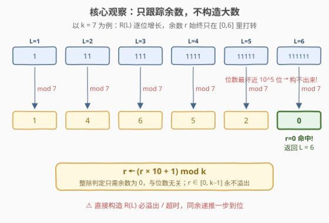
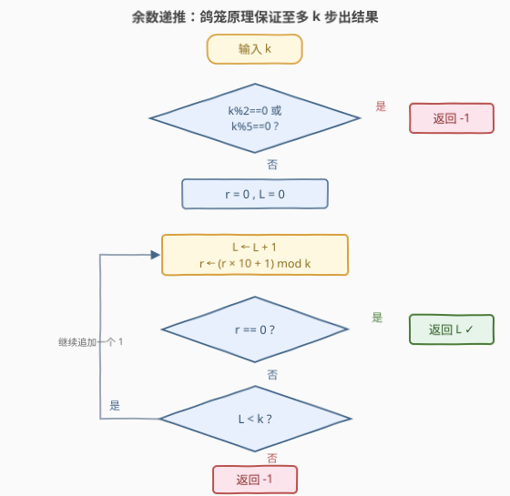

# 最小全 1 倍数

- **题目名称**：最小全 1 倍数
- **链接**：[3790. 最小全 1 倍数](https://leetcode.cn/problems/smallest-all-ones-multiple/)
- **难度**：中等
- **标签**：哈希表、数学

## 1. 题目概述

给你一个正整数 $k$。找出满足以下条件的**最小**整数 $n$：$n$ 能被 $k$ 整除，且其十进制表示中**只包含数字 1**（例如：$1$、$11$、$111$、……）。

返回一个整数，表示 $n$ 的十进制表示的**位数**。如果不存在这样的 $n$，则返回 $-1$。

**示例 1**：

```text
输入：k = 3
输出：3
解释：n = 111，因为 111 能被 3 整除，但 1 和 11 不能。n = 111 的长度为 3。
```

**示例 2**：

```text
输入：k = 7
输出：6
解释：n = 111111。n = 111111 的长度为 6。
```

**示例 3**：

```text
输入：k = 2
输出：-1
解释：不存在满足条件且为 2 的倍数的有效 n。
```

**约束条件**：

- $2 \le k \le 10^5$

> 💡 **审题关键**：① 全 1 数（**repunit**）记作 $R(L)$，即长度为 $L$ 的全 1 数，$R(1)=1$、$R(2)=11$、$R(3)=111$……本题等价于求最小的 $L$ 使 $R(L) \equiv 0 \pmod{k}$；② $k \le 10^5$ 时答案可达近 $10^5$ 位——**天文数字本身不可构造**，这是本题的第一道门槛；③ 官方 hints 给出了完整的recipe：逐位构造、只跟踪模 $k$ 余数、余数重复即无解——正好对应「哈希表 + 数学」两个标签。

---

## 2. 解题思路

### 2.1 暴力思路：构造全 1 数再判整除

最直观的做法是从小到大枚举全 1 数，逐个检查能否被 $k$ 整除：

```python
n = 0
for L in range(1, ???):
    n = n * 10 + 1        # R(L) = R(L-1) * 10 + 1
    if n % k == 0:
        return L
```

两条路都堵死了：

- **溢出**：C++/Java 的 64 位整数最多放 19 位，而 $k$ 接近 $10^5$ 时答案可达数万位；即便 Python 大整数能存，每轮对 $L$ 位大数取模是 $O(L)$，总体 $O(k^2) = 10^{10}$ 位操作，严重超时；
- **无解检测**：$k = 2$ 时 $R(L)$ 恒为奇数，循环永远不终止——还缺一个「何时该放弃」的判据。

> 💡 转机在于：**判断整除只需余数，不需原数**。$R(L) \bmod k$ 完全由 $R(L-1) \bmod k$ 决定，与 $R(L)$ 有多少位无关。

### 2.2 核心观察：余数递推——把天文数字压成一个余数



三条性质支撑起整个解法：

1. **余数递推**：由 $R(L) = R(L-1) \times 10 + 1$ 得

$$R(L) \bmod k = \big((R(L-1) \bmod k) \times 10 + 1\big) \bmod k$$

   每步只维护 $r \gets (r \times 10 + 1) \bmod k$，$r$ 永远落在 $[0, k-1]$，**永不溢出**；

2. **命中条件**：某步 $r = 0$ 时，当前步数 $L$ 即答案；

3. **无解判定**：$R(L)$ 末位恒为 $1$，故 $R(L)$ 恒为**奇数**且 $\bmod\ 5 \equiv 1$。若 $k$ 含因子 $2$ 或 $5$（即 $\gcd(k,10)>1$），则 $k \nmid R(L)$ 对一切 $L$ 成立，返回 $-1$。

> 💡 **关键转化**：把「构造数万位大数再取模」归约为「维护一个 $[0, k-1]$ 内的余数状态机」。这正是模运算的经典威力——**同余类才是整除问题的本体，数值大小只是表象**。

### 2.3 算法流程图



| 步骤 | 操作 | 说明 |
|------|------|------|
| ① 判无解 | $k \% 2 == 0$ 或 $k \% 5 == 0$？ | 是 → 返回 $-1$（$O(1)$ 提前退出） |
| ② 初始化 | $r = 0$，$L = 0$ | $r$ 表示当前已构造部分的余数 |
| ③ 追加一位 | $L \gets L+1$，$r \gets (r \times 10 + 1) \bmod k$ | 相当于在右侧新写一个 $1$ |
| ④ 命中检查 | $r == 0$？ | 是 → 返回 $L$ |
| ⑤ 上界检查 | $L < k$？ | 是 → 回到 ③；否 → 返回 $-1$ |

> ⚠️ **终止保证**：循环上界设 $k$ 不是拍脑袋——由**鸽笼原理**，$\gcd(k,10)=1$ 时至多 $k$ 步必命中 $r=0$（证明见第 5 节）；若不预判 $\gcd$，也可改用**哈希集合记录出现过的余数**，余数重复即说明进入循环、永远到不了 $0$，返回 $-1$——这正是题目标签里 Hash Table 的含义。

### 2.4 示例演算

以 $k = 7$（示例 2）为例，逐步递推：

| $L$ | $R(L)$ | $r = R(L) \bmod 7$ | 递推计算 |
|-----|--------|--------------------|----------|
| 1 | 1 | $1$ | $r = (0 \times 10 + 1) \bmod 7 = 1$ |
| 2 | 11 | $4$ | $r = (1 \times 10 + 1) \bmod 7 = 4$ |
| 3 | 111 | $6$ | $r = (4 \times 10 + 1) \bmod 7 = 6$ |
| 4 | 1111 | $5$ | $r = (6 \times 10 + 1) \bmod 7 = 5$ |
| 5 | 11111 | $2$ | $r = (5 \times 10 + 1) \bmod 7 = 2$ |
| 6 | 111111 | $0$ ✓ | $r = (2 \times 10 + 1) \bmod 7 = 0$ → 返回 $6$ |

全程最大中间值仅 $61$（递推中的 $6 \times 10 + 1$），无需构造 $111111$，更不用说数万位的极端情形。$r$ 的取值 $\{1,4,6,5,2,0\}$ 各不相同，恰好在第 6 步命中——也印证了鸽笼上界的宽松（最坏 $k$ 步）。

**无解情形**：$k=2$ 时 $2 \mid k$，直接返回 $-1$；即便不预判，递推出的余数序列 $1,1,1,\ldots$（$(1\times10+1)\bmod 2 = 1$）永远重复 $1$、到不了 $0$，哈希判圈版同样会正确返回 $-1$。

---

## 3. 参考代码

### C++

```cpp
class Solution {
public:
    int minAllOneMultiple(int k) {
        if (k % 2 == 0 || k % 5 == 0) return -1;
        int r = 0;
        for (int len = 1; len <= k; ++len) {
            r = (r * 10 + 1) % k;
            if (r == 0) return len;
        }
        return -1;
    }
};
```

> ⚠️ **溢出分析**：$k \le 10^5$，$r \in [0, k-1]$，递推中间值 $r \times 10 + 1 \le 10^6 - 9$，远小于 `INT_MAX`（$\approx 2.1 \times 10^9$），`int` 完全安全，无需 `long long`。

### Python

```python
class Solution:
    def minAllOneMultiple(self, k: int) -> int:
        if k % 2 == 0 or k % 5 == 0:
            return -1
        r = 0
        for length in range(1, k + 1):
            r = (r * 10 + 1) % k
            if r == 0:
                return length
        return -1
```

**哈希判圈版**（对应 Hash Table 标签，不做 $\gcd$ 预判，靠余数重复检测无解）：

```python
class Solution:
    def minAllOneMultiple(self, k: int) -> int:
        seen = set()
        r = 0
        length = 0
        while True:
            r = (r * 10 + 1) % k
            length += 1
            if r == 0:
                return length
            if r in seen:      # 余数重复 → 进入循环，永远到不了 0
                return -1
            seen.add(r)
```

> 💡 两版**正确性等价**：鸽笼原理保证余数至多 $k$ 种，定长循环版「跑满 $k$ 步没命中就认输」与哈希版「见到重复余数就认输」判定的是同一件事。定长版 $O(1)$ 空间且对 $2\mid k$、$5\mid k$ 提前 $O(1)$ 退出；哈希版不需要数论预判，思路更「流程化」，是 hints 推荐的路线。

---

## 4. 复杂度分析

| 维度 | 复杂度 | 说明 |
|------|--------|------|
| **时间** | $O(k)$ | 循环至多 $k$ 次，每步一次乘加取模 $O(1)$；预判命中时 $O(1)$ |
| **空间** | $O(1)$ | 定长循环版仅维护 $r$ 与 $L$ 两个变量；哈希判圈版需 $O(k)$ 记录余数 |
| **量级判断** | $k \le 10^5$ | 暴力构造大数为 $O(k^2)$ 位操作（$10^{10}$）且空间 $O(k)$——数据范围恰好宣判暴力超时、放行线性扫描 |

---

## 5. 扩展：鸽笼原理证明终止性

### 5.1 为什么至多 k 步必命中

设 $\gcd(k, 10) = 1$（已排除 $2 \mid k$、$5 \mid k$）。余数序列 $r_1, r_2, \ldots$ 每项 $\in [0, k-1]$，共 $k$ 种取值。

**反证**：假设前 $k$ 步均未命中 $0$，则 $r_1, \ldots, r_k \in \{1, 2, \ldots, k-1\}$——$k$ 个值挤进 $k-1$ 种取值，由**鸽笼原理**必有 $r_i = r_j$（$1 \le i < j \le k$）。于是

$$R(j) \equiv R(i) \pmod{k} \implies R(j) - R(i) \equiv 0 \pmod{k}$$

而 $R(j) - R(i) = \underbrace{11\cdots1}_{j-i} \times 10^{i} = R(j-i) \times 10^{i}$，故 $R(j-i) \times 10^{i} \equiv 0 \pmod{k}$。由 $\gcd(10, k) = 1$ 知 $10^{i}$ 模 $k$ 可逆，两边消去得

$$R(j-i) \equiv 0 \pmod{k}, \qquad 1 \le j - i \le k - 1$$

即第 $j-i$ 步**早就该命中** $r=0$，与前 $k$ 步未命中的假设矛盾。$\square$

顺带得到无解的完整刻画：$\gcd(k,10)>1$ 时无解，$\gcd(k,10)=1$ 时必有解且答案 $\le k$——两类合起来，**循环上界 $k$ 覆盖所有情况**。

### 5.2 更本质的视角：repunit 与 $10^L \equiv 1$

$$R(L) = \frac{10^L - 1}{9}$$

$k \mid R(L)$ 大致等价于 $10^L \equiv 1 \pmod{m}$（$m$ 取决于 $k$ 与 $9$ 的公因子），而 $10^L \equiv 1 \pmod{m}$ 有解当且仅当 $\gcd(10, m) = 1$（欧拉定理保证存在性）。这解释了为什么**因子 $2$ 和 $5$ 是唯一的死穴**：$10 = 2 \times 5$，与 $10$ 不互素的 $k$ 无论乘方多少次也回不到 $1$。

### 5.3 与 1015 的关系

本题与 [1015. 可被 K 整除的最小整数](https://leetcode.cn/problems/smallest-integer-divisible-by-k/)（[题解](../1001-1100/1015_可被K整除的最小整数.md)）是**同一道题的换皮**：题意、算法、复杂度完全一致，仅函数名（`smallestRepunitDivByK` → `minAllOneMultiple`）与约束下界（$1 \to 2$，少了对 $k=1$ 的平凡讨论）不同。面试中若两题任选其一，讲透余数递推 + 鸽笼终止即可通吃。

---

## 6. 面试要点

**Q1：为什么不能直接构造 $R(L)$ 检查整除？**

> 答案位数最坏接近 $k = 10^5$ 位，远超 64 位整数；即便 Python 大整数能存，每轮对 $L$ 位大数取模 $O(L)$，总体 $O(k^2) = 10^{10}$ 位操作必超时。正确姿势是利用同余性质只跟踪余数，把每步代价压回 $O(1)$。

**Q2：为什么 $k$ 含因子 $2$ 或 $5$ 时返回 $-1$？**

> $R(L)$ 末位恒为 $1$：恒为奇数（$2 \nmid R(L)$），且 $R(L) \bmod 5 = 1$（$5 \nmid R(L)$）。若 $2 \mid k$ 或 $5 \mid k$，则 $k$ 的这个因子永远无法被 $R(L)$ 提供，故无解。等价判据：$\gcd(k, 10) > 1$。

**Q3：循环上界为什么是 $k$？不做上界会怎样？**

> 鸽笼原理：有解（$\gcd(k,10)=1$）时若前 $k$ 步未命中 $0$，$k$ 个非零余数挤 $k-1$ 种取值必有重复，由 $R(j)-R(i) = R(j-i)\cdot 10^i \equiv 0$ 且 $10^i$ 可逆推出更早处已命中，矛盾——故至多 $k$ 步命中；无解时余数必在 $k$ 步内重复（同样鸽笼），要么靠哈希检测重复，要么直接跑满 $k$ 步返回 $-1$。不设上界又不判圈，无解输入会死循环。

**Q4：定长循环版和哈希判圈版怎么选？**

> 正确性等价。定长版 $O(1)$ 空间、配合 $\gcd$ 预判可对无解输入 $O(1)$ 退出，是最优写法；哈希版空间 $O(k)$ 但不需要任何数论前置知识（不预判 2/5、不证鸽笼），是更通用的「状态图判圈」范式（与快乐数、分数到小数的循环节检测同构）。面试建议：先写定长版，再主动提一句哈希判圈也行，展示两种终止性论证。

**Q5：`r * 10 + 1` 在 C++ 里会溢出吗？**

> 不会。$r \le k - 1 \le 10^5 - 1$，中间值 $\le 10^6 - 9 < \text{INT\_MAX} \approx 2.1 \times 10^9$，`int` 安全。但若手滑写成先累乘后取模（如 `r = r * 10 + 1;` 忘了 `% k` 继续循环），下一轮 $r$ 可达 $10^{10}$ 立即溢出——取模必须每轮做。

> 💡 **一句话总结**：3790 = 「$R(L) = R(L-1)\times10+1$ 的**余数递推**」+「$\gcd(k,10)>1$ 判无解 / 鸽笼原理判 $k$ 步必终止」。两个带走的知识点：整除问题只看同余类不看数值；有限状态 + 鸽笼（或哈希判圈）是「序列何时终止」类问题的万能终止性论证。

---

## 7. 同类练习题

- [1015. 可被 K 整除的最小整数](https://leetcode.cn/problems/smallest-integer-divisible-by-k/)（[题解](../1001-1100/1015_可被K整除的最小整数.md)）：本题的原型，题意完全一致，练同一套余数递推
- [1018. 可被 5 整除的二进制前缀](https://leetcode.cn/problems/binary-prefix-divisible-by-5/)（[题解](../1001-1100/1018_可被5整除的二进制前缀.md)）：逐位构造二进制前缀只跟踪模 $5$ 余数，同款「递推取模防溢出」思想
- [166. 分数到小数](https://leetcode.cn/problems/fraction-to-recurring-decimal/)：长除法只跟踪余数，余数重复即循环节——与本题哈希判圈版同构
- [202. 快乐数](https://leetcode.cn/problems/happy-number/)（[题解](../0201-0300/202_快乐数.md)）：序列「到达 1 or 陷入循环」的判定，练哈希集合 / Floyd 判圈两种终止检测
- [974. 和可被 K 整除的子数组](https://leetcode.cn/problems/subarray-sums-divisible-by-k/)（[题解](../0901-1000/974_和可被K整除的子数组.md)）：前缀和同余定理，共享「模 $K$ 整除性」主题的哈希计数应用
