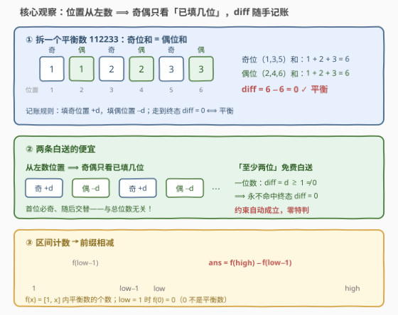
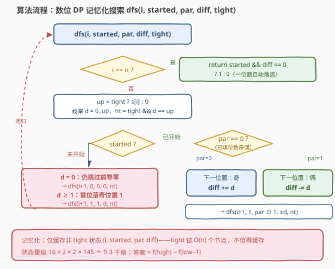

# LeetCode 给定范围内平衡整数的数目 题解

## 1. 题目概述

- **标题 / 题号**：给定范围内平衡整数的数目（#3791，hard）
- **链接**：https://leetcode.cn/problems/number-of-balanced-integers-in-a-range/
- **难度**：困难
- **标签**：动态规划、数位 DP

**题意**：给你两个整数 `low` 和 `high`。如果一个整数同时满足以下**两个**条件，则称其为**平衡**整数：

1. **至少包含两位数字**；
2. **偶数位置上的数字之和等于奇数位置上的数字之和**（最左边的数字位置为 $1$）。

返回区间 $[\text{low}, \text{high}]$（包含两端）内平衡整数的数量。

**示例 1**：

```text
输入：low = 1, high = 100
输出：9
解释：1 到 100 之间共有 9 个平衡数：11、22、33、44、55、66、77、88、99。
```

**示例 2**：

```text
输入：low = 120, high = 129
输出：1
解释：只有 121 是平衡的：奇位和 1 + 1 = 2，偶位和 = 2。
```

**示例 3**：

```text
输入：low = 1234, high = 1234
输出：0
解释：1234 的奇位和 1 + 3 = 4，偶位和 2 + 4 = 6，不相等。
```

**约束**：

- $1 \le \text{low} \le \text{high} \le 10^{15}$

> 💡 **审题关键**：① 位置从**最左边**起算 $1$——奇偶性是「从左数」的属性，这一点直接决定数位 DP 的状态设计（见 2.2；若是「从右数」还得外层枚举总位数）；② 「至少两位」看似要特判，实则被终态条件 $\text{diff} = 0$ 免费保证——一位数的 $\text{diff} = d \ge 1$ 永不归零；③ $10^{15}$ 共 16 位，值域尺度排除一切逐数枚举，必须**按数位**思考；④ 区间计数是前缀相减的标准触发场景：$\text{ans} = f(\text{high}) - f(\text{low} - 1)$。

## 2. 解题思路

### 2.1 暴力思路

枚举 $[\text{low}, \text{high}]$ 中每个数 $v$：转字符串，一趟扫出奇位和与偶位和并比较——单个数 $O(\lg v)$，总计 $O((\text{high} - \text{low} + 1) \cdot 16)$。值域最宽 $10^{15}$，逐数枚举是 $10^{15}$ 量级的运算，按每秒 $10^9$ 次也要跑十来天，直接排除。

区间不行就换**前缀**：令 $f(x)$ 为 $[1, x]$ 内平衡数的个数，则

$$\text{ans} = f(\text{high}) - f(\text{low} - 1)$$

（$\text{low} = 1$ 时 $f(0) = 0$）。问题归一为：**数出 $[1, x]$ 内的平衡数**。这仍是 $O(x)$ 级的 counting，但「$v \le x$」可以拆成逐位的 tight 约束、「平衡」可以拆成逐位的记账约束——两份约束塞进同一个记忆化搜索，这就是数位 DP 的入场券。

### 2.2 核心观察：数位 DP——diff 随手记账，位置奇偶只看「已填几位」



把 $x$ 写成数字串 $s$，从最高位往低位逐位试填。四条观察把状态设计完全钉死。

**观察一：位置从左数 ⟹ 奇偶性在填数过程中即可确定。**
位置从最左边起算 $1$，与总位数无关：第一个填下的数字永远落在位置 $1$（奇），之后逐位交替。于是从高到低填数时，**下一个位置的奇偶只由「已填几位」决定**——记已填位数的奇偶为 $\text{par}$：$\text{par} = 0$ 时下一位置为奇、$\text{par} = 1$ 时为偶，每填一位 $\text{par}$ 翻转。不需要预知这个数最终有几位（这正是「从左数」的幸运，反例见第 5 节）。

**观察二：diff 逐位记账。**
令 $\text{diff} = \text{奇位和} - \text{偶位和}$：填奇位置则 $\text{diff} \mathrel{+}= d$，填偶位置则 $\text{diff} \mathrel{-}= d$，终态要求 $\text{diff} = 0$。以 $121$ 为例：$+1 \to -2 \to +1$，归零 ✓。$x \le 10^{15}$ 至多 16 位、奇偶位各至多 8 个，故 $|\text{diff}| \le 9 \times 8 = 72$——**145 个取值**，一个常数维装下全部信息。

**观察三：「至少两位」白送。**
一位数的 $\text{diff} = d \ge 1 \ne 0$，永远不会命中终态 $\text{diff} = 0$；而 $0$ 全程「未开始」也被排除。约束被隐式满足，一行特判都不用写。

**观察四：前导零不占位置（started 状态）。**
数 $11$ 对齐到三位串是「011」：开头的 $0$ 是前导零，**不占位置**——位置从第一个非零数字起算。于是需要 started 标志：未开始时填 $0$ 继续跳过；一旦开始，之后每一位（含真实的 $0$）都正常占位、正常记账。

> ⚠️ **两个常见坑**：
> - **把前导零当位置**：「011」若按串下标算奇偶，第一个 $1$ 会被误判落在偶位置，整条路径记账全错——位置必须从 started 之后起算；
> - **终态漏判 started**：只判 $\text{diff} = 0$ 不判 started，会把「全零串」代表的 $0$ 数进来（$0$ 的 diff 恰为 $0$）。

**最终形态**：记忆化搜索 $dfs(i, \text{started}, \text{par}, \text{diff}, \text{tight})$ 统计 $\le x$ 的平衡数，答案 $= f(\text{high}) - f(\text{low} - 1)$。

### 2.3 算法流程图



**逻辑执行步骤**（$s$ 为 $x$ 的数字串，$n = |s|$；每个分支继承各自的 $\text{nt} = \text{tight} \wedge (d = \text{up})$）：

| 步骤 | 操作 | 说明 |
|------|------|------|
| ① 终点判定 | $i = n$ 时返回 $\text{started} \wedge (\text{diff} = 0)$ | 一位数、$0$ 自动落选 |
| ② 定上界 | $\text{up} = \text{tight}$ ? $s_i$ : $9$ | tight 路径贴 $x$ 走，其余位自由 |
| ③ 枚举数位 | $d = 0 \dots \text{up}$ | 逐分支下传 nt |
| ④ 未开始转移 | $d = 0$：继续跳；$d \ge 1$：首位落奇位，$(\text{par}, \text{diff}) \to (1,\ d)$ | 前导零不占位置 |
| ⑤ 已开始转移 | $\text{par} = 0$：奇位 $\text{diff} + d$；$\text{par} = 1$：偶位 $\text{diff} - d$；$\text{par}$ 翻转 | 奇偶逐位交替 |
| ⑥ 记忆化 | 仅缓存非 tight 的 $(i, \text{started}, \text{par}, \text{diff})$ | tight 前缀每层至多 1 个，整链 $O(n)$ |

### 2.4 示例演算

**示例 2**：$\text{low} = 120, \text{high} = 129$，答案 $= f(129) - f(119)$。

先手数答案：$\le 129$ 的平衡数 = 两位的 $11 \sim 99$（9 个）+ 三位的 $121$（1 个）$= 10$；$\le 119$ 的平衡数 $= 9$。故答案 $10 - 9 = 1$ ✓。

DP 视角（$s =$「129」，三条代表路径）：

| 填写路径（三位串） | 代表的数 | 逐位记账 | 终态 | 计数 |
|---|---|---|---|---|
| $0 \to 1 \to 1$ | $11$（前导零跳过） | 跳过；$+1$（奇）；$-1$（偶）$\Rightarrow 0$ | started ✓，diff $= 0$ | 1 |
| $1 \to 2 \to 1$ | $121$ | $+1$（奇）；$-2$（偶）；$+1$（奇）$\Rightarrow 0$ | started ✓，diff $= 0$ | 1 |
| $1 \to 0 \to 0$ | $100$ | $+1$（奇）；$-0$（偶）；$+0$（奇）$\Rightarrow 1$ | diff $\ne 0$ | 0 |

两条细节值得咀嚼：**$11$ 是经「首位填 0」的自由分支数进来的**——若没有 started 状态，「011」的第一个 $1$ 会被记到偶位置上，整条路径判错；**$121$ 走的是 tight 分支**（$1 \to 2$ 贴着 $s$，第三位 $\text{up} = 9$ 自由），tight 与自由两条路在此汇合。所有两位平衡数都来自「$0\,d\,d$」型路径；而全部一位数（「$00d$」型）因 $\text{diff} = d \ne 0$ 整体落选——观察三的免费约束肉眼可见。

## 3. 参考代码

### C++

```cpp
class Solution {
    static constexpr int D = 145;

    long long countUpTo(long long x) {
        if (x <= 0) return 0;
        string s = to_string(x);
        int n = s.size();
        vector memo(n, vector(2, vector(2, vector<long long>(D, -1))));

        function<long long(int, int, int, int, int)> dfs =
            [&](int i, int started, int par, int diff, int tight) -> long long {
            if (i == n) return started && diff == 0;
            if (!tight && memo[i][started][par][diff + 72] >= 0)
                return memo[i][started][par][diff + 72];
            int up = tight ? s[i] - '0' : 9;
            long long res = 0;
            for (int d = 0; d <= up; ++d) {
                int nt = tight && d == up;
                if (!started) {
                    if (d == 0) res += dfs(i + 1, 0, 0, 0, nt);
                    else res += dfs(i + 1, 1, 1, d, nt);
                } else {
                    int nd = par == 0 ? diff + d : diff - d;
                    res += dfs(i + 1, 1, par ^ 1, nd, nt);
                }
            }
            if (!tight) memo[i][started][par][diff + 72] = res;
            return res;
        };

        return dfs(0, 0, 0, 0, 1);
    }

public:
    long long countBalanced(long long low, long long high) {
        return countUpTo(high) - countUpTo(low - 1);
    }
};
```

> 💡 **写法要点**：
> - diff 偏移 $+72$ 后落进 $[0, 144]$，四维 memo $(i, \text{started}, \text{par}, \text{diff})$ 共约 $9.3 \times 10^3$ 格；
> - 只有非 tight 状态才缓存：tight 前缀每层至多一个 $d$ 命中上界，整条链 $O(n)$ 个节点，缓存无益还污染下标语义；
> - `return started && diff == 0` 的 bool 隐式转成 0/1，「至少两位」零特判；
> - 答案上界 $f(10^{15}) \approx 3.3 \times 10^{13}$，远超 `int` 的 $2.1 \times 10^9$——累加器必须 `long long`。

### Python

```python
class Solution:
    def countBalanced(self, low: int, high: int) -> int:
        def count_up_to(x: int) -> int:
            if x <= 0:
                return 0
            s = str(x)
            n = len(s)

            @cache
            def dfs(i: int, started: bool, par: int, diff: int, tight: bool) -> int:
                if i == n:
                    return 1 if started and diff == 0 else 0
                up = int(s[i]) if tight else 9
                res = 0
                for d in range(up + 1):
                    nt = tight and d == up
                    if not started:
                        if d == 0:
                            res += dfs(i + 1, False, 0, 0, nt)
                        else:
                            res += dfs(i + 1, True, 1, d, nt)
                    else:
                        nd = diff + d if par == 0 else diff - d
                        res += dfs(i + 1, True, par ^ 1, nd, nt)
                return res

            ans = dfs(0, False, 0, 0, True)
            dfs.cache_clear()
            return ans

        return count_up_to(high) - count_up_to(low - 1)
```

> 💡 **写法要点**：
> - `@cache` 把 tight 一起做键：正确性不受影响——tight=true 的状态本就至多 $O(n)$ 个（tight 前缀被 $s$ 唯一钉死），多缓存几个不亏，比手写「非 tight 才存」省心；
> - 每次调用 `count_up_to` 各建一套独立闭包；末尾 `cache_clear()` 显式断开「缓存 → 闭包 → 缓存」的循环引用，大批量调用时不积攒内存；
> - Python 整数任意精度，diff 直接存带符号值，连偏移都省了。

## 4. 复杂度分析

| 维度 | 复杂度 | 说明 |
|------|--------|------|
| **时间** | $O(n \cdot 2 \cdot 2 \cdot 145 \cdot 10) \approx 2 \times 10^5$ | $n = 16$ 位；$(i, \text{started}, \text{par}, \text{diff})$ 状态数 × 10 个转移；两次 $f$ 调用 |
| **空间** | $O(n \cdot 4 \cdot 145) \approx 10^4$ | 记忆化数组约 $9.3 \times 10^3$ 格 + 递归栈深 $O(n)$ |
| **对比暴力** | $O(10^{15}) \to O(10^5)$ | 复杂度只与**位数**有关、与数值无关——数位 DP 的标志：$x = 10^{15}$ 与 $x = 10^9$ 的耗时几乎相同 |

## 5. 扩展：从右数会怎样 / 按长度枚举 / 平衡数的密度

**若位置改成「从右数」**（如交替数字和类定义）：奇偶性依赖总位数 $L$——数字串「1234」从左数的奇位是 $\{1, 3\}$，从右数的奇位是 $\{4, 2\}$，完全两码事。观察一失效，标准修法是**外层枚举精确长度 $L$**：$L < n$ 时该长度的数全部 $\le x$、无需 tight；$L = n$ 时才走 tight 路径——位置奇偶由 $L$ 直接钉死。代价是跑 $n$ 趟 DP，仍是常数级。本文的 started/par 写法把所有长度拧进同一棵搜索树，一趟搞定，两种形态完全等价。

**换个终态就是一道新题**：把终态判定 $\text{diff} = 0$ 改成 $\text{diff} = t$，立刻能数「奇位和与偶位和之差恰为 $t$」的数——diff 维度本来就是全谱统计，$t = 0$ 只是其中一个取值；再加「至少 $K$ 位」约束，也只需在终态多查一个已填位数。

**平衡数有多稀罕？** 实测 $f(10^{15}) = 32{,}811{,}494{,}188{,}974$——$[1, 10^{15}]$ 中约 **3.28%** 的数是平衡的。直觉：随机 $L$ 位数的奇位和与偶位和是两个独立随机和，由局部中心极限定理，两者取同一值的概率约为 $1 / \sqrt{2\pi\sigma^2 (a+b)}$ 量级（$\sigma^2 = 8.25$ 为单个数位的方差，$a + b = L$）——15 位数（$a = 8, b = 7$）代入约 $3.6\%$，与实测吻合。位数增长时衰减得很慢，平衡数远不稀有，这也解释了为什么 $|\text{diff}| \le 72$ 的窄维度足以承载全部计数。

**与 2719 的对照**：[2719. 统计整数数目](https://leetcode.cn/problems/count-of-integers/)（[站内题解](../2701-2800/2719_统计整数数目.md)）数的是「数位和落在给定区间」的数——同样是 $f(\text{high}) - f(\text{low}-1)$ + 一个数位和维度；本题把单一数位和换成**两个数位和之差**，一次加减维护替代两次求和，是同一骨架的小变奏。

## 6. 面试要点

**Q1：位置的奇偶性在填数过程中怎么确定？不需要知道总位数吗？**

> 不需要。位置从最左起算：第一个非零数字必落位置 $1$（奇），之后逐位交替。过程中只需记「已填位数的奇偶」par——首位后 par $= 1$，每填一位翻转。这是「从左数」的幸运；若从右数，奇偶依赖总长 $L$，得外层枚举 $L$。

**Q2：「至少两位」为什么不用特判？**

> 一位数的 diff $= d \ge 1 \ne 0$，永远不会满足终态 diff $= 0$；$0$ 全程 started $=$ false 也被排除。「至少两位」被 started $\wedge$ (diff $= 0$) 隐式包含，零特判。

**Q3：前导零为什么必须单独处理？举个会翻车的例子。**

> 数 $11$ 对齐三位串是「011」：开头的 $0$ 不占位置。若按串下标记奇偶，第一个 $1$ 落在位置 $2$（偶），记账 $+1$ 变 $-1$，整条路径判错。started $=$ false 时填 $0$ 继续跳过；started $=$ true 之后的 $0$ 是真实数位、正常占位。

**Q4：diff 的值域多大？换个上界还成立吗？**

> $x \le 10^{15}$ 至多 16 位，奇偶位各至多 8 个，$|\text{diff}| \le 9 \times 8 = 72$，共 145 个取值。即使上界抬到 $10^{18}$（19 位），$|\text{diff}| \le 9 \times 10 = 90$，依旧常数级——数位 DP 的状态量只随位数线性增长。

**Q5：tight 状态要不要进记忆化？**

> 两种写法都对。C++ 版只缓存非 tight 状态：tight 前缀每层至多一个分支命中上界，整条链 $O(n)$ 个节点，缓存无益；Python `@cache` 把 tight 一起当键，tight=true 的状态至多 $O(n)$ 个，多缓存不亏。语义等价，只是实现口味。

> 💡 **一句话总结**：3791 = 前缀相减 $f(\text{high}) - f(\text{low}-1)$ + 数位 DP 五元组 $(i, \text{started}, \text{par}, \text{diff}, \text{tight})$。两个题眼：位置从左数 ⟹ 奇偶只需「已填位数」；一位数 diff $\ne 0$ ⟹「至少两位」白送。三件带走的事：$|\text{diff}| \le 72$ 的紧界、前导零不占位、tight 链不必缓存。

## 同类练习题

| # | 题目 | 与本题的关联 |
|---|------|-------------|
| 233 | [数字 1 的个数](https://leetcode.cn/problems/number-of-digit-one/)（[题解](../0201-0300/233_数字1的个数.md)） | 数位 DP 母题——逐位拆贡献统计 1 的出现次数，体会 tight 的基本形态 |
| 902 | [最大为 N 的数字组合](https://leetcode.cn/problems/numbers-at-most-n-given-digit-set/)（[题解](../0901-1000/902_最大为N的数字组合.md)） | 限定数字集合的 ≤ N 计数，started + tight 双状态的同款组合 |
| 2719 | [统计整数数目](https://leetcode.cn/problems/count-of-integers/)（[题解](../2701-2800/2719_统计整数数目.md)） | $f(\text{high}) - f(\text{low}-1)$ + 数位和进状态，与本题结构最接近的近亲 |
| 2827 | [范围中美丽整数的数目](https://leetcode.cn/problems/number-of-beautiful-integers-in-the-range/)（[题解](../2801-2900/2827_范围内美丽整数的数目.md)） | 区间计数 + 双重数位约束（偶值数字个数 = 奇值数字个数、且被 $k$ 整除），同一套数位 DP 状态硬吃 |
| 2376 | [统计特殊整数](https://leetcode.cn/problems/count-special-integers/)（[题解](../2301-2400/2376_统计特殊整数.md)） | 把 diff 换成「已用数字掩码」的进阶版，正难则反数「各位互不相同」 |
