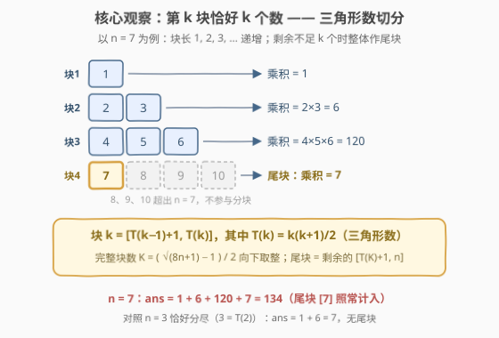
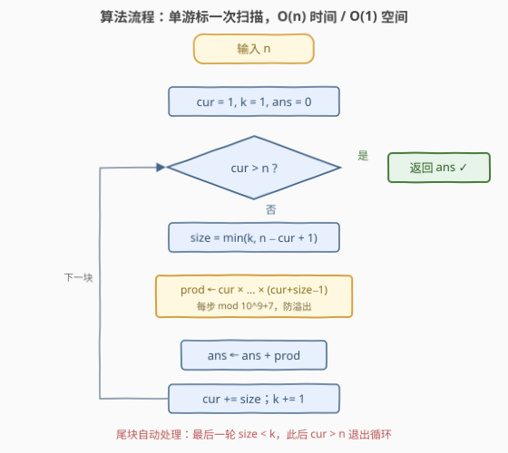

# 递增乘积块之和

- **题目名称**：递增乘积块之和
- **链接**：[3792. 递增乘积块之和](https://leetcode.cn/problems/sum-of-increasing-product-blocks/)
- **难度**：中等
- **标签**：数学、模拟

## 1. 题目概述

> ⚠️ 本题为 LeetCode 付费题，题意描述根据官方示例用例与 hints 重建，可能与官方题面有出入。重建依据：函数签名 `sumOfBlocks(n)`（单整数入参）、官方示例输入 `3` 与 `7`、hint「按序计算每个块的乘积并边算边累加」、标签 Math / Simulation。其中「取模 $10^9+7$」与数据范围为推测（依据见 5.2 节的 64 位安全域分析），若官方约束较小且不取模，直接使用第 3 节的 Python 精确版即可。

给你一个正整数 $n$。

将整数 $1, 2, \ldots, n$ 依次划分为若干**块**（block）：第 $1$ 块包含 $1$ 个整数 $[1]$，第 $2$ 块包含 $2$ 个整数 $[2, 3]$，第 $3$ 块包含 $3$ 个整数 $[4, 5, 6]$……即第 $k$ 块包含 $k$ 个**连续递增**的整数。若剩余整数不足 $k$ 个，则**最后一个块由剩余的全部整数组成**（称为尾块）。

每个块的**乘积**定义为块内所有整数的乘积。返回所有块的乘积之和。由于答案可能很大，请返回其对 $10^9 + 7$ 取模的结果。

**示例 1**：

```text
输入：n = 3
输出：7
解释：块为 [1] 与 [2, 3]，块乘积之和 = 1 + 2 × 3 = 7。3 = T(2) 恰好分尽，无尾块。
```

**示例 2**：

```text
输入：n = 7
输出：134
解释：块为 [1]、[2, 3]、[4, 5, 6] 与尾块 [7]（剩余 1 个，不足 4 个）。
块乘积之和 = 1 + 6 + 120 + 7 = 134。
```

**约束条件**（重建推测）：

- $1 \le n \le 10^5$

> 💡 **审题关键**：① 块长按 $1, 2, 3, \ldots$ 递增，块与块**无缝衔接**——第 $k$ 个完整块覆盖 $[T(k-1)+1,\ T(k)]$，其中 $T(k) = k(k+1)/2$ 是**三角形数**，这正是 Math 标签的来源；② 官方两个示例 $n=3$（$=T(2)$，恰好分尽）与 $n=7$（剩 1 个成尾块）恰好覆盖「无尾块 / 有尾块」两种形态——**尾块是本题最大的 off-by-one 陷阱**；③ 块乘积增长极快（第 11 个完整块的乘积已超 64 位），大数处理是 Medium 难度的核心考点。

---

## 2. 解题思路

### 2.1 暴力思路：先建块、再求积

最直观的做法分两步：先把 $1 \sim n$ 按「第 $k$ 块 $k$ 个数」切成子数组存下来，再逐块连乘求和：

```python
blocks, cur, k = [], 1, 1
while cur <= n:
    size = min(k, n - cur + 1)
    blocks.append(list(range(cur, cur + size)))
    cur += size
    k += 1

ans = 0
for b in blocks:
    prod = 1
    for x in b:
        prod *= x
    ans += prod
```

三个问题：

- **空间浪费**：显式存块需要 $O(n)$ 额外空间，而每个整数只在连乘时被访问一次，块根本不需要「存」下来；
- **大数爆炸**：不取模直接连乘，块积增长极快——第 11 个完整块 $[56, \ldots, 66]$ 的乘积 $\approx 4.3 \times 10^{19}$，早已超出 64 位整数（详见 5.2 节）；
- **两次遍历**：建块一遍、求积一遍，其实一遍就够。

> 💡 转机在于：块与块在数轴上**首尾相接**，只要维护一个游标 `cur`（下一个未分组的整数），就能边切边乘，一遍扫完。

### 2.2 核心观察：三角形数切分 + 单游标一次扫描



三条性质支撑起整个解法：

1. **块边界 = 三角形数**：第 $k$ 个完整块覆盖 $[T(k-1)+1,\ T(k)]$，其中 $T(k) = \frac{k(k+1)}{2}$。数轴被切成长为 $1, 2, 3, \ldots$ 的段，无缝无重叠；

2. **尾块一次 `min` 搞定**：设当前游标为 `cur`（下一个未分组整数）、块号为 `k`，则本块长度为

$$\text{size} = \min(k,\ n - \text{cur} + 1)$$

   剩余足够就是完整块，不足就把剩余的**全部**装进尾块——两种形态统一在同一行代码里，不重不漏；

3. **乘积边算边模**：块积 $B(k) = \prod_{x=T(k-1)+1}^{T(k)} x$ 增长极快，但模乘法对乘法封闭——连乘每步取模、累加后取模，与「先精确算完再取模」结果一致，全程 64 位安全。

> 💡 **关键转化**：把「先切块、再求积、最后求和」的三段式，压缩成「一个游标 + 一次线性扫描」——`cur` 走到哪，块就切到哪，积就乘到哪，和就加到哪。Simulation 标签的「模拟」，指的就是这个游标推进过程。

### 2.3 算法流程图



| 步骤 | 操作 | 说明 |
|------|------|------|
| ① 初始化 | `cur = 1, k = 1, ans = 0` | `cur` 为下一个未分组整数 |
| ② 终止判断 | `cur > n` ？ | 是 → 返回 `ans`（含取模） |
| ③ 定块长 | `size = min(k, n − cur + 1)` | 完整块与尾块统一处理 |
| ④ 连乘 | `prod = cur × … × (cur+size−1)` | 每步取模，防溢出 |
| ⑤ 累加 | `ans += prod` | 累加后取模 |
| ⑥ 推进 | `cur += size, k += 1` | 回到 ② |

> ⚠️ **易错点**：循环条件是 `cur > n`（游标越界）而**不是**「`k` 达到某个上界」——完整块数虽是 $\Theta(\sqrt{n})$ 级（由 $T(K) \le n$ 解出 $K \approx \sqrt{2n}$），但直接用游标判断最稳，连块数都不必显式计算。

### 2.4 示例演算

以 $n = 7$（示例 2）为例，逐步执行：

| 块号 $k$ | 块内整数 | 块积 | 累加后 ans | 游标变化 |
|----------|----------|------|-----------|----------|
| 1 | $[1]$ | $1$ | $1$ | cur: 1 → 2 |
| 2 | $[2, 3]$ | $6$ | $7$ | cur: 2 → 4 |
| 3 | $[4, 5, 6]$ | $120$ | $127$ | cur: 4 → 7 |
| 4（尾块） | $[7]$（剩 1 个 < 4） | $7$ | $134$ | cur: 7 → 8 |
| — | cur = 8 > 7 | — | **返回 134** | 循环结束 |

对照示例 1（$n = 3$）：块 $[1]$、$[2, 3]$ 恰好用完所有整数（$3 = T(2)$ 分尽），无尾块，ans $= 1 + 6 = 7$。两个示例分别验证了「分尽」与「带尾块」两条分支。

---

## 3. 参考代码

### C++

```cpp
class Solution {
public:
    int sumOfBlocks(int n) {
        constexpr long long MOD = 1'000'000'007LL;
        long long ans = 0;
        long long cur = 1;
        for (int k = 1; cur <= n; ++k) {
            long long size = min<long long>(k, n - cur + 1);
            long long prod = 1;
            for (long long x = cur; x < cur + size; ++x) {
                prod = prod * (x % MOD) % MOD;
            }
            ans = (ans + prod) % MOD;
            cur += size;
        }
        return (int)ans;
    }
};
```

> ⚠️ **溢出分析**：循环内 `prod < MOD < 2^30`，`x % MOD < 2^30`，故中间值 `prod * (x % MOD) < 2^60`，`long long` 全程安全。若**不取模**精确计算，第 11 个完整块积 $\approx 4.3 \times 10^{19}$ 已同时超出 `int64` 与 `uint64` 上限（$n \ge 66$ 必爆，64 位安全域仅 $n \le 65$，见 5.2 节）——这也是推测官方题面带取模的原因。

### Python

**取模版**（对应重建题面）：

```python
class Solution:
    def sumOfBlocks(self, n: int) -> int:
        MOD = 10**9 + 7
        ans = 0
        cur, k = 1, 1
        while cur <= n:
            size = min(k, n - cur + 1)
            prod = 1
            for x in range(cur, cur + size):
                prod = prod * x % MOD
            ans = (ans + prod) % MOD
            cur += size
            k += 1
        return ans
```

**大整数精确版**（验证用；若官方约束较小且不取模，即为正解）：

```python
class Solution:
    def sumOfBlocks(self, n: int) -> int:
        ans = 0
        cur, k = 1, 1
        while cur <= n:
            size = min(k, n - cur + 1)
            prod = 1
            for x in range(cur, cur + size):
                prod *= x          # Python 大整数，无需取模
            ans += prod
            cur += size
            k += 1
        return ans
```

> 💡 两版**游标逻辑完全一致**，差别只在是否逐步取模。小数据下可用精确版对拍验证取模版：$n = 7$ 得 $134$；$n = 10$（$=T(4)$ 恰好分尽）得 $1 + 6 + 120 + 5040 = 5167$。

---

## 4. 复杂度分析

| 维度 | 复杂度 | 说明 |
|------|--------|------|
| **时间** | $O(n)$ | 每个整数恰被乘一次（$\sum \text{块长} = n$），每步一次取模乘法 $O(1)$ |
| **空间** | $O(1)$ | 仅维护 `cur / k / ans / prod` 四个变量，不存任何块 |
| **量级判断** | 块数 $\Theta(\sqrt{n})$ | 由 $T(K) \le n$ 得 $K = \lfloor(\sqrt{8n+1}-1)/2\rfloor \approx \sqrt{2n}$；但时间由**总元素数** $n$ 而非块数决定 |

---

## 5. 扩展：阶乘比值视角与 64 位安全域

### 5.1 块积 = 阶乘比值

第 $k$ 个完整块的乘积可以写成

$$B(k) = \prod_{x=T(k-1)+1}^{T(k)} x = \frac{T(k)!}{T(k-1)!}$$

这一视角解释了两件事：

- **增长为何爆炸**：$B(k)$ 是 $k$ 个 $\Theta(k^2)$ 量级整数的连乘，指数级增长——$B(11) \approx 4.3 \times 10^{19}$ 直接击穿 64 位；
- **另一种实现**：预处理前缀阶乘 $F[i] = i! \bmod p$，则 $B(k) \equiv F[T(k)] \cdot F[T(k-1)]^{-1} \pmod{p}$（逆元由费马小定理 $a^{p-2} \bmod p$ 求得）。总复杂度仍是 $O(n)$，只是把「逐个乘」换成「一次逆元」，块数很多时常数更小。

### 5.2 64 位安全域的精确边界

逐一算出前 11 个完整块积：

| $k$ | 块区间 | $B(k)$ | 量级 |
|-----|--------|--------|------|
| 1 | $[1]$ | $1$ | $10^0$ |
| 2 | $[2, 3]$ | $6$ | $10^0$ |
| 3 | $[4, 6]$ | $120$ | $10^2$ |
| 4 | $[7, 10]$ | $5040$ | $10^3$ |
| 5 | $[11, 15]$ | $360360$ | $10^5$ |
| 6 | $[16, 21]$ | $39070080$ | $10^7$ |
| 7 | $[22, 28]$ | $5967561600$ | $10^9$ |
| 8 | $[29, 36]$ | $1220096908800$ | $10^{12}$ |
| 9 | $[37, 45]$ | $321570878428800$ | $10^{14}$ |
| 10 | $[46, 55]$ | $106137499051584000$ | $10^{17}$ |
| 11 | $[56, 66]$ | $42873948150095462400$ | $10^{19}$ |

精确和的 64 位安全边界：$n = 65$ 时和为 $756065571035365207 \approx 7.6 \times 10^{17}$（安全）；$n = 66$ 起包含完整块 $B(11)$，和 $\approx 4.3 \times 10^{19}$，同时超出 `int64` 上限 $9.2 \times 10^{18}$ 与 `uint64` 上限 $1.8 \times 10^{19}$。

由此反推：本题要出成 Medium 且约束超过两位数，**取模几乎是必然设计**——这也是第 1 节重建题面时补充「对 $10^9 + 7$ 取模」的依据。

---

## 6. 面试要点

**Q1：尾块怎么处理？为什么 $n = 7$ 的答案是 134 而不是 127？**

> 尾块 = 分完所有完整块后剩余的整数，**乘积照常计入总和**。`size = min(k, n - cur + 1)` 一行统一完整块与尾块：$n=7$ 分完 $[1],[2,3],[4,5,6]$ 后剩 $[7]$，故 $1+6+120+7=134$；若题意改为「剩余不足即丢弃」，则去掉尾块为 $127$——重建题意时这是最需要与官方核对的一处。

**Q2：如何 $O(1)$ 定位第 $k$ 块的边界与完整块数？**

> 三角形数 $T(k)=k(k+1)/2$，第 $k$ 个完整块覆盖 $[T(k-1)+1,\ T(k)]$；完整块数 $K$ 为满足 $T(K) \le n$ 的最大值，由求根公式 $K=\lfloor(\sqrt{8n+1}-1)/2\rfloor$ 直接算出。不过用游标 `cur` 推进时连这些都不需要——边界天然在推进中产生。

**Q3：为什么必须取模或用大整数？64 位什么时候爆？**

> 块积是阶乘比值 $T(k)!/T(k-1)!$，指数增长。$B(11)\approx4.3\times10^{19}$ 已同时超出 `int64`/`uint64`，故 $n\ge66$ 精确值必溢出，$n\le65$ 才 64 位安全。取模版每步 `prod = prod * x % MOD`，中间值 $< \text{MOD}^2 \approx 10^{18}$，`long long` 全程安全。

**Q4：单游标 `cur` 相比「每个块用公式重算起点」好在哪？**

> 公式法每块要额外计算 $T(k-1)+1$（乘除法）并单独判断尾块；游标法 `cur += size` 顺次推进，块与块无缝衔接，尾块由 `min` 自动截断——更少的边界计算、更少的 off-by-one 机会，空间 $O(1)$。

**Q5：本题能比 $O(n)$ 更快吗？**

> 难。$\sum_k T(k)!/T(k-1)!$ 没有已知封闭形式；前缀阶乘 + 逆元的写法（5.1 节）也只是常数优化。每个整数至少要参与一次乘法，线性扫描已是范式解。

> 💡 **一句话总结**：3792 = 「三角形数切分 + 单游标模拟」+「边乘边模防爆炸」。两个带走的知识点：第 $k$ 块 $k$ 个元素的递增分块结构由 $T(k)=k(k+1)/2$ 刻画；连乘类问题动笔先问一句「乘到第几项会爆 64 位」。

---

## 7. 同类练习题

- [118. 杨辉三角](https://leetcode.cn/problems/pascals-triangle/)：同款「第 $k$ 行 $k$ 个元素」的递增行结构，练按行构造与边界控制
- [59. 螺旋矩阵 II](https://leetcode.cn/problems/spiral-matrix-ii/)（[题解](../0001-0100/59_螺旋矩阵II.md)）：游标推进 + 边界收缩的一维化模拟，练 off-by-one
- [238. 除自身以外数组的乘积](https://leetcode.cn/problems/product-of-array-except-self/)（[题解](../0201-0300/238_除自身以外数组的乘积.md)）：前缀乘积思想，与本文「阶乘比值」视角相通
- [152. 乘积最大子数组](https://leetcode.cn/problems/maximum-product-subarray/)（[题解](../0101-0200/152_乘积最大子数组.md)）：滚动维护乘积与溢出/边界意识
- [2195. 向数组中追加 K 个整数](https://leetcode.cn/problems/append-k-integers-with-minimal-sum/)（[题解](../2101-2200/2195_向数组中追加K个整数.md)）：分组求和的公式化，练「用数学代替模拟」
