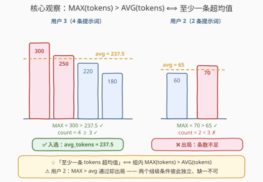
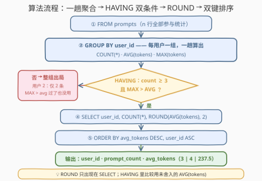

# LeetCode 查找高tokens使用量的用户 题解

## 1. 题目概述

- **标题 / 题号**：查找高tokens使用量的用户（#3793，easy）
- **链接**：https://leetcode.cn/problems/find-users-with-high-token-usage/
- **难度**：简单
- **标签**：数据库、SQL、聚合函数、`GROUP BY` + `HAVING`、`MAX > AVG` 存在性判定、`ROUND` 保留小数

**表结构**：`prompts`

| 列名 | 类型 |
|------|------|
| user_id | int |
| prompt | varchar |
| tokens | int |

- `(user_id, prompt)` 是这张表的主键（值互不相同）。
- 每一行表示一个用户提交给 AI 系统的提示词以及所消耗的 token 数量。

**目标**：对每个用户统计并筛选，输出同时满足以下条件的用户：

1. `prompt_count`：该用户提交的提示词总数；
2. `avg_tokens`：每个提示词的平均 token 数（**舍入到 2 位小数**）；
3. 至少提交了 **3 个**提示词（`prompt_count ≥ 3`）；
4. 至少提交过**一个** tokens 数量**超过自己平均值**的提示词。

结果按 `avg_tokens` **降序**、再按 `user_id` **升序**排序。

**示例**：

```text
输入：prompts 表
+---------+--------------------------+--------+
| user_id | prompt                   | tokens |
+---------+--------------------------+--------+
| 1       | Write a blog outline     | 120    |
| 1       | Generate SQL query       | 80     |
| 1       | Summarize an article     | 200    |
| 2       | Create resume bullet     | 60     |
| 2       | Improve LinkedIn bio     | 70     |
| 3       | Explain neural networks  | 300    |
| 3       | Generate interview Q&A   | 250    |
| 3       | Write cover letter       | 180    |
| 3       | Optimize Python code     | 220    |
+---------+--------------------------+--------+

输出：
+---------+--------------+------------+
| user_id | prompt_count | avg_tokens |
+---------+--------------+------------+
| 3       | 4            | 237.5      |
| 1       | 3            | 133.33     |
+---------+--------------+------------+
```

> 💡 **审题关键**：
> ① 「超过自己的平均」是与**自己组的平均值**比较，不是全局平均值；
> ② 条件 4 的比较对象是**未舍入**的平均值（`AVG(tokens)` 原值），`ROUND` 只负责展示；
> ③ 两个过滤条件**彼此独立**：用户 2 的最大值 70 > 自己的平均 65，条件 4 通过，却因只有 2 条提示词倒在条件 3；
> ④ `avg_tokens` 是输出列名，`ORDER BY avg_tokens DESC` 引用的是**舍入后**的值，`user_id` 升序作第二键防并列乱序。

## 2. 解题思路

### 2.1 暴力思路：JOIN 统计表逐行比对？

「至少一条 tokens 超过自己的平均」最直白的写法是三步走：先 `GROUP BY user_id` 算出每个用户的平均值，再把 `prompts` 与统计结果 `JOIN` 回去，用 `WHERE p.tokens > s.avg_tokens` 过滤后 `DISTINCT` 去重——一张表扫两遍、JOIN 一次、还要去重，只为回答一个「存在性」问题。

> 💡 存在性问题的信号：**「至少一条满足谓词的行」往往能坍缩成「组内某个聚合量满足一个不等式」**，一趟聚合把两个量同时算出来。

另一个直觉歧途是把条件写进 `WHERE`：`WHERE tokens > (该用户的平均)`——`WHERE` 在分组**前**执行，彼时平均值尚未产生，标准 SQL 里 `WHERE` 根本不能引用聚合，这条路写不通（要么包两层派生表，要么搬进 `HAVING`）。

### 2.2 核心观察：`MAX(tokens) > AVG(tokens)` 一行判定存在性



**观察一：「至少一条超过平均」⟺「组内最大值超过平均」。**

若某条 `tokens_i > avg`，则 `MAX(tokens) ≥ tokens_i > avg`；反之若 `MAX(tokens) > avg`，取得最大值的那一行本身就超过了平均。于是全部输出量与过滤量坍缩为三个组内聚合：

| 类别 | 量 | 来源 |
|------|-----|------|
| 组级聚合 | `prompt_count` | `COUNT(*)` |
| 组级聚合 | `avg_tokens`（输出值） | `ROUND(AVG(tokens), 2)` |
| 组级聚合 | 「存在超均值行」 | `MAX(tokens) > AVG(tokens)` |

**观察二：三个量都是同一个 `GROUP BY user_id` 的产物，`HAVING` 天然是它们的过滤器。**

`HAVING` 与 `WHERE` 的分工正在于此：`WHERE` 作用于**分组前**的原始行（此时平均值尚不存在），`HAVING` 作用于**分组后**的组级统计量。两个条件 `COUNT(*) >= 3` 与 `MAX(tokens) > AVG(tokens)` 都是对「组」的断言，一并写进 `HAVING`，一趟聚合收工。

**观察三：比较用未舍入的 `AVG`，`ROUND` 只出现在 SELECT 清单。**

`ROUND` 是**展示层**操作：`HAVING` 里写 `MAX(tokens) > AVG(tokens)`（原值），`SELECT` 里才写 `ROUND(AVG(tokens), 2)`。本题 tokens 为整数，平均值与舍入值之差不足 $0.005$，任何整数都不可能落在两者之间，两种口径实际等价；但「判原始值、展示才舍入」是无坑的通用写法。

> 💡 一句话：**`GROUP BY user_id` 一趟算出 COUNT / AVG / MAX → `HAVING` 双条件过滤 → `SELECT` 里 `ROUND` → 双键排序收尾。**

### 2.3 算法流程图



**逻辑执行步骤**：

| 步骤 | 子句 | 操作 | 说明 |
|------|------|------|------|
| ① FROM | `prompts` | 读入全部 n 行 | 无需预过滤，所有行都参与统计 |
| ② GROUP BY | `GROUP BY user_id` | 每用户折叠成一组 | 同时算出 `COUNT(*)`、`AVG(tokens)`、`MAX(tokens)` |
| ③ HAVING | 组级双条件 | `COUNT(*) ≥ 3` 且 `MAX > AVG` | 对「组」断言，缺一不可 |
| ④ SELECT | 输出列 | `ROUND(AVG(tokens), 2)` | 舍入只发生在展示层 |
| ⑤ ORDER BY | 双键排序 | `avg_tokens DESC, user_id ASC` | 按舍入后的输出列排序，第二键防并列乱序 |

### 2.4 示例演算

对示例中 3 个用户逐一执行「聚合 → 双条件」：

| user | tokens | count | avg（未舍入） | count ≥ 3 | MAX > avg | 判定 |
|------|--------|:--:|------|:--:|:--:|------|
| 1 | 120, 80, 200 | 3 | 400/3 ≈ 133.33 | ✓ | 200 > 133.33 ✓ | ✅ 入选 |
| 2 | 60, 70 | 2 | 65 | **✗** | 70 > 65 ✓ | ❌ 条数不足 |
| 3 | 300, 250, 180, 220 | 4 | 950/4 = 237.5 | ✓ | 300 > 237.5 ✓ | ✅ 入选 |

两个幸存者按 `avg_tokens` 降序：237.5 > 133.33 → 输出 `3, 1`，与官方一致 ✓。注意用户 2 的 `MAX > avg` 实际是**通过**的（70 > 65），出局的唯一原因是条数不足——两个条件彼此独立，正是 2.2 观察二「组级断言缺一不可」的活例子。

## 3. 参考代码

### MySQL（解法 A：`GROUP BY` + `HAVING`，推荐）

```sql
# Write your MySQL query statement below
SELECT user_id,
       COUNT(*)              AS prompt_count,
       ROUND(AVG(tokens), 2) AS avg_tokens
FROM prompts
GROUP BY user_id
HAVING COUNT(*) >= 3
   AND MAX(tokens) > AVG(tokens)
ORDER BY avg_tokens DESC,
         user_id ASC;
```

> 💡 **写法要点**：
> - `MAX(tokens) > AVG(tokens)` 把「存在一条超均值的行」压缩成聚合不等式，**不需要**任何子查询或自连接；
> - `HAVING` 里原样重写聚合表达式而非引用别名——标准 SQL 的 `HAVING` 不能引用同层 SELECT 别名（MySQL 虽放宽了限制，重写更可移植）；
> - 比较用未舍入的 `AVG(tokens)`，`ROUND` 只出现在 SELECT；
> - `ORDER BY avg_tokens` 引用的是 SELECT 别名（舍入后的值），与输出列语义一致。

### MySQL（解法 B：窗口函数版，逐行谓词直判）

```sql
# Write your MySQL query statement below
SELECT DISTINCT user_id,
       prompt_count,
       ROUND(avg_raw, 2) AS avg_tokens
FROM (
    SELECT user_id,
           COUNT(*) OVER (PARTITION BY user_id) AS prompt_count,
           AVG(tokens) OVER (PARTITION BY user_id) AS avg_raw,
           tokens
    FROM prompts
) t
WHERE prompt_count >= 3
  AND tokens > avg_raw
ORDER BY avg_tokens DESC,
         user_id ASC;
```

> 💡 **A vs B**：B 是「窗口函数不塌缩行」的示范——`COUNT/AVG OVER` 把组级统计广播到每一行，于是「该行 tokens 是否超均值」变成**行级谓词**直接 `WHERE`，连 `MAX > AVG` 的等价转换都省了；代价是派生表物化 n 行 + `DISTINCT` 去重。本题三个量全是组级统计、无明细需求，A 更短更直接；当「组统计 + 行明细」需要同框时（如 3716 的末行判定）才轮到 B 出场。

### Pandas

```python
import pandas as pd

def find_users_with_high_token_usage(prompts: pd.DataFrame) -> pd.DataFrame:
    stats = prompts.groupby('user_id').agg(
        prompt_count=('tokens', 'size'),
        avg_tokens=('tokens', 'mean'),
        max_tokens=('tokens', 'max'),
    ).reset_index()

    ans = stats[(stats['prompt_count'] >= 3)
                & (stats['max_tokens'] > stats['avg_tokens'])].copy()
    ans['avg_tokens'] = ans['avg_tokens'].round(2)

    return (ans.sort_values(by=['avg_tokens', 'user_id'],
                            ascending=[False, True])
              [['user_id', 'prompt_count', 'avg_tokens']]
              .reset_index(drop=True))
```

> 💡 **写法要点**：
> - `agg` 一次算出三个组级量，与 SQL 版的三个聚合一一对应；
> - 过滤用**未舍入**的 `avg_tokens`，比较完再 `.round(2)`，与 SQL 版「判原始、展示才舍入」对齐；
> - **先 round 再 sort**：与 SQL 版 `ORDER BY avg_tokens`（舍入后的别名）语义一致；
> - 布尔条件用 `&` 连接必须逐个加括号（`&` 的优先级低于比较运算符）；
> - ⚠️ `Series.round` 是**银行家舍入**（round-half-even），MySQL `ROUND` 对 DECIMAL 是四舍五入：均值恰落 `.xx5` 时两者可能差 0.01（如 sum=1、count=8 → 0.125，pandas 得 0.12、MySQL 得 0.13），详见第 5 节。

## 4. 复杂度分析

| 维度 | 复杂度 | 说明 |
|------|--------|------|
| **时间复杂度** | $O(n)$ | 一趟 `GROUP BY` 聚合（哈希分组 $O(n)$；若引擎走排序分组为 $O(n \log n)$）+ 对通过过滤的 $k$ 个用户排序 $O(k \log k)$ |
| **空间复杂度** | $O(m)$ | $m$ 为用户数——每组只物化一行统计（COUNT / AVG / MAX 三个标量） |

> - 对比「JOIN 统计表 + 逐行比对 + DISTINCT」的暴力版：表扫两遍 + JOIN + 去重，复杂度阶未必更差，但代码量与中间结果规模都翻倍；
> - 窗口函数版物化 $n$ 行派生表，空间 $O(n)$，换取的是「逐行谓词」的直观性——本题数据量小无所谓，大表场景 A 更省。

## 5. 扩展：舍入的三个坑与 `HAVING` vs `WHERE`

**坑一：舍入的位置。** 判定用原值、展示才舍入是无坑写法。本题因 tokens 为整数且 $|\mathrm{avg} - \mathrm{round}(\mathrm{avg})| < 0.005$，整数不可能夹在两者之间，先舍入再比较侥幸等价；一旦 tokens 变成小数，先舍入就可能翻转判定（如 `tokens = 133.34` 对 `round(133.335, 2) = 133.34`，严格大于退化为相等）。

**坑二：舍入的规则。** MySQL `ROUND` 对 DECIMAL 是「四舍五入（远离 0）」，`np.round` / `Series.round` 是「银行家舍入（round-half-even）」：`0.125` 前者得 `0.13`、后者得 `0.12`。跨语言对拍时若均值恰落 `.xx5`，Python 侧可用 `decimal.Decimal(...).quantize(Decimal('0.01'), rounding=ROUND_HALF_UP)` 显式对齐。

**坑三：舍入后的排序。** `ORDER BY avg_tokens` 引用的是 SELECT 别名——**舍入后**的值。两个用户未舍入均值相差 0.001、舍入后并列时，顺序由第二键 `user_id` 决定；若题目口径是按原始均值排序，须写 `ORDER BY AVG(tokens) DESC, user_id`，两者在边界用例上会给出不同结果。

**`HAVING` vs `WHERE` 的分工**（本题的教科书场景）：

| 子句 | 作用对象 | 能否引用聚合 | 本题用途 |
|------|---------|:--:|---------|
| `WHERE` | 分组**前**的原始行 | ✗ | 无（不存在行级预过滤需求） |
| `HAVING` | 分组**后**的组级统计 | ✓ | `COUNT(*) ≥ 3` 且 `MAX > AVG` |

> 💡 判别口诀：谓词里出现聚合函数（`COUNT/AVG/MAX/...`）→ 必须进 `HAVING`；只涉及原始列 → 优先 `WHERE`（过滤前移、减小分组规模）。

## 6. 面试要点

**Q1：「至少一条超过平均值」为什么等价于 `MAX(tokens) > AVG(tokens)`？**

> 双向论证：若存在 `tokens_i > avg`，则 `MAX ≥ tokens_i > avg`；若 `MAX > avg`，取得最大值的那一行本身超过平均。更一般地，「存在行满足谓词」常可坍缩为「组内极值/计数满足不等式」——`MAX` 管超上界、`MIN` 管低下界、`SUM(条件)` 管计数存在性，这一步转换直接消灭子查询。

**Q2：过滤条件写进 `WHERE` 还是 `HAVING`？**

> `COUNT(*) >= 3` 与 `MAX > AVG` 都含聚合，是对**组**的断言，必须进 `HAVING`——`WHERE` 在分组前执行，彼时平均值尚未产生。经验法则：谓词含聚合 → `HAVING`；不含 → `WHERE`。另外标准 SQL 的 `HAVING` 不能引用 SELECT 别名，聚合表达式要在 `HAVING` 里原样重写。

**Q3：`ROUND` 应该放在哪里？比较、排序、输出各用什么值？**

> 比较用未舍入的 `AVG(tokens)`（题面语义是「真实的平均使用量」）；输出列 `ROUND(AVG(tokens), 2)` 只管展示；排序按题目要求对输出列（舍入值）排，`user_id` 作第二键防并列。本题 tokens 为整数使「先舍入再比较」侥幸等价，但不要养成这个习惯。

**Q4：窗口函数版和 `GROUP BY` 版怎么选？**

> 需要组级统计**和**行级明细同框（如 3716 的「末行 + 组统计」）→ 窗口函数，它不塌缩行、把统计广播到每行；只要组级统计（本题三个量都是组级）→ `GROUP BY`，写法更短、物化更少。窗口版在本题的唯一收益是「tokens > avg」变成行级谓词直观可见，代价是派生表 $n$ 行 + `DISTINCT`。

**Q5：用户 2 的 `MAX = 70 > avg = 65` 明明通过，为什么被排除？**

> 条件 3（count ≥ 3）与条件 4（存在超均值行）是**独立**的组级断言，`HAVING` 里用 `AND` 连接、缺一不可。这正是 `HAVING` 的本质：对每个组做一次「体检」，任一指标不达标整组出局——不存在「部分通过」。

> 💡 **一句话总结**：3793 = `GROUP BY` 三聚合 + `HAVING` 双条件 + 展示层 `ROUND`。带走三件事：存在性坍缩成 `MAX > AVG`、聚合谓词进 `HAVING`、舍入只发生在 SELECT。

## 同类练习题

| # | 题目 | 与本题的关联 |
|---|------|-------------|
| 1934 | [确认率](https://leetcode.cn/problems/confirmation-rate/)（[题解](../1901-2000/1934_确认率.md)） | 同款「每用户平均值 + `ROUND(..., 2)`」输出，叠加 `LEFT JOIN` 零记录用户按 0 处理的考点 |
| 1211 | [查询结果的质量和占比](https://leetcode.cn/problems/queries-quality-and-percentage/)（[题解](../1201-1300/1211_查询结果的质量和占比.md)） | 每查询两个 `ROUND(AVG(...))` 指标 + `SUM(条件)/COUNT` 条件聚合，与本题的聚合量同构 |
| 586 | [订单最多的客户](https://leetcode.cn/problems/customer-placing-the-largest-number-of-orders/)（[题解](../0501-0600/586_订单最多的客户.md)） | `GROUP BY` 计数 + 排序取最值——本题的 `prompt_count` 单拎出来就是它 |
| 619 | [只出现一次的最大数字](https://leetcode.cn/problems/biggest-single-number/)（[题解](../0601-0700/619_只出现一次的最大数字.md)） | `HAVING COUNT(*) = 1` 的存在性过滤 + 空集兜底，感受「组级断言」的另一个形态 |
| 1045 | [买下所有产品的客户](https://leetcode.cn/problems/customers-who-bought-all-products/)（[题解](../1001-1100/1045_买下所有产品的客户.md)） | `HAVING COUNT(DISTINCT ...) = 子查询全集`——组级断言的「完备性」进阶版 |
