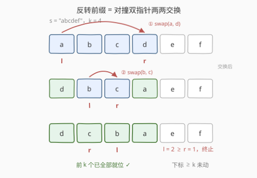
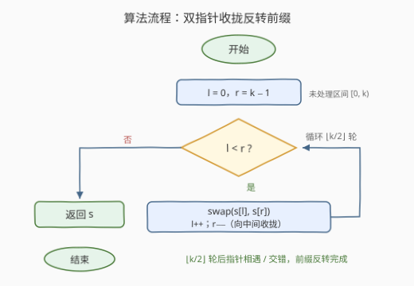

# 反转字符串前缀

- **题目名称**：反转字符串前缀
- **链接**：[3794. 反转字符串前缀](https://leetcode.cn/problems/reverse-string-prefix/)
- **难度**：简单
- **标签**：双指针、字符串

## 1. 题目概述

给你一个字符串 `s` 和一个整数 `k`。

反转 `s` 的**前 `k` 个字符**，并返回结果字符串。

**示例 1**：

```text
输入：s = "abcd", k = 2
输出："bacd"
解释：前 k = 2 个字符 "ab" 反转为 "ba"，最终得到 "bacd"。
```

**示例 2**：

```text
输入：s = "xyz", k = 3
输出："zyx"
解释：前 k = 3 个字符 "xyz" 反转为 "zyx"。
```

**示例 3**：

```text
输入：s = "hey", k = 1
输出："hey"
解释：前 k = 1 个字符 "h" 在反转后保持不变。
```

**约束条件**：

- $1 \le s.length \le 100$
- `s` 仅由小写英文字母组成
- $1 \le k \le s.length$

> 💡 **审题关键**：① 反转的区间是**左闭右开的前缀** $[0,\ k)$，第 `k` 个字符（下标 `k`）起**原样保留**；② 约束保证 $k \le |s|$，无需处理「`k` 超长截断」——但面试中若去掉这条约束（如 [541. 反转字符串 II](https://leetcode.cn/problems/reverse-string-ii/) 就必须 `min(k, n)` 防越界），见第 6 节 Q3；③ `k = 1` 时前缀长度为 1，反转后不变（示例 3），说明**循环边界 `l < r` 天然处理了平凡情形**。

---

## 2. 解题思路

### 2.1 暴力思路：开新串倒着抄

最直观的做法是**另开一个结果串**：倒序遍历前缀把字符抄过去，再拼上尾部：

```python
res = []
for i in range(k - 1, -1, -1):   # 前缀倒着抄
    res.append(s[i])
res.append(s[k:])                # 尾部原样接上
return ''.join(res)
```

问题：

- **空间多余**：结果串额外 $O(n)$ 空间（Python 中字符串不可变，这无法避免；但 C++ 的 `std::string` 可变，完全可以**原位**交换，一个字符的临时空间都不用）；
- **绕远路**：「倒序抄写」把「反转」拆成了逐字符的搬运，而反转的本质是**对称位置两两交换**——每个位置只动一次，成对处理更直接。

> 💡 转机在于：前缀 $[0, k)$ 的反转 = $\lfloor k/2 \rfloor$ 次**轴对称交换**：位置 $0 \leftrightarrow k-1$、$1 \leftrightarrow k-2$……一把「对撞双指针」正好刻画这个过程。

### 2.2 核心观察：对撞双指针原位交换



三条性质支撑起整个解法：

1. **反转 = 对称交换**：前缀 $[0, k)$ 反转后，位置 $i$ 上的字符恰好来自原位置 $k-1-i$。因此只需交换 $(0,\ k-1),\ (1,\ k-2),\ \ldots$ 这些**关于中点对称的字符对**，共 $\lfloor k/2 \rfloor$ 对；

2. **循环不变式**：每轮交换后，$[0, l)$ 与 $(r, k)$ 内的字符**已就位**（不会再被任何后续操作触碰），未就位的区间 $[l, r]$ 始终是「仍需反转的连续段」——`l`、`r` 收拢的过程就是未处理区间收缩的过程；

3. **`l < r` 自带全部边界**：两指针相遇（`l == r`，`k` 为奇数时的正中字符）或交错（`l > r`，`k` 为偶数）即终止——正中字符反转后就是它自己，无需交换，也无需为奇偶写任何分支。

> 💡 **关键转化**：把「构造一个反转的新串」换成「在原串上按对称对交换」——`swap(s[l++], s[r--])` 一行完成「交换 + 双侧收拢」，本题是 [344. 反转字符串](https://leetcode.cn/problems/reverse-string/) 的「前缀版」，也是对撞双指针的最小示例。

### 2.3 算法流程图



| 步骤 | 操作 | 说明 |
|------|------|------|
| ① 初始化 | `l = 0, r = k − 1` | 未处理区间 $[l, r]$ = 整个前缀 |
| ② 终止判断 | `l < r` ？ | 否 → 前缀已反转，返回 `s` |
| ③ 交换 | `swap(s[l], s[r])` | 对称位置的字符各就各位 |
| ④ 收拢 | `l++, r--` | 未处理区间两端各缩一格，回到 ② |

> ⚠️ **易错点**：终止条件是 `l < r` **而不是** `l <= r`——写成 `<=` 时奇数 `k` 的正中字符会和自己交换一次，结果仍正确但多一次无谓写操作；更要紧的是若顺手写成 `l < k` 之类的下界混用，会把已就位的字符再换回去，直接出错。

### 2.4 示例演算

以 `s = "abcdef", k = 4` 为例（前缀 $[0, 4)$ 即 `"abcd"`）：

| 轮次 | 处理前 | 指针 | 交换对 | 处理后 | 已就位区间 |
|------|--------|------|--------|--------|-----------|
| 1 | `a b c d e f` | $l=0,\ r=3$ | `s[0] ↔ s[3]`（a↔d） | `d b c a e f` | $[0,1)\cup(2,4)$ |
| 2 | `d b c a e f` | $l=1,\ r=2$ | `s[1] ↔ s[2]`（b↔c） | `d c b a e f` | $[0,4)$ |
| 3 | `d c b a e f` | $l=2,\ r=1$ | —（`l ≥ r`，终止） | **返回 `"dcbaef"`** | — |

尾部 `e f`（下标 $\ge k$）全程未被触碰，原样保留——这正是「前缀反转」与「整串反转」（[344](https://leetcode.cn/problems/reverse-string/)）唯一的差别。

---

## 3. 参考代码

### C++

```cpp
class Solution {
public:
    string reversePrefix(string s, int k) {
        int l = 0, r = k - 1;
        while (l < r) {
            swap(s[l++], s[r--]);
        }
        return s;
    }
};
```

> 💡 `std::string` 可变，`swap(s[l++], s[r--])` 一行完成「交换 + 收拢」，全程原位、零额外空间。

### Python

**切片一行版**（最 Pythonic）：

```python
class Solution:
    def reversePrefix(self, s: str, k: int) -> str:
        return s[:k][::-1] + s[k:]
```

**双指针版**（与 C++ 逻辑一一对应，体现通用套路）：

```python
class Solution:
    def reversePrefix(self, s: str, k: int) -> str:
        t = list(s)          # str 不可变，转 list 才能原位交换
        l, r = 0, k - 1
        while l < r:
            t[l], t[r] = t[r], t[l]
            l += 1
            r -= 1
        return ''.join(t)
```

> ⚠️ Python 的 `str` 是**不可变对象**，无法像 C++ 那样原地交换字符——要么转 `list` 模拟原位，要么直接切片拼接（切片版会创建中间串 `s[:k][::-1]`，想省这一次拷贝可写 `s[k-1::-1] + s[k:]`，注意 `k-1` 起步省去 `+1` 的边界心智负担）。

---

## 4. 复杂度分析

| 维度 | 复杂度 | 说明 |
|------|--------|------|
| **时间** | $O(k)$ | 至多 $\lfloor k/2 \rfloor$ 次交换，每次 $O(1)$；$k \le n \le 100$，整体 $O(n)$ |
| **空间** | C++ $O(1)$ / Python $O(n)$ | C++ 原位交换零额外空间；Python 因字符串不可变，切片或 `list` 转换均需 $O(n)$ |
| **下界** | $\Omega(k)$ | 前 `k` 个字符每个都要改变位置（$k \ge 2$ 时），任何算法都必须触碰它们至少一次 |

---

## 5. 扩展：「反转字符串」家族

本题是一族「反转」题的最小原子，掌握它即可秒拆整族：

| 题目 | 反转区间 | 与本题的差异 |
|------|----------|--------------|
| [344. 反转字符串](https://leetcode.cn/problems/reverse-string/) | $[0, n)$ | 即 $k = n$ 的特例 |
| **本题 3794** | $[0, k)$ | `k` 显式给出，且保证 $k \le n$ |
| [541. 反转字符串 II](https://leetcode.cn/problems/reverse-string-ii/) | 每 $2k$ 块的前 $k$ 个 | **需 `min(i+k, n)` 截断**：尾部可能不足 `k` 个 |
| [2000. 反转单词前缀](https://leetcode.cn/problems/reverse-prefix-of-word/) | $[0,\ \text{ch 首次出现处}]$ | `k` 退化为「先 `find` 定位，再反转」两步 |

共同骨架都是同一个循环：`while l < r: swap(s[l++], s[r--])`——变化的只有 `l`、`r` 的**初始值来源**（给定 / 计算 / 查找）。这也是双指针标签的含义：指针的初始化与终止条件才是题型考点，交换本身永远是模板。

---

## 6. 面试要点

**Q1：循环条件为什么是 `l < r` 而不是 `l <= r`？**

> 反转的对称交换只发生在**严格不相等的指针对**之间。`k` 为奇数时 `l == r` 落在正中字符，它反转后就是自身，交换是空操作（结果不错但多余）；`k` 为偶数时指针会交错（`l > r`），更不该继续。`l < r` 同时覆盖两种奇偶情形，一行写对所有边界。

**Q2：Python 为什么不能像 C++ 一样原位交换？两种写法怎么选？**

> Python 的 `str` 不可变，任何"修改"都会生成新对象。切片版 `s[:k][::-1] + s[k:]` 简洁且常数小，是工程首选；转 `list` 的双指针版逻辑与 C++ 一一对应，便于展示套路、也便于迁移到「字符数组可变」的语言。两者时间同为 $O(n)$。

**Q3：如果约束不保证 `k ≤ s.length`，代码要怎么改？**

> 初始化改为 `r = min(k, (int)s.size()) - 1`，即先把右边界**截断到串尾**——本题约束 $1 \le k \le s.length$ 所以不必，但 [541. 反转字符串 II](https://leetcode.cn/problems/reverse-string-ii/) 的尾部块必须这么做。面试口述这个防御性边界是加分项。

**Q4：本题与 2000「反转单词前缀」是什么关系？**

> 同一骨架、不同定位方式：2000 先 `find(ch)` 找到字符首次出现的下标 `i`（找不到则原样返回），再对 $[0, i]$ 执行与本题完全相同的对撞反转——相当于 `k = i + 1` 且多一个「定位失败」分支。本题是它的「`k` 直接给定」简化版。

**Q5：能比 $O(k)$ 更快吗？**

> 不能。反转是**置换**而非函数求值：$k \ge 2$ 时前缀每个位置的内容都来自另一个位置，任何正确算法必须对这 `k` 个位置各至少读一次、写一次，$\Omega(k)$ 是信息论下界。$O(k)$ 的双指针已是最优。

> 💡 **一句话总结**：3794 = 「对撞双指针交换对称对」的最小用例。带走两点：`while (l < r) swap(s[l++], s[r--])` 是全族反转题的公共模板；变化的只有指针初值——给定（本题）、截断计算（541）、查找定位（2000）。

---

## 7. 同类练习题

- [344. 反转字符串](https://leetcode.cn/problems/reverse-string/)（[题解](../0301-0400/344_反转字符串.md)）：本题 $k = n$ 的整串版，双指针模板的出处
- [541. 反转字符串 II](https://leetcode.cn/problems/reverse-string-ii/)（[题解](../0501-0600/541_反转字符串II.md)）：分段前缀反转 + `min` 截断，练边界防御
- [2000. 反转单词前缀](https://leetcode.cn/problems/reverse-prefix-of-word/)（[题解](../1901-2000/2000_反转单词前缀.md)）：先 `find` 定位再反转，本题的「查找版」
- [345. 反转字符串中的元音字母](https://leetcode.cn/problems/reverse-vowels-of-a-string/)：对撞双指针 + 条件跳过（只换元音），练指针收拢控制
- [151. 反转字符串中的单词](https://leetcode.cn/problems/reverse-words-in-a-string/)：整串反转 + 逐词反转的组合，双指针的进阶应用
