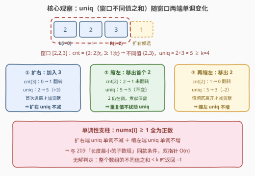
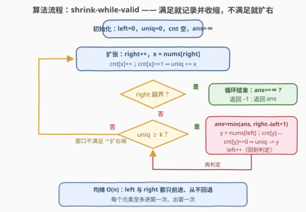

# 不同元素和至少为K的最短子数组长度

- **题目名称**：不同元素和至少为K的最短子数组长度
- **链接**：[3795. 不同元素和至少为 K 的最短子数组长度](https://leetcode.cn/problems/minimum-subarray-length-with-distinct-sum-at-least-k/)
- **难度**：中等
- **标签**：数组、哈希表、滑动窗口

## 1. 题目概述

**题意**：给定整数数组 $nums$ 与整数 $k$。求一个**子数组**（连续非空）的最小长度，使得该子数组中出现的**不同**值之和（每个值只计算一次）**至少**为 $k$；不存在这样的子数组则返回 $-1$。

**示例 1**：

```text
输入：nums = [2,2,3,1], k = 4
输出：2
解释：子数组 [2, 3] 的不同值为 {2, 3}，和为 5 ≥ 4；不存在长度为 1 的合法子数组。
```

**示例 2**：

```text
输入：nums = [3,2,3,4], k = 5
输出：2
解释：子数组 [3, 2] 的不同值为 {3, 2}，和为 5 ≥ 5。
```

**示例 3**：

```text
输入：nums = [5,5,4], k = 5
输出：1
解释：子数组 [5] 的不同值为 {5}，和为 5 ≥ 5。
```

**约束条件**：

- $1 \le nums.length \le 10^5$
- $1 \le nums[i] \le 10^5$
- $1 \le k \le 10^9$

> 💡 **审题关键**：① 「不同值之和」指窗口内**每个出现过的值只算一次**——示例 1 中 $[2,2]$ 的不同值和是 $2$ 而非 $4$，示例 3 中 $[5,5]$ 仍是 $5$；② $nums[i] \ge 1$ **全为正数**，这是本题能用滑窗的命门（见 2.2）；③ 不同值个数至多 $10^5$、每个值至多 $10^5$，$uniq$ 上界 $10^{10}$，C++ 必须 `long long`；④ 全数组不同值之和都凑不够 $k$ 时答案为 $-1$。

---

## 2. 解题思路

### 2.1 暴力思路：枚举所有子数组

枚举每个左端点 $l$，向右扩张右端点 $r$，用哈希集合维护窗口内出现过的值并累加「首次加入」的值，一旦和 $\ge k$ 就记录长度 $r-l+1$ 并 `break`（再扩长度只会更大）：

```text
for l in 0 .. n−1:
    uniq = 0, seen = 空集合
    for r in l .. n−1:
        if nums[r] not in seen:
            seen.add(nums[r]); uniq += nums[r]
        if uniq >= k:
            ans = min(ans, r − l + 1); break
```

总时间 $O(n^2)$。$n = 10^5$ 时最坏 $10^{10}$ 次操作（$k$ 很大、始终不满足时内层全程跑满），不可行。

**瓶颈**：每个左端点都把窗口信息**从零重算**。若窗口指标关于两端**单调**，就能让左右指针都只前进不回退——这正是 [209. 长度最小的子数组](https://leetcode.cn/problems/minimum-size-subarray-sum/) 的滑窗条件。

### 2.2 核心观察：「不同值之和」是窗口单调量



定义 $uniq(l, r)$ = 窗口 $[l, r]$ 内出现过的不同值之和。用**频次哈希表** $cnt$ 维护窗口，关键在于**频次 $0 \leftrightarrow 1$ 的翻转**：

| 窗口动作 | 频次变化 | 对 $uniq$ 的影响 |
|---------|---------|-----------------|
| 扩右端加入 $x$ | $cnt[x]$：$0 \to 1$（翻转） | $uniq \mathrel{+}= x$（首次进窗） |
| 扩右端加入 $x$ | $cnt[x]$：$\ge 1 \to +1$（未翻转） | 不变（重复值白加） |
| 缩左端移出 $y$ | $cnt[y]$：$1 \to 0$（翻转） | $uniq \mathrel{-}= y$（彻底离开） |
| 缩左端移出 $y$ | $cnt[y]$：$\ge 2 \to -1$（未翻转） | 不变（窗口里还有副本） |

由于 $nums[i] \ge 1$ **全为正数**：

- **扩右端**：要么不变、要么加上一个正数 ⇒ $uniq$ **单调不减**；
- **缩左端**：要么不变、要么减去一个正数 ⇒ $uniq$ **单调不增**。

这正是 209 式滑窗所需的全部单调性（209 的普通和是本题 $cnt$ 恒为 1 的退化版）。于是套用 **shrink-while-valid** 模板：对每个右端点 $r$，在保持 $uniq \ge k$ 的前提下把 $left$ 推到最右，得到的窗口就是**以 $r$ 结尾的最短合法窗口**；对所有 $r$ 取最小即为答案。

> ⚠️ **无解判定**不需要单独写：整个数组的不同值之和是 $uniq$ 能达到的最大值，若它 $< k$，`while` 循环一次都不会进入，$ans$ 保持 $\infty$，最后统一返回 $-1$。

### 2.3 算法流程图



**文字版步骤**：

| 步骤 | 操作 | 说明 |
|------|------|------|
| ① 扩张 | `right++`，`cnt[x]++`；若 `cnt[x]==1` 则 `uniq += x` | 右端元素进窗，频次翻转才累加 |
| ② 判定 | `while uniq >= k` | 当前窗口 `[left, right]` 合法 |
| ③ 记录 | `ans = min(ans, right − left + 1)` | 先记录**当前**合法窗口长度 |
| ④ 收缩 | 移出 `y = nums[left]`：`cnt[y]--`；若 `cnt[y]==0` 则 `uniq -= y`；`left++` | 回到 ② 继续判定 |
| ⑤ 收尾 | 右端越界后，`ans==∞` 返回 $-1$，否则返回 `ans` | 每个元素至多进出窗口各一次 |

### 2.4 示例演算

以示例 1 `nums = [2,2,3,1], k = 4` 走一遍：

| right | 加入 | 频次变化 | uniq | 窗口 | 动作 | ans |
|-------|------|---------|------|------|------|-----|
| 0 | 2 | $cnt[2]$：$0{\to}1$ 翻转 | 2 | $[2,2]$ 前 $[2]$ | $2 < 4$，继续扩右 | $\infty$ |
| 1 | 2 | $cnt[2]$：$1{\to}2$ | 2 | $[2,2]$ | $2 < 4$，继续扩右 | $\infty$ |
| 2 | 3 | $cnt[3]$：$0{\to}1$ 翻转 | 5 | $[2,2,3]$ | $5 \ge 4$：记录 $len=3$；移出首个 2（$cnt[2]$：$2{\to}1$，uniq 仍 5）记录 $len=2$；移出 2（$cnt[2]$：$1{\to}0$，$uniq=3$）停止 | **2** |
| 3 | 1 | $cnt[1]$：$0{\to}1$ 翻转 | 4 | $[3,1]$ | $4 \ge 4$：记录 $len=2$；移出 3（$cnt[3]$：$1{\to}0$，$uniq=1$）停止 | 2 |

返回 $2$ ✓。示例 2、3 同理：$[3,2]$ 得 $2$；$[5]$ 首个元素即满足得 $1$。

---

## 3. 参考代码

### C++

```cpp
class Solution {
  public:
    int minLength(vector<int>& nums, int k) {
        int n = nums.size();
        unordered_map<int, int> cnt;      // 值 -> 窗口内出现次数
        long long uniq = 0;               // 窗口内不同值之和，上界 1e10 必须 long long
        int ans = INT_MAX;
        int left = 0;
        for (int right = 0; right < n; right++) {
            if (++cnt[nums[right]] == 1) uniq += nums[right];   // 首次进窗
            while (uniq >= k) {                                 // 窗口合法：记录并收缩
                ans = min(ans, right - left + 1);
                if (--cnt[nums[left]] == 0) uniq -= nums[left]; // 彻底离开
                left++;
            }
        }
        return ans == INT_MAX ? -1 : ans;
    }
};
```

### Python

```python
class Solution:
    def minLength(self, nums: List[int], k: int) -> int:
        cnt = defaultdict(int)          # 值 -> 窗口内出现次数
        uniq = 0                        # 窗口内不同值之和
        ans = inf
        left = 0
        for right, x in enumerate(nums):
            cnt[x] += 1
            if cnt[x] == 1:             # 首次进窗
                uniq += x
            while uniq >= k:            # 窗口合法：记录并收缩
                ans = min(ans, right - left + 1)
                y = nums[left]
                cnt[y] -= 1
                if cnt[y] == 0:         # 彻底离开
                    uniq -= y
                left += 1
        return -1 if ans == inf else ans
```

> 💡 **写法要点**：
> - $uniq$ 上界 $10^5 \times 10^5 = 10^{10}$，超出 `int`（约 $2.1 \times 10^9$），C++ 全程 `long long`；$k \le 10^9$ 在 `int` 内，但与 `uniq` 比较时会自动提升，无需强转。
> - **先记录再收缩**：`while` 体内先记 `right - left + 1` 再移除左端——记录的语义是「当前窗口 $[left, right]$ 合法」，收缩后窗口可能不再合法。
> - 值域 $nums[i] \le 10^5$，C++ 可用 `vector<int> cnt(100001, 0)` 替 `unordered_map` 再提速一档；Python 用 `defaultdict` 即可。
> - `++cnt[x] == 1` / `--cnt[y] == 0` 把「翻转判定」压进一行，是频次表滑窗的惯用写法。

---

## 4. 复杂度分析

| 维度 | 复杂度 | 说明 |
|------|--------|------|
| **时间复杂度** | $O(n)$ | `left`、`right` 各自只前进不回退，每个元素至多进窗、出窗各一次，每步 $O(1)$ 更新（均摊） |
| **空间复杂度** | $O(U)$ | 频次表只存窗口内出现过的值，$U \le \min(n, 10^5)$ 为不同值个数 |

---

## 5. 扩展：元素允许为负数时会怎样？

**正数是 2.2 单调性的支柱**，一旦放开限制：

- **负数**：扩右端首次加入一个负值 $x$ 会让 $uniq$ **下降**（$uniq \mathrel{+}= x < uniq$），缩左端彻底移出一个负值反而让 $uniq$ **上升**——扩不减排、缩不增减两条单调性同时被破坏，shrink-while-valid 模板直接失效（可能提前停止收缩漏掉更短窗口，或收缩后再次合法的窗口被跳过）。
- 对照 [862. 和至少为 K 的最短子数组](https://leetcode.cn/problems/shortest-subarray-with-sum-at-least-k/)：**普通和**版允许负数的经典做法是「前缀和 + 单调双端队列」。但本题的 $uniq$ 依赖窗口内**值的去重集合**，无法写成前缀量之差（同一个值在两个前缀里的「去重贡献」不可相减），负数版目前没有漂亮的线性解。

这给出滑窗题的通用自查清单：**窗口指标 + 单调性论证**——先问「扩右 / 缩左各让指标怎么变」，两条单调性都在，才配套双指针；任何一条断了，就得换前缀和、单调队列、二分答案等其他武器。

---

## 6. 面试要点

**Q1：为什么「不同值之和」能用滑动窗口？请给出单调性论证。**

> 设 $uniq(l,r)$ 为窗口内不同值之和。扩右端加入 $x$：若 $cnt[x]$ 从 0 翻到 1 则 $uniq \mathrel{+}= x \ge 1$，否则不变，故 $uniq$ 关于 $r$ 单调不减；缩左端移出 $y$：若 $cnt[y]$ 从 1 翻到 0 则 $uniq \mathrel{-}= y \le -1$，否则不变，故关于 $l$ 单调不增。两个方向的单调性合起来，保证「对每个 $r$，合法的 $l$ 是一段连续区间，且其右边界随 $r$ 增大不回退」，左右指针各走一遍即可。

**Q2：与 209「长度最小的子数组」的联系与区别？**

> 完全同款 shrink-while-valid 模板，区别只在窗口指标的维护：209 的普通和直接 `sum += x` / `sum -= y`，相当于每个值的频次恒为 1；本题的 $uniq$ 要借频次哈希表判断 $0 \leftrightarrow 1$ 翻转——重复值进窗不加分、副本还在窗时移出也不减分。模板不变，维护成本各一步 $O(1)$。

**Q3：`while` 循环里为什么先记录 `ans` 再收缩，反过来行不行？**

> 不行。记录的语义是「窗口 $[left, right]$ 此刻合法，长度为 $right - left + 1$」；若先收缩再判定，等价于把判定挪到收缩后，会漏记收缩前那个更长的合法窗口——不过「更长」通常不影响最小值，真正的坑在逻辑语义上：先收缩再记录会让记录的长度与判定的窗口错位。规范写法就是「判定成立 → 记录 → 收缩一步 → 回到判定」。

**Q4：哪些地方有溢出风险？**

> $uniq$ 上界 = 不同值个数 $\times$ 最大值 $= 10^5 \times 10^5 = 10^{10}$，超 `int` 六倍，C++ 必须 `long long`；$k \le 10^9$ 恰在 `int` 内。窗口长度 `right - left + 1` 至多 $10^5$，`ans` 用 `int` 即可。Python 原生 int 无此问题。

**Q5：什么时候返回 $-1$？需要提前判一次吗？**

> 不需要。$uniq$ 的全局最大值就是整个数组的不同值之和；若它 $< k$，任何窗口都不满足，`while` 一次不进，`ans` 保持初始 $\infty$，循环外统一 `ans == inf ? -1 : ans` 即可。若想提前剪枝，可在开始前去重求和判一次，但省不了复杂度，纯属可选。

---

## 7. 同类练习题

- [209. 长度最小的子数组](https://leetcode.cn/problems/minimum-size-subarray-sum/)：同款 shrink-while-valid 模板，窗口指标从「去重和」退化为普通和——本题的原型
- [3. 无重复字符的最长子串](https://leetcode.cn/problems/longest-substring-without-repeating-characters/)：同用频次哈希维护窗口，目标反向（求最长），收缩条件是「出现重复」
- [76. 最小覆盖子串](https://leetcode.cn/problems/minimum-window-substring/)：同为求最短合法窗口，但合法条件（覆盖目标字符）更复杂，是滑窗模板的高阶应用
- [713. 乘积小于 K 的子数组](https://leetcode.cn/problems/subarray-product-less-than-k/)：正数保证乘积关于窗口单调的又一实例，与本题互为「正数条件是滑窗命门」的印证
- [862. 和至少为 K 的最短子数组](https://leetcode.cn/problems/shortest-subarray-with-sum-at-least-k/)：允许负数时单调性崩塌，改用前缀和 + 单调双端队列——本题第 5 节扩展的反面教材
