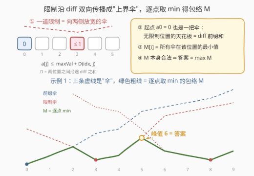
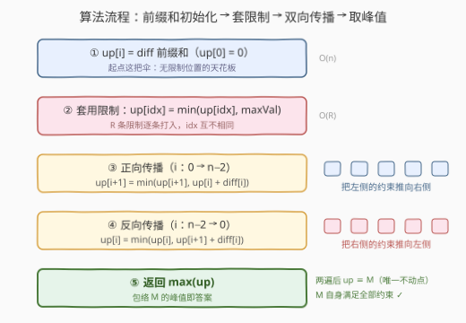

# 找到带限制序列的最大值

- **题目名称**：找到带限制序列的最大值
- **链接**：[3796. 找到带限制序列的最大值](https://leetcode.cn/problems/find-maximum-value-in-a-constrained-sequence/)
- **难度**：中等
- **标签**：贪心、数组

## 1. 题目概述

给定整数 `n`、二维整数数组 `restrictions` 和长度为 `n - 1` 的整数数组 `diff`，构造长度为 `n` 的序列 $a[0..n-1]$，满足：

1. $a[0] = 0$；
2. 所有元素均为**非负整数**；
3. 相邻约束：对每个 $0 \le i \le n-2$，有 $\lvert a[i] - a[i+1] \rvert \le diff[i]$；
4. 点位约束：对每个 $restrictions[i] = [idx,\ maxVal]$，有 $a[idx] \le maxVal$。

在满足全部条件的前提下，**最大化序列中的最大值**，返回该最大值。

**示例 1**：

```text
输入：n = 10, restrictions = [[3,1],[8,1]], diff = [2,2,3,1,4,5,1,1,2]
输出：6
解释：a = [0, 2, 4, 1, 2, 6, 2, 1, 1, 3] 合法（a[3] ≤ 1 且 a[8] ≤ 1），最大值为 6。
```

**示例 2**：

```text
输入：n = 8, restrictions = [[3,2]], diff = [3,5,2,4,2,3,1]
输出：12
解释：a = [0, 3, 3, 2, 6, 8, 11, 12] 合法（a[3] ≤ 2），最大值为 12。
```

**约束条件**：

- $2 \le n \le 10^5$
- $1 \le restrictions.length \le n - 1$，且每个 $idx$ 互不相同
- $1 \le idx < n$，$1 \le maxVal \le 10^6$
- $1 \le diff[i] \le 10$

> 💡 **审题关键**：① 限制会**传染**——相邻约束 $\lvert a[i]-a[i+1] \rvert \le diff[i]$ 把远处的限制沿链条传递过来，每个位置的真实上界由**全部**限制共同决定，不能只看本位的 $maxVal$；② 起点 $a[0]=0$ 本身也是一道"限制"：无限制位置的天花板就是 diff 的**前缀和**；③ 全 0 序列恒合法（$0 \le maxVal$、$0 \le diff[i]$），问题必有解，我们只需求"最大能冲到多高"；④ $idx \ge 1$ 且 $maxVal \ge 1$，保证限制不与 $a[0]=0$ 及非负性冲突。

---

## 2. 解题思路

### 2.1 暴力思路：每个位置对所有限制源两两求 min

记 $D(i, j)$ 为下标 $i$、$j$ 之间沿途 `diff` 之和（$i = j$ 时为 0）：

$$D(i,j)=\sum_{k=\min(i,j)}^{\max(i,j)-1} diff[k]$$

把每个"源头" $s$ 统一看待：起点（$\mathit{cap}[0]=0$）或某条限制（$\mathit{cap}[idx]=maxVal$）。由相邻约束逐段放缩（三角不等式），任何合法序列都满足

$$a[i] \;\le\; a[s] + D(s,i) \;\le\; \mathit{cap}[s] + D(s,i)$$

于是每个位置能取到的最大值不超过 $up[i] = \min_s \big(\mathit{cap}[s] + D(s,i)\big)$。暴力做法就是对每个 $i$ 遍历全部 $O(n)$ 个源取 min——总时间 $O(n \cdot R)$，最坏 $10^{10}$，必然超时。

> 💡 转机在于：这个"逐点对所有限制取 min"的结构，在**一维链**上可以被两遍线性扫描等价地算出来——这正是经典的**一维距离变换**。

### 2.2 核心观察：限制沿 diff 双向传播成"上界伞"，逐点取 min 的包络自身合法



三个关键概念：

1. **伞（上界传播）**：从源头 $s$ 看过去，$\mathit{cap}[s] + D(s, \cdot)$ 是一把**以 $s$ 为谷底、向两侧按沿途 diff 逐步放宽的 V 形伞**。限制 $(idx, maxVal)$ 不仅压住 $idx$ 一处，还压住了整把伞覆盖的区域——这就是"限制传染"的几何形态；
2. **包络**：$M[i] = \min_s \big(\mathit{cap}[s] + D(s,i)\big)$，即所有伞在每个位置的**最低处**。它是每个位置取值的上确界；
3. **包络自身合法**（本题最妙之处）：
   - $M[i] \le \mathit{cap}[i]$（取 $s = i$，$D(i,i)=0$）——限制全部满足；且 $M[0] = 0$（源 $s=0$ 给出 0，其余源非负）；
   - $\lvert M[i] - M[i+1] \rvert \le diff[i]$——由三角不等式 $D(s,i) \le D(s,i+1) + diff[i]$ 得 $M[i] \le M[i+1] + diff[i]$，对称得另一侧；
   - $M[i] \ge 0$——所有 $\mathit{cap}$ 与 $D$ 均非负。

因此**直接令 $a := M$**，每个位置同时顶到自己的上界，答案就是

$$\text{ans} = \max_i M[i]$$

> 💡 **关键转化**：不再纠结"序列怎么构造"，而是先求"每个位置最高能到哪"——上界的逐点最小值恰好自己就是一条合法序列，构造与判定合二为一。

### 2.3 算法流程图：两遍线性扫描（一维距离变换）



| 步骤 | 操作 | 说明 |
|------|------|------|
| ① 初始化 | `up[i] = diff[0..i-1]` 之和 | 无限制天花板 = 起点这把"前缀伞" |
| ② 套限制 | `up[idx] = min(up[idx], maxVal)` | 限制先打进自己那格 |
| ③ 正向传播 | `i` 从左到右：`up[i+1] = min(up[i+1], up[i] + diff[i])` | 把**左侧所有源**的伞推到右边 |
| ④ 反向传播 | `i` 从右到左：`up[i] = min(up[i], up[i+1] + diff[i])` | 把**右侧所有源**的伞补到左边 |
| ⑤ 取峰值 | `return max(up)` | 此时 `up ≡ M`，峰值即答案 |

**为什么两遍就够**：正向传播后归纳可得 $up[i] = \min_{s \le i}\big(\mathit{cap}[s] + D(s,i)\big)$（每次 `min` 恰好把当前最右源的影响续上一段）；反向传播再把 $s > i$ 的源补齐，两遍后 $up \equiv M$。这与扫描先后顺序无关（先右后左、再补一遍左→右，结果相同）——$M$ 是传播操作的**唯一不动点**。

> ⚠️ **易错点**：只扫一遍**不够**。例如 `n = 4, diff = [10,10,1], restrictions = [[3,1]]`：正向传播后 `up = [0,10,20,1]`，其中 `up[2] = 20` 是假上界——右侧限制 $a[3] \le 1$ 连同 $|a[2]-a[3]| \le 1$ 实际把它压到 2，这层影响必须由反向传播补上（最终 `M = [0,10,2,1]`）。另外注意 ④ 中跨过 $i$、$i+1$ 用的是 `diff[i]`（而非 `diff[i+1]`）。

### 2.4 示例演算

以示例 1 为例（$n=10$，限制 $[3,1]$、$[8,1]$，`diff = [2,2,3,1,4,5,1,1,2]`）：

| i | 0 | 1 | 2 | 3 | 4 | 5 | 6 | 7 | 8 | 9 |
|----|---|---|---|---|---|---|---|---|---|---|
| ① 前缀和（无限制上界） | 0 | 2 | 4 | 7 | 8 | 12 | 13 | 14 | 15 | 17 |
| ② 套限制后 | 0 | 2 | 4 | **1** | 8 | 12 | 13 | 14 | **1** | 17 |
| ③ 正向传播后 | 0 | 2 | 4 | 1 | 2 | 6 | 11 | 12 | 1 | 3 |
| ④ 反向传播后 = M | 0 | 2 | 4 | 1 | 2 | **6** | 3 | 2 | 1 | 3 |
| 胜出的伞 | 前缀 | 前缀 | 平手 | 限@3 | 限@3 | 限@3 | 限@8 | 限@8 | 限@8 | 限@8 |

- 峰值出现在 $i=5$：此处左限制伞已放宽到 $1+1+4=6$，而右限制伞（$1+5+1+1=8$）还压不下来——**两把伞的交点即山峰**；
- $i=2$ 处前缀伞与限@3 伞恰好相切（$4 = 1+3$），随后包络切换到限@3 的伞；
- 官方示例序列 $[0,2,4,1,2,6,2,1,1,3]$ 与 $M$ 不同（合法解不唯一），但最大值同为 6——最大值是唯一的；
- 示例 2 同法得 $M = [0,3,4,2,6,8,11,12]$，峰值 12 顶到**最右端**：右侧没有限制伞压制时，前缀伞一路抬高到边界才被左侧的限@3 伞压弯。

---

## 3. 参考代码

### C++

```cpp
class Solution {
public:
    int findMaxVal(int n, vector<vector<int>>& restrictions, vector<int>& diff) {
        vector<int> up(n);
        up[0] = 0;
        for (int i = 1; i < n; ++i)                              // ① 前缀和 = 无限制上界
            up[i] = up[i - 1] + diff[i - 1];
        for (const auto& r : restrictions)                       // ② 套限制
            up[r[0]] = min(up[r[0]], r[1]);
        for (int i = 0; i + 1 < n; ++i)                          // ③ 左 → 右传播
            up[i + 1] = min(up[i + 1], up[i] + diff[i]);
        for (int i = n - 2; i >= 0; --i)                         // ④ 右 → 左传播
            up[i] = min(up[i], up[i + 1] + diff[i]);
        return *max_element(up.begin(), up.end());               // ⑤ 峰值即答案
    }
};
```

> 💡 数值范围：$up \le$ 前缀和 $\le 10^5 \times 10 = 10^6$，全程 `int` 无溢出风险。两遍传播都是"先 min 后加"，不产生大数运算。

### Python

```python
from itertools import accumulate

class Solution:
    def findMaxVal(self, n: int, restrictions: List[List[int]], diff: List[int]) -> int:
        up = list(accumulate(diff, initial=0))          # ① 前缀和，长度恰为 n，up[0] = 0
        for idx, mx in restrictions:                    # ② 套限制
            up[idx] = min(up[idx], mx)
        for i in range(n - 1):                          # ③ 左 → 右传播
            up[i + 1] = min(up[i + 1], up[i] + diff[i])
        for i in range(n - 2, -1, -1):                  # ④ 右 → 左传播
            up[i] = min(up[i], up[i + 1] + diff[i])
        return max(up)                                  # ⑤ 峰值即答案
```

> ⚠️ `accumulate(diff, initial=0)` 的 `initial` 参数需 Python 3.8+（LeetCode 环境满足）；低版本可用 `up = [0] + list(accumulate(diff))` 等价替代。

---

## 4. 复杂度分析

| 维度 | 复杂度 | 说明 |
|------|--------|------|
| **时间** | $O(n + R)$ | ①③④⑤ 各扫一遍数组、② 扫一遍限制（$R \le n-1$），总计线性 |
| **空间** | $O(n)$ | `up` 数组；`diff` 为输入不计。链上信息无法用 $O(1)$ 变量承载全部位置的上界 |
| **下界** | $\Omega(n)$ | 每个位置的 `diff` 都可能改变答案，必须全部读入 |

---

## 5. 扩展：下界变体、镜像题与最短路视角

- **加下界的变体**：若还限制 $a[idx] \ge minVal$，则对称地维护 `low` 数组做"**取 max** 的双向传播"（下界伞向两侧收紧），传播后需检查 `low[i] <= up[i]` 且 `low` 满足相邻约束与非负性，否则无解。本题是"单侧（上界）传播"的特例，双侧合起来就是经典的**区间传播**问题。
- **镜像题 135 分发糖果**：同为"相邻约束 + 双向扫描"，135 是把**下界**抬上去（相邻 ratings 高者糖多，取 max），本题是把**上界**压下来（取 min）——同一把梳子，向两个方向梳。
- **最短路视角**：$M[i] = \min_s(\mathit{cap}[s] + D(s,i))$ 恰是链上图的**多源最短路**（边权为 `diff`，源点初始距离为 `cap`）。一般图上要跑 Dijkstra / Bellman-Ford；而链上"每点只连左右邻居"的结构把松弛过程拆成了两个单调方向，于是两遍线性扫描就完成了全部松弛——距离变换是 Dijkstra 在一维上的"拍扁"版。

---

## 6. 面试要点

**Q1：为什么两遍扫描就够？后一遍会不会破坏前一遍的结果？**

> 正向传播后 $up[i]$ 已含**所有左侧源**的最优（对 $i$ 归纳）；反向传播做的是同样的 min 操作，只会让值更小、且恰好补上右侧源。两遍后 $up \equiv M$，而 $M$ 是传播操作的唯一不动点——先右后左、再补一遍左→右，结果不变。真正会错的是**只扫一遍**：右侧限制压不到左侧（见 2.3 的反例 `diff=[10,10,1]`）。

**Q2：上界为什么"取得到"——证明 M 自身合法的关键一步是什么？**

> 相邻约束这一条靠**三角不等式**：$D(s,i) \le D(s,i+1) + diff[i]$，两边对 $s$ 取 min 即得 $M[i] \le M[i+1] + diff[i]$，对称得另一侧。配合 $M[i] \le \mathit{cap}[i]$（源 $s=i$ 自咬）、$M[0]=0$、$M[i] \ge 0$，四条约束全数满足，所以 $a := M$ 直接达到每个位置的上界。

**Q3：初始化用前缀和还是 +∞？**

> 都正确：用 +∞ 时正向传播会自动生成前缀（`up[i+1] = min(+∞, up[i]+diff[i])`）。推荐前缀和——它显式编码了"起点这把伞"，且全程数值 $\le 10^6$ 无溢出之虞；用 +∞ 则要小心哨兵与 `diff` 相加的溢出（需用足够大的类型或先 min 后加）。

**Q4：本题和最短路算法是什么关系？**

> $M[i] = \min_s(\mathit{cap}[s] + D(s,i))$ 就是链上多源最短路：把每个源 $s$ 看作初始距离为 $\mathit{cap}[s]$ 的起点，相邻位置连边权 `diff`。两遍扫描 = 在"每点只连邻居"的链图上把 Bellman-Ford 的松弛按单调方向拆开，每条边恰好被两侧各松弛一次。换成一般图，就得老老实实跑 Dijkstra。

**Q5：峰值一般出现在哪里？**

> 在**两把伞的交点**处（相邻限制之间、离两侧约束"最远"的位置），或在没有压制的一端顶到边界（示例 2 峰值 12 在最右端）。限制越密、伞越多，包络越矮——这也是直觉检验答案的方式。

> 💡 **一句话总结**：3796 = "起点前缀 + 限制传播，把所有上界伞拍在链上取逐点 min；两遍线性扫描（一维距离变换）算出包络 M，M 自身合法，答案 = M 的峰值"。

---

## 7. 同类练习题

- [135. 分发糖果](https://leetcode.cn/problems/candy/)（[题解](../0101-0200/135_分发糖果.md)）：相邻约束下双向扫描"抬下界"的贪心经典，与本题"压上界"互为镜像
- [238. 除自身以外数组的乘积](https://leetcode.cn/problems/product-of-array-except-self/)（[题解](../0201-0300/238_除自身以外数组的乘积.md)）：前缀/后缀两次线性传播思想的代表作
- [1425. 带限制的子序列和](https://leetcode.cn/problems/constrained-subsequence-sum/)（[题解](../1401-1500/1425_带限制的子序列和.md)）：同族"序列上带约束的最优化"（下标距离约束 + 单调队列优化）
- [53. 最大子数组和](https://leetcode.cn/problems/maximum-subarray/)（[题解](../0001-0100/53_最大子数组和.md)）：单向往右传播运行状态的最小范本，体会"传播方向"的重要性
