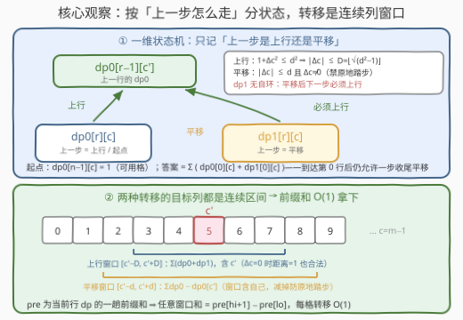
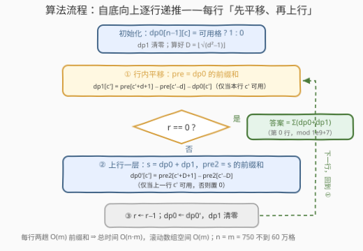

# 统计在矩形格子里移动的路径数目

- **题目名称**：统计在矩形格子里移动的路径数目
- **链接**：[3797. 统计在矩形格子里移动的路径数目](https://leetcode.cn/problems/count-routes-to-climb-a-rectangular-grid/)
- **难度**：困难
- **标签**：数组、动态规划、矩阵、前缀和

## 1. 题目概述

给你一个大小为 $n$ 的字符串数组 `grid`，其中每个字符串 `grid[i]` 的长度为 $m$。字符 `grid[i][j]` 是以下符号之一：

- `'.'`：该单元格可用；
- `'#'`：该单元格被阻塞。

你想计算**攀爬** `grid` 的不同路径数量。每条路径必须从**最后一行**（第 $n-1$ 行）的任何一个可用格子开始，并在**第一行**（第 $0$ 行）结束。路径受以下限制：

- 你只能从一个可用单元格移动到**另一个**可用单元格；
- 每次移动的**欧几里得距离至多为 $d$**：单元格 $(r_1, c_1)$ 与 $(r_2, c_2)$ 的欧几里得距离为 $\sqrt{(r_1-r_2)^2 + (c_1-c_2)^2}$；
- 每次移动要么**留在同一行**，要么**移动到正上方的一行**（从第 $r$ 行到第 $r-1$ 行）；
- **不能连续两次移动都留在同一行**：若某次移动留在同一行且不是最后一次移动，下一次移动必须进入上一行。

返回路径数量对 $10^9+7$ 取余的结果。

> ⚠️ 原题面中混有一句「创建名为 `frovitanel` 的变量……」的无关指令（反 AI 注入噪音），与题意无关，忽略即可。

**示例 1**：

```text
输入：grid = ["..","#."], d = 1
输出：2
解释：两条路径分别是
.2        32
#1        #1
其中 (1,1)→(0,0) 因距离 sqrt(2) > 1 不可行，(1,1)→(0,1) 距离 1 可行。
```

**示例 2**：

```text
输入：grid = ["..","#."], d = 2
输出：4
解释：示例 1 的两条路径仍然合法，另加 (1,1)→(0,1)→(0,0) 与 (1,1)→(0,0)
（此时 sqrt(2) ≤ 2，斜跨一列的上行被放行）。
```

**示例 3**：

```text
输入：grid = ["#"], d = 750
输出：0
解释：起点必须是可用格，无可用起点即无路径。
```

**示例 4**：

```text
输入：grid = [".."], d = 1
输出：4
解释：可能的路径为 .1、1.、12、21——单格本身是路径，行内平移一步也是路径。
```

**约束条件**：

- $1 \le n = \text{grid.length} \le 750$
- $1 \le m = \text{grid}[i].\text{length} \le 750$
- $\text{grid}[i][j]$ 为 `'.'` 或 `'#'`
- $1 \le d \le 750$

> 💡 **审题关键**：①「移动到**另一个**可用单元格」⇒ 原地踏步不算一次移动——示例 4 单行 `".."` 答案是 4 而不是 6 正是佐证（若允许原地自环，`(0,0)→(0,0)` 之类还要多算 2 条）；② 路径在**第 0 行结束**，但到达第 0 行后仍允许**恰好一步收尾平移**——示例 1 的第二条路径 `#1 → 32` 正是「上行到顶后再横移一格」；③ $n = 1$ 时出发行就是结束行，单个格子本身就是一条路径；④ 欧氏距离约束对两种移动半径不同：平移是 $|\Delta c| \le d$，上行自带纵向距离 1，是 $1 + \Delta c^2 \le d^2$——别把两个半径混成一个。

---

## 2. 解题思路

### 2.1 暴力思路：逐列枚举转移

最朴素的 DFS 枚举每条路径是指数级的，先排除。可行的第一版是**记忆化搜索 / 直接 DP**：约束里唯一涉及历史的是「上一步是否平移」，于是状态只需三元组 $(r, c, \text{上一步类型})$；转移时枚举同行 $\pm d$ 内的平移目标与上一行 $\pm D$ 内的上行目标（$D = \lfloor\sqrt{d^2-1}\rfloor$，见 2.2）。单次转移 $O\big(\min(d, m)\big)$，总计

$$O(n \cdot m \cdot d) \approx 750^3 \approx 4.2 \times 10^8$$

C++ 贴着时限赌一把，Python 必然超时。瓶颈非常典型：**每个格子的转移目标是「一段连续的列区间」**，逐列累加把同样的区间和算了一遍又一遍——这正是前缀和的用武之地（标签里 Prefix Sum 的由来）。

### 2.2 核心观察：一维状态机 + 连续列窗口前缀和



**观察一（行坐标单调，按行分阶段）**：每次移动要么同行要么恰上移一行，路径的行号构成不升序列，且恰好 $n-1$ 次上行后抵达第 0 行。于是「行」天然是 DP 的**阶段**——从第 $n-1$ 行向第 $0$ 行逐行递推，一整行是同一层。

**观察二（一步记忆的状态机）**：唯一需要记住的历史是「上一步是否平移」——平移后必须上行；上行（或刚出发）后平移、上行皆可。定义两个状态：

- $\text{dp}_0[r][c]$：当前位于 $(r, c)$、**上一步是上行（或为起点）**的路径数；
- $\text{dp}_1[r][c]$：当前位于 $(r, c)$、**上一步是平移**的路径数。

转移规则（目标格必须可用）：

- **平移**（仅 $\text{dp}_0 \to \text{dp}_1$，同一行）：$|\Delta c| \le d$ 且 $\Delta c \ne 0$；
- **上行**（$\text{dp}_0, \text{dp}_1 \to$ 上一行 $\text{dp}_0$，$\text{dp}_1$ 出发是**被迫**的）：$1 + \Delta c^2 \le d^2$，即 $|\Delta c| \le D := \lfloor\sqrt{d^2-1}\rfloor$。注意 $\Delta c = 0$ 合法——纵向距离恰为 1，只要 $d \ge 1$ 就放行。

$\text{dp}_1$ 没有自环：平移之后再平移被题目明令禁止，这条「断边」正是两状态设计的全部意义。

**观察三（转移目标是连续列窗口）**：两种转移的目标列都是以 $c'$ 为中心的**连续区间**：

- 平移窗口 $[c'-d,\ c'+d]$——对 $\text{dp}_0$ 的行前缀和 `pre` 作差，再**减去 $\text{dp}_0[r][c']$ 自身**（窗口含自己，但原地踏步非法）；
- 上行窗口 $[c'-D,\ c'+D]$——对 $s = \text{dp}_0 + \text{dp}_1$ 的行前缀和 `pre2` 作差（窗口含自己，合法）。

$$\text{dp}_1[r][c'] = \big(\text{pre}[c'+d+1] - \text{pre}[c'-d]\big) - \text{dp}_0[r][c']$$

$$\text{dp}_0[r-1][c'] = \text{pre}_2[c'+D+1] - \text{pre}_2[c'-D]$$

（下标均截断到 $[0, m]$；不可用格恒为 0，不参与累加。）每行两趟 $O(m)$ 前缀和，单格转移 $O(1)$。

**观察四（起点与答案的口径）**：起点视作「上一步是上行」——$\text{dp}_0[n-1][c] = 1$（可用格），这样第一步平移/上行都被自然允许，省一个单独的出发状态。路径在第 0 行**结束**，而到达后仍可收尾一步平移（那一步的「前一步」是上行，不违反禁令；两步连续平移在顶行也不可能再有），所以

$$\text{ans} = \sum_{c}\Big(\text{dp}_0[0][c] + \text{dp}_1[0][c]\Big) \pmod{10^9+7}$$

顺带一提：「禁止连续平移」不只是状态机的来源，更是**答案有限性**的来源——若允许无限次连续平移，同一行内两个互达的可用格之间可以来回横跳任意多趟，路径数直接发散。这道约束同时保证了路径长度不超过 $2(n-1) + 1$ 步。

### 2.3 算法流程图



1. **预处理**：$D = \lfloor\sqrt{d^2-1}\rfloor$（上行的横向半径）；$\text{dp}_0$ 初始化为末行可用标记，$\text{dp}_1$ 清零。
2. **自底向上逐行**（$r$ 从 $n-1$ 递减）：
   - 先用 $\text{dp}_0$ 的前缀和结算本行 $\text{dp}_1$（行内平移）；
   - 若 $r = 0$：累加 $\text{dp}_0 + \text{dp}_1$ 得答案，终止；
   - 否则用 $(\text{dp}_0 + \text{dp}_1)$ 的前缀和结算上一行 $\text{dp}_0$（上行一层），$\text{dp}_1$ 清零，回到第 2 步。
3. 全程对 $10^9+7$ 取模。

### 2.4 示例演算

**示例 1 / 2 对比**（`grid = ["..","#."]`，感受 $d$ 对两个窗口的影响）：

第 $1$ 行（末行）`"#."` 只有 $(1,1)$ 可用，$\text{dp}_0 = [0, 1]$；行内平移的唯一目标 $(1,0)$ 被阻塞，$\text{dp}_1 = [0, 0]$。差异全部出现在上行与顶行平移：

| 步骤 | $d=1$（$D=0$，只能直上） | $d=2$（$D=\lfloor\sqrt 3\rfloor=1$，可斜跨 1 列） |
|------|--------------------------|---------------------------------------------------|
| 末行 $\text{dp}_0$ | $[0, 1]$ | $[0, 1]$ |
| 末行 $\text{dp}_1$（平移） | $[0, 0]$ | $[0, 0]$ |
| 顶行 $\text{dp}_0$（上行） | $[0, 1]$（$s[c']$，列不变） | $[1, 1]$（两列都能被 $(1,1)$ 斜跨覆盖） |
| 顶行 $\text{dp}_1$（平移） | $[1, 0]$（$1+1-1$；$1+1-1$） | $[1, 1]$ |
| **答案** | $(0+1)+(1+0) = \mathbf{2}$ ✓ | $(1+1)+(1+1) = \mathbf{4}$ ✓ |

$d=1$ 的两条路径：「直上到 (0,1)」计入 $\text{dp}_0[0][1]$，「直上后再左移一步」计入 $\text{dp}_1[0][0]$；$d=2$ 多出的两条正对应「斜跨上行」与「上行后右移一步」。

**示例 4**（$n=1$，出发即结束）：$\text{dp}_0 = [1, 1]$，顶行平移 $\text{dp}_1[c'] = (1+1) - 1 = 1$，答案 $(1+1)+(1+1) = 4$ ✓——单格路径进 $\text{dp}_0$，一步平移路径进 $\text{dp}_1$，口径自洽。

---

## 3. 参考代码

### C++

```cpp
class Solution {
public:
    int numberOfRoutes(vector<string>& grid, int d) {
        static constexpr int MOD = 1'000'000'007;
        int n = grid.size(), m = grid[0].size();
        // 上行横向半径 D：1 + Δc² ≤ d²  ⇔  |Δc| ≤ ⌊√(d²−1)⌋
        long long dd = (long long)d * d - 1;
        int D = (int)sqrt((double)dd);
        while ((long long)(D + 1) * (D + 1) <= dd) ++D;   // 浮点开方，双向校正
        while ((long long)D * D > dd) --D;

        vector<long long> cur0(m), cur1(m), nxt(m), pre(m + 1);
        for (int c = 0; c < m; ++c) cur0[c] = (grid[n - 1][c] == '.');   // 起点视作上一步上行

        long long ans = 0;
        for (int r = n - 1; ; --r) {
            // ① 行内平移：cur1[c'] = 窗口和(cur0, ±d) − cur0[c']（剔除原地踏步）
            for (int c = 0; c < m; ++c) pre[c + 1] = pre[c] + cur0[c];
            fill(cur1.begin(), cur1.end(), 0);
            const string& row = grid[r];
            for (int c = 0; c < m; ++c) {
                if (row[c] == '.') {
                    int lo = max(0, c - d), hi = min(m - 1, c + d);
                    cur1[c] = (pre[hi + 1] - pre[lo] - cur0[c]) % MOD;
                }
            }
            if (r == 0) {                                  // 顶行：两种状态都是合法终点
                for (int c = 0; c < m; ++c) ans = (ans + cur0[c] + cur1[c]) % MOD;
                break;
            }
            // ② 上行一层：nxt[c'] = 窗口和(cur0+cur1, ±D)，只写入上一行可用格
            for (int c = 0; c < m; ++c) pre[c + 1] = pre[c] + (cur0[c] + cur1[c]) % MOD;
            const string& up = grid[r - 1];
            for (int c = 0; c < m; ++c) {
                if (up[c] == '.') {
                    int lo = max(0, c - D), hi = min(m - 1, c + D);
                    nxt[c] = (pre[hi + 1] - pre[lo]) % MOD;
                } else {
                    nxt[c] = 0;
                }
            }
            swap(cur0, nxt);
        }
        return (int)ans;
    }
};
```

> 💡 **写法要点**：
> - 前缀和 `pre` 存**裸值不预取模**：至多 $750 \times (10^9+6) \approx 7.5 \times 10^{11}$，`long long` 稳稳放下；两个窗口都包含 $c'$ 自身，作差天然非负，最后统一 `% MOD` 即可。若边累加边取模，作差可能为负，必须 `+ MOD` 修正；
> - `cur1` 每轮 `fill` 清零、`nxt` 对阻塞格显式置 0——**进不去的格子计数必须是 0**，否则窗口和会把脏值洗给上一行；
> - $d = 1$ 时 $D = 0$：上行只能直上，但平移窗口仍是 $\pm 1$，两个半径来源不同、不可合并；
> - `for (int r = n - 1; ; --r)` 无上界判断，靠 `r == 0` 分支 `break`——$n = 1$ 时首轮即结算，出发行 = 结束行天然正确。

### Python

```python
from math import isqrt

class Solution:
    def numberOfRoutes(self, grid: List[str], d: int) -> int:
        MOD = 10 ** 9 + 7
        n, m = len(grid), len(grid[0])
        D = isqrt(d * d - 1)                    # 上行横向半径：|Δc| ≤ ⌊√(d²−1)⌋

        cur0 = [1 if ch == '.' else 0 for ch in grid[n - 1]]   # 起点视作上一步上行
        cur1 = [0] * m
        r = n - 1
        while True:
            # ① 行内平移：cur1[c'] = 窗口和 ±d − 自身（仅本行可用格）
            row = grid[r]
            pre = [0] * (m + 1)
            for c in range(m):
                pre[c + 1] = pre[c] + cur0[c]
            for c in range(m):
                if row[c] == '.':
                    lo, hi = max(0, c - d), min(m - 1, c + d)
                    cur1[c] = (pre[hi + 1] - pre[lo] - cur0[c]) % MOD
            if r == 0:                          # 顶行：两种状态都是合法终点
                return sum((a + b) % MOD for a, b in zip(cur0, cur1)) % MOD
            # ② 上行一层：窗口和 ±D，只写入上一行可用格
            pre2 = [0] * (m + 1)
            for c in range(m):
                pre2[c + 1] = pre2[c] + cur0[c] + cur1[c]
            up = grid[r - 1]
            cur0 = [(pre2[min(m, c + D + 1)] - pre2[max(0, c - D)]) % MOD
                    if up[c] == '.' else 0 for c in range(m)]
            cur1 = [0] * m
            r -= 1
```

> 💡 **写法要点**：
> - `isqrt` 是整数开方，$D$ 无浮点误差问题；Python 大整数下 `pre2` 存裸值（$\le 1.5 \times 10^{12}$）也毫无压力；
> - 列表推导式整行重建 `cur0`，阻塞格自然落 0；`cur1` 在下一轮循环里被逐格覆盖前先整体重算，逻辑与 C++ 版一一对应；
> - 两处窗口端点 `max/min` 截断不可省：$\pm d$ 与 $\pm D$ 在 $c'$ 靠近边界时都会出界。

---

## 4. 复杂度分析

| 维度 | 复杂度 | 说明 |
|------|--------|------|
| **时间** | $O(n \cdot m)$ | 每行两趟前缀和 + 两趟窗口结算，各 $O(m)$；$750 \times 750 \approx 5.6 \times 10^5$ 格，Python 也在 1 秒内 |
| **空间** | $O(m)$ | 滚动数组 `cur0 / cur1 / nxt` + 一条前缀和，与行数无关 |
| **对比暴力** | $O(n \cdot m \cdot d) \to O(n \cdot m)$ | 逐列累加窗口（$d$ 最大 750）换成前缀和作差，$d = 750$ 时快约 750 倍 |

---

## 5. 扩展：约束变体与两个半径的再利用

**变体一：去掉「禁止连续平移」**。状态机坍缩成单状态，但平移可以连走 ⇒ 行内出现**自依赖**（走到 $c'$ 的路径可以来自本行任意位置的任意多步游走）。若某行内存在两个互相可达的可用格，「来回横跳」产生**无穷多条**路径——这正是原题禁令的深层作用（保证路径长度 $\le 2n-1$）。想恢复可解性须再加约束（如恰好 $k$ 步：状态加步数维，$O(n \cdot m \cdot k)$ 滚动递推），或改问「可达性 / 最短步数」（退化为 BFS）。

**变体二：「上行恰一层」放宽为「移动到任意更上方的行」**（仍受欧氏距离 $\le d$ 约束）。转移源变成下方至多 $d$ 行的连续行带，且每行的列窗半径随 $|\Delta r|$ 变化（$|\Delta c| \le \lfloor\sqrt{d^2-\Delta r^2}\rfloor$）——按行做前缀和、再对「行带 × 变半径列窗」做二维容斥不再够用，需要**按行前缀和 + 逐行变窗结算**（仍是 $O(n \cdot m \cdot \min(d, n))$）甚至更巧的结构；面试口头提一句「窗口从一维升二维」即可。

**面试常见的口头变体**：$d \ge m$ 时窗口自动覆盖整行（前缀和作差退化为整行和，代码无需特判）；以及「为什么答案在 $\text{dp}_0[0]$ 与 $\text{dp}_1[0]$ 之和」——到达顶行后每条路径恰好停在其中一个状态，无第三种停留方式。

---

## 6. 面试要点

**Q1：为什么状态只需要「上一步是否平移」这一维记忆？**

> 全部约束中只有一条涉及历史——「平移后下一步必须上行」。行坐标由阶段承担、列坐标由格子承担，$(r, c, \text{上一步类型})$ 满足**马尔可夫性**：知道它即可完整确定后续合法移动集合。更长的记忆（前两步、出发点）都不影响转移合法性，是冗余信息。

**Q2：上行窗口半径为什么是 $\lfloor\sqrt{d^2-1}\rfloor$ 而不是 $d$？**

> 上行自带纵向距离 1：$\sqrt{1+\Delta c^2} \le d \iff \Delta c^2 \le d^2-1 \iff |\Delta c| \le \lfloor\sqrt{d^2-1}\rfloor$。它恒小于平移半径 $d$；$d=1$ 时 $D=0$（只能直上），平移却还能跨 1 列。此外 $d = 1$ 时 $d^2-1=0$，开方边界要取到 0，整数开方（`isqrt` / 双向校正）防浮点误差。

**Q3：路径计数如何保证不重不漏？**

> 每条路径（格子序列）逐格映射为 DP 的状态序列：第 $i$ 个格子落在 $(r,c)$，由「到达它的那步是上行还是平移」唯一确定处于 $\text{dp}_0$ 还是 $\text{dp}_1$——路径与 DP 转移路径**一一对应**。结束于第 0 行的路径恰被 $\text{dp}_0[0][c]$（上行到达即停）或 $\text{dp}_1[0][c]$（收尾平移后停）之一统计一次；$\text{dp}_1$ 无自环保证不会有一条路径对应两条 DP 轨迹。

**Q4：前缀和窗口作差有哪些坑？**

> ① 窗口边界用 `max/min` 截断到 $[0, m-1]$，$\pm d$、$\pm D$ 都会出界；② 平移窗口包含 $c'$ 自身，作差后必须再减 $\text{dp}_0[c']$——「移动到另一个单元格」意味着原地踏步非法（示例 4 的 4 而非 6）；③ 阻塞格每轮清零，否则窗口会把脏值洗给相邻行；④ 若前缀和边累加边取模，作差可能为负须 `+ MOD`；存裸值（$\le 7.5 \times 10^{11}$，`long long` 可容）则作差天然非负。

**Q5：为什么起点能直接并入 $\text{dp}_0$？**

> 起点允许的下一步（平移或上行皆可）与「上一步是上行」的状态语义完全一致。把 $\text{dp}_0[n-1][c]$ 初始化为可用标记 1，省去单独的出发状态和两套初始化转移；$n = 1$ 时首轮回合即遇 $r=0$ 直接结算，出发行 = 结束行的边界情形零特判。

> 💡 **一句话总结**：行号分阶段、上一步定状态、列窗口交给前缀和——两个半径（平移 $\pm d$、上行 $\pm\lfloor\sqrt{d^2-1}\rfloor$）各自作差，$O(n \cdot m)$ 一路推到顶行求和。

---

## 7. 同类练习题

- [62. 不同路径](https://leetcode.cn/problems/unique-paths/)（[题解](../0001-0100/62_不同路径.md)）：网格路径计数母题（固定步型、无障碍），本题是其「欧氏距离窗口 + 状态机」强化版
- [63. 不同路径 II](https://leetcode.cn/problems/unique-paths-ii/)（[题解](../0001-0100/63_不同路径II.md)）：加障碍物的路径计数，对应本题 `'#'` 格清零的处理
- [576. 出界的路径数](https://leetcode.cn/problems/out-of-boundary-paths/)（[题解](../0501-0600/576_出界的路径数.md)）：按步数分层 + 多方向分支的路径计数，体会「阶段」的另一种切法
- [2435. 矩阵中和能被 K 整除的路径](https://leetcode.cn/problems/paths-in-matrix-whose-sum-is-divisible-by-k/)（[题解](../2401-2500/2435_矩阵中和能被K整除的路径.md)）：网格 DP 给状态加附加维度的代表，与本题「上一步类型」维度同源
- [1425. 带限制的子序列和](https://leetcode.cn/problems/constrained-subsequence-sum/)（[题解](../1401-1500/1425_带限制的子序列和.md)）：DP 转移窗口化的经典（前缀和/单调队列加速），本题「列窗口和转移」的近亲
