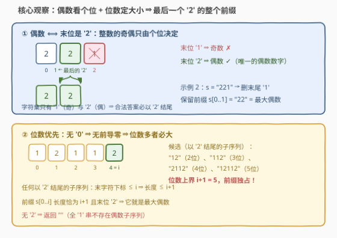
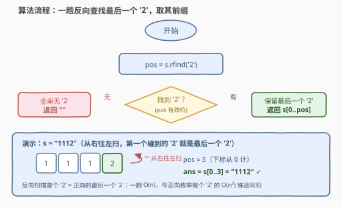

# 最大的偶数

- **题目名称**：最大的偶数
- **链接**：[3798. 最大的偶数](https://leetcode.cn/problems/largest-even-number/)
- **难度**：简单
- **标签**：贪心、字符串

## 1. 题目概述

给你一个仅由字符 `'1'` 和 `'2'` 组成的字符串 $s$。

你可以删除字符串 $s$ 中的**任意数量的字符**，但必须保持剩余字符的**顺序不变**。

返回可以表示**偶数**整数的**最大结果字符串**。如果不存在这样的字符串，则返回空字符串 `""`。

**示例 1**：

```text
输入：s = "1112"
输出："1112"
解释：该字符串已经表示了最大的偶数，因此不需要删除任何字符。
```

**示例 2**：

```text
输入：s = "221"
输出："22"
解释：删除 '1' 后，可以得到最大的偶数，即 22。
```

**示例 3**：

```text
输入：s = "1"
输出：""
解释：无法通过删除字符得到偶数。
```

**约束条件**：

- $1 \le s.length \le 100$
- $s$ 仅由字符 `'1'` 和 `'2'` 组成。

> 💡 **审题关键**：① 删字符保序 = 在 $s$ 的**子序列**里挑答案；② 整数的奇偶性**只由个位决定**，而字符集里唯一的偶数数字是 `'2'`，所以答案必须以 `'2'` 结尾；③ 字符集没有 `'0'`，任何保留结果都**无前导零**，于是「比大小」先比位数——这把贪心证明化到最简；④ $n \le 100$ 位，结果可能远超 64 位整数，全程按**字符串**处理，不要转数值。

---

## 2. 解题思路

### 2.1 暴力思路

最朴素的枚举：$s$ 的每个子序列都试一遍（$2^n$ 个），留下末位是 `'2'` 的那些，再比较数值取最大——指数级，$n=100$ 时天文数字。

稍微收敛一点：答案必须以某个 `'2'` 结尾，那枚举「以每个 `'2'` 结尾的最长子序列」——即每个 `'2'` 位置 $p$ 给出候选 $s[0..p]$，共 $O(n)$ 个候选，两两比较是 $O(n^2)$。这已经接近了，但还差最后一层窗户纸：**这些候选里谁最大？**

### 2.2 核心观察：找最后一个 `'2'`，保留它的整个前缀



两个性质合起来直接给出答案：

**性质一（偶数 ⟺ 末位是 `'2'`）**：整数的奇偶性只看个位。字符集只有 `'1'`（奇）和 `'2'`（偶），所以合法答案必须以 `'2'` 结尾；一个 `'2'` 都没有时无解，返回 `""`。

**性质二（位数优先）**：保留的字符全是 `'1'`/`'2'`，首位永不为零，于是**位数多的正整数一定更大**——连逐位比较都不用看。

设 $s$ 中**最后一个 `'2'` 的下标为 $i$**。任何以 `'2'` 结尾的子序列，其末字符只能是 $s$ 中某个 `'2'`，下标必 $\le i$，因此**长度 $\le i+1$**。而前缀 $s[0..i]$ 恰好以 `'2'` 结尾、长度恰为 $i+1$，**独占这个上界**（长度 $i+1$ 且末字符下标 $\le i$ 的子序列只能整段保留 $s[0..i]$）。

结论一步到位：

$$\text{ans} = \begin{cases} s[0..i] & \text{若存在 '2'} \\ \text{""} & \text{否则} \end{cases}$$

### 2.3 算法流程图



**逻辑执行步骤**：

| 步骤 | 操作 | 说明 |
|------|------|------|
| ① 反向查找 | `pos = s 中最后一个 '2' 的下标` | C++ `rfind('2')` / Python `rfind('2')` |
| ② 存在性判定 | `pos` 找到了吗？ | 没有任何 `'2'` ⇒ 无偶数子序列 |
| ③ 无解分支 | 返回 `""` | 全 `'1'` 串的宿命 |
| ④ 有解分支 | 返回 `s[0..pos]` | 保留到最后一个 `'2'` 的整个前缀 |

### 2.4 示例演算

| 输入 | 最后一个 `'2'` 的下标 | 保留前缀 | 输出 | 备注 |
|------|----------------------|----------|------|------|
| `"1112"` | $3$ | $s[0..3]$ | `"1112"` | 整串已是最大偶数 |
| `"221"` | $1$ | $s[0..1]$ | `"22"` | 末尾 `'1'` 被丢弃 |
| `"1"` | 不存在 | — | `""` | 无 `'2'` 即无偶数 |

以 `"221"` 走一遍贪心论证：合法候选是所有以 `'2'` 结尾的子序列——`"2"`（首位那个）、`"22"`，长度上界是 $i+1=2$，前缀 `"22"` 独占上界且末位为 `'2'`，即最大偶数 $22$ ✓。

---

## 3. 参考代码

### C++

```cpp
class Solution {
public:
    string largestEven(string s) {
        size_t pos = s.rfind('2');
        return pos == string::npos ? "" : s.substr(0, pos + 1);
    }
};
```

> 💡 **写法要点**：
> - `rfind('2')` 一趟反向扫描，找不到返回 `string::npos`，是「找最后一个字符」的惯用一行；
> - `substr(0, pos + 1)` 取含末位 `'2'` 的前缀，长度恰好 $i+1$；
> - 结果最长 100 位，全程按字符串操作，**不要**试图转成数值类型。

### Python

```python
class Solution:
    def largestEven(self, s: str) -> str:
        pos = s.rfind('2')
        return "" if pos == -1 else s[:pos + 1]
```

> 💡 **写法要点**：
> - `rfind` 找不到返回 `-1`，与 C++ 的 `npos` 语义对应，注意两者判定写法不同；
> - `s[:pos + 1]` 切片含头含尾（右端开区间 +1），一步取出前缀。

---

## 4. 复杂度分析

| 维度 | 复杂度 | 说明 |
|------|--------|------|
| **时间** | $O(n)$ | `rfind` 一趟反向扫描，$n \le 100$ |
| **空间** | $O(1)$ 额外 | 仅下标与返回串本身；返回串是输出，不计入 |
| **对比** | 贪心 vs 暴力 | 暴力子序列枚举 $O(2^n)$；贪心把「挑哪个子序列」压成一个下标 |

---

## 5. 扩展：字符集推广到 `'0'`–`'9'`

若 $s$ 是**任意数字字符串**（仍保证无前导零地删字符），「最大偶数」要分两种情况：

- 存在偶数数字：**挑最大的偶数数字 $d$ 放末位**，其余字符**降序**排前面（位数尽量多、高位尽量大）。例如 `"1234"` → 前三位降序 `"432"` + 末位 `'4'`？注意 `'4'` 只出现一次时末位要用次大的偶数数字——细节在于**末位数字可能同时出现在高位**，需从降序序列里去掉一个与末位相同的字符；
- 只有奇数数字：无解，返回 `""`。

本题的 `'1'`/`'2'` 字符集是它的极简特例：偶数数字唯一（`'2'`），且「其余字符降序」退化为「原样全保留」（相对顺序下 `'1'` 和 `'2'` 怎么排都是原串前缀的一部分）。想透了推广版，再看本题会有一眼丁真的通透感。

---

## 6. 面试要点

**Q1：为什么答案必须以 `'2'` 结尾？**

> 整数的奇偶性只由**个位**决定：个位为偶数数字则偶。本题字符集只有 `'1'`（奇）和 `'2'`（偶），所以合法答案末位只能是 `'2'`；字符串中一个 `'2'` 都没有时，任何子序列都以 `'1'` 结尾或为空，无偶数解。

**Q2：为什么保留到最后一个 `'2'` 的前缀就是最大的？请严格论证。**

> 三步：① 合法候选 = 以 `'2'` 结尾的子序列；② 设最后一个 `'2'` 下标为 $i$，任何此类子序列的末字符下标 $\le i$，故长度 $\le i+1$；③ 前缀 $s[0..i]$ 长度恰为 $i+1$ 且末位为 `'2'`，独占上界（要凑满 $i+1$ 长只能整段保留该前缀）。字符全非零 ⇒ 无前导零 ⇒ 位数多者数值大，故该前缀即最大偶数。

**Q3：结果最长 100 位，需要担心数值溢出吗？**

> 不需要也不允许：$10^{100}$ 远超 `long long`（约 $9.2\times10^{18}$）。全程按字符串操作（`rfind` + 切片/`substr`），「比较大小」也被位数优先 + 贪心证明绕开了，根本不发生数值运算。

**Q4：如果改成「最大的奇数」呢？**

> 奇数末位是 `'1'`。取**最后一个 `'1'`** 的前缀？不对——要位数最多，应取**最后一个 `'1'` 的下标 $j$ 的前缀**吗？也不对：`'2'` 也是合法字符。正确做法：答案以最后一个 `'1'` 结尾时位数上界为 $j+1$，但中间的 `'2'` 不影响合法性，所以贪心失效，需要更细的论证（末位定为最后一个 `'1'`，保留其前全部字符即可，论证同本题主线）。这题留作思考：两道题共享「位数优先 + 末位定奇偶」的骨架，差别只在末位找谁。

**Q5：这题的贪心和 402「移掉 K 位数字」有什么同源之处？**

> 都是「删字符保序，使剩余数字最优」。402 删恰好 $k$ 个使数最小，用单调栈维护「高位递增」；本题删任意个使数最大且限定偶数，用「位数上界 + 前缀独占」一步到位。共同的底层视角：**子序列的字典序/数值最优，几乎总由「能保多长就保多长 + 关键位约束」决定**。

> 💡 **一句话总结**：偶数 ⟺ 末位 `'2'`；字符全非零 ⇒ 位数优先；最后一个 `'2'` 的前缀独占长度上界。三行推理换来一行代码：`rfind('2')` + 切前缀。

---

## 7. 同类练习题

- [402. 移掉 K 位数字](https://leetcode.cn/problems/remove-k-digits/)（[题解](../0401-0500/402_移掉K位数字.md)）：同样是删字符保序求最优数，单调栈贪心版
- [321. 拼接最大数](https://leetcode.cn/problems/create-maximum-number/)（[题解](../0301-0400/321_拼接最大数.md)）：从两个串里删字符拼出最大数，位数与字典序贪心进阶
- [179. 最大数](https://leetcode.cn/problems/largest-number/)（[题解](../0101-0200/179_最大数.md)）：自定义排序拼接使数字最大，「比大小」贪心的经典
- [738. 单调递增的数字](https://leetcode.cn/problems/monotone-increasing-digits/)（[题解](../0701-0800/738_单调递增的数字.md)）：构造满足位约束的最大数字，贪心构造思路同源
- [1663. 具有给定数值的最小字符串](https://leetcode.cn/problems/smallest-string-with-a-given-numeric-value/)（[题解](../1601-1700/1663_具有给定数值的最小字符串.md)）：按位贪心构造字典序最小串，正反两面的练习
