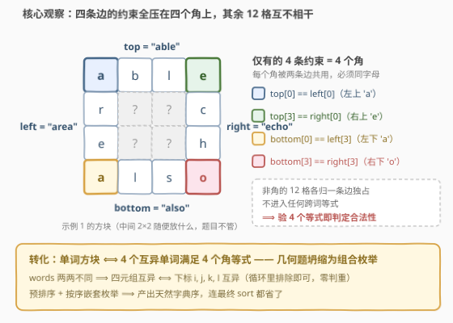
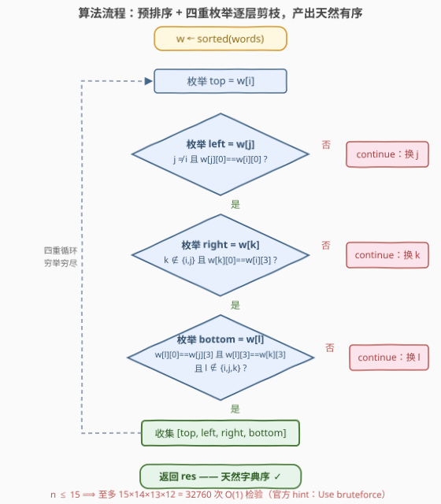

# LeetCode 单词方块II 题解

## 1. 题目概述

- **标题 / 题号**：单词方块II（#3799，medium）
- **链接**：https://leetcode.cn/problems/word-squares-ii/
- **难度**：中等
- **标签**：数组、字符串、回溯、枚举、排序

**题意**：给你一个字符串数组 `words`，包含一组**互不相同**且仅由小写英文字母组成的**四字母**字符串。

**单词方块**由 4 个**互不相同**的单词 `top`、`left`、`right`、`bottom` 组成，按如下方式排列：

- `top` 形成**顶部行**；
- `bottom` 形成**底部行**；
- `left` 形成**左侧列**（从上到下）；
- `right` 形成**右侧列**（从上到下）。

它必须满足以下条件：

- `top[0] == left[0]`，`top[3] == right[0]`
- `bottom[0] == left[3]`，`bottom[3] == right[3]`

返回所有满足题目要求的**不同**单词方块，按 4 元组 `(top, left, right, bottom)` 的**字典序升序**排序。

**示例 1**：

```text
输入：words = ["able","area","echo","also"]
输出：[["able","area","echo","also"],["area","able","also","echo"]]
解释：有且仅有两个合法方块：
  ① top="able", left="area", right="echo", bottom="also"
     —— top[0]=left[0]='a'，top[3]=right[0]='e'，
        bottom[0]=left[3]='a'，bottom[3]=right[3]='o'
  ② top="area", left="able", right="also", bottom="echo"
     —— 四个角的约束同样全部满足。
```

**示例 2**：

```text
输入：words = ["code","cafe","eden","edge"]
输出：[]
解释：没有任何四个单词的组合能满足所有四个角的约束。
```

**约束**：

- $4 \le \text{words.length} \le 15$
- $\text{words}[i].\text{length} = 4$
- `words[i]` 仅由小写英文字母组成
- 所有 `words[i]` **互不相同**

> 💡 **审题关键**：① 把 $4\times4$ 方块画出来会发现——`top[0]` 与 `left[0]` 指向**同一个格子**（左上角），四个条件恰好是四个角格的「两条边共用」约束；② 除 4 个角外，其余 12 个格子**不参与任何跨词等式**；③ $n\le15$、词长恒为 4，全部有序四元组至多 $A(15,4)=32760$ 个——官方 hint 直接写着 *Use bruteforce*；④ 输出要求按四元组字典序，**预排序 + 按序枚举**可以把最后的排序也省掉。

## 2. 解题思路

### 2.1 暴力思路

最朴素的做法：穷举 `words` 的全部有序四元组 $(top, left, right, bottom)$，逐个检验 4 个角等式，最后 `sort` 一次输出：

```python
res = [list(t) for t in itertools.permutations(words, 4)
       if t[0][0] == t[1][0] and t[0][3] == t[2][0]
       and t[3][0] == t[1][3] and t[3][3] == t[2][3]]
res.sort()
```

在 $n\le15$ 下这已经能过（$A(15,4)=32760$ 次检验）。但有两个可以白拿的优化：

- **免最终排序**：先 `sorted(words)` 再四重嵌套循环按索引序枚举，产出天然字典序；
- **免无效组合**：把 4 个等式拆进对应层循环**内联剪枝**（如 `w[j][0] != w[i][0]` 直接 `continue`），大部分垃圾组合在第二层就被丢弃。

### 2.2 核心观察：约束全在四个角，枚举即有序



三条性质支撑起整个解法：

1. **角格共用，一角一等式**：`top[0]` 与 `left[0]` 是**同一格**（左上角），`top[3]` 与 `right[0]` 同为右上角，`bottom[0]` 与 `left[3]` 同为左下角，`bottom[3]` 与 `right[3]` 同为右下角——四个条件本质上就是「四个角格分别被两条边共用，字母必须一致」。**其余 12 格各归一条边独占，互不牵连**，合法性判断与它们完全无关；

2. **互不相同 ⟺ 索引互异**：题面保证 `words` 两两不同，因此四元组内四个词互不相同当且仅当四个下标 $i,j,k,l$ 互异——循环里用 `k ∉ {i,j}`、`l ∉ {i,j,k}` 排除即可，零额外判重；

3. **预排序白嫖字典序**：把 `words` 排序成 $w$ 后按下标嵌套枚举，下标元组的枚举顺序就是字典序；又因 $w$ 严格递增，「下标序」与「单词序」完全同步，**产出即字典序**，连最后的 `sort` 一步都省了。

> 💡 **关键转化**：把「在 $4\times4$ 网格里构造方块」的几何问题，坍缩成「枚举 4 个互异下标 + 验 4 个等式」的纯组合枚举——几何直觉负责看清约束落点，组合枚举负责收尾。

### 2.3 算法流程图



| 步骤 | 操作 | 剪枝 / 说明 |
|------|------|-------------|
| ① 排序 | `w = sorted(words)` | 为输出字典序铺路 |
| ② 枚举 top | `for i in range(n)` | 最外层 |
| ③ 枚举 left | `j ≠ i` 且 `w[j][0] == w[i][0]` | 不同词 + 左上角等式 |
| ④ 枚举 right | `k ∉ {i,j}` 且 `w[k][0] == w[i][3]` | 右上角等式：top 尾 = right 首 |
| ⑤ 枚举 bottom | `l ∉ {i,j,k}` 且 `w[l][0] == w[j][3]` 且 `w[l][3] == w[k][3]` | 左下 + 右下两个角同时卡 |
| ⑥ 收集 | 追加 `[w[i], w[j], w[k], w[l]]` | 天然字典序，免排序 |

> ⚠️ **易错点**：第 ⑤ 层是**两个**等式同时成立（`bottom[0]==left[3]` 与 `bottom[3]==right[3]`），漏验任何一个都会把非法方块混进结果——示例 2 恰好就卡在「首字母都对、尾字母配不齐」这一步。

### 2.4 示例演算

以示例 1 演算，排序后 $w=$ `[able, also, area, echo]`：

| top | left（须 'a' 开头） | right（须 top 尾字母开头） | bottom（须 left 尾开头 + right 尾结尾） | 结果 |
|-----|--------------------|---------------------------|------------------------------------------|------|
| able | also | echo（'e'） | 须 'o' 开头：无候选 | ✗ |
| able | area | echo（'e'） | 'a' 开头：also（able 已用）；尾 'o' == echo 尾 'o' | ✓ (able, area, echo, also) |
| also | able / area | 须 'o' 开头：无候选 | — | ✗ |
| area | able | also（'a'） | 'e' 开头：echo；尾 'o' == 'o' | ✓ (area, able, also, echo) |
| area | also | able（'a'） | 须 'o' 开头：无候选 | ✗ |
| echo | 无其他 'e' 开头词 | — | — | ✗ |

输出 `[["able","area","echo","also"],["area","able","also","echo"]]`，与官方一致且天然有序。

对照示例 2：`code/cafe`（'c' 开头）与 `eden/edge`（'e' 开头）虽各有同首字母候选 `(top, left)`，但链条推进到 bottom 时，`eden` 尾 'n' 与 `edge` 尾 'e' 永远凑不齐 `bottom[3] == right[3]`，全数阵亡，返回 `[]`。

## 3. 参考代码

### C++

```cpp
class Solution {
public:
    vector<vector<string>> wordSquares(vector<string>& words) {
        int n = words.size();
        vector<string> w(words);
        sort(w.begin(), w.end());          // 预排序：产出天然字典序
        vector<vector<string>> res;
        for (int i = 0; i < n; ++i) {              // top
            for (int j = 0; j < n; ++j) {          // left
                if (j == i || w[i][0] != w[j][0]) continue;               // 左上角
                for (int k = 0; k < n; ++k) {      // right
                    if (k == i || k == j || w[i][3] != w[k][0]) continue; // 右上角
                    for (int l = 0; l < n; ++l) {  // bottom
                        if (l == i || l == j || l == k) continue;
                        if (w[j][3] != w[l][0] || w[k][3] != w[l][3]) continue; // 左下+右下
                        res.push_back({w[i], w[j], w[k], w[l]});
                    }
                }
            }
        }
        return res;
    }
};
```

### Python

```python
class Solution:
    def wordSquares(self, words: List[str]) -> List[List[str]]:
        w = sorted(words)                     # 预排序：产出天然字典序
        n = len(w)
        res = []
        for i in range(n):                                  # top
            for j in range(n):                              # left
                if j == i or w[i][0] != w[j][0]:            # 左上角
                    continue
                for k in range(n):                          # right
                    if k in (i, j) or w[i][3] != w[k][0]:   # 右上角
                        continue
                    for l in range(n):                      # bottom
                        if (l in (i, j, k)
                                or w[j][3] != w[l][0]       # 左下角
                                or w[k][3] != w[l][3]):     # 右下角
                            continue
                        res.append([w[i], w[j], w[k], w[l]])
        return res
```

## 4. 复杂度分析

| 维度 | 复杂度 | 说明 |
|------|--------|------|
| **时间** | $O(n\log n + A(n,4))$ | $A(n,4)=n(n-1)(n-2)(n-3)$，$n=15$ 时仅 $32760$ 次检验；词长 $L=4$ 为常数，每次检验 $O(1)$ |
| **空间** | $O(n)$（不计输出） | 排序副本 + 常数个循环变量 |
| **量级判断** | 输出本身可达 $\Theta(n^4)$ | 如 15 个形如 `a??a` 的词（中间两位有 $26^2=676$ 种组合）会让**全部** $A(15,4)$ 个四元组合法——枚举规模与输出规模同阶，不构成瓶颈 |

## 5. 扩展：桶分组加速——当 n 更大时

$n\le15$ 时四重循环绰绰有余；若 $n$ 放大到数百上千，$O(n^4)$ 不可行，需要利用等式的「字母桶」结构做**跳跃式枚举**：

```python
by_first = defaultdict(list)   # 首字母 -> 词表
by_fl = defaultdict(list)      # (首字母, 尾字母) -> 词表
for x in w:                    # w 已排序，桶内天然保序
    by_first[x[0]].append(x)
    by_fl[(x[0], x[-1])].append(x)

res = []
for top in w:
    for left in by_first[top[0]]:                 # 左上角：同首字母
        if left == top: continue
        for right in by_first[top[3]]:            # 右上角：right 首 = top 尾
            if right in (top, left): continue
            for bottom in by_fl[(left[3], right[3])]:  # 左下+右下：首尾双卡
                if bottom in (top, left, right): continue
                res.append([top, left, right, bottom])
```

- 第二层从 $O(n)$ 降到 $O(|\text{同首字母桶}|)$，第四层直接跳到「首尾都匹配」的候选，**只访问能通过字母约束的链路**；
- 字母分布稀疏时总耗时远小于 $n^4$；最坏情形（全部 `a??a` 型）仍是 $\Theta(n^4)$——但此时输出本身也是 $\Theta(n^4)$ 个，属输出敏感最优；
- 由于每个桶都按 $w$ 的顺序构建，各层迭代器依旧升序，**产出仍然天然字典序**——「枚举即有序」的性质在跳跃式枚举下依然成立。

顺带一提本题与经典题 **425 单词方块** 的关系：425 要求第 $i$ 行字符串与第 $i$ 列字符串**完全相同**（对称矩阵，约束遍布整个网格），必须「逐行回溯 + 前缀剪枝（Trie/哈希）」；3799 只约束四个角，是它的「边框松弛版」，约束弱到暴力枚举就能收尾。把本题的角约束加严到「行 $i$ = 列 $i$」，就退回 425 的框架。

## 6. 面试要点

**Q1：为什么中间区域和边的内部格子都可以不管？**

> 四个条件全部落在**角格**上——每个角格同时属于两条边（如左上格既是 `top[0]` 又是 `left[0]`），等式即「同格同字母」。其余 12 格各被一条边独占，不进入任何跨词等式；合法性只由 4 个角决定。

**Q2：输出的字典序是怎么保证的？**

> 预排序 `w = sorted(words)` 后按 $(i,j,k,l)$ 嵌套枚举：下标元组的枚举顺序即字典序，而 `w` 严格递增使「下标序」与「单词序」同步，产出天然有序。第 5 节的桶分组版因各桶保序，同样免排序。

**Q3：与 425 单词方块的本质区别？**

> 425 要求行 $i$ = 列 $i$，约束随放置深度增长，适合 Trie + 回溯逐步锁定前缀；3799 只有 4 个独立的角等式，约束图极稀疏，$A(n,4)$ 穷举即可。判断「该回溯还是该穷举」，先看约束的**密度与落点**。

**Q4：「互不相同」如何落实？如果 words 允许重复呢？**

> 题面保证 `words` 两两不同，四元组互异 ⟺ 下标 $i,j,k,l$ 互异，循环内排除即可。若允许重复，同词多份会产生重复四元组，需先去重（或按「值 + 剩余份数」控制选取）。

**Q5：最坏情况下输出多大？会拖垮算法吗？**

> 15 个形如 `a??a` 的词会让**所有** $A(15,4)=32760$ 个四元组全部合法，输出 $\Theta(n^4)$。任何算法都至少要逐个写出这些结果，枚举法与输出规模同阶，不会成为瓶颈。

> 💡 **一句话总结**：3799 = 「画图看清约束落点，几何题坍缩为组合枚举」+「预排序白嫖字典序」。带走两点：动笔前先画格子看约束密度；有序枚举可免最终排序。

## 同类练习题

| # | 题目 | 与本题的关联 |
|---|------|-------------|
| 425 | [单词方块](https://leetcode.cn/problems/word-squares/)（[题解](../0401-0500/425_单词方块.md)） | 本题的「完全对称」加强版，行 $i$ = 列 $i$，Trie + 回溯 |
| 51 | [N 皇后](https://leetcode.cn/problems/n-queens/)（[题解](../0001-0100/51_N皇后.md)） | 逐行放置 + 约束剪枝的回溯范式 |
| 46 | [全排列](https://leetcode.cn/problems/permutations/)（[题解](../0001-0100/46_全排列.md)） | 有序枚举全部排列，索引互异排除同层重复 |
| 30 | [串联所有单词的子串](https://leetcode.cn/problems/substring-with-concatenation-of-all-words/)（[题解](../0001-0100/30_串联所有单词的子串.md)） | 等长单词组合 + 哈希计数 |
| 79 | [单词搜索](https://leetcode.cn/problems/word-search/)（[题解](../0001-0100/79_单词搜索.md)） | 网格与单词的回溯搜索，约束沿路径逐步检验 |
