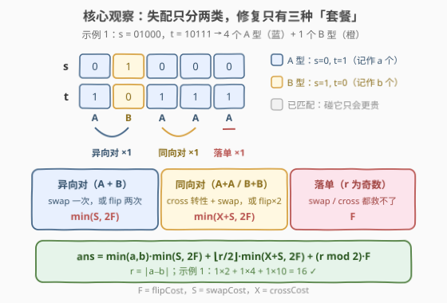
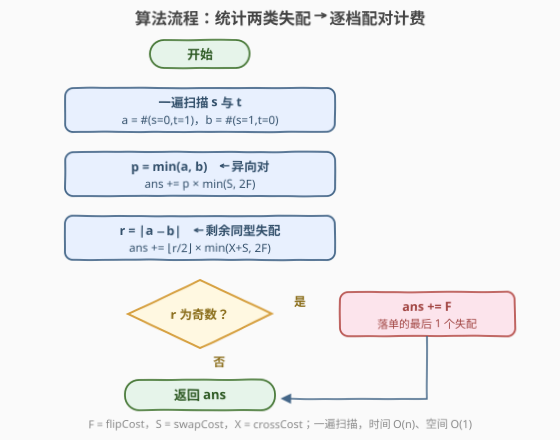

# 使二进制字符串相等的最小成本

- **题目名称**：使二进制字符串相等的最小成本
- **链接**：[3800. 使二进制字符串相等的最小成本](https://leetcode.cn/problems/minimum-cost-to-make-two-binary-strings-equal/)
- **难度**：中等
- **标签**：贪心、字符串

## 1. 题目概述

给你两个长度为 $n$ 的二进制字符串 $s$ 和 $t$，以及三个**正整数** `flipCost`、`swapCost` 和 `crossCost`。可以对两串施加以下操作任意次（顺序不限）：

| 操作 | 内容 | 成本 |
|------|------|------|
| **翻转** | 选任意下标 $i$，把 $s[i]$ 或 $t[i]$ 的 `0`↔`1` 互换 | `flipCost` |
| **串内交换** | 选两个**不同**下标 $i \ne j$，交换 $s[i]$ 与 $s[j]$（或 $t[i]$ 与 $t[j]$） | `swapCost` |
| **交叉交换** | 选一个下标 $i$，交换 $s[i]$ 与 $t[i]$ | `crossCost` |

返回使字符串 $s$ 和 $t$ 相等所需的**最小总成本**。

**示例 1**：

```text
输入：s = "01000", t = "10111", flipCost = 10, swapCost = 2, crossCost = 2
输出：16
解释：交换 s[0] 和 s[1]（2）；交叉交换 s[2] 和 t[2]（2）；交换 s[2] 和 s[3]（2）；
     翻转 s[4]（10）。总成本 2 + 2 + 2 + 10 = 16。
```

**示例 2**：

```text
输入：s = "001", t = "110", flipCost = 2, swapCost = 100, crossCost = 100
输出：6
解释：swap / cross 都太贵，直接翻转 s 的 3 个位，3 × 2 = 6。
```

**示例 3**：

```text
输入：s = "1010", t = "1010", flipCost = 5, swapCost = 5, crossCost = 5
输出：0
解释：两串已经相等，无需任何操作。
```

**约束条件**：

- $n = |s| = |t|$
- $1 \le n \le 10^5$
- $1 \le \text{flipCost}, \text{swapCost}, \text{crossCost} \le 10^9$
- $s$ 和 $t$ 仅由 `'0'` 和 `'1'` 组成

> 💡 **审题关键**：① **位置不重要，只有失配的「型」和数量重要**——swap/cross 的成本与下标距离无关，两个失配隔多远都一样修；② 三种操作对「失配总数」的作用不同：串内 swap 一次修掉 0 或 2 个、cross 一个都不修（只是给失配「转性」）、flip 恰好修掉 1 个——**失配总数的奇偶性只能被 flip 改变**；③ 成本上限 $10^9$、$n$ 上限 $10^5$，答案上界 $\approx 2 \times 10^{14}$，必须用 64 位整数。

---

## 2. 解题思路

### 2.1 暴力思路：逐位翻转 / 状态搜索

最直接的想法：把每个 $s[i] \ne t[i]$ 的位单独 flip 掉，成本 $(a+b) \cdot \text{flipCost}$（$a+b$ 为失配总数）。示例 2 正是这种情况——swap 和 cross 都要 100，flip 只要 2，逐位翻转就是最优。但示例 1 里一次 swap 才 2、一次 flip 要 10，逐位翻转会白白多花 4 倍的钱：**它没有利用「一次操作修两个失配」的机会**。

另一头是暴力搜索：把 $(s, t)$ 的当前状态当结点、三种操作当边跑最短路。但状态空间是 $2^{2n}$ 级别，$n = 10^5$ 直接爆炸。

> 💡 转机在于：操作成本与下标无关 ⇒ **状态可以坍缩**。两串具体长什么样无所谓，每个失配位只有两种「型」——把整个问题压成两个计数器。

### 2.2 核心观察：失配分两类，修复只有三种「套餐」



**第一刀：只统计失配的「型」**。逐位比较 $s$ 与 $t$，失配只有两种：

- **A 型**：$s_i = 0,\ t_i = 1$，共 $a$ 个；
- **B 型**：$s_i = 1,\ t_i = 0$，共 $b$ 个。

已匹配的位置**永远不必碰**：串内 swap 在两个 bit 相同时是恒等操作，cross 在 $s_i = t_i$ 时也是恒等操作，而 flip 一个已匹配位只会**制造**新失配（制造出来还得再修，纯亏）。于是整个问题被压缩成两个整数 $(a, b)$。

**第二刀：三种操作对 $(a, b)$ 的宏观效果**：

- **串内 swap**：把一个 A 和一个 B（两个不同下标）同时修掉 → $(a-1,\ b-1)$，成本 $S$；
- **cross**：A 变 B、B 变 A → $(a \pm 1,\ b \mp 1)$，成本 $X$，**失配总数不变**（它不修失配，只「转性」）；
- **flip**：修掉一个失配 → $(a-1,\ b)$ 或 $(a,\ b-1)$，成本 $F$。

**第三刀：修复只有三种「套餐」**（任何更花哨的组合都不比这三档便宜，见第 5 节）：

| 套餐 | 消灭对象 | 等价操作序列 | 单价 |
|------|----------|--------------|------|
| **异向对** | 1 个 A + 1 个 B | swap 一次；或 flip 两次 | $\min(S,\ 2F)$ |
| **同向对** | 2 个 A（或 2 个 B） | cross 转性 + swap；或 flip 两次 | $\min(X+S,\ 2F)$ |
| **落单** | 1 个失配（$r$ 为奇数时） | 只能 flip 一次 | $F$ |

- **同向对的来历**：两个 A 失配，先 cross 其中一个（$X$）把它变成 B，此时一 A 一 B，再 swap（$S$）双双修掉；若 flip 更便宜就干脆 flip 两次。故单价 $\min(X+S,\ 2F)$。
- **落单的来历（奇偶性）**：串内 swap 使失配总数 $-2$、cross 不变、flip $\pm 1$，所以**失配总数为奇数时至少要用奇数次 flip**。当配完对后剩下孤零零一个失配，swap 无能为力（需要另一个异型失配配合）、cross 只会转性不解决问题，只能 flip。

**第四刀：优先配异向对**。异向对单价 $\min(S, 2F) \le \min(X+S, 2F)$（因 $X \ge 1$），即异向对永远不贵于同向对，所以先让 A 和 B 尽量互配 $p = \min(a, b)$ 对，剩余 $r = |a - b|$ 个同型失配再两两配同向对，最后可能剩 1 个落单。汇总成公式：

$$\text{ans} = \underbrace{\min(a,b) \cdot \min(S,\ 2F)}_{\text{异向对}} \;+\; \underbrace{\left\lfloor \frac{r}{2} \right\rfloor \cdot \min(X+S,\ 2F)}_{\text{同向对}} \;+\; \underbrace{(r \bmod 2) \cdot F}_{\text{落单}}$$

> 💡 **关键转化**：$n$ 长的字符串问题 ⟶ 两个计数器 $(a, b)$ ⟶ 三档单价的配对计费。Greedy 标签的「贪心」就体现在**优先用便宜的那一档配对**。

### 2.3 算法流程图



| 步骤 | 操作 | 说明 |
|------|------|------|
| ① 统计 | 一遍扫描得 $a, b$ | A 型 = $(0,1)$ 位，B 型 = $(1,0)$ 位 |
| ② 异向对 | $p = \min(a,b)$，累加 $p \cdot \min(S, 2F)$ | A 与 B 互配，最便宜的一档 |
| ③ 同向对 | $r = \|a-b\|$，累加 $\lfloor r/2 \rfloor \cdot \min(X+S, 2F)$ | 剩余同型失配两两配对 |
| ④ 落单 | $r$ 为奇数时再累加 $F$ | 奇偶性所致，不可避免 |
| ⑤ 返回 | `ans` | 64 位整数 |

> ⚠️ **易错点**：**溢出**。$2 \times \text{flipCost}$ 与 $\text{crossCost} + \text{swapCost}$ 都可达 $2 \times 10^9$，而 $p \cdot \min(S, 2F)$ 最高 $10^5 \times 2 \times 10^9 = 2 \times 10^{14}$——C++ 必须把成本先转成 `long long` 再参与运算，全程 64 位。

### 2.4 示例演算

以示例 1（$s = $ `01000`，$t = $ `10111`，$F=10,\ S=2,\ X=2$）为例：

| 下标 $i$ | 0 | 1 | 2 | 3 | 4 |
|----------|---|---|---|---|---|
| $s_i$ | 0 | 1 | 0 | 0 | 0 |
| $t_i$ | 1 | 0 | 1 | 1 | 1 |
| 型 | **A** | **B** | **A** | **A** | **A** |

- $a = 4,\ b = 1 \Rightarrow p = 1$：1 个异向对，单价 $\min(2, 20) = 2$，计 **2**；
- $r = 3$：$\lfloor 3/2 \rfloor = 1$ 个同向对，单价 $\min(2+2,\ 20) = 4$，计 **4**；
- $r$ 为奇数：落单 1 个，计 $F = $ **10**；
- 合计 $2 + 4 + 10 = \mathbf{16}$ ✓（与官方解释的 4 步操作殊途同归：官方那串「swap + cross + swap + flip」本质就是 1 个异向对 + 1 个同向对 + 1 个落单）。

再验示例 2（$a = 2,\ b = 1,\ F=2,\ S=X=100$）：$1 \times \min(100, 4) + 0 + 1 \times 2 = 4 + 2 = 6$ ✓。示例 3：$a = b = 0$，直接返回 $0$ ✓。

---

## 3. 参考代码

### C++

```cpp
class Solution {
public:
    long long minimumCost(string s, string t, int flipCost, int swapCost, int crossCost) {
        long long a = 0, b = 0;
        for (int i = 0; i < (int)s.size(); ++i) {
            if (s[i] != t[i]) (s[i] == '0' ? a : b) += 1;
        }
        const long long F = flipCost, S = swapCost, X = crossCost;
        long long r = a > b ? a - b : b - a;
        long long ans = (a < b ? a : b) * min(S, 2 * F);   // 异向对
        ans += (r / 2) * min(X + S, 2 * F);                // 同向对
        ans += (r % 2) * F;                                // 落单个
        return ans;
    }
};
```

> ⚠️ `flipCost` 等形参是 `int`：`2 * flipCost` 恰好不超过 $2.1 \times 10^9$（有惊无险），但后续乘上 $p$ 必爆 32 位——故第一行就把三者存入 `long long`，之后所有算术都在 64 位下进行。

### Python

```python
class Solution:
    def minimumCost(self, s: str, t: str, flipCost: int, swapCost: int, crossCost: int) -> int:
        a = b = 0
        for x, y in zip(s, t):
            if x != y:
                if x == '0':
                    a += 1
                else:
                    b += 1
        p, r = min(a, b), abs(a - b)
        return (p * min(swapCost, 2 * flipCost)                        # 异向对
                + r // 2 * min(crossCost + swapCost, 2 * flipCost)     # 同向对
                + (r & 1) * flipCost)                                  # 落单个
```

---

## 4. 复杂度分析

| 维度 | 复杂度 | 说明 |
|------|--------|------|
| **时间** | $O(n)$ | 一遍扫描计数，之后 $O(1)$ 合成答案 |
| **空间** | $O(1)$ | 仅 $a, b$ 两个计数器与常数个变量 |
| **值域** | 答案 $\le 2 \times 10^{14}$ | $n \le 10^5$、套餐单价 $\le 2 \times 10^9$，C++ 须 `long long` |

---

## 5. 扩展：正确性——套餐覆盖性与 Dijkstra 对拍

### 5.1 为什么不会有第四种更便宜的修法

对任意一段操作序列，盯住每个失配的「死法」，只有两种可能：

1. **被某个 flip 修掉**——一次恰修 1 个；
2. **被某次串内 swap 修掉**——一次恰修 2 个，且**必须是一个 A 加一个 B**（swap 交换的是同一字符串内的两个 bit：A 型的 $s_i=0$ 与 B 型的 $s_j=1$ 互换后双双匹配；两个同型失配在同一字符串里的 bit 相同，swap 是恒等操作）。

cross 一个失配都不修，它的全部价值是「转性」——把一个 A 变成 B，从而让原本配不成异向对的失配配上对。据此枚举所有可能的修复编组，成本总能归约到三种套餐的线性和：

- **异向对**：直接 swap（$S$）或 flip 两次（$2F$）；任何先 cross 的路径 $\ge X + \min(S, 2F) \ge \min(S, 2F)$，不会更便宜；
- **同向对**：cross 转性后按异向对修（$X + \min(S, 2F)$，当 $S \ge 2F$ 时它退化为 $\ge 2F$，即不如直接 flip 两次），或直接 flip 两次（$2F$）——两者取 min 恰为 $\min(X+S,\ 2F)$；
- **落单**：奇偶性（2.2 第三刀） forcing 至少一次 flip，且恰有一次就够。

因此公式给出的值既是**下界**（任何方案都能拆成这些套餐、单价取 min 已是每档最低），又**可以构造达到**（逐套餐执行等价操作序列即可），贪心得证。

### 5.2 Dijkstra 对拍验证

对 $n \in [1, 5]$ 的**全部** $(s, t)$ 串对（状态含具体下标，操作语义与题目严格一致：swap 需两个不同下标且 bit 相异才有效、cross 在 $s_i = t_i$ 时为恒等操作），以 $(F, S, X) \in \{1, 2, 3, 5, 7\}^3$ 共 125 种成本组合逐一跑 Dijkstra 最短路，与公式比对：**零不一致**。小规模穷举 + 大规模公式，双重佐证。

> 💡 对拍时踩的一个坑值得复述：用「两边同时 XOR」模拟 swap/cross 会把**相等 bit 也同时翻转**（真实 swap 在相等 bit 上是恒等操作），凭空多出「把匹配位 $(0,0)$ 变 $(1,1)$ 再利用」的非法能力，导致 `s=00, t=11, F=S=X=1` 被算成 1（正确答案 2）。模拟交换类操作时务必先判两 bit 相异。

---

## 6. 面试要点

**Q1：为什么已匹配的位置永远不用动？**

> 三种操作在「无失配参与」时要么恒等要么纯亏：串内 swap 两个相同 bit 是恒等；cross 在 $s_i = t_i$ 时是恒等；flip 匹配位会制造新失配，制造出来还得再修。所以最优解只碰失配位——这也正是状态能坍缩成 $(a, b)$ 两个计数器的前提。

**Q2：为什么剩余失配为奇数个时必须付一次 `flipCost`？逃不掉吗？**

> 奇偶不变量：串内 swap 使失配总数 $-2$、cross 使总数不变（只转性）、flip 使总数 $\pm 1$。失配总数为奇数时 flip 必须用奇数次（至少 1 次）。配完对剩最后一个失配时，swap 需要另一个异型失配配合、cross 只会 A↔B 转性，都救不了，只能 flip。

**Q3：为什么先配异向对、再配同向对，而不是反过来或混着配？**

> 异向对单价 $\min(S, 2F)$ 恒 $\le$ 同向对单价 $\min(X+S, 2F)$（因 $X \ge 1$）。而任何方案里被 swap 消灭的都是 A-B 对、cross 的唯一价值就是把同型转成异型——这正是同向对套餐内部已经计入的路径，混合配对不会产生更便宜的新组合（5.1 节的归约论证）。

**Q4：三个成本参数取极端时，公式分别退化成什么？**

> $F$ 极小：三档全取 flip 分支，ans $= (a+b) \cdot F$，即逐位翻转；$S$ 极小：异向对全用 swap，同向对在 $X+S$ 与 $2F$ 间取小；$X$ 极大：cross 彻底不用，同向对退化为 flip 两次。示例 2 / 示例 1 分别对应前两种退化，可作快速 sanity check。

**Q5：本题最容易被卡 WA/RE 的坑是什么？**

> **溢出**。答案上界 $10^5 \times 2 \times 10^9 = 2 \times 10^{14}$，超出 32 位；C++ 中若 `p * min(...)` 以 `int` 参与运算直接爆。其次是把「交换两个相同 bit」也当成有效操作（对拍坑，见 5.2），以及忘记奇数落单的那一次 `flipCost`。

> 💡 **一句话总结**：3800 = 「失配分两类计数」+「三种修复套餐取 min 配对计费」。两个带走的知识点：操作成本与位置无关时先想**状态坍缩**（串 → 计数器）；修复类问题先列**操作对失配数目的奇偶效应**，常能直接逼出「落单项」的形状。

---

## 7. 同类练习题

- [1247. 交换字符使得字符串相同](https://leetcode.cn/problems/minimum-swaps-to-make-strings-equal/)（[题解](../1201-1300/1247_交换字符使得字符串相同.md)）：同款「两类失配计数 + 配对计费」骨架，但其交换是 $s_1[i] \leftrightarrow s_2[j]$，配对结构与本题**互为镜像**（那边同型对 1 次交换、遗留异型对 2 次），做完对照加深理解
- [1737. 满足三条件之一需改变的最少字符数](https://leetcode.cn/problems/change-minimum-characters-to-satisfy-one-of-three-conditions/)（[题解](../1701-1800/1737_满足三条件之一需改变的最少字符数.md)）：字符计数 + 多种「改造方式」逐档取最小，同款分类计费贪心
- [462. 最小操作次数使数组元素相等II](https://leetcode.cn/problems/minimum-moves-to-equal-array-elements-ii/)（[题解](../0401-0500/462_最小操作次数使数组元素相等II.md)）：中位数配对修复，体会「配对思想」的另一形态
- [2037. 使每位学生都有座位的最少移动次数](https://leetcode.cn/problems/minimum-number-of-moves-to-seat-everyone/)（[题解](../2001-2100/2037_使每位学生都有座位的最少移动次数.md)）：排序后配对求 $\sum|\text{差}|$，贪心配对的基本功训练
- [854. 相似度为K的字符串](https://leetcode.cn/problems/k-similar-strings/)（[题解](../0801-0900/854_相似度为K的字符串.md)）：同为「最少交换使两串相等」，但字符集更大、需 BFS/贪心分支搜索，可对照本题二进制 + 三种操作下依然有闭式解的优雅
