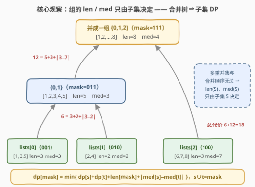
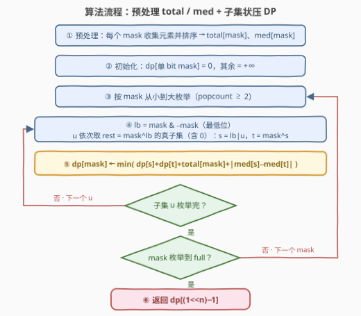

# LeetCode 合并有序列表的最小成本 题解

## 1. 题目概述

- **标题 / 题号**：合并有序列表的最小成本（#3801，hard）
- **链接**：https://leetcode.cn/problems/minimum-cost-to-merge-sorted-lists/
- **难度**：困难
- **标签**：位运算、数组、动态规划、状态压缩

**题意**：给定二维整数数组 `lists`，每个 `lists[i]` 都是**非递减排序**的非空整数数组。每次操作任选两个**当前**列表 $a$、$b$ 合并成一个有序列表，代价为

$$\text{cost}(a, b) = \text{len}(a) + \text{len}(b) + \lvert \text{median}(a) - \text{median}(b) \rvert$$

其中 $\text{len}$ 为长度，$\text{median}$ 为**中位数**（元素个数为偶数时取**左侧**中间元素）。合并后从 `lists` 中移除 $a$、$b$，把合并结果插入任意位置。重复直到只剩一个列表，求**最小总代价**。

**示例 1**：

```text
输入：lists = [[1,3,5],[2,4],[6,7,8]]
输出：18
解释：先合并 [1,3,5] 与 [2,4]：3+2+|3−2| = 6，得 [1,2,3,4,5]；
　　　再与 [6,7,8] 合并：5+3+|3−7| = 12。总代价 6+12 = 18。
```

**示例 2**：

```text
输入：lists = [[1,1,5],[1,4,7,8]]
输出：10
解释：只有一种合并：3+4+|1−4| = 10。
```

**示例 3**：

```text
输入：lists = [[1],[3]]
输出：4
```

**示例 4**：

```text
输入：lists = [[1],[1]]
输出：2
```

**约束**：

- $2 \le \text{lists.length} \le 12$
- $1 \le \text{lists}[i].\text{length} \le 500$
- $-10^9 \le \text{lists}[i][j] \le 10^9$
- 所有列表长度之和不超过 $2000$

> 💡 **审题关键**：① $n \le 12$——$2^{12} = 4096$ 个子集，**状压 DP 的甜区**；② 合并代价里的 $\text{len}$、$\text{median}$ 都针对**当前列表**（可能已是若干原始列表的并）而言；③「插入任意位置」是烟雾弹——位置不影响任何后续代价，真正要决策的只是**谁和谁合并**；④ 偶数个元素取**左**中位数，即排序后下标 $\lfloor (L-1)/2 \rfloor$。

## 2. 解题思路

### 2.1 暴力思路：枚举合并顺序 / 贪心

**暴力枚举**：合并过程本质是一棵「二叉合并树」——$n$ 个叶子是原始列表，每个内部节点是一次合并。逐对尝试所有合并顺序，$n=12$ 时序列数约 $10^{13}$ 量级，不可行。

**更诱人的贪心**：每一步挑「当前立即代价最小」的一对合并（类似哈夫曼）。可惜是错的：

```text
lists = [[1],[2],[10]]
贪心：先合并代价最小的 (1,2) → 花 3 得 [1,2]；再与 [10] 合并 → 3+|1−10| = 12，总代价 15
最优：先合并 (2,10) → 花 10 得 [2,10]（中位数仍是 2）；再与 [1] 合并 → 3+|1−2| = 4，总代价 14
```

直觉：合并 $(1,2)$ 虽然眼前便宜，却把组中位数「钉」在 $1$，之后与 $10$ 合并要付 $9$ 的中位数差；先合并 $(2,10)$ 局部更贵，但并集中位数仍是 $2$，为后续省下大头。**中位数差项让「局部最优」与「全局最优」脱钩**——若代价只有 $\text{len}(a)+\text{len}(b)$，本题就是经典哈夫曼合并（如「合并果子」），贪心可证；多出的 median 项破坏了交换论证。

> 💡 眼前便宜的合并，不一定留下好的「身份」（合并后组的中位数）。于是状态不能只记「当前有哪些列表」，还得知道**每个组里装了哪些原始列表**——这正是子集 DP 要刻画的东西。

### 2.2 核心观察：组的 len / med 只由「子集」决定——子集状压 DP



**观察一（分组不变量）**：任一时刻的每个当前列表都对应一个原始下标集合 $S \subseteq \{0,\dots,n-1\}$，它的两个「身份属性」只由 $S$ 决定：

$$\text{len}(S) = \sum_{i \in S} \text{len}(lists[i]), \qquad \text{med}(S) = \text{sorted}\Big(\bigcup_{i \in S} lists[i]\Big)\Big[\Big\lfloor \frac{\text{len}(S)-1}{2} \Big\rfloor\Big]$$

多重集的并集与 $S$ 内部按什么顺序合并**无关**——不管 $[1,3,5]$ 和 $[2,4]$ 什么时候并、之前各自经历过什么，只要组是 $\{0,1\}$，它就永远是 $[1,2,3,4,5]$：长度恒为 5、中位数恒为 3。

**观察二（合并树刻画）**：整个合并过程 $=$ 一棵 $n$ 叶二叉树。每个内部节点把父集合 $M$ 划分成 $S$ 与 $M \setminus S$ 两个孩子，该次合并的代价为

$$\text{len}(S) + \text{len}(M \setminus S) + \lvert \text{med}(S) - \text{med}(M \setminus S) \rvert = \text{len}(M) + \lvert \text{med}(S) - \text{med}(M \setminus S) \rvert$$

（$S$ 与 $M \setminus S$ 不相交，两个长度项合并成 $\text{len}(M)$，省一次查表。）

**观察三（子集 DP）**：设 $dp[mask]$ = 把 $mask$ 内所有原始列表并成**一个**列表的最小总代价，枚举**最后一次合并**的两侧：

$$dp[mask] = \min_{\varnothing \ne s \subsetneq mask} \ dp[s] + dp[mask \setminus s] + \text{len}[mask] + \lvert \text{med}[s] - \text{med}[mask \setminus s] \rvert$$

边界：$mask$ 只含一个 bit（单个列表本身就是「一个列表」）时 $dp = 0$；答案为 $dp[(1 \ll n)-1]$。每个无序划分 $\{s, t\}$ 会被 $s$、$t$ 各枚举一次，实现时**固定 $mask$ 的最低位属于 $s$**，转移数减半。

### 2.3 算法流程图



**文字版步骤**：

| 步骤 | 操作 | 说明 |
|------|------|------|
| ① 预处理 | 对每个非空 $mask$ 收集其内所有列表的元素，排序后记录 $\text{total}[mask]$ 与 $\text{med}[mask]$ | 中位数取下标 $(L-1)/2$，偶数取左 |
| ② 初始化 | 单 bit 的 $dp[mask] = 0$，其余 $= +\infty$ | 单个列表无需合并 |
| ③ 枚举 mask | 按 $mask$ 从小到大（保证转移来源先算好） | 只需处理 popcount $\ge 2$ 的 |
| ④ 枚举划分 | $lb = mask\ \&\ (-mask)$；$u$ 依次取 $rest = mask \oplus lb$ 的真子集（含 0），$s = lb \mid u$，$t = mask \oplus s$ | 固定最低位，每个无序划分恰一次 |
| ⑤ 松弛 | $dp[mask] \leftarrow \min\big(dp[s]+dp[t]+\text{total}[mask]+\lvert \text{med}[s]-\text{med}[t] \rvert\big)$ | 两子集长度之和恰为 total[mask] |
| ⑥ 返回 | $dp[(1 \ll n)-1]$ | |

### 2.4 示例演算

以示例 1 `lists = [[1,3,5],[2,4],[6,7,8]]`（列表 0/1/2 对应 bit 0/1/2）走一遍。

**第一步：预处理每个 mask 的 total 与 med**

| mask | 组成 | 并集 | total | med |
|------|------|------|-------|-----|
| 001 | $\{0\}$ | $[1,3,5]$ | 3 | 3 |
| 010 | $\{1\}$ | $[2,4]$ | 2 | 2 |
| 100 | $\{2\}$ | $[6,7,8]$ | 3 | 7 |
| 011 | $\{0,1\}$ | $[1,2,3,4,5]$ | 5 | 3 |
| 101 | $\{0,2\}$ | $[1,3,5,6,7,8]$ | 6 | 5 |
| 110 | $\{1,2\}$ | $[2,4,6,7,8]$ | 5 | 6 |
| 111 | $\{0,1,2\}$ | $[1,\dots,8]$ | 8 | 4 |

**第二步：按 mask 升序递推 dp**

| mask | 候选划分（$s$ 含最低位） | dp 值 |
|------|--------------------------|-------|
| 001 / 010 / 100 | 单个列表 | 0 |
| 011 | $\{0\} \mid \{1\}$：$0+0+5+\lvert 3-2 \rvert$ | 6 |
| 101 | $\{0\} \mid \{2\}$：$0+0+6+\lvert 3-7 \rvert$ | 10 |
| 110 | $\{1\} \mid \{2\}$（最低位是 bit 1）：$0+0+5+\lvert 2-7 \rvert$ | 10 |
| 111 | $\{0\}\mid\{1,2\}$：$0+10+8+\lvert 3-6 \rvert=21$；$\{0,1\}\mid\{2\}$：$6+0+8+\lvert 3-7 \rvert=\mathbf{18}$；$\{0,2\}\mid\{1\}$：$10+0+8+\lvert 5-2 \rvert=21$ | **18** |

得 $dp[111] = 18$，与示例一致。注意 110 的「最低位」是 bit 1（列表 1），$s$ 必含列表 1——固定最低位只是去重手段，不影响 min 的结果。

## 3. 参考代码

### C++

预处理用**增量归并**：`arr[mask]` 由「`arr[mask 去掉最低位]` 与 `lists[最低位]`」两个有序数组归并而成，比每个 mask 重新排序更省。

```cpp
class Solution {
  public:
    long long minMergeCost(vector<vector<int>>& lists) {
        int n = lists.size(), m = 1 << n;

        // 预处理：arr[mask] = mask 内全部元素的有序并集
        vector<int> total(m);
        vector<long long> med(m);       // 中位数差可达 2e9，用 long long 防溢出
        vector<vector<int>> arr(m);
        for (int mask = 1; mask < m; ++mask) {
            int i = __builtin_ctz(mask);            // 最低位对应的列表
            int prev = mask & (mask - 1);           // 去掉最低位
            if (prev == 0) {
                arr[mask] = lists[i];
            } else {
                const vector<int>& a = arr[prev];
                const vector<int>& b = lists[i];
                vector<int> c;
                c.reserve(a.size() + b.size());
                merge(a.begin(), a.end(), b.begin(), b.end(), back_inserter(c));
                arr[mask] = move(c);
            }
            total[mask] = (int)arr[mask].size();
            med[mask] = arr[mask][(total[mask] - 1) / 2];   // 偶数个取左中位数
        }

        // 子集 DP：dp[mask] = 把 mask 并成一个列表的最小总代价
        vector<long long> dp(m, LLONG_MAX / 4);
        for (int mask = 1; mask < m; ++mask) {
            if ((mask & (mask - 1)) == 0) {          // 单个列表，无需合并
                dp[mask] = 0;
                continue;
            }
            int lb = mask & -mask, rest = mask ^ lb;
            // u 依次取 rest 的真子集（含 0）：s 含最低位非空，t = mask^s 非空
            for (int u = (rest - 1) & rest; ; u = (u - 1) & rest) {
                int s = lb | u, t = mask ^ s;
                dp[mask] = min(dp[mask], dp[s] + dp[t] + total[mask]
                                         + llabs(med[s] - med[t]));
                if (u == 0) break;
            }
        }
        return dp[m - 1];
    }
};
```

### Python

预处理用**逐 mask 收集 + 排序**：内存只需 $O(T)$；排序输入是 $k$ 段有序 run，Timsort 近线性完成归并。

```python
class Solution:
    def minMergeCost(self, lists: List[List[int]]) -> int:
        n = len(lists)
        m = 1 << n

        # 预处理：每个 mask 的元素总数与并集中位数
        total = [0] * m
        med = [0] * m
        for mask in range(1, m):
            buf = []
            for i in range(n):
                if mask >> i & 1:
                    buf += lists[i]                    # 收集 mask 内所有元素
            buf.sort()                                 # k 段有序 run，近线性
            total[mask] = len(buf)
            med[mask] = buf[(total[mask] - 1) // 2]    # 偶数个取左中位数

        # 子集 DP
        INF = float('inf')
        dp = [INF] * m
        for mask in range(1, m):
            if mask & (mask - 1) == 0:                 # 单个列表，无需合并
                dp[mask] = 0
                continue
            lb = mask & -mask
            rest = mask ^ lb
            u = (rest - 1) & rest                      # u 依次取 rest 的真子集（含 0）
            while True:
                s = lb | u                             # s 含最低位，非空
                t = mask ^ s                           # t 非空
                cand = dp[s] + dp[t] + total[mask] + abs(med[s] - med[t])
                if cand < dp[mask]:
                    dp[mask] = cand
                if u == 0:
                    break
                u = (u - 1) & rest
        return dp[m - 1]
```

> 💡 **写法要点**：
> - **子集枚举**：`u = (u-1) & rest` 从最大真子集一路降到 0；配合 `s = lb | u` 保证 $s$ 非空、$t$ 非空、每个无序划分只枚举一次。初值取 `(rest-1) & rest`（跳过 $u = rest$，否则 $s = mask$、$t$ 为空非法）；`u == 0` 时处理完再 break。
> - **长度项合并**：$\text{len}(s)+\text{len}(t) = \text{total}[mask]$，转移里少一次查表。
> - **溢出**：$\lvert \text{med}$ 差 $\rvert$ 最大 $2\times 10^9$，超 32 位 int；C++ 把 `med` 存成 `long long` 并用 `llabs`，Python 天然大整数无感。
> - **预处理两法**：C++ 增量归并复用子 mask 的有序数组（空间 $O(T \cdot 2^{n-1}) \approx 16$ MB）；Python 收集 + 排序省内存——两者总搬运量都是 $T \cdot 2^{n-1} \approx 4\times 10^6$，绰绰有余。

## 4. 复杂度分析

设 $n \le 12$ 为列表数，$T \le 2000$ 为元素总数。

| 维度 | 复杂度 | 说明 |
|------|--------|------|
| **时间** | $O(3^n + T \cdot 2^{n})$ | DP 转移数 $\sum_{mask} 2^{\text{popcount}(mask)-1} = 3^n/2 \approx 2.7\times 10^5$；预处理中每个元素出现在恰 $2^{n-1}$ 个 mask 里，总搬运 $T \cdot 2^{n-1} \approx 4.1\times 10^6$ |
| **空间** | $O(2^n)$（Python）／$O(T \cdot 2^{n-1})$（C++ 增量归并） | C++ 存每个 mask 的有序并集约 16 MB；Python 逐 mask 收集只用 $O(T)$ 临时空间，另有 $dp/med/total$ 各 $2^n$ |

## 5. 扩展：中位数预处理的三档做法 & 框架的普适性

**中位数预处理**（按工程取舍选）：

1. **逐 mask 收集 + 排序**（本文 Python）：代码最短，内存 $O(T)$；Timsort 自动识别 $k$ 段有序 run 并做一次归并，接近线性。
2. **增量归并**（本文 C++）：`arr[mask] = merge(arr[mask 去最低位], lists[最低位])`，线性归并无浪费，但要存 $2^n$ 个数组（约 16 MB）。
3. **按值二分计数**：不存数组，对每个 mask 在「全体元素的有序值域」上二分，用每段 `bisect` 数 $\le v$ 的元素个数找第 $r$ 小——空间最省、代码最长，本题没必要。

**框架的普适性**：只要合并代价是「两个分组集合」的函数，整套「预处理集合属性 + 子集 DP 枚举最后一次合并」照搬即可——把 median 换成 min/max/平均值，或把长度项换成 $\text{len}(a)\cdot\text{len}(b)$，只改预处理与转移式，框架不动。

**与哈夫曼的对照**：去掉 median 项就是经典「最优合并模式」（哈夫曼）：每次合并最短两个，交换论证可证贪心最优。本题 median 项使代价与「分组身份」耦合，贪心失效（见 2.1 反例），只能状压。$3^n$ 的复杂度也划定了边界：$n \le 12$ 正是出题人留给 $3^{12} \approx 5.3\times 10^5$ 的窗口，$n$ 再大此路不通。

## 6. 面试要点

**Q1：为什么贪心（每次合并立即代价最小的一对）不成立？**

> 反例 `[[1],[2],[10]]`：贪心先并 $(1,2)$ 花 3，之后与 $[10]$ 合并付 $\lvert 1-10 \rvert = 9$，总 15；最优先并 $(2,10)$ 花 10，并集 $[2,10]$ 中位数仍是 2，之后只付 $\lvert 1-2 \rvert = 1$，总 14。哈夫曼贪心的交换论证依赖「代价只含长度」；median 项让合并后组的中位数（身份）影响未来代价，局部最优不再蕴含全局最优。

**Q2：为什么整个过程的代价只依赖「分组集合」，与合并顺序无关？**

> 任一时刻每个当前列表对应原始下标集合 $S$：长度是 $S$ 内原始长度之和；内容是 $S$ 内所有元素的多重并集（与 $S$ 内部合并次序无关），故中位数也是集合的函数。于是每棵合并树的代价都能逐节点写成「左右子集」的函数——这是 $dp[mask]$ 能刻画所有合并过程的根基。

**Q3：子集 DP 的转移数为什么是 $3^n$？如何把每个划分从算两次减为一次？**

> $\sum_{mask} 2^{\text{popcount}(mask)} = 3^n$（每个元素三种归属：不在 mask／在 $s$／在 $t$）。固定「$mask$ 的最低位属于 $s$」后，每对无序划分 $\{s,t\}$ 恰枚举一次，即 $3^n/2$；实现上枚举 $u \subsetneq rest$（$rest = mask \oplus lb$），$s = lb \mid u$。

**Q4：中位数预处理的总量怎么估算？会不会成为瓶颈？**

> 每个元素出现在恰 $2^{n-1}$ 个 mask 里（其余 $n-1$ 个列表任选），总搬运 $T \cdot 2^{n-1}$；上限 $2000 \times 2048 \approx 4.1\times 10^6$，配合「k 段有序 run 排序」或「增量归并」都近线性，不会成为瓶颈。若 $T$ 再大一个量级，可换「按值二分计数」把每个 mask 的预处理压到 $O(n \log T)$ 次计数。

**Q5：实现上有哪些细节坑？**

> ① 偶数长度取**左**中位，下标 $(L-1)/2$（整除）；② $\lvert \text{med}$ 差 $\rvert$ 可达 $2\times 10^9$，C++ 必须用 `long long` 承接（`med` 直接开 `long long`，取绝对值用 `llabs`）；③ 子集枚举初值取 `(rest-1) & rest` 跳过 $u = rest$（否则 $s = mask$、$t$ 为空）；④ $mask$ 升序枚举保证 $dp[s]$、$dp[t]$ 先于 $dp[mask]$ 就绪。

## 同类练习题

| # | 题目 | 与本题的关联 |
|---|------|-------------|
| 2305 | [公平分发饼干](https://leetcode.cn/problems/fair-distribution-of-cookies/)（[题解](../2301-2400/2305_公平分发饼干.md)） | 「子集划分 + dp[mask]」的最简入门——把数分进 $k$ 个桶 |
| 1986 | [完成任务的最少工作时段](https://leetcode.cn/problems/minimum-number-of-work-sessions-to-finish-the-tasks/)（[题解](../1901-2000/1986_完成任务的最少工作时间段.md)） | 同款「预处理子集属性 + 枚举子集转移」双重奏 |
| 1125 | [最小的必要团队](https://leetcode.cn/problems/smallest-sufficient-team/)（[题解](../1101-1200/1125_最小的必要团队.md)） | 状压 DP 的覆盖集合版，练 mask 当「状态」的手感 |
| 943 | [最短超级串](https://leetcode.cn/problems/find-the-shortest-superstring/)（[题解](../0901-1000/943_最短超级串.md)） | 预处理「集合代价」思想的集大成者，$n \le 12$ 同款甜区 |
| 1000 | [合并石头的最低成本](https://leetcode.cn/problems/minimum-cost-to-merge-stones/)（[题解](../0901-1000/1000_合并石头的最低成本.md)） | 同为「合并代价」问题但用**区间 DP**——对照体会合并树的两类刻画（子集型 vs 区间型） |
