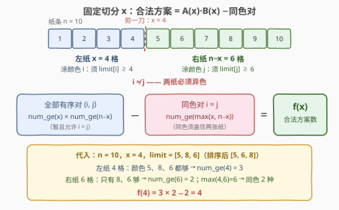
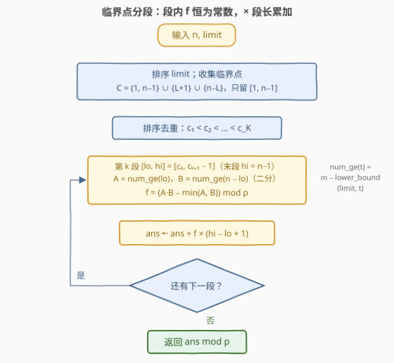

# 给纸张涂色的方式数量

- **题目名称**：给纸张涂色的方式数量
- **链接**：[3802. 给纸张涂色的方式数量](https://leetcode.cn/problems/number-of-ways-to-paint-sheets/)
- **难度**：困难
- **标签**：数组、排序、二分查找、计数

## 1. 题目概述

> ⚠️ 本题为 LeetCode 付费题，题意描述根据官方示例用例与 hints 重建，可能与官方题面有出入。

**题意**（依官方 hints 重建）：给定一个整数 $n$ 和一个整数数组 $limit$。一张长为 $n$ 格的纸条要被**剪一刀、分成两张非空纸张**并涂色：

- 选择切分位置 $x$（$1 \le x \le n-1$），得到尺寸为 $x$ 与 $n-x$ 的两张纸；
- 第一张纸涂颜色 $i$、第二张纸涂颜色 $j$，要求 $i \ne j$（两纸**必须异色**）；
- 颜色 $c$ 最多只能涂**尺寸不超过** $limit[c]$ 的纸，即须 $limit[i] \ge x$、$limit[j] \ge n - x$。

三元组 $(x, i, j)$ 不同即方案不同。返回方案总数，对 $10^9 + 7$ 取模。

**示例 1**（输出按重建题意推得）：

```text
输入：n = 4, limit = [3,1,2]
输出：6
解释：颜色 1/2/3 的涂色上限分别为 3/1/2。
      x=1：(2,1),(3,1)；x=2：(1,3),(3,1)；x=3：(1,2),(1,3)，共 6 种。
```

**示例 2**（输出按重建题意推得）：

```text
输入：n = 3, limit = [1,2]
输出：2
解释：x=1：(1,2)；x=2：(2,1)。
```

**示例 3**（输出按重建题意推得）：

```text
输入：n = 3, limit = [2,2]
输出：4
解释：x=1：(1,2),(2,1)；x=2：(1,2),(2,1)——两种颜色上限相同，每个切分处恰有 2 个有序对。
```

**约束条件**（付费题面未给出，按 hints 与同类题惯例推断）：$2 \le n \le 10^9$，$1 \le limit.length \le 10^5$，$1 \le limit[i] \le 10^9$——$n$ 高达 $10^9$，逐位枚举切分位置不可行，这正是本题「困难」的来源；方案数可达 $10^{19}$ 量级，须取模。

> 💡 **审题关键**：① 官方 hints 直接给出关键定义 $num\_ge(t)$ = 「$limit \ge t$ 的颜色个数」（排序 + `lower_bound` 二分），说明**阈值计数**是官方路线；② hints 用「ordered pairs $(i,j)$ with $i \ne j$」——**左右纸互换颜色算不同方案**，$x$ 与 $n-x$ 也是不同切分；③ hints 3、4 指出 $num\_ge(x)$、$num\_ge(n-x)$ 只在有限个临界点跳变、段间为常数——暗示 $n$ 巨大，必须**分段求和**。

---

## 2. 解题思路

### 2.1 暴力思路：枚举切分 × 枚举颜色对

最朴素的计数是三重循环：

```python
ans = 0
for x in range(1, n):                 # 切分位置
    for i in range(m):                # 左纸颜色
        for j in range(m):            # 右纸颜色
            if i != j and limit[i] >= x and limit[j] >= n - x:
                ans += 1
```

两层颜色循环可以立刻用**阈值计数**消掉——满足 $limit[i] \ge x$ 的颜色数就是 $num\_ge(x)$，于是

$$\text{ans} = \sum_{x=1}^{n-1} f(x), \qquad f(x) = num\_ge(x) \cdot num\_ge(n-x) - num\_ge\big(\max(x,\, n-x)\big)$$

即便如此仍是 $O(n \log m)$，$n \sim 10^9$ 时约 $10^{10}$ 级操作，不可行。**转机**在于 $f(x)$ 的结构：它是若干**阶梯函数**的复合，在长长的区间上取值不变。

### 2.2 核心观察：固定 x 的方案数 = 两个阈值计数相乘，再容斥掉同色对



固定切分 $x$，记 $A(x) = num\_ge(x)$（能涂左纸的颜色数）、$B(x) = num\_ge(n-x)$（能涂右纸的颜色数）：

1. **先数全部有序对**（暂且允许 $i = j$）：左纸任选一个「够格」颜色、右纸任选一个「够格」颜色，共 $A(x) \cdot B(x)$ 种；
2. **再剔除同色对** $i = j$：同一颜色要**同时盖住两张纸**，必须 $limit[i] \ge x$ 且 $limit[i] \ge n-x$，即 $limit[i] \ge \max(x, n-x)$，共 $num\_ge(\max(x, n-x))$ 种。

相减即得 $f(x) = A(x)B(x) - num\_ge(\max(x, n-x))$。

> 💡 **一个少有人点破的恒等式**：$num\_ge$ 单调不增，而 $\max(x, n-x)$ 恰是 $x$ 与 $n-x$ 之一，故
> $$num\_ge\big(\max(x, n-x)\big) = \min\big(A(x),\, B(x)\big)$$
> 「套在 max 上的计数」=「两个计数取 min」。它解释了后文为什么 $x$ 的中点（max 的换向处）**不是** $f$ 的跳变点——换向被 $\min$ 平滑吸收，$f$ 只随 $A$、$B$ 变化。

### 2.3 算法流程图：临界值分段——把 10⁹ 个切分压成 O(m) 段



$A(x) = num\_ge(x)$ 关于 $x$ **单调不增**、$B(x) = num\_ge(n-x)$ 关于 $x$ **单调不减**，各自只在有限个整数点跳档：

- $A$ 在 $x$ 越过某个 $L$ 时掉档（新值自 $L+1$ 起生效），跳变点 $L + 1$；
- $B$ 在 $x$ 越过 $n - L$ 时升档（新值自 $n-L$ 起生效），跳变点 $n - L$。

于是把 $x$ 的值域 $[1, n-1]$ 用临界点集

$$\mathcal{C} = \big(\{1,\ n-1\} \cup \{L+1 : L \in limit\} \cup \{n-L : L \in limit\}\big) \cap [1,\, n-1]$$

切成至多 $2m + 2$ 个**半开段** $[c_k, c_{k+1})$（末段补到 $n-1$）。每段内 $A$、$B$（从而 $f = A \cdot B - \min(A, B)$）**恒为常数**，整段一次乘法：

$$\text{ans} = \sum_{\text{段}} f(\text{段左端}) \times \text{段长} \pmod{10^9+7}$$

**文字版步骤**：

| 步骤 | 操作 | 说明 |
|------|------|------|
| ① 排序 | `limit` 升序排序 | 支撑 $num\_ge$ 的二分 |
| ② 收临界点 | $\{1, n-1\} \cup \{L+1\} \cup \{n-L\}$，过滤到 $[1, n-1]$ | 至多 $2m+2$ 个，排序去重 |
| ③ 分段 | 第 $k$ 段 $[c_k, c_{k+1}-1]$，末段到 $n-1$ | 半开段，方向论证见第 5 节 |
| ④ 求值 | $f = A(c_k) \cdot B(c_k) - \min(A, B)$，两次二分 | 段内任意点等价，取左端最顺手 |
| ⑤ 累加 | $ans \mathrel{+}= f \times (c_{k+1} - c_k)$ | 段长先取模再乘 |

### 2.4 示例演算

**官方示例 1** `n = 4, limit = [3,1,2]`（排序后 `[1,2,3]`：$num\_ge(1)=3$，$num\_ge(2)=2$，$num\_ge(3)=1$，$num\_ge(4)=0$）：

临界点 $\{1, 3\} \cup \{2, 3, \cancel{4}\} \cup \{3, 2, 1\} = \{1,2,3\}$，三段恰好各长 1：

| 段 | $x$ | $A=num\_ge(x)$ | $B=num\_ge(4-x)$ | $\max$ | $f = A \cdot B - num\_ge(\max)$ | 贡献 |
|----|-----|------|------|------|------|------|
| 1 | 1 | 3 | 1 | 3 | $3 \times 1 - 1 = 2$ | 2 |
| 2 | 2 | 2 | 2 | 2 | $2 \times 2 - 2 = 2$ | 2 |
| 3 | 3 | 1 | 3 | 3 | $1 \times 3 - 1 = 2$ | 2 |

合计 $6$ ✓。逐对验证：$x=1$：$(2,1),(3,1)$；$x=2$：$(1,3),(3,1)$；$x=3$：$(1,2),(1,3)$。

**自构造示例**（演示「段长乘法」的威力）`n = 10, limit = [5,8,6]`：

$num\_ge$：$t \le 5 \to 3$，$t = 6 \to 2$，$7 \le t \le 8 \to 1$，$t \ge 9 \to 0$。临界点 $\{1, 9\} \cup \{6, 7, 9\} \cup \{5, 4, 2\} = \{1,2,4,5,6,7,9\}$：

| 段 | 范围 | 段长 | $f$（左端求值） | 贡献 |
|----|------|------|------|------|
| 1 | $[1,1]$ | 1 | $3 \times 0 - 0 = 0$ | 0 |
| 2 | $[2,3]$ | **2** | $3 \times 1 - 1 = 2$ | **4** |
| 3 | $[4,4]$ | 1 | $3 \times 2 - 2 = 4$ | 4 |
| 4 | $[5,5]$ | 1 | $3 \times 3 - 3 = 6$ | 6 |
| 5 | $[6,6]$ | 1 | $2 \times 3 - 2 = 4$ | 4 |
| 6 | $[7,8]$ | **2** | $1 \times 3 - 1 = 2$ | **4** |
| 7 | $[9,9]$ | 1 | $0 \times 3 - 0 = 0$ | 0 |

合计 $22$。段 2、段 6 各覆盖两个切分位置且取值不变——**一段一次求值、按段长放大**，这就是 $10^9$ 级 $n$ 也能 $O(m \log m)$ 收工的原因。

---

## 3. 参考代码

### C++

```cpp
class Solution {
public:
    int numberOfWays(int n, vector<int>& limit) {
        const long long MOD = 1'000'000'007;
        if (n <= 1) return 0;

        sort(limit.begin(), limit.end());
        int m = limit.size();
        // num_ge(t)：limit 中 >= t 的颜色数（排序 + lower_bound，O(log m)）
        auto num_ge = [&](long long t) -> long long {
            return m - (lower_bound(limit.begin(), limit.end(), t) - limit.begin());
        };

        // 临界点：{1, n-1} ∪ {L+1} ∪ {n-L}，只保留 [1, n-1]
        vector<long long> crit = {1, (long long)n - 1};
        auto add = [&](long long c) { if (c >= 1 && c <= n - 1) crit.push_back(c); };
        for (int L : limit) {
            add((long long)L + 1);   // A(x) 的跳变点
            add((long long)n - L);   // B(x) 的跳变点
        }
        sort(crit.begin(), crit.end());
        crit.erase(unique(crit.begin(), crit.end()), crit.end());

        long long ans = 0;
        for (size_t k = 0; k < crit.size(); ++k) {
            long long lo = crit[k];                                 // 段左端
            long long hi = (k + 1 < crit.size() ? crit[k + 1] - 1   // 半开段 [c_k, c_{k+1})
                                                : (long long)n - 1); // 末段收尾到 n-1
            long long A = num_ge(lo), B = num_ge(n - lo);
            long long f = ((A * B) % MOD - min(A, B) + MOD) % MOD;  // 段内恒为常数
            ans = (ans + f * ((hi - lo + 1) % MOD)) % MOD;          // 乘段长
        }
        return (int)ans;
    }
};
```

> 💡 **写法要点**：
> - 函数名 `numberOfWays` 与「$n$ 用 `int`」按英文题名驼峰惯例与 $n \le 10^9$ 推断（付费题取不到代码模板），以实际提交页为准；若 $n$ 上界更大，仅把参数换成 `long long`，算法不变；
> - $A \cdot B$ 可达 $10^5 \times 10^5 = 10^{10}$，超 `int`——**先取模再参与加减**（防负数再 `+ MOD`）；段长 $hi - lo + 1$ 同样先 `% MOD` 再与 $f$ 相乘，两次乘法均 $< (10^9)^2 < 2^{63}$，`long long` 安全；
> - `add` 里对 $L+1$、$n-L$ 做完整的 $[1, n-1]$ 越界过滤：$L$ 可能远大于 $n$（$L+1$ 越上界）也可能小到 $0$（$n-L$ 越上界），漏过滤会把段切错。

### Python

```python
class Solution:
    def numberOfWays(self, n: int, limit: List[int]) -> int:
        MOD = 10 ** 9 + 7
        if n <= 1:
            return 0
        limit.sort()
        m = len(limit)

        def num_ge(t: int) -> int:          # limit 中 >= t 的颜色数
            return m - bisect_left(limit, t)

        crit = {1, n - 1}
        for L in limit:
            for c in (L + 1, n - L):        # A、B 各自的跳变点
                if 1 <= c <= n - 1:
                    crit.add(c)
        cs = sorted(crit)

        ans = 0
        for k, lo in enumerate(cs):
            hi = cs[k + 1] - 1 if k + 1 < len(cs) else n - 1
            A, B = num_ge(lo), num_ge(n - lo)
            ans += (A * B - min(A, B)) * (hi - lo + 1)   # 段内恒为常数 × 段长
        return ans % MOD
```

> 💡 **写法要点**：Python 大整数无溢出之忧，中途免取模、最后统一 `% MOD`；`bisect_left(limit, t)` 数出「$< t$」的颜色数，$m$ 减之即 $num\_ge(t)$——与 C++ 的 `lower_bound` 一一对应。随机小样例与暴力三方对拍（枚举 $(x,i,j)$ / 逐项公式 / 分段算法）全部一致。

---

## 4. 复杂度分析

| 维度 | 复杂度 | 说明 |
|------|--------|------|
| **时间** | $O(m \log m)$ | 排序 $O(m \log m)$；临界点至多 $2m+2$ 个，每段两次二分 $O(\log m)$——**与 $n$ 无关** |
| **空间** | $O(m)$ | 排序缓冲 + 临界点数组 |
| **量级判断** | $n \sim 10^9$，$m \sim 10^5$ | 暴力 $O(n \log m)$ 约 $10^{10}$ 级操作必超时；分段后仅约 $2 \times 10^5$ 段——数据范围「宣判逐位枚举死刑、放行分段求和」 |

---

## 5. 扩展：跳变点的方向性与「宁多勿漏」

### 5.1 为什么恰是 L+1 与 n−L（off-by-one 的方向）

两个跳变的方向**相反**，这是本题最易写错的地方：

- $A(x) = num\_ge(x)$ 随 $x$ 增大**掉档**：$A(L) - A(L+1) = \#\{L' = L\}$，新值自 $x = L+1$ 起生效，断点在**右**侧；
- $B(x) = num\_ge(n-x)$ 随 $x$ 增大**升档**：$B(x) - B(x-1) = \#\{L' = n-x\}$，新值自 $x = n-L$ 起生效，断点在**左**侧。

因此分段必须取**半开段** $[c_k, c_{k+1})$：段内不含任何跳变。若错用闭段长度 $c_{k+1} - c_k + 1$ 配左端值，段右端 $c_{k+1}$ 处 $f$ 可能已跳档，会把新值的位置错算成旧值——差之毫厘、错一整段。

### 5.2 漏掉断点致命，多加断点无害

$f$ 只依赖 $(A, B)$，**真实断点**只有 $\{L+1\} \cup \{n-L\}$。但若没看出 2.2 节的 $\min$ 恒等式、把 $\max$ 的换向点 $\lceil n/2 \rceil$ 也加进临界点，多出的段内 $f$ 依然常数——**答案不变**，只是多几次二分。反之漏掉一个真实断点，整段被左端值「以偏概全」，答案直接错。这是分段求和类题的通用工程原则：**临界点宁多勿漏**——多分段是常数开销，漏一段就是错误。

### 5.3 本质视角：一维值域的坐标压缩

把 $x \in [1, n-1]$（$10^9$ 个整数）压缩成 $O(m)$ 个临界点代表的段，本质是**值域坐标压缩 / 扫描线**：相邻事件之间「世界不变」，事件点才是变化的源头。[天际线问题](../0201-0300/218_天际线问题.md)（事件 = 建筑边界）、[矩形面积 II](../0801-0900/850_矩形面积II.md)（事件 = 矩形竖边）、[向下取整数对的和](../1801-1900/1862_向下取整数对和.md)（事件 = 值域倍数分桶）共享同一思想——本题不过是把「几何事件」换成了「两个阶梯函数的跳档」。

---

## 6. 面试要点

**Q1：固定切分 x 后，合法颜色对数怎么求？为什么减 $num\_ge(\max(x, n-x))$？**

> 能涂左纸的颜色有 $A = num\_ge(x)$ 个、右纸 $B = num\_ge(n-x)$ 个，全部有序对 $A \cdot B$ 个；其中 $i = j$ 的同色对要求同一颜色同时盖住两张纸，即 $limit \ge \max(x, n-x)$，共 $num\_ge(\max)$ 个。容斥相减即得，且 $num\_ge(\max) = \min(A, B)$。

**Q2：n 高达 $10^9$，切分位置枚举不动，怎么办？**

> 观察 $f(x) = A(x)B(x) - \min(A(x), B(x))$ 中 $A$、$B$ 都是阶梯函数：$A$ 只在 $L+1$ 掉档、$B$ 只在 $n-L$ 升档。收集全部临界点排序去重后，$[1, n-1]$ 被切成 $O(m)$ 段，段内 $f$ 恒常数——每段一次求值乘段长，总时间 $O(m \log m)$，与 $n$ 无关。

**Q3：跳变点为什么是 $L+1$ 和 $n-L$，而不是 $L$ 和 $n-L-1$？**

> 方向性：$A$ 掉档发生在「从 $x=L$ 走到 $x=L+1$」这一步，新值自 $L+1$ 起生效；$B$ 升档发生在「从 $x=n-L-1$ 走到 $x=n-L$」这一步，新值自 $n-L$ 起生效。断点都是「新取值生效的第一个 x」，对应实现上的半开段 $[c_k, c_{k+1})$。这类 off-by-one 靠小样例对拍最易暴露。

**Q4：$\max(x, n-x)$ 在 $x = \lceil n/2 \rceil$ 处换向，它是不是新的断点？**

> 不是。$num\_ge$ 单调不增且 $\max$ 恰为 $x$、$n-x$ 之一，故 $num\_ge(\max(x, n-x)) = \min(A(x), B(x))$——换向被 $\min$ 吸收。不过即使没看出这点、把中点也列入临界点，答案依然正确：多分段只是多几次二分，「宁多勿漏」。

**Q5：取模与溢出有哪些坑？**

> $A \cdot B \le (10^5)^2 = 10^{10}$ 超 `int`，C++ 须 `long long` 且**乘完先取模**再做减法（防负数再 `+MOD`）；段长可达 $10^9$，与 $f$ 相乘前先 `% MOD`，否则 $10^{10} \times 10^9$ 爆 `long long`。Python 大整数全程免操心，末尾统一取模即可。

> 💡 **一句话总结**：3802 =「固定切分的**阈值计数容斥** $num\_ge(x) \cdot num\_ge(n-x) - num\_ge(\max)$」+「阶梯函数**临界点分段** × 段长」。两个带走的知识点：单调计数函数套 $\max$ 等于取 $\min$；大值域求和先问一句「被求的函数是不是分段常数」。

---

## 7. 同类练习题

- [2563. 统计公平数对的数目](https://leetcode.cn/problems/count-the-number-of-fair-pairs/)（[题解](../2501-2600/2563_统计公平数对的数目.md)）：排序 + 二分统计满足阈值条件的数对，`num_ge` 计数的直接练习
- [1712. 将数组分成三个子数组的方案数](https://leetcode.cn/problems/ways-to-split-array-into-three-subarrays/)（[题解](../1701-1800/1712_将数组分成三个子数组的方案数.md)）：二分数切分位置、按区间统计方案数，同款「切分计数」
- [1862. 向下取整数对的和](https://leetcode.cn/problems/sum-of-floored-pairs/)（[题解](../1801-1900/1862_向下取整数对和.md)）：按倍数分桶聚合全部数对的贡献，同款「分段聚合代替逐对枚举」
- [850. 矩形面积 II](https://leetcode.cn/problems/rectangle-area-ii/)（[题解](../0801-0900/850_矩形面积II.md)）：收集临界 x 坐标、相邻事件间状态恒定的坐标压缩经典
- [218. 天际线问题](https://leetcode.cn/problems/the-skyline-problem/)（[题解](../0201-0300/218_天际线问题.md)）：临界事件扫描线的祖师爷，与本题「跳变点之间世界不变」同构
