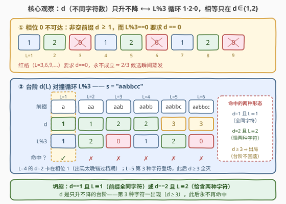
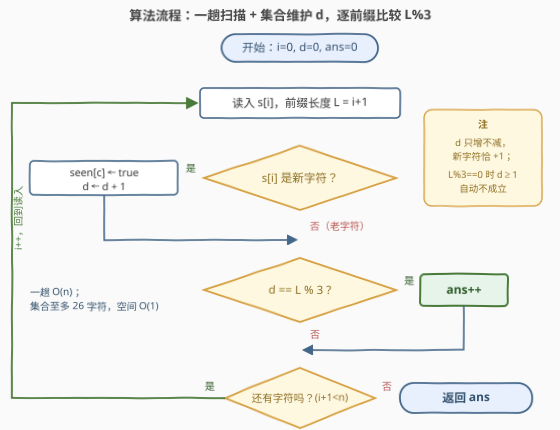

# LeetCode 统计残差前缀 题解

## 1. 题目概述

- **标题 / 题号**：统计残差前缀（#3803，easy）
- **链接**：https://leetcode.cn/problems/count-residue-prefixes/
- **难度**：简单
- **标签**：哈希表、字符串

**题意**：给你一个仅由小写英文字母组成的字符串 $s$。

如果字符串 $s$ 的某个**前缀**中**不同字符的数量**等于 $\text{len(prefix)} \bmod 3$，则该前缀被称为**残差前缀**（residue prefix）。返回字符串 $s$ 中残差前缀的数量。

字符串的**前缀**是一个非空子字符串，从字符串的开头起始并延伸到任意位置。

**示例 1**：

```text
输入：s = "abc"
输出：2
解释：
  前缀 "a" 有 1 个不同字符，且长度模 3 为 1，因此它是残差前缀。
  前缀 "ab" 有 2 个不同字符，且长度模 3 为 2，因此它是残差前缀。
  前缀 "abc" 有 3 个不同字符，长度模 3 为 0，不满足条件。
  因此，答案是 2。
```

**示例 2**：

```text
输入：s = "dd"
输出：1
解释：
  前缀 "d" 有 1 个不同字符，且长度模 3 为 1，因此它是残差前缀。
  前缀 "dd" 有 1 个不同字符，但长度模 3 为 2，不满足条件。
  因此，答案是 1。
```

**示例 3**：

```text
输入：s = "bob"
输出：2
解释：
  前缀 "b" 有 1 个不同字符，且长度模 3 为 1，因此它是残差前缀。
  前缀 "bo" 有 2 个不同字符，且长度模 3 为 2，因此它是残差前缀。
  前缀 "bob" 有 2 个不同字符，长度模 3 为 0，不满足条件。
  因此，答案是 2。
```

**约束**：

- $1 \le s.length \le 100$
- $s$ 仅包含小写英文字母。

> 💡 **审题关键**：① 前缀从串首起、非空，共 $n$ 个（长度 $1 \sim n$），**枚举长度即枚举前缀**；② 比较的双方是「不同字符数 $d(L)$」与「长度残差 $L \bmod 3$」，前者 $\ge 1$ 且**只增不减**，后者在 $\{0,1,2\}$ 里循环——这个不对称性就是全部突破口；③ $n \le 100$，怎么写都能过，但「一趟扫描 + 增量维护」才是值得带走的手感。

## 2. 解题思路

### 2.1 暴力思路

对每个前缀长度 $L$，重新扫描 $s[0..L-1]$ 数一遍不同字符，再与 $L \bmod 3$ 比较：

```python
ans = 0
for L in range(1, n + 1):
    if len(set(s[:L])) == L % 3:
        ans += 1
```

每个前缀重数一遍，$O(n^2)$；$n \le 100$ 自然能过，但前缀是**逐个延长**的——每往后读一个字符，不同字符数要么不变、要么恰加一，重扫纯属浪费。

### 2.2 核心观察：模 3 条件坍缩——目标只在 $d \in \{1, 2\}$ 可达



三条性质把条件压缩到极简：

**性质一（$0$ 不可达）**：非空前缀至少含一个字符，故 $d(L) \ge 1$；而 $L \bmod 3 = 0$ 要求 $d = 0$。于是**长度为 $3, 6, 9, \dots$ 的前缀一律出局**——三分之二的候选瞬间蒸发。

**性质二（条件坍缩）**：残差前缀只剩两种形态：

$$d(L) = 1 \text{ 且 } L \equiv 1 \pmod 3 \quad(\text{前缀清一色同一字符})， \qquad d(L) = 2 \text{ 且 } L \equiv 2 \pmod 3 \quad(\text{前缀恰含两种字符})$$

**性质三（事件截断）**：$d(L)$ 是**非降台阶**——每遇到一个新字符恰 $+1$。一旦第 3 种字符登场，$d \ge 3 > 2$ 且永不回落，之后所有前缀全部出局。**全部残差前缀都终止在第 3 个不同字符首次出现之前**。

据此实现极简：**一趟扫描**，集合增量维护 $d$，读一个字符比较一次：

$$\text{每步判定：} \quad d \stackrel{?}{=} (i+1) \bmod 3$$

其中 $i + 1$ 是当前前缀长度。

### 2.3 算法流程图



**逻辑执行步骤**：

| 步骤 | 操作 | 说明 |
|------|------|------|
| ① 读字符 | 取 $s[i]$，$i$ 从 $0$ 起 | 前缀长度 $L = i + 1$ |
| ② 更新集合 | $s[i]$ 入集合；若是新字符则 $d{+}{+}$ | `bool[26]` 或 `set` 均可 |
| ③ 比较判定 | $d \stackrel{?}{=} (i+1) \bmod 3$ | 性质一保证 $L \bmod 3 = 0$ 时自动为假 |
| ④ 计数 | 相等则 $ans{+}{+}$ | |
| ⑤ 循环 | $i{+}{+}$，回到 ①；扫完返回 $ans$ | $O(n)$ 一趟收工 |

### 2.4 示例演算

**官方示例 3** `s = "bob"` 逐步走一遍：

| $L$ | 前缀 | $d$（不同字符数） | $L \bmod 3$ | 命中？ |
|-----|------|------|------|------|
| 1 | `"b"` | 1 | 1 | ✓ |
| 2 | `"bo"` | 2 | 2 | ✓ |
| 3 | `"bob"` | 2 | 0 | ✗ |

合计 $2$ ✓。

**全部示例 + 一个自构造样例**汇总：

| 输入 | 各前缀 $(d,\ L \bmod 3)$ | 答案 |
|------|--------------------------|------|
| `"abc"` | $(1,1)\checkmark\ (2,2)\checkmark\ (3,0)\times$ | 2 |
| `"dd"` | $(1,1)\checkmark\ (1,2)\times$ | 1 |
| `"bob"` | $(1,1)\checkmark\ (2,2)\checkmark\ (2,0)\times$ | 2 |
| `"aabbcc"` | $(1,1)\checkmark\ (1,2)\times\ (2,0)\times\ (2,1)\times\ (3,2)\times\ (3,0)\times$ | 1 |

`"aabbcc"` 值得细品两处：$L=4$ 时 $d=2$ 却卡在相位 $1$ 上——「两种字符」出现得**太晚**错过了 $L \equiv 2$ 的档期；$L=5$ 第 3 种字符一登场，$d$ 升到 3，后面无论多长全部出局——性质三的现场演示。

## 3. 参考代码

### C++

```cpp
class Solution {
public:
    int residuePrefixes(string s) {
        int ans = 0;
        bool seen[26] = {false};      // 字符集仅小写字母，数组替哈希表
        int d = 0;                    // 当前前缀的不同字符数
        for (int i = 0; i < (int)s.size(); ++i) {
            int c = s[i] - 'a';
            if (!seen[c]) {
                seen[c] = true;
                ++d;                  // 新字符登场，台阶 +1
            }
            if (d == (i + 1) % 3) ++ans;
        }
        return ans;
    }
};
```

> 💡 **写法要点**：
> - `seen[26]` 布尔数组替代哈希表——字符集固定 26，O(1) 判定且无哈希开销；`int d` 增量维护，免得每步重算 `count(seen)`；
> - `(i + 1) % 3` 中 `i + 1` 即前缀长度，$L \bmod 3 = 0$ 时因 $d \ge 1$ 自动不成立，**无需特判**；
> - 答案至多 $\lceil n/3 \rceil \cdot 2 \le 68$，`int` 绰绰有余。

### Python

```python
class Solution:
    def residuePrefixes(self, s: str) -> int:
        seen = set()
        ans = 0
        for i, c in enumerate(s):
            seen.add(c)                       # 幂等：老字符不改变集合大小
            ans += len(seen) == (i + 1) % 3   # bool 直接参与加法
        return ans
```

> 💡 **写法要点**：`set.add` 幂等，重复字符不加白加，`len(seen)` 天然就是增量维护的 $d$；`bool` 是 `int` 的子类，`ans += (条件)` 一行完成「命中才 +1」。

## 4. 复杂度分析

| 维度 | 复杂度 | 说明 |
|------|--------|------|
| **时间** | $O(n)$ | 一趟扫描，每步 $O(1)$；暴力重数是 $O(n^2)$，$n \le 100$ 时两者都过，但增量版可扛 $n \sim 10^6$ |
| **空间** | $O(1)$ | 集合至多 26 个字符（或 `bool[26]`），与 $n$ 无关 |
| **量级判断** | $n \le 100$ | 官方 hint 明言「按描述模拟」，本题考的是**别把简单题写复杂**，一趟 + 集合即满分姿势 |

## 5. 扩展：事件驱动闭式与 mod k 推广

### 5.1 答案只由前 3 个不同字符的位置决定

由性质三，第 3 种字符出现后万事皆休。设：

- $p_2$ = 使前缀**首次**含 2 种不同字符的下标（即第 2 种字符的首现位置，不存在则记 $n$）；
- $p_3$ = 第 3 种字符的首现位置（不存在则记 $n$）。

则「恰 1 种字符」的前缀长度为 $L \in [1, p_2]$，「恰 2 种」为 $L \in [p_2 + 1, p_3]$，于是

$$\text{ans} = \#\{L \le p_2 : L \equiv 1 \pmod 3\} \;+\; \#\{p_2 < L \le p_3 : L \equiv 2 \pmod 3\}$$

区间内同余计数有闭式 $\#\{L \in [1, m] : L \equiv r \pmod 3\} = \lfloor (m - r)/3 \rfloor + 1$（$m \ge r$，否则 $0$）。随机对拍 20000 组与逐前缀模拟完全一致。**推论**：哪怕 $n = 10^{18}$（$s$ 由小字母表周期性重复而成），扫到第 3 个新字符即可提前收工——答案与之后的字符毫无关系。

### 5.2 推广到 $\bmod\ k$

条件变为 $d(L) = L \bmod k$ 时，同样的坍缩成立：$d \ge 1$ 砍掉 $r = 0$ 相位，合法形态只剩 $d = r,\ r \in [1, k-1]$ 共 $k - 1$ 种配对；全部命中仍终止在**第 $k$ 个不同字符首现之前**（且 $d$ 台阶封顶于字符集大小 $\Sigma = 26$，$k > 27$ 时高相位天然不可达）。解题姿势不变：一趟扫描 + 集合，比较 $d \stackrel{?}{=} L \bmod k$。

## 6. 面试要点

**Q1：长度是 3 的倍数的前缀为什么永远不是残差前缀？**

> 非空前缀至少含 1 个不同字符，$d \ge 1$；而 $L \bmod 3 = 0$ 要求 $d = 0$，矛盾。所以 $L = 3, 6, 9, \dots$ 的前缀全部出局，条件实际坍缩为 $d = 1$ 配 $L \equiv 1$、$d = 2$ 配 $L \equiv 2$ 两种相位。

**Q2：如何避免对每个前缀重数一遍不同字符？**

> 前缀是逐个延长一个字符的，$d$ 只会「不变或 +1」：用一个集合（或 `bool[26]`）记录已见字符，读到新字符时 $d{+}{+}$，老字符不动。一趟扫描 $O(n)$，每步 $O(1)$，替代 $O(n^2)$ 的逐前缀重数。

**Q3：这题答案的结构上界是什么？**

> 一旦第 3 种不同字符出现，$d \ge 3$ 且单调不降，之后永不再命中。所以**全部残差前缀都在第 3 个不同字符首现之前**，答案只由前 3 个不同字符的位置决定（见 5.1 闭式），与串的后续内容无关。

**Q4：用 `set` 还是 `bool[26]` 数组？**

> 字符集固定为 26 个小写字母时数组更快更省（无哈希开销、缓存友好）；字符集大或不定（Unicode、整数键）时用 `set` / `unordered_set`。本题两者皆可，数组版是「值域受限用桶替哈希」的经典小技巧。

**Q5：若把 $\bmod 3$ 改成 $\bmod k$、$n$ 放大到 $10^{18}$ 呢？**

> 判定逻辑不变（$d \stackrel{?}{=} L \bmod k$），但逐位扫描不可行——用 5.1 的事件截断：只找前 $k$ 个不同字符的首现位置（至多扫 $\Sigma + 1$ 个字符，$\Sigma$ 为字符集大小），再对 $k-1$ 个「恰 $r$ 种字符」的长度区间做同余闭式计数，总计 $O(\Sigma + k)$。

> 💡 **一句话总结**：$d \ge 1$ 砍掉相位 0，条件坍缩成「1 配 1、2 配 2」；$d$ 是只升不降的台阶，第 3 种字符一出现全剧终。一趟扫描 + 集合维护 $d$，与 $(i+1) \bmod 3$ 逐步对表即可。

## 同类练习题

| # | 题目 | 与本题的关联 |
|---|------|-------------|
| 1832 | [判断句子是否为全字母句](https://leetcode.cn/problems/check-if-the-sentence-is-pangram/)（[题解](../1801-1900/1832_判断句子是否为全字母句.md)） | 集合数不同字母的一趟扫描，本题「维护 $d$」的最直白亲戚 |
| 2351 | [第一个出现两次的字母](https://leetcode.cn/problems/first-letter-to-appear-twice/)（[题解](../2301-2400/2351_第一个出现两次的字母.md)） | 集合判重 + 首次事件定位，同款「一趟 + set」手感 |
| 771 | [宝石与石头](https://leetcode.cn/problems/jewels-and-stones/)（[题解](../0701-0800/771_宝石与石头.md)） | 把石头集合化再计数，字符哈希入门 |
| 1624 | [两个相同字符之间的最长子字符串](https://leetcode.cn/problems/largest-substring-between-two-equal-characters/)（[题解](../1601-1700/1624_两个相同字符之间的最长子字符串.md)） | 记录字符首现下标，前缀视角的近亲 |
| 2085 | [统计出现过一次的公共字符串](https://leetcode.cn/problems/count-common-words-with-one-occurrence/)（[题解](../2001-2100/2085_统计出现过一次的公共字符串.md)） | 两张哈希表交叉计数，哈希计数族的巩固练习 |
