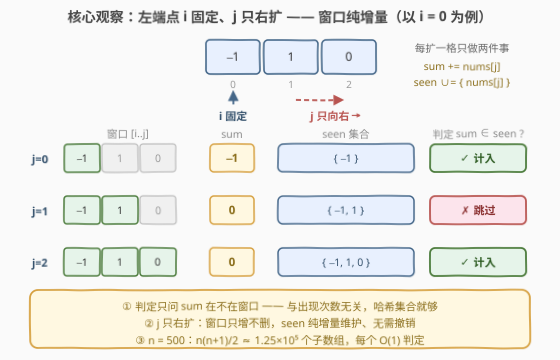
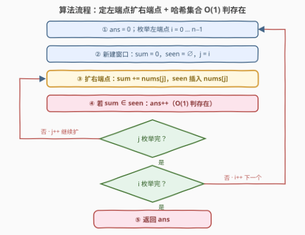

# 中心子数组的数量

- **题目名称**：中心子数组的数量
- **链接**：[3804. 中心子数组的数量](https://leetcode.cn/problems/number-of-centered-subarrays/)
- **难度**：中等
- **标签**：数组、哈希表、枚举

## 1. 题目概述

**题意**：给定一个整数数组 `nums`。如果一个**子数组**的元素之和**等于该子数组中的至少一个元素**，则称其为**中心子数组**。返回 `nums` 中中心子数组的数量。

子数组是数组中连续、非空的元素序列。

**示例 1**：

```text
输入：nums = [-1,1,0]
输出：5
解释：
• 所有单元素子数组（[-1]、[1]、[0]）都是中心子数组；
• 子数组 [1,0] 的和为 1，且 1 在该子数组中；
• 子数组 [-1,1,0] 的和为 0，且 0 在该子数组中。
```

**示例 2**：

```text
输入：nums = [2,-3]
输出：2
解释：只有单元素子数组（[2]、[-3]）是中心子数组。
```

**约束条件**：

- $1 \le \text{nums.length} \le 500$
- $-10^5 \le \text{nums}[i] \le 10^5$

> 💡 **审题关键**：① 判定条件是「子数组**和** $\in$ 子数组**元素集合**」——既不是「和为定值」也不是「和等于某个端点」：如 $[1,3,-1]$ 的和 $3$ 等于**中间**元素，与两端点无关；② 单元素子数组 $[x]$ 的和就是 $x$ 自身，必为中心子数组 $\Rightarrow$ **答案 $\ge n$**，可作对拍下界；③ $n \le 500 \Rightarrow$ 子数组至多 $\tfrac{n(n+1)}{2} \approx 1.25\times 10^5$ 个——**$O(n^2)$ 枚举正是出题人留的窗口**；④ 元素可负、可重复，「和」与「元素」随时可能撞车。

---

## 2. 解题思路

### 2.1 暴力思路：枚举子数组 + 扫描窗口判存在

枚举全部 $O(n^2)$ 个子数组：用增量累加 $O(1)$ 求出子数组和 $S$，再**从头扫描窗口**逐个比对「$S$ 是否等于窗口中某个元素」，单次判定 $O(n)$，总计 $O(n^3)$。

$n=500$ 时约 $1.25\times 10^8$ 次比较——C++ 开 O2 勉强能过，Python 必超时。整道题的瓶颈**全部**堆在「判存在」这一步：求和本来就能增量维护，凭什么判定不能？

> 💡 暴力的浪费在于：窗口从 $[i..j-1]$ 扩到 $[i..j]$ 只多了一个元素，之前扫过的比对结果却全部作废、从头再扫。我们需要一种能**随窗口增量维护**的「元素存在性」结构。

### 2.2 核心观察：定左端点、j 只右扩——哈希集合 O(1) 判存在



**观察一（判定与次数无关）**：条件只问「$S$ 在不在窗口元素的**值集合**里」，不关心出现几次、出现在哪——一个**哈希集合** `seen` 即可承载，连计数器都不需要。

**观察二（窗口纯增量）**：固定左端点 $i$、让右端点 $j$ 从 $i$ 向右推进时，窗口每步只发生一种变化——**加入 `nums[j]`**，永不删除。集合无需支持撤销，`insert` 一步维护。

**观察三（和同样增量）**：$S_{[i..j]} = S_{[i..j-1]} + \text{nums}[j]$，求和也免重算。

三者合一：每个子数组 $(i,j)$ 的判定代价从 $O(n)$ 降到 $O(1)$，总时间 $O(n^2)$——$n=500$ 时约 $1.25\times 10^5$ 次哈希操作，三个数量级的提速。

> 💡 **两个对称性注脚**：① 定**右**端点向左扩同理；② 每轮 $i$ **新建**集合而非全局复用——左端点右移需要删元素，`set` 遇到重复值时一次 `erase` 会把仍在窗口里的副本也误删（要删得干净得上计数器），干脆每轮重来，总代价不变。

### 2.3 算法流程图



**文字版步骤**：

| 步骤 | 操作 | 说明 |
|------|------|------|
| ① 外层枚举 | `ans = 0`；左端点 $i$ 从 $0$ 到 $n-1$ | |
| ② 新建窗口 | `sum = 0`，`seen = ∅`，`j = i` | 每轮新建集合，不做删除 |
| ③ 扩右端点 | `sum += nums[j]`；`seen.insert(nums[j])` | 窗口纯增量 |
| ④ 判定计数 | 若 `sum ∈ seen`：`ans++` | 哈希集合 $O(1)$ 判存在 |
| ⑤ 推进循环 | `j++` 至越界，随后 `i++` | 两层枚举 |
| ⑥ 返回 | `ans` | |

### 2.4 示例演算

以示例 1 `nums = [-1, 1, 0]` 走一遍全部 $6$ 个子数组：

| $i$ | $j$ | 子数组 | sum | seen | 中心？ |
|-----|-----|--------|-----|------|--------|
| 0 | 0 | $[-1]$ | $-1$ | $\{-1\}$ | ✓（单元素必中心） |
| 0 | 1 | $[-1,1]$ | $0$ | $\{-1,1\}$ | ✗（$0 \notin$ 窗口） |
| 0 | 2 | $[-1,1,0]$ | $0$ | $\{-1,1,0\}$ | ✓（$0$ 刚入窗） |
| 1 | 1 | $[1]$ | $1$ | $\{1\}$ | ✓ |
| 1 | 2 | $[1,0]$ | $1$ | $\{1,0\}$ | ✓（$1$ 在窗口） |
| 2 | 2 | $[0]$ | $0$ | $\{0\}$ | ✓ |

共 $5$ 个，与示例输出一致。注意第 3 行：`nums[2] = 0` **先加入 `seen` 再判定**，$[-1,1,0]$ 才被正确计入——判定必须发生在「累加与插入之后」。

---

## 3. 参考代码

### C++

```cpp
class Solution {
  public:
    int centeredSubarrays(vector<int>& nums) {
        int n = nums.size(), ans = 0;
        for (int i = 0; i < n; ++i) {
            unordered_set<int> seen;      // 窗口内出现过的值：判存在，与次数无关
            long long sum = 0;            // |sum| ≤ 500×1e5 = 5e7，int 亦够，long long 求稳
            for (int j = i; j < n; ++j) {
                sum += nums[j];
                seen.insert(nums[j]);     // 必须先插入再判定：单元素窗口才不漏
                if (seen.count((int)sum)) ++ans;
            }
        }
        return ans;
    }
};
```

### Python

```python
class Solution:
    def centeredSubarrays(self, nums: List[int]) -> int:
        n, ans = len(nums), 0
        for i in range(n):
            seen, s = set(), 0            # 每轮新建：窗口只增不删
            for j in range(i, n):
                s += nums[j]
                seen.add(nums[j])
                ans += s in seen          # O(1) 判存在
        return ans
```

> 💡 **写法要点**：
> - **集合而非计数器**：判定只问「在不在」。若硬要全局维护一个集合并随 $i$ 右移删除，重复值会被 `erase` 连根拔掉（窗口里还有副本却被删光）；每轮新建最省心，且总插入次数 = 子数组个数 = $O(n^2)$，代价不变。
> - **顺序不能反**：`sum` 累加、`seen` 插入都在判定**之前**完成，单元素子数组 $[x]$ 才能正确判 ✓。
> - **溢出**：$\lvert S \rvert \le 500 \times 10^5 = 5\times 10^7 < 2^{31}$，`int` 装得下；C++ 用 `long long` 承接纯属保险。

---

## 4. 复杂度分析

| 维度 | 复杂度 | 说明 |
|------|--------|------|
| **时间** | $O(n^2)$ | 两层循环总步数 = 子数组个数 $\tfrac{n(n+1)}{2} \approx 1.25\times 10^5$，每步 $O(1)$ 增量维护 + $O(1)$ 哈希判定 |
| **空间** | $O(n)$ | 单侧窗口的 `seen` 至多 $n$ 个元素；每轮新建、用完即弃，峰值不叠加 |

---

## 5. 扩展：为什么不能像「和为 K 的子数组」那样 O(n)？

**对照 560 题**：「子数组和 $= K$」可改写成 $P[r] - P[l] = K$（$P$ 为前缀和）——条件**只依赖两个端点各自的前缀和**，于是边扫边查哈希「之前出现过几个 $P[r]-K$」，一次遍历 $O(n)$ 收工。

**本题为何失效**：条件是

$$\underbrace{P[j+1] - P[i]}_{\text{子数组和}} \in \{\, \text{nums}[i],\ \dots,\ \text{nums}[j] \,\}$$

右边的合法取值集**依赖区间内部的元素集合**，无法写成只关于 $i$、$j$ 各自的函数——「端点 + 前缀和」表达不了「区间内容」，只能枚举一个端点、增量维护窗口信息，$O(n^2)$。

**证人视角的尝试与陷阱**：换个思路，对每个位置 $k$（值为 $v$）统计「包含 $k$ 且和为 $v$」的子数组，即找配对 $P[j+1] = P[i] + v$（$i \le k \le j$）。但一个子数组可能有**多个证人**——如 $[0,0]$ 的和 $0$ 同时是两个元素的「证人」，按证人求和会重复计数，须「只归功最左证人」之类的去重，实现复杂且仍难低于 $O(n^2)$。$n \le 500$ 的约束本身就宣判：出题人只要 $O(n^2)$。

---

## 6. 面试要点

**Q1：暴力 $O(n^3)$ 与哈希优化 $O(n^2)$ 的差距在哪？$n=500$ 时各是多少？**

> 差距全在「判存在」：扫描窗口 $O(n)$ → 哈希集合 $O(1)$。总量 $1.25\times 10^8 \to 1.25\times 10^5$，三个数量级；优化后 Python 也能轻松通过。

**Q2：为什么用集合而不是计数的哈希表？反过来全局维护一个集合行不行？**

> 判定只问「sum 在不在窗口」，与出现次数无关，集合足够。全局维护会随左端点右移做删除——`set` 的 `erase` 按值删光所有副本，重复值仍在窗口却被误删（要删得干净得上计数器）；而每轮新建逻辑最简、代价相同（总插入数仍是 $O(n^2)$），是更优选择。

**Q3：为什么不能像 560 题那样前缀和 + 哈希一次遍历？**

> 560 的条件 $P[r]-P[l]=K$ 只依赖两个前缀和；本题条件 $P[j+1]-P[i] \in \text{nums}[i..j]$ 依赖**区间内的元素集合**，不是端点的函数，前缀和技巧表达不了区间内容，只能枚举端点 + 增量维护窗口（见第 5 节）。

**Q4：答案有什么天然下界？**

> 所有单元素子数组必为中心子数组（和 = 自身 ∈ 窗口），故答案 $\ge n$；对拍时可当 sanity check——随机小数组先验证 `ans >= n` 且与暴力一致。

**Q5：实现上有哪些细节坑？**

> ① 判定必须在「累加 `nums[j]`、插入 `nums[j]` **之后**」——顺序反了单元素窗口会漏判；② `sum` 用 `long long` 保险（本题 `int` 实际够用，$5\times 10^7 < 2^{31}$）；③ 每轮 $i$ 新建 `seen`，别复用；④ C++ `unordered_set` 理论最坏单次 $O(n)$，数据小无碍，追求稳定可 `reserve` 或换排序数组 + 二分（$O(n^2\log n)$，本题无必要）。

---

## 7. 同类练习题

- [560. 和为 K 的子数组](https://leetcode.cn/problems/subarray-sum-equals-k/)（[题解](../0501-0600/560_和为K的子数组.md)）：条件只与前缀和差有关时的 $O(n)$ 哈希一次遍历——对照本题为何此路不通
- [974. 和可被 K 整除的子数组](https://leetcode.cn/problems/subarray-sums-divisible-by-k/)（[题解](../0901-1000/974_和可被K整除的子数组.md)）：前缀和 + 哈希计数的同余版
- [1524. 和为奇数的子数组数目](https://leetcode.cn/problems/number-of-sub-arrays-with-odd-sum/)（[题解](../1501-1600/1524_和为奇数的子数组数目.md)）：前缀和奇偶性 + 组合计数，巩固「端点条件型」套路
- [713. 乘积小于 K 的子数组](https://leetcode.cn/problems/subarray-product-less-than-k/)（[题解](../0701-0800/713_乘积小于K的子数组.md)）：同款「枚举端点 + 窗口增量维护」，体会本题所属的「窗口内容型」家族
