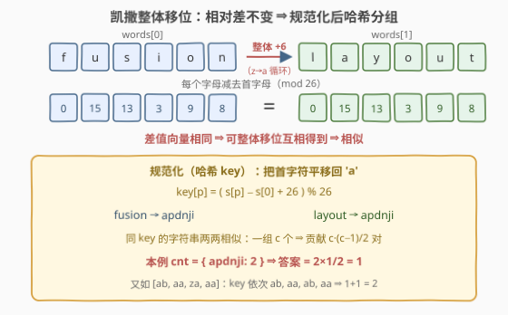
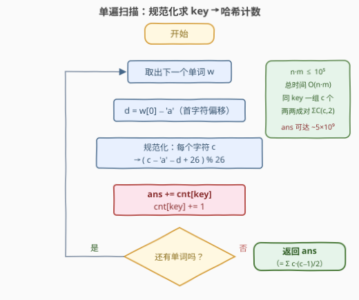

# 统计凯撒加密对数目

- **题目名称**：统计凯撒加密对数目
- **链接**：[3805. 统计凯撒加密对数目](https://leetcode.cn/problems/count-caesar-cipher-pairs/)
- **难度**：中等
- **标签**：数组、哈希表、数学、字符串、计数

## 1. 题目概述

**题意**：给定由 $n$ 个字符串组成的数组 $words$，每个字符串长度均为 $m$ 且只含小写字母。一次**操作**是：选择某个字符串，把其中**每个**字母替换为字母表中的下一个字母（循环替换，`'z'` 的下一个是 `'a'`）。若对字符串 $s$ 和 $t$ 执行**任意多次**操作（可以对二者分别操作，也可能零次）后能使它们相等，则称 $s$ 与 $t$ **相似**。求满足 $i < j$ 且 $words[i]$ 与 $words[j]$ 相似的下标对数量。

**示例 1**：

```text
输入：words = ["fusion","layout"]
输出：1
解释：对 "fusion" 执行 6 次操作：fusion → gvtjpo → hwukqp → ixvlrq
      → jywmsr → kzxnts → layout，故二者相似。
```

**示例 2**：

```text
输入：words = ["ab","aa","za","aa"]
输出：2
解释：words[0]="ab" 与 words[2]="za" 相似；words[1]="aa" 与 words[3]="aa" 相似。
```

**约束条件**：$1 \le n \le 10^5$，$1 \le m \le 10^5$，$1 \le n \cdot m \le 10^5$，$words[i]$ 仅由小写英文字母组成。

> 💡 **审题关键**：① 操作作用在**整个字符串**上——所有字母**同时** +1（mod 26），这正是**凯撒密码**的整体移位；② 操作可对 $s$、$t$ **分别**施加任意次，但两个整体移位叠加后仍是整体移位（见 5.1 节），所以「能否相似」只取决于**一个**移位量 $k$；③ $n \cdot m \le 10^5$ 说明总字符数很小，但 $n$ 本身可达 $10^5$——逐对判定 $O(n^2)$ 必死，题目在逼你把「相似」压缩成可哈希的**签名**。

---

## 2. 解题思路

### 2.1 暴力思路：逐对判定「字符差是否为常数」

一次操作 = 整串字母在字母环上**统一前进一格**；$k$ 次操作 = 整串统一前进 $k$ 格。因此 $s$ 与 $t$ 相似当且仅当存在 $k \in [0, 26)$ 使每个位置都满足

$$t[p] \equiv s[p] + k \pmod{26}$$

即**所有位置上的字符差 $t[p] - s[p]$（mod 26）是同一个常数**。于是暴力做法呼之欲出：

```python
ans = 0
for i in range(n):
    for j in range(i + 1, n):
        s, t = words[i], words[j]
        if len(set((ord(t[p]) - ord(s[p])) % 26 for p in range(m))) == 1:
            ans += 1
```

时间 $O(n^2 \cdot m)$。看似有 $n \cdot m \le 10^5$ 兜底，但当 $m = 1$ 时 $n$ 可达 $10^5$，数对约 $\tfrac{10^{10}}{2} = 5 \times 10^9$ 个——判定再快也扛不住。**必须把 $O(n^2)$ 的两两比较改成 $O(n)$ 的分组计数。**

### 2.2 核心观察：整体移位不改变「相对差」——规范化签名



把条件「字符差为常数」换个角度看：$t[p] - s[p] \equiv k$ 对所有 $p$ 成立，等价于**每个字符串内部各字母相对首字母的偏移完全一致**：

$$t[p] - t[0] \equiv (s[p] + k) - (s[0] + k) \equiv s[p] - s[0] \pmod{26}$$

**移位量 $k$ 在相减时被消掉了**——整体移位改变每个字母的绝对位置，却**不改变字母之间的相对差**。于是定义每个字符串的**规范化签名**（把首字符平移回 `'a'`）：

$$key[p] = \big(s[p] - s[0] + 26\big) \bmod 26$$

$$s \sim t \iff key(s) = key(t)$$

上图中 `"fusion"` 与 `"layout"` 的差值向量同为 $(0, 15, 13, 3, 9, 8)$，规范化后同为 `"apdnji"`——一眼看出相似。反向也成立：若 $key$ 相同，把 $s$ 整体移位 $t[0] - s[0]$ 格就得到 $t$。

于是问题坍缩成纯粹的**分组计数**：同 $key$ 的字符串构成一个「相似类」，类内 $c$ 个字符串两两相似，贡献 $\binom{c}{2} = \dfrac{c(c-1)}{2}$ 对。

### 2.3 算法流程图：单遍扫描，边扫边数



| 步骤 | 操作 | 说明 |
|------|------|------|
| ① 取单词 | 取下一个 $w$，记 $d = w[0] - {}$`'a'` | $d$ 是首字符偏移 |
| ② 规范化 | 每个字符 $c \mapsto (c - d + 26) \bmod 26$ 拼成 $key$ | 首字符对齐到 `'a'` |
| ③ 计数 | $ans \mathrel{+}= cnt[key]$；$cnt[key] \mathrel{+}= 1$ | 与之前同 $key$ 的每个字符串各成一对 |
| ④ 收尾 | 扫描结束返回 $ans$ | 恰等于 $\sum_{key} \binom{cnt[key]}{2}$ |

> 💡 **为什么「边扫边加」是对的**：处理到第 $i$ 个字符串时，$cnt[key]$ 恰是它前面同 $key$ 的字符串个数——它们与第 $i$ 个**都**成对。逐个累加与最后统一算 $\sum \binom{c}{2}$ 完全等价，好处是只需一遍扫描、无需二次遍历哈希表。

### 2.4 示例演算

**示例 2** `words = ["ab","aa","za","aa"]`（注意 `"za"` 的首字符是 `'z'`，$d = 25$）：

| 单词 | 首字母 | $d$ | 规范化过程 | $key$ | 此前同 $key$ 数 | $cnt$ 变化 | $ans$ |
|------|--------|-----|-----------|-------|----------------|-----------|-------|
| `"ab"` | a | 0 | b−a=1 | `"ab"` | 0 | → 1 | 0 |
| `"aa"` | a | 0 | a−a=0 | `"aa"` | 0 | → 1 | 0 |
| `"za"` | z | 25 | (0−25+26)%26=1 | `"ab"` | **1** | → 2 | **1** |
| `"aa"` | a | 0 | a−a=0 | `"aa"` | **1** | → 2 | **2** |

最终 $cnt = \{ab{:}\,2,\ aa{:}\,2\}$，两组各含 $c = 2$ 个、各贡献 $\dfrac{c(c-1)}{2} = 1$ 对，$ans = 1 + 1 = 2$ ✓——与暴力逐对判定一致。

**边界**：$m = 1$ 时所有单字母串的 $key$ 都是 `"a"`（单字母可移位到任何字母），$n = 10^5$ 时答案 $\tfrac{10^5 \times 99999}{2} \approx 5 \times 10^9$——算法毫无特判地自然得到正确结果，但**答案本身超出 `int`**（见下）。

---

## 3. 参考代码

### C++

```cpp
class Solution {
public:
    long long countPairs(vector<string>& words) {
        unordered_map<string, long long> cnt;
        long long ans = 0;
        for (const string& w : words) {
            int d = w[0] - 'a';                        // 首字符偏移
            string key = w;
            for (char& c : key)
                c = 'a' + (c - 'a' - d + 26) % 26;     // 首字符对齐到 'a'
            ans += cnt[key]++;                         // 与之前同 key 的都成对
        }
        return ans;
    }
};
```

> 💡 **写法要点**：
> - 签名直接复用 `string`（总字符数 $\le 10^5$，构造无压力）；`c - 'a' - d` 可能为负，**必须 `+ 26` 再取模**，这是本题唯一容易写错的细节；
> - `ans += cnt[key]++` 一行完成「先累加后计数」——后缀自增返回旧值，恰好是「此前同 $key$ 的个数」；
> - 答案最大约 $5 \times 10^9 > 2^{31} - 1$，官方函数签名已用 `long long`；若自己刷题时写 `int` 会静默溢出。

### Python

```python
class Solution:
    def countPairs(self, words: List[str]) -> int:
        cnt = Counter()
        ans = 0
        for w in words:
            d = ord(w[0]) - 97
            key = ''.join(chr((ord(c) - 97 - d) % 26 + 97) for c in w)
            ans += cnt[key]
            cnt[key] += 1
        return ans
```

> 💡 **写法要点**：Python 的 `%` 对负数也返回非负结果，`(ord(c) - 97 - d) % 26` 无需显式 `+ 26`；`Counter` 未登记的 key 默认取 0，首次出现自然累加 0。随机小样例与暴力逐对判定对拍 3000 组全部一致。

---

## 4. 复杂度分析

| 维度 | 复杂度 | 说明 |
|------|--------|------|
| **时间** | $O(n \cdot m)$ | 每个单词规范化 $O(m)$，全部 $key$ 字符总数 $\le n \cdot m \le 10^5$；哈希单次均摊 $O(1)$ |
| **空间** | $O(n \cdot m)$ | 哈希表存下所有 $key$（总字符 $\le 10^5$） |
| **量级判断** | $n \le 10^5$，$n \cdot m \le 10^5$ | 暴力 $O(n^2)$ 在 $m=1$ 时约 $5 \times 10^9$ 对必超时；分组计数后与 $n^2$ 彻底解耦 |

---

## 5. 扩展：移位的代数性质与签名的等价形式

### 5.1 为什么「对两边各操作若干次」仍归结为「单个移位 k」

题面允许对 $s$、$t$ **分别**操作，容易误以为要枚举两个移位量。设对 $s$ 共操作 $k_1$ 次、对 $t$ 共操作 $k_2$ 次（均为非负整数），最终比较的是 $s + k_1$ 与 $t + k_2$，相等即

$$t \equiv s + (k_1 - k_2) \pmod{26}$$

$k_1 - k_2$ 取遍全体整数，模 26 后**恰是某个 $k \in [0, 26)$**。所以「存在双向操作序列」⟺「存在单个移位 $k$ 使 $t = s + k$」——两个自由度看似翻倍，实为一个。

### 5.2 签名的等价形式：相邻差

除了「首字符对齐到 `'a'`」（$key$ 长 $m$），还可以用**相邻字符差** $(s[p] - s[p-1]) \bmod 26$ 拼成长 $m-1$ 的签名。二者判定的等价类完全相同：整体移位在相减时同样被消掉。首字符对齐的好处是实现顺手（原地改写副本即可）；相邻差的好处是天然体现了「循环字母环上的形状」。这招的祖师爷是 [249. 移位字符串分组](../0201-0300/249_移位字符串分组.md)——同一套规范化，249 只要求**分组**，本题进一步**数对**，是一道干净的续作。

---

## 6. 面试要点

**Q1：一次操作对字符串做了什么？「任意多次操作」如何化简？**

> 一次操作 = 整串字母在 mod 26 字母环上统一 +1，即凯撒移位；$k$ 次操作 = 统一 +k。对 $s$、$t$ 分别操作 $k_1$、$k_2$ 次后相等 ⟺ $t \equiv s + (k_1 - k_2) \pmod{26}$，而 $k_1 - k_2$ 模 26 可取任意值，故相似 ⟺ 存在单个 $k \in [0, 26)$ 使 $t = s + k$。

**Q2：「相似」的充要条件是什么？怎么想到用相对差刻画？**

> $t[p] - s[p] \equiv k$（常数）对每个位置 $p$ 成立。关键代数步骤：$t[p] - t[0] \equiv s[p] - s[0]$——移位量在「同串内相减」时被消掉，说明**相似类由字符串内部的相对结构唯一决定**，与绝对起点无关。这正是能做规范化签名的根本原因。

**Q3：规范化为什么选「首字符对齐到 `'a'`」？**

> 它是相对差刻画的最直接实现：$key[p] = (s[p] - s[0] + 26) \bmod 26$，把每个相似类映射到唯一代表元（类中「首字母为 a」的那个串）。任何两个字符串相似 ⟺ 代表元相同。实现上只需遍历一遍原地改写，$O(m)$ 无额外技巧。

**Q4：计数为什么用 `ans += cnt[key]++`，而不是最后遍历哈希表算 $\sum \binom{c}{2}$？**

> 二者数学上等价（每个字符串与「先到的同 key 者」逐个成对，全部数对恰被计数一次）。边扫边加只需一遍、代码更短；最后统一求 $\sum \binom{c}{2}$ 则更直观不易写错。面试中能说清「为什么等价」比选哪种写法更重要。

**Q5：实现上有哪些坑？**

> ① C++ 中 `c - 'a' - d` 可能为负，必须 `(x + 26) % 26`，Python 则无此忧（`%` 天然非负）；② 答案上界约 $5 \times 10^9$ 超 `int`，返回值须 `long long`（官方签名已是）；③ $m=1$ 是隐形大样例——所有单字母串互相相似，答案 $O(n^2)$，靠签名分组自然化解，无需特判。

> 💡 **一句话总结**：3805 =「凯撒移位的**不变量**（相对差）」+「**规范化签名 + 哈希分组计数**」。带走的知识点：遇到「经某类整体变换后相等」的判定，先找变换作用下的不变量，把它做成可哈希的 key，两两比较就坍缩成一遍扫描。

---

## 7. 同类练习题

- [249. 移位字符串分组](https://leetcode.cn/problems/group-shifted-strings/)（[题解](../0201-0300/249_移位字符串分组.md)）：同款「首字符对齐」规范化签名的祖师爷——分组输出而非数对
- [49. 字母异位词分组](https://leetcode.cn/problems/group-anagrams/)（[题解](../0001-0100/49_字母异位词分组.md)）：另一类「规范化签名（排序）+ 哈希分组」的经典形态
- [1512. 好数对的数目](https://leetcode.cn/problems/number-of-good-pairs/)（[题解](../1501-1600/1512_好数对的数目.md)）：同值/同 key 两两成对的轻量计数练习，$\sum \binom{c}{2}$ 思想
- [2006. 差的绝对值为 K 的数对数目](https://leetcode.cn/problems/count-number-of-pairs-with-absolute-difference-k/)（[题解](../2001-2100/2006_差的绝对值为K的数对数目.md)）：哈希表边扫边数对的入门版，与本题 ③ 步同构
