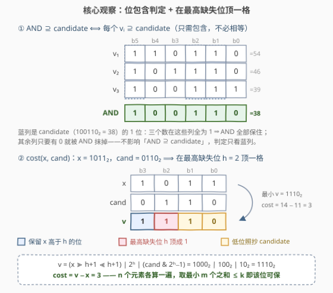
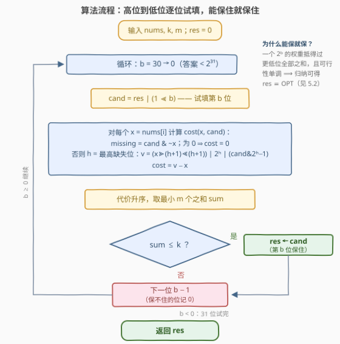

# 增加操作后最大按位与的结果

- **题目名称**：增加操作后最大按位与的结果
- **链接**：[3806. 增加操作后最大按位与的结果](https://leetcode.cn/problems/maximum-bitwise-and-after-increment-operations/)
- **难度**：困难
- **标签**：贪心、位运算、数组、排序

## 1. 题目概述

**题意**：给定整数数组 $nums$ 与整数 $k$、$m$。你**最多**可以执行 $k$ 次操作，每次操作任选一个下标 $i$，使 $nums[i]$ 增加 $1$。操作结束后，从数组中任选一个**大小为 $m$ 的子集**，返回这些元素按位与（AND）结果的最大可能值。

**示例 1**：

```text
输入：nums = [3,1,2], k = 8, m = 2
输出：6
解释：选下标 [0, 2]，花 3 次把 3 加到 6、花 4 次把 2 加到 6，
      共 7 次 ≤ 8，[6, 6] 的按位与为 6。
```

**示例 2**：

```text
输入：nums = [1,2,8,4], k = 7, m = 3
输出：4
解释：选下标 [0, 1, 3]，花 3 次把 1 加到 4、花 2 次把 2 加到 4，4 不动，
      共 5 次 ≤ 7，[4, 4, 4] 的按位与为 4。
```

**示例 3**：

```text
输入：nums = [1,1], k = 3, m = 2
输出：2
解释：两个 1 各花 1 次加到 2，共 2 次 ≤ 3，[2, 2] 的按位与为 2。
```

**约束条件**：$1 \le n = nums.length \le 5 \times 10^4$，$1 \le nums[i] \le 10^9$，$1 \le k \le 10^9$，$1 \le m \le n$。

> 💡 **审题关键**：① 操作预算 $k$ **全局共享**，但只有被选进子集的元素才需要花钱——没选中的元素一次操作都不必花；② 「子集」= 自由挑 $m$ 个下标，每个元素的最终值 $v_i \ge nums[i]$，AND 只由这 $m$ 个最终值决定；③ 答案上界 $\le \max(nums) + k \le 2 \times 10^9 < 2^{31}$——**最高只需考虑第 30 位**。

---

## 2. 解题思路

### 2.1 暴力思路：三层枚举，层层不可行

最朴素的搜索有三层：

1. **枚举子集**：$\binom{n}{m}$ 种选法，$n = 5 \times 10^4$ 时天文数字；
2. **枚举增量分配**：固定子集后，把 $\le k$ 次操作分给 $m$ 个元素又是组合爆炸；
3. **枚举答案值**：从 $2 \times 10^9$ 开始向下找一个「可行」的值——值域还是太大。

但第 3 条离正解只差一步：**答案的二进制表示至多 31 位**，而「一个候选值能否作为 AND 的包含目标」恰好可以高效判定（见 2.2）。于是把「$2 \times 10^9$ 的值域枚举」降维成「**31 次逐位决策**」——从高位到低位，每一位问一句「这一位保得住吗」。

### 2.2 核心观察：位包含判定 + 单元素代价独立



**转化一（判定改写）**：一组值 $v_1, \dots, v_m$ 的 AND **包含** $candidate$ 的全部 1 位（$v_1 \& \cdots \& v_m \supseteq candidate$），当且仅当**每个** $v_i$ 都包含 $candidate$ 的全部 1 位（$v_i \& candidate = candidate$）——因为 AND 在某位上是 1 ⟺ 所有数在该位上都是 1。注意只要求「包含」、不要求相等：多出来的位会被 AND 自然抹掉。

**转化二（代价独立）**：每个元素只需要「升到某个 $\ge nums[i]$ 且包含 $candidate$ 的值」，元素之间互不影响，总代价就是各自最小代价之和。于是

$$candidate \text{ 可行} \iff \text{全体 } n \text{ 个元素的最小代价中取最小的 } m \text{ 个，求和} \le k$$

没被选中的元素一次操作都不花，所以「挑代价最小的 $m$ 个」就是最优选法。

**转化三（单元素代价 $O(1)$ 求出）**：记 $missing = candidate \& \sim x$（$x$ 缺失的 candidate 位）：

- $missing = 0$：$x$ 已经包含 $candidate$，代价为 $0$；
- 否则设 $h$ 为 $missing$ 的**最高位**，最小可行值为

$$v = \underbrace{(x \gg (h+1) \ll (h+1))}_{\text{高于 } h \text{：照抄 } x} \;|\; \underbrace{2^h}_{\text{第 } h \text{ 位：顶成 } 1} \;|\; \underbrace{(candidate \& (2^h - 1))}_{\text{低于 } h \text{：照抄 candidate}}$$

代价即 $v - x$。**为什么在最高缺失位「顶一格」**：第 $h$ 位必须变成 1 而 $x$ 的该位是 0，任何可行 $v$ 都在这一位与 $x$「分道扬镳」且从此变大；分道位置越低、分道后补的位越小，$v$ 就越小——$h$ 已是分道位置的下界，其下低位照抄 $candidate$ 又是满足位包含的最小填法（严格证明见 5.1）。

### 2.3 算法流程图：从高位到低位逐位试填



**文字版步骤**：

| 步骤 | 操作 | 说明 |
|------|------|------|
| ① 初始化 | $res = 0$ | 已确认保得住的位集合 |
| ② 逐位 | $b$ 从 $30$ 递减到 $0$ | 答案 $< 2^{31}$，最高位是 30 |
| ③ 试填 | $candidate = res \,\vert\, 2^b$ | 假设第 $b$ 位也要保住 |
| ④ 代价 | 每个元素 $O(1)$ 算 $cost(x, candidate)$ | 见 2.2 转化三 |
| ⑤ 选 m | 代价取最小 $m$ 个求和 $sum$ | 代价独立，最小 $m$ 个即最优选法 |
| ⑥ 定夺 | $sum \le k \Rightarrow res = candidate$ | 能保住就保住，保不住该位记 0 |
| ⑦ 返回 | $res$ | 与最优解逐位相同（证明见 5.2） |

### 2.4 示例演算

**官方示例 1** $nums = [3,1,2]$，$k = 8$，$m = 2$（代价三列依次对应 $x = 3, 1, 2$）：

| 位 $b$ | $candidate$ | 代价（$x$=3 / 1 / 2） | 最小 2 个之和 | 与 $k=8$ 比较 | $res$ |
|--------|-------------|---------------------|----------------|---------------|-------|
| $\ge 4$ | $\ge 16$ | 均需加到 $\ge 16$ | 更大 | 超 ✗ | $0$ |
| 3 | $8 = 1000_2$ | 5 / 7 / 6 | $5 + 6 = 11$ | 超 ✗ | $0$ |
| 2 | $4 = 100_2$ | 1 / 3 / 2 | $1 + 2 = 3$ | 过 ✓ | $4$ |
| 1 | $6 = 110_2$ | 3 / 5 / 4 | $3 + 4 = 7$ | 过 ✓ | $6$ |
| 0 | $7 = 111_2$ | 4 / 6 / 5 | $4 + 5 = 9$ | 超 ✗ | $6$ |

答案 $6$——正对应官方解释「$3 \to 6$ 花三次、$2 \to 6$ 花四次，共 $7 \le 8$」。注意位 1 的判定恰好复现了这组最优操作：$x = 3$ 时 $missing = 6$、$h = 2$、$v = 6$、代价 3；$x = 2$ 时 $missing = 4$、$h = 2$、$v = 6$、代价 4。

（退化检查：$m = 1$ 时算法返回 $\max(nums) + k$——全部预算花在最大元素上，可作对拍样例。）

---

## 3. 参考代码

### C++

```cpp
class Solution {
public:
    int maximumAND(vector<int>& nums, int k, int m) {
        const int n = nums.size();
        int res = 0;
        vector<long long> cost(n);
        for (int b = 30; b >= 0; --b) {
            const int cand = res | (1 << b);
            for (int i = 0; i < n; ++i) {
                const int x = nums[i];
                const int missing = cand & ~x;                // x 缺失的 candidate 位
                if (missing == 0) { cost[i] = 0; continue; }
                const int h = 31 - __builtin_clz((unsigned)missing); // 最高缺失位
                const long long v = ((long long)x >> (h + 1) << (h + 1)) // 高于 h：照抄 x
                                     | (1LL << h)                          // 第 h 位：顶成 1
                                     | (long long)(cand & ((1LL << h) - 1)); // 低于 h：照抄 cand
                cost[i] = v - x;
            }
            nth_element(cost.begin(), cost.begin() + m - 1, cost.end());
            long long sum = 0;
            for (int i = 0; i < m; ++i) sum += cost[i];
            if (sum <= (long long)k) res = cand;              // 能保住就保住
        }
        return res;
    }
};
```

> 💡 **写法要点**：
> - 单个代价上界约 $2^{31}$，总和最大 $5 \times 10^4 \times 2^{31} \approx 10^{14}$——`cost`、`v`、`sum` 必须 `long long`；
> - `31 - __builtin_clz(missing)` 即「最高缺失位」，等价于 C++20 的 `bit_width(missing) - 1`；
> - `nth_element` 把「取最小 $m$ 个」从 $O(n \log n)$ 压到均摊 $O(n)$，31 趟总计约 $1.6 \times 10^6$ 次操作；
> - `cand` 始终 $< 2^{31}$，`int` 装得下；但 `(1 << h)` 在 `h = 30` 时贴 `int` 上限，与 `x` 拼接前先转 `long long` 更稳。

### Python

```python
class Solution:
    def maximumAND(self, nums: List[int], k: int, m: int) -> int:
        res = 0
        for b in range(30, -1, -1):
            cand = res | (1 << b)
            costs = []
            for x in nums:
                missing = cand & ~x                 # x 缺失的 candidate 位
                if missing:
                    h = missing.bit_length() - 1    # 最高缺失位
                    v = (x >> (h + 1) << (h + 1)) | (1 << h) | (cand & ((1 << h) - 1))
                    costs.append(v - x)
                else:
                    costs.append(0)
            costs.sort()
            if sum(costs[:m]) <= k:                 # 最小 m 个代价之和就是最优选法
                res = cand
        return res
```

> 💡 **写法要点**：`missing.bit_length() - 1` 直接给出最高缺失位；`cand & ~x` 在 Python 任意精度下按补码语义天然正确；实测 $n = 5 \times 10^4$ 全量跑约 0.7 秒（31 趟排序），余量充足。随机小样例与暴力对拍（枚举子集 + 枚举增量分配）3000 组全部一致。

---

## 4. 复杂度分析

| 维度 | 复杂度 | 说明 |
|------|--------|------|
| **时间** | $O\big(B \cdot (n + n\log n)\big)$，$B = 31$ | 每位一趟代价计算 $O(n)$ + 取最小 $m$ 个（排序 $O(n\log n)$；C++ `nth_element` 可到 $O(n)$） |
| **空间** | $O(n)$ | 代价数组 |
| **量级判断** | $n = 5 \times 10^4$，31 位 | 总计约 $1.6 \times 10^6$ 次位运算 + 31 次排序，毫秒级；对比暴力：$\binom{n}{m}$ 种子集 × 增量分配组合爆炸，根本不可行 |

---

## 5. 扩展：两个证明

### 5.1 「顶一格」的最小性

设 $h$ 为最高缺失位（$candidate_h = 1$，$x_h = 0$），构造值

$$v^* = (x \text{ 高于 } h \text{ 的位}) \;\vert\; 2^h \;\vert\; (candidate \text{ 低于 } h \text{ 的位})$$

任何可行 $v$（$v \ge x$ 且 $v \supseteq candidate$）在 $h$ 位必为 1，而 $x$ 的 $h$ 位是 0，故 $v$ 与 $x$ 必在某处分道且变大。看两者的**最高不同位** $p$（$v \ge x$ 保证该位上 $v_p = 1, x_p = 0$）：

- $p = h$：$v$ 高于 $h$ 的位与 $x$ 相同；$v$ 低于 $h$ 的位须包含 $candidate$ 的低位，而 $v^*$ 恰好取 $candidate$ 的低位 ⇒ $v \ge v^*$；
- $p > h$：$v^*$ 在 $p$ 位取 $x_p = 0$、高于 $p$ 的位与 $x$ 相同 ⇒ $v^* < v$。

两类合起来，$v^*$ 是全局最小可行值。∎

### 5.2 贪心与最优解逐位一致

记 $OPT$ 为所有可行方案能达到的最大 AND 值。先看**单调性**：若 $candidate$ 可行（存在总代价 $\le k$ 的选法使 AND $\supseteq candidate$），则任何子集 $candidate' \subseteq candidate$ 也可行——同一组选择里每个值 $\supseteq candidate \supseteq candidate'$。这是「能保就保」不出错的前提。

再**归纳**证明处理完位 $b + 1$ 后 $res$ 与 $OPT$ 在高于 $b$ 的位上完全一致：

- 若 $OPT$ 的第 $b$ 位是 1：做出 $OPT$ 的那组 $m$ 个值，每个都 $\supseteq OPT \supseteq res \,\vert\, 2^b$（高于 $b$ 的位一致 + 第 $b$ 位），代价 $\le k$——它就是试填成功的见证，$res$ 置上第 $b$ 位；
- 若试填成功：存在某组值的 AND $X \supseteq res \,\vert\, 2^b$。若 $X$ 在高于 $b$ 处有 $OPT$ 缺失的位，则 $X > OPT$，与最大性矛盾；故 $X$ 与 $OPT$ 高位相同，而 $X$ 含第 $b$ 位——若 $OPT$ 不含第 $b$ 位则 $X > OPT$，同样矛盾。故 $OPT$ 的第 $b$ 位也是 1。

两个方向合起来：$res$ 与 $OPT$ 逐位相同，返回值即最优。∎ 直觉版本：一个 $2^b$ 的权重超过低于 $b$ 的全部位之和（$2^b > 2^b - 1$），配合可行性单调，高位「能要就要」永不亏。

---

## 6. 面试要点

**Q1：「大小为 m 的子集按位与最大」怎么转化成可判定的形式？**

> AND $\supseteq candidate$ ⟺ 每个选中值 $\supseteq candidate$（$v \,\&\, candidate = candidate$）。把「最大化 AND」拆成 31 个「这一位保不保得住」的判定，每位一次线性扫描。

**Q2：每个元素的最小代价为什么能 O(1) 算出？在哪一位「顶」？**

> $missing = candidate \,\&\, \sim x$ 的最高位 $h$。保留 $x$ 高于 $h$ 的位、第 $h$ 位置 1、低位照抄 $candidate$。任何可行值都必须在第 $h$ 位与 $x$ 分道且变大，$h$ 是分道位置的下界，分道后低位取满足包含的最小填法（证明见 5.1）。$missing = 0$ 时代价为 0。

**Q3：为什么从高位到低位「能保就保」是最优策略？**

> 可行性关于 candidate 单调（超集可行 ⟹ 子集可行），加上 $2^b$ 的权重压过更低位的全部组合，归纳可证贪心结果与最优 AND 逐位相同（证明见 5.2）。

**Q4：为什么取「最小的 m 个代价」而不是随便挑 m 个元素？**

> 元素之间唯一的耦合是共享预算 $k$；各元素代价独立可加，所以判定 = 全体代价中最小 $m$ 个之和 $\le k$。未选中的元素一个操作都不用花。

**Q5：实现上有哪些坑？**

> ① 代价总和最大约 $10^{14}$，C++ 必须 `long long`；② 从第 30 位开始枚举（答案 $\le 2 \times 10^9 < 2^{31}$）；③ $m = 1$ 退化为 $\max(nums) + k$，可作 sanity check；④ `missing = 0` 要短路，否则 `clz(0)` / `bit_length` 语义出错。

> 💡 **一句话总结**：3806 =「AND 的**位包含判定** $v \supseteq candidate$」+「单元素代价在**最高缺失位顶一格** $O(1)$ 求出」+「高位优先**能保就保**的逐位贪心」。与 3022（逐位清除求最小 OR）互为镜像。

---

## 7. 同类练习题

- [3022. 给定操作次数内使剩余元素的或值最小](https://leetcode.cn/problems/minimize-or-of-remaining-elements-using-operations/)（[题解](../3001-3100/3022_给定操作次数内使剩余元素的或值最小.md)）：同款「高位到低位逐位尝试 + 可行性检查」，本题「最大化 AND」的镜像题
- [2275. 按位与结果大于零的最长组合](https://leetcode.cn/problems/largest-combination-with-bitwise-and-greater-than-zero/)（[题解](../2201-2300/2275_按位与结果大于零的最长组合.md)）：子集 AND 的逐位计数版（无增量预算），理解「AND 的 1 位 = 公共位」的最佳入门
- [2680. 最大或值](https://leetcode.cn/problems/maximum-or/)（[题解](../2601-2700/2680_最大或值.md)）：把增值预算集中分配使位运算值最大，同款「预算分配 × 位运算最大化」
- [3125. 使得按位与结果为0的最大数字](https://leetcode.cn/problems/maximum-number-that-makes-result-of-bitwise-and-zero/)（[题解](../3101-3200/3125_使得按位与结果为0的最大数字.md)）：AND 与二进制逐位判定/二分的组合，巩固位级思维
- [2419. 按位与最大的最长子数组](https://leetcode.cn/problems/longest-subarray-with-maximum-bitwise-and/)（[题解](../2401-2500/2419_按位与最大的最长子数组.md)）：连续子数组的 AND 最值，「最大 AND 必由最大值决定」的观察
