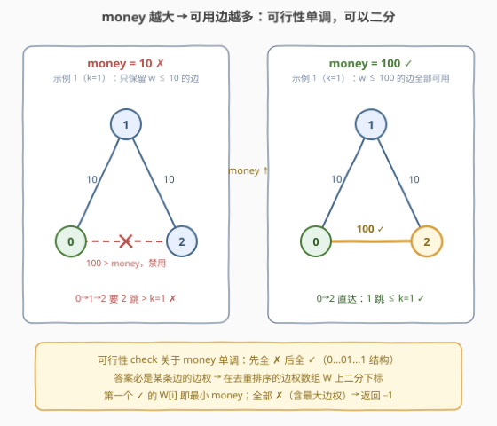
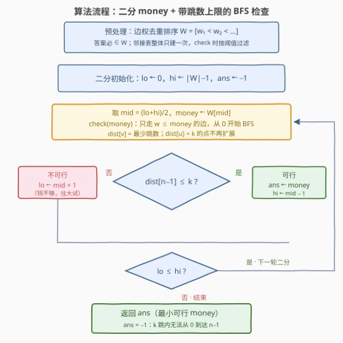

# LeetCode 修复边以遍历图的最小成本 题解

## 1. 题目概述

- **标题 / 题号**：修复边以遍历图的最小成本（#3807，medium）
- **链接**：https://leetcode.cn/problems/minimum-cost-to-repair-edges-to-traverse-a-graph/
- **难度**：中等
- **标签**：广度优先搜索、图、二分查找

> ⚠️ 本题为 LeetCode 付费题，题意描述根据官方示例用例与 hints 重建，可能与官方题面有出入。

**题意**：给你一个整数 $n$ 和一个二维整数数组 $edges$，其中 $edges[i] = [u_i, v_i, w_i]$ 表示节点 $u_i$ 与 $v_i$ 之间有一条**双向**道路，修复并通行它的成本为 $w_i$。再给你一个整数 $k$。

所有道路最初均处于损坏状态。你从节点 $0$ 出发，想要到达节点 $n-1$，且整段行程**最多只能使用 $k$ 条边**。你携带一笔预算 $money$，途经的每条边都要先花预算修复才能通行，预算的约束是**单笔开销不得超过 $money$**。求能完成从 $0$ 到 $n-1$ 旅行的最小 $money$；若无论预算多少都无法在 $k$ 条边内到达，返回 $-1$。

换个等价的说法（后文一律用这个数学口径）：**在所有「从 $0$ 到 $n-1$、边数不超过 $k$」的路径中，最小化路径上边权的最大值**；不存在这样的路径则返回 $-1$。

**示例 1**：

```text
输入：n = 3, edges = [[0,1,10],[1,2,10],[0,2,100]], k = 1
输出：100
解释：k = 1 只允许走 1 条边，唯一选择是直达边 0→2，其成本 100；
      更便宜的 0→1→2（两条边权均为 10）需要 2 条边，超出 k 的限制。
```

**示例 2**：

```text
输入：n = 6, edges = [[0,2,5],[2,3,6],[3,4,7],[4,5,5],[0,1,10],[1,5,12],[0,3,9],[1,2,8],[2,4,11]], k = 2
输出：12
解释：两条边以内从 0 到 5 的唯一路径是 0→1→5（边权 10、12），最大边权 12；
      更便宜的 0→2→3→4→5（最大边权 7）需要 4 条边，超出 k = 2。
```

**示例 3**：

```text
输入：n = 3, edges = [[0,1,1]], k = 1
输出：-1
解释：节点 2 与节点 0 之间没有任何路径，与预算多少无关。
```

**约束条件**（依据题型惯例推断，具体以官方为准）：$2 \le n$；$1 \le \text{edges.length}$；$0 \le u_i, v_i < n$；$1 \le w_i \le 10^9$；$1 \le k$。函数签名按题意重建，以官方为准。

> 💡 **审题关键**：① 目标是**最大边权最小**（minimax），不是路径总花费最小——若是后者就成了 [787. K 站中转内最便宜的航班](https://leetcode.cn/problems/cheapest-flights-within-k-stops/) 的 Bellman-Ford，官方 hints 里的「二分」无从谈起；② 「至多 $k$ 条边」是**跳数硬约束**：再便宜的路径，边数超 $k$ 也作废（示例 1 的 $0 \to 1 \to 2$、示例 2 的四边便宜路都被它挡掉）；③ 若答案存在，它**必等于某条边的边权**——最优路径上取到最大值的那条边就是答案本身。

## 2. 解题思路

### 2.1 暴力思路：枚举路径 / 线性扫描阈值

两种朴素做法：

- **枚举路径**：DFS 回溯枚举所有从 $0$ 到 $n-1$、边数 $\le k$ 的路径，逐条计算路径最大边权取最小——路径条数最坏是指数级（网格状图上 $k$ 跳内的路径数可达 $\binom{2k}{k}$ 量级），直接爆炸；
- **线性扫描阈值**：把所有边权去重排序成 $W = [w_1 < w_2 < \dots < w_t]$，从 $w_1$ 到 $w_t$ **从小到大逐个试探**：对候选 $money = w_i$，只用 $w \le w_i$ 的边做一次 BFS，判断 $0$ 能否在 $k$ 跳内到达 $n-1$，第一个可行的即为答案。单次检查 $O(n + m)$，整体 $O((n+m) \cdot t)$，最坏 $t = m$，$n, m \sim 10^5$ 时约 $10^{10}$ 次操作，必然超时。

注意第二种暴力已经把正确的「检查」写出来了，它只差最后一步——把**线性扫描**换成**二分**。

### 2.2 核心观察：可行性关于 money 单调 → 二分答案



三个观察把解法压到 $O((n+m)\log m)$：

**观察一（单调性，二分的合法性来源）**：固定 $money$，若「只用边权 $\le money$ 的边、$0$ 能在 $k$ 跳内到达 $n-1$」成立，则对任何 $money' > money$ 也成立——原来那条可行路径一条边都不用换（如上图：$money=10$ 时 $0 \to 1 \to 2$ 因 $2$ 跳 $> k=1$ 不可行，$money=100$ 时直达边解禁、$1$ 跳即达）。即可行性是关于 $money$ 的**单调谓词**，在候选值序列上呈 $0\cdots011\cdots1$ 结构，二分找第一个 $1$，$t$ 次检查降为 $\lceil \log_2 t \rceil$ 次。

**观察二（答案落在边权集合上）**：最优路径取到最大值的那条边，其边权就是答案；因此候选集就是去重排序的边权数组 $W$，在 $W$ 的**下标**上二分即可，不必对 $[0, 10^9]$ 整数值域二分（值域二分也对，但要 $\log 10^9 \approx 30$ 轮，且边权数组二分对任意数值类型都适用）。

**观察三（检查 = 带跳数上限的 BFS）**：给定 $money$，只保留 $w \le money$ 的边，从 $0$ 开始 BFS——无权图 BFS 按「跳数」分层扩展，**首次到达某点的层数就是最少跳数** $dist[v]$；于是「$k$ 跳内可达」$\iff dist[n-1]$ 存在且 $\le k$。两个工程细节：层数已达 $k$ 的点不再向外扩展（再走必超限）；首次发现 $n-1$ 即可提前返回 `true`。

> 💡 **为什么并查集在这里失效**：无跳数约束的 minimax 路径（[1631. 最小体力消耗路径](https://leetcode.cn/problems/path-with-minimum-effort/)）可以用「边权从小到大依次合并并查集、$0$ 与 $n-1$ 首次连通时的边权即答案」的 Kruskal 式解法；但**连通性不携带跳数信息**——示例 1 中按边权升序合并，$money=10$ 时 $0$ 与 $2$ 就经由 $0 \to 1 \to 2$ 连通了，可那是 $2$ 跳路径，$k=1$ 下并不合法。跳数约束只能靠 BFS 一层层数出来。

### 2.3 算法流程图



文字版步骤：

| 步骤 | 操作 | 说明 |
|------|------|------|
| ① 预处理 | 边权去重排序得 $W$；邻接表整体建一次（边权随边存） | 答案必是 $W$ 中某个值；每次 check 只按阈值过滤，不重建图 |
| ② 二分框架 | $lo = 0$，$hi = \lvert W \rvert - 1$，$ans = -1$；取 $mid$，令 $money = W[mid]$ | 在 $W$ 的下标区间上二分 |
| ③ BFS 检查 | 只走 $w \le money$ 的边，从 $0$ 分层扩展记录 $dist[v]$ | $dist[u] = k$ 的点不再扩展；首触 $n-1$ 提前返回 |
| ④ 判定 | $dist[n-1] \le k$：可行 → $ans = money$，$hi = mid - 1$；否则 $lo = mid + 1$ | 可行往小试，不可行往大试 |
| ⑤ 收尾 | $lo > hi$ 时返回 $ans$ | 连最大边权都不可行 → $ans$ 保持 $-1$，即 $k$ 跳内不可达 |

### 2.4 示例演算

**官方示例 2** `n = 6, edges = [[0,2,5],[2,3,6],[3,4,7],[4,5,5],[0,1,10],[1,5,12],[0,3,9],[1,2,8],[2,4,11]], k = 2`（专门演练二分 + BFS 跳数剪枝）：

去重边权 $W = [5, 6, 7, 8, 9, 10, 11, 12]$（下标 $0 \sim 7$），二分过程：

| 轮次 | $lo..hi$ | $mid \to money$ | BFS 结果（$k=2$） | 判定 | 更新 |
|------|------|------|------|------|------|
| 1 | $0..7$ | $3 \to 8$ | 可用边 $\{5,6,7,8\}$：$dist[2]{=}1$，$dist[1]{=}dist[3]{=}2$ 到头，$5$ 不可达 | ✗ | $lo \gets 4$ |
| 2 | $4..7$ | $5 \to 10$ | 加入 $\{9,10\}$：$dist[1]{=}dist[3]{=}1$、$dist[4]{=}2$ 即被剪枝，$1\text{-}5$ 的 $12>10$ 用不了 | ✗ | $lo \gets 6$ |
| 3 | $6..7$ | $6 \to 11$ | 加入 $\{11\}$：$2\text{-}4$ 解禁但 $dist[4]$ 仍 $=2=k$，$5$ 依旧不可达 | ✗ | $lo \gets 7$ |
| 4 | $7..7$ | $7 \to 12$ | $1\text{-}5(12)$ 可用：$0 \to 1 \to 5$ 共 $2$ 跳 $\le k$ | ✓ | $ans \gets 12$，$hi \gets 6$ |

$lo > hi$ 结束，返回 $12$ ✓。注意第 2、3 轮的细节：$4\text{-}5$ 这条便宜边（$w=5$）一直可用，但走到 $4$ 本身已花掉 $2$ 跳，$dist[4] = k$ 被剪枝——**便宜但够不着的边救不了场**。

**官方示例 1** `k=1`：$W = [10, 100]$。$mid=0 \to money=10$：$0\text{-}2(100)$ 被阈值禁用，$0 \to 1 \to 2$ 需 $2$ 跳 $> 1$ → ✗，$lo \gets 1$；$mid=1 \to money=100$：直达边解禁，$1$ 跳即达 → ✓，返回 $100$ ✓。

**官方示例 3**：$W = [1]$，`check(1)` 后 $dist[2] = -1$ → ✗，二分结束 $ans$ 仍是 $-1$——**$k$ 跳内根本不可达与钱多少无关**，直接返回 $-1$ ✓。

## 3. 参考代码

### C++

```cpp
class Solution {
public:
    int minRepairCost(int n, vector<vector<int>>& edges, int k) {
        if (n == 1) return 0;                       // 起点即终点：0 条边可达
        if (edges.empty()) return -1;               // 无边且 n > 1：必不可达

        // ① 候选答案 = 去重排序后的边权（最优路径的最大边必在其中取到）
        vector<int> ws;
        ws.reserve(edges.size());
        for (auto& e : edges) ws.push_back(e[2]);
        sort(ws.begin(), ws.end());
        ws.erase(unique(ws.begin(), ws.end()), ws.end());

        // 邻接表整体只建一次，check 时按 w <= money 过滤，不重建图
        vector<vector<array<int, 2>>> adj(n);
        for (auto& e : edges) {
            adj[e[0]].push_back({e[1], e[2]});
            adj[e[1]].push_back({e[0], e[2]});
        }

        // ② check(money)：只走 w <= money 的边，BFS 求各点最少跳数
        auto check = [&](int money) {
            vector<int> dist(n, -1);
            queue<int> q;
            dist[0] = 0;
            q.push(0);
            while (!q.empty()) {
                int u = q.front(); q.pop();
                if (dist[u] == k) continue;          // 跳数用满，不能再扩展
                for (auto& [v, w] : adj[u]) {
                    if (w <= money && dist[v] == -1) {
                        dist[v] = dist[u] + 1;
                        if (v == n - 1) return true; // 首次触达即最少跳数
                        q.push(v);
                    }
                }
            }
            return false;
        };

        // ③ 在 ws 的下标上二分：找最小可行边权
        int lo = 0, hi = (int)ws.size() - 1, ans = -1;
        while (lo <= hi) {
            int mid = lo + (hi - lo) / 2;
            if (check(ws[mid])) { ans = ws[mid]; hi = mid - 1; }
            else                { lo = mid + 1; }
        }
        return ans;                                  // 全部不可行 -> -1
    }
};
```

> 💡 **写法要点**：
> - 邻接表**只建一次**，每次 `check` 只做 $w \le money$ 的过滤——重建邻接表会把复杂度乘上一个大常数；
> - `if (dist[u] == k) continue;` 是跳数剪枝：层数等于 $k$ 的点再扩展必超限；它与「首次发现 $n-1$ 即返回」一起保证 BFS 每点至多入队一次，单次 check 严格 $O(n + m)$；
> - 全程只有**比较**没有累加，边权 $10^9$ 也无任何溢出风险，`int` 足够；
> - `n == 1` 特判返回 $0$（$0$ 条边即到达）；此时若边集非空，去重数组里可能没有 $0$，直接走二分会漏解。
> - 函数签名按重建题意给出，提交时以官方签名为准。

### Python

```python
class Solution:
    def minRepairCost(self, n: int, edges: List[List[int]], k: int) -> int:
        if n == 1:
            return 0
        if not edges:
            return -1

        ws = sorted({w for _, _, w in edges})        # 候选答案：去重边权
        adj = [[] for _ in range(n)]
        for u, v, w in edges:
            adj[u].append((v, w))
            adj[v].append((u, w))

        def check(money: int) -> bool:               # 只走 w <= money 的边
            dist = [-1] * n
            dist[0] = 0
            q = deque([0])
            while q:
                u = q.popleft()
                if dist[u] == k:                     # 跳数用满，不再扩展
                    continue
                for v, w in adj[u]:
                    if w <= money and dist[v] == -1:
                        dist[v] = dist[u] + 1
                        if v == n - 1:               # 首次触达即最少跳数
                            return True
                        q.append(v)
            return False

        lo, hi, ans = 0, len(ws) - 1, -1
        while lo <= hi:
            mid = (lo + hi) // 2
            if check(ws[mid]):
                ans, hi = ws[mid], mid - 1           # 可行：往小试
            else:
                lo = mid + 1                         # 不可行：往大试
        return ans
```

> 💡 **写法要点**：`ws` 用集合推导一行完成去重 + 排序；`check` 定义为闭包直接捕获 `adj / k / n`，无需传参；两种语言版本均已对拍官方 3 组示例及 $n=1$、$0$ 权边、跳数松紧三组自造用例。

## 4. 复杂度分析

设 $n$ 为点数、$m$ 为边数、$t \le m$ 为**去重后**的边权个数。

| 维度 | 复杂度 | 说明 |
|------|--------|------|
| **时间** | $O\big((n + m)\log m\big)$ | 预处理排序 $O(m \log m)$；二分 $\lceil \log_2 t \rceil \le \log_2 m$ 轮，每轮 BFS 严格 $O(n + m)$（每点至多入队一次，跳数剪枝不改变量级） |
| **空间** | $O(n + m)$ | 邻接表 $O(m)$、去重边权数组 $O(m)$、BFS 的 $dist$ 与队列 $O(n)$ |
| **量级判断** | $n, m \sim 10^5$ | $\log_2 m \approx 17$，总量约 $2 \times 10^6$ 次基本操作，远低于时限；即使改在 $[0, 10^9]$ 值域上二分（约 $30$ 轮）也稳过，但在 $W$ 上二分轮数更少且不依赖整数边权 |

## 5. 扩展：minimax 家族与「目标 × 约束」的 2×2 地图

**解法二：分层图 Dijkstra（免二分）**。把「已用边数」并入状态：$dist[v][h]$ 表示**恰好用 $h$ 条边**到达 $v$ 时的最小「路径最大边权」，转移为 $dist[v][h+1] = \max(dist[u][h], w)$，按该值建小根堆做 Dijkstra。由于扩展只会让 max 不减（权非负），贪心性质成立；答案是 $\min_{h \le k} dist[n-1][h]$。复杂度 $O\big((nk + mk)\log(nk)\big)$——$k$ 接近 $n$ 时状态数平方级爆炸，而二分 + BFS 的 $O((n+m)\log m)$ 与 $k$ 完全无关（跳数只是 BFS 内部的剪枝），这就是官方 hint 指向二分的原因。

**如果去掉跳数约束 $k$**：本题退化为 [1631. 最小体力消耗路径](https://leetcode.cn/problems/path-with-minimum-effort/)，解法全家桶瞬间扩容——除二分 + BFS 外，还有 Dijkstra(minimax) 和「边权升序 Kruskal 并查集、首次连通即答案」（本质是最小瓶颈路）。并查集解法**依赖且仅依赖**「连通性 $\iff$ 可行」这一等价，跳数约束恰恰把它打破（见 2.2 的反例），这是本题与 1631 的分水岭。

把「优化目标」和「路径约束」看成两个正交维度，本家族可以排成一张 2×2 地图：

| | 无额外约束 | 跳数（边数）约束 |
|------|------|------|
| **最小化总花费**（min-sum） | Dijkstra（[743. 网络延迟时间](https://leetcode.cn/problems/network-delay-time/)） | Bellman-Ford / 分层 DP（[787. K 站中转内最便宜的航班](https://leetcode.cn/problems/cheapest-flights-within-k-stops/)） |
| **最小化最大边权**（min-max） | 二分 + BFS / Dijkstra / Kruskal（[1631](https://leetcode.cn/problems/path-with-minimum-effort/)、[778. 水位上升的泳池中游泳](https://leetcode.cn/problems/swim-in-rising-water/)） | **本题**：二分 + BFS（分层 Dijkstra 亦可） |

面试中能主动画出这张地图、说清每个格子「约束进不进状态、目标换不换聚合方式」，是明显的加分项。

## 6. 面试要点

**Q1：为什么可以二分？单调性怎么证？**

> 定义谓词 $\text{check}(money)$：只用 $w \le money$ 的边，$0$ 能在 $k$ 跳内到达 $n-1$。可用边集 $S(money) = \{e : w_e \le money\}$ 随 $money$ 单调递增；若 $money$ 下存在可行路径 $P$，则对 $money' > money$，$P$ 的每条边仍在 $S(money')$ 中，$P$ 依旧可行。故 check 在候选值序列上单调，呈 $0\cdots011\cdots1$，二分找转折点。这是「二分答案」的标准合法性论证：**先找到随答案单调的判定谓词，再谈二分**。

**Q2：为什么答案一定落在边权集合里？有没有答案不在其中的情况？**

> 最优路径的最大边权由路径上某条边取到，答案即该边权，必 $\in W$。两个边界：存在 $w = 0$ 的边时 $0 \in W$，天然覆盖；$n = 1$ 时空路径（$0$ 条边）即可到达、答案为 $0$，而 $W$ 可能为空或不含 $0$，须在入口特判。同理 $k = 0$ 时只有 $n = 1$ 可行，交给 `check` 的剪枝自然处理。

**Q3：BFS 凭什么判「$k$ 跳内可达」？两处剪枝各是什么？**

> 无权图 BFS 按层扩展，队列中先处理完第 $d$ 层再处理第 $d+1$ 层，所以**首次到达 $v$ 的层数就是最少跳数** $dist[v]$（这是 BFS 最短路性质在所有边权相等时的特例）；于是 $k$ 跳内可达 $\iff dist[n-1] \le k$。剪枝一：出队时 $dist[u] = k$ 就跳过——它的邻居若可达必是第 $k+1$ 层，必然超限；剪枝二：首次发现 $n-1$ 立即返回 `true`。两者合起来保证每点至多入队一次，单次 check 严格 $O(n+m)$。

**Q4：把目标误当成「总花费最小」会怎样？**

> 那是 787 的题（Bellman-Ford 限制松弛 $k+1$ 轮）。两个目标在同一张图上可以给出**不同路径**：取 $k=2$、边 $\{0\text{-}1(1),\ 1\text{-}3(9),\ 0\text{-}2(5),\ 2\text{-}3(6)\}$——min-sum 会选 $0 \to 1 \to 3$（总花费 $10$），但它的最大边权是 $9$；minimax 的答案是 $0 \to 2 \to 3$（总花费 $11$、最大边权 $6$）。面试时先跟面试官确认目标聚合方式（sum 还是 max），是这类图题的第一步。

**Q5：这题和 1631 / 778 / 787 是什么关系？**

> 见第 5 节的 2×2 地图：1631/778 是**无跳数约束**的 minimax（二分 + BFS/DFS、Dijkstra、Kruskal 并查集三解通吃）；787 是**跳数约束**下的 min-sum（Bellman-Ford）；本题是「minimax + 跳数」的组合，官方考点正是**二分答案把 minimax 化成可达性判定、BFS 承接跳数约束**。三者共享「带约束的图上路径优化」骨架，差别只在约束进状态（787）还是进检查（本题）。

> 💡 **一句话总结**：3807 =「**可行性关于 money 单调**（可用边集只增不减）」+「**去重边权上二分下标**」+「**带跳数上限的 BFS 检查**（首达层数 = 最少跳数，$dist[u]=k$ 剪枝）」。三个带走的知识点：单调谓词先行再二分；答案落在边权集合的论证；并查集解法为何被跳数约束击杀。

## 同类练习题

| # | 题目 | 与本题的关联 |
|---|------|-------------|
| 1631 | [最小体力消耗路径](https://leetcode.cn/problems/path-with-minimum-effort/)（[题解](../1601-1700/1631_最小体力消耗路径.md)） | 无跳数约束的 minimax 路径，二分 + BFS / Dijkstra / 并查集三解齐全，是本题的「减配版」 |
| 778 | [水位上升的泳池中游泳](https://leetcode.cn/problems/swim-in-rising-water/)（[题解](../0701-0800/778_水位上升的泳池中游泳.md)） | 格子图上的 minimax，同一个「二分阈值 + 可达性检查」套路的换皮练习 |
| 787 | [K 站中转内最便宜的航班](https://leetcode.cn/problems/cheapest-flights-within-k-stops/)（[题解](../0701-0800/787_K站中转内最便宜的航班.md)） | 跳数约束下的 min-sum，与本题对照理解「目标（sum/max）× 约束（有无跳数）」两个正交维度 |
| 1928 | [规定时间内到达终点的最小花费](https://leetcode.cn/problems/minimum-cost-to-reach-destination-in-time/)（[题解](../1901-2000/1928_规定时间内到达终点的最小花费.md)） | 把「跳数约束」换成「累计时间约束」的 min-sum，约束维度的另一种变体，时间须进状态分层 DP |
