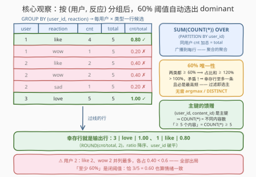
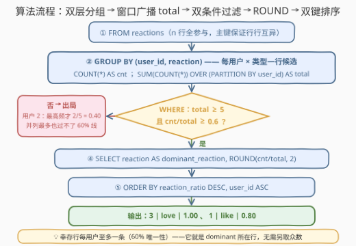

# 寻找情绪一致的用户

- **题目名称**：寻找情绪一致的用户
- **链接**：[3808. Find Emotionally Consistent Users](https://leetcode.cn/problems/find-emotionally-consistent-users/)
- **难度**：中等
- **标签**：数据库、SQL、`GROUP BY`、窗口函数（`SUM(COUNT(*)) OVER`）、组内占比过滤、`ROUND` 舍入

## 1. 题目概述

**表结构**：`reactions`

| 列名 | 类型 |
|------|------|
| user_id | int |
| content_id | int |
| reaction | varchar |

- `(user_id, content_id)` 是这张表的主键（值互不相同）。
- 每一行代表一个用户对某个内容项发出的一次反应（`reaction` 为反应类型，如 `like`、`wow`、`sad`、`love`）。

**目标**：识别**情绪一致的用户**，需同时满足：

1. 统计每个用户发送的**总反应次数**；
2. 仅包含**至少对 5 个不同内容项**作出反应的用户；
3. 若用户**至少 60%** 的反应属于**同一种类型**，则认为其情绪一致。

**输出**三列 `user_id, dominant_reaction, reaction_ratio`（**舍入到 2 位小数**），按 `reaction_ratio` **降序**、再按 `user_id` **升序**排序。

**示例**：

```text
输入：reactions 表
+---------+------------+----------+
| user_id | content_id | reaction |
+---------+------------+----------+
| 1       | 101        | like     |
| 1       | 102        | like     |
| 1       | 103        | like     |
| 1       | 104        | wow      |
| 1       | 105        | like     |
| 2       | 201        | like     |
| 2       | 202        | wow      |
| 2       | 203        | sad      |
| 2       | 204        | like     |
| 2       | 205        | wow      |
| 3       | 301        | love     |
| 3       | 302        | love     |
| 3       | 303        | love     |
| 3       | 304        | love     |
| 3       | 305        | love     |
+---------+------------+----------+

输出：
+---------+-------------------+----------------+
| user_id | dominant_reaction | reaction_ratio |
+---------+-------------------+----------------+
| 3       | love              | 1.00           |
| 1       | like              | 0.80           |
+---------+-------------------+----------------+
```

> 💡 **审题关键**：
> ① `(user_id, content_id)` 是主键 ⟹ 同一用户不会对同一内容重复反应，**每行就是一个互异内容项**——「总反应次数」与「不同内容项数」是同一个量 `COUNT(*)`，「至少 5 个内容」即 `COUNT(*) >= 5`，不需要 `COUNT(DISTINCT)`；
> ② 「至少 60%」是**闭阈值**：$\text{cnt}/\text{total} \ge 0.6$，5 条里恰有 3 条同类型（$3/5 = 0.60$）也算情绪一致；
> ③ `dominant_reaction` 是该用户**最高频**的反应类型——本题里它不需要单独求（见 2.2），能过 60% 线的类型必然就是最高频；
> ④ `reaction_ratio` 保留 2 位小数是**展示要求**，判定与统计用原始分数；排序按输出列（舍入值）降序，`user_id` 升序防并列乱序。

---

## 2. 解题思路

### 2.1 暴力思路：先求「众数」再算占比？

最直白的拆解是三步走：先 `GROUP BY (user_id, reaction)` 算出每种类型的次数；再对每个用户**取次数最大的一行**——`ROW_NUMBER() OVER (PARTITION BY user_id ORDER BY cnt DESC)` 取 `rn = 1`，或者相关子查询 `cnt = (SELECT MAX ...)`；最后把这一行的 `cnt` 与用户总数（又一遍 `GROUP BY user_id`）相除、过滤、舍入。两次分组、一次组内取最值、一次 JOIN，还要回答「两种类型并列最多时取谁」的平局口径——**而这一切 60% 阈值根本不需要**（见 2.2 观察三）。

另一个直觉歧途是把占比写进原始行的 `WHERE`：分组之前「某类型占比」这个量尚不存在，`WHERE` 无法引用聚合结果——占比天然是**分组之后**才诞生的量，过滤必须排在分层（CTE / 派生表）的外层。

### 2.2 核心观察：60% 阈值自带唯一性——过滤即选主



**观察一：主键把两个统计量坍缩成一个。**

「总反应次数」与「不同内容项数」都等于每用户的 `COUNT(*)`——条件 1 的分母与条件 2 的阈值是同一个量，一趟分组全部算出。

**观察二：`SUM(COUNT(*)) OVER` 是「聚合的聚合」，让 `cnt` 与 `total` 同框。**

```sql
SELECT user_id,
       reaction,
       COUNT(*) AS cnt,
       SUM(COUNT(*)) OVER (PARTITION BY user_id) AS total
FROM reactions
GROUP BY user_id, reaction
```

执行顺序是**先 `GROUP BY` 后开窗**：`GROUP BY (user_id, reaction)` 先把表塌缩成「每用户 × 每类型一行」的候选表，窗口 `SUM` 再在**候选表上**把同用户的 `cnt` 加总、广播到每行——分子分母一次到位，无 JOIN、无相关子查询。

**观察三：60% 唯一性——通过过滤的行就是 `dominant_reaction` 所在行。**

各类型的计数互斥，占比之和不超过 1；若两种类型都 $\ge 0.6$，占比之和 $\ge 1.2 > 1$，矛盾——**每个用户至多一种类型能过线**。且过线的类型必然严格最高频（其余类型至多占 $0.4$）。于是：

- 它就是 `dominant_reaction`——不需要 argmax；
- 每用户至多一行幸存——不需要 `DISTINCT` 去重；
- 幸存行的 $\text{cnt}/\text{total}$ 就是 `reaction_ratio`。

| 类别 | 量 | 来源 |
|------|-----|------|
| 组级聚合 | `cnt`（每类型次数） | `GROUP BY (user_id, reaction)` + `COUNT(*)` |
| 窗口广播 | `total`（总次数 = 内容数） | `SUM(COUNT(*)) OVER (PARTITION BY user_id)` |
| 幸存行读出 | `dominant_reaction` | 60% 唯一性，无需另取众数 |
| 幸存行读出 | `reaction_ratio` | `ROUND(cnt / total, 2)` |

> 💡 一句话：**`GROUP BY (user_id, reaction)` 出 `cnt` → 窗口 `SUM` 广播 `total` → `total ≥ 5` 且 `cnt/total ≥ 0.6` 过滤 → 幸存行即答案 → `ROUND` + 双键排序收尾。**

### 2.3 算法流程图



**逻辑执行步骤**：

| 步骤 | 操作 | 说明 |
|------|------|------|
| ① FROM | 读入 `reactions` 全部 n 行 | 主键保证行行互异，无需去重 |
| ② 双层分组 | `GROUP BY user_id, reaction` + `COUNT(*)` | 每用户 × 每类型一行候选，`cnt` 落地 |
| ③ 窗口广播 | `SUM(COUNT(*)) OVER (PARTITION BY user_id)` | 同用户所有 `cnt` 之和即 `total`，广播到每行 |
| ④ 行级过滤 | `total ≥ 5` 且 `cnt/total ≥ 0.6` | 两个条件独立、缺一不可；幸存行每用户至多一条 |
| ⑤ 输出排序 | `ROUND(cnt/total, 2)` + `reaction_ratio DESC, user_id ASC` | 舍入只管展示；第二键防并列乱序 |

> ⚠️ 步骤 ③ 的窗口作用在**分组结果**上、步骤 ④ 的 `WHERE` 引用派生表的**列**（`cnt`/`total`）——所以 ②③④ 必须分层：先在 CTE / 派生表里把 `cnt`、`total` 落地成列，外层才能过滤（标准 SQL 的 `WHERE` 不能引用同层 SELECT 别名）。

### 2.4 示例演算

对示例中 3 个用户执行「双层分组 → 双条件」：

| user | 各类型计数 | total | 最高占比 | ≥ 0.6？ | ≥ 5？ | 判定 |
|------|-----------|:--:|------|:--:|:--:|------|
| 1 | like×4、wow×1 | 5 | $4/5 = 0.80$ | ✓ | ✓ | ✅ 输出 (like, 0.80) |
| 2 | like×2、wow×2、sad×1 | 5 | $2/5 = 0.40$ | **✗** | ✓ | ❌ 不一致 |
| 3 | love×5 | 5 | $5/5 = 1.00$ | ✓ | ✓ | ✅ 输出 (love, 1.00) |

逐行看候选表更直观：用户 1 的 5 个候选行（like 4/5、wow 1/5）中只有 like 过线；用户 2 的三个候选 like 0.40、wow 0.40、sad 0.20 全部出局——注意 like 与 wow **并列最多**也救不了它，各占 $0.4 < 0.6$；用户 3 的唯一候选 love 1.00 轻松过线。幸存两行按 `reaction_ratio` 降序：$1.00 > 0.80$ → 输出 `3, 1`，与官方一致 ✓。

---

## 3. 参考代码

### MySQL（解法 A：双层分组 + 窗口广播总数，推荐）

```sql
# Write your MySQL query statement below
SELECT user_id,
       reaction              AS dominant_reaction,
       ROUND(cnt / total, 2) AS reaction_ratio
FROM (
    SELECT user_id,
           reaction,
           COUNT(*) AS cnt,
           SUM(COUNT(*)) OVER (PARTITION BY user_id) AS total
    FROM reactions
    GROUP BY user_id, reaction
) t
WHERE total >= 5
  AND cnt / total >= 0.6
ORDER BY reaction_ratio DESC,
         user_id;
```

> 💡 **写法要点**：
> - `SUM(COUNT(*)) OVER (PARTITION BY user_id)` 是「聚合的聚合」：内层 `COUNT` 随 `GROUP BY (user_id, reaction)` 塌缩出每类型次数，外层窗口 `SUM` 再在分组结果上把同用户的次数加总广播——分子分母一趟同框；
> - `WHERE` 的两个条件作用在派生表列上：`total >= 5` 对应「至少 5 个不同内容项」，`cnt / total >= 0.6` 对应「至少 60% 同类型」（**闭阈值**）；
> - 幸存行每用户至多一条（60% 唯一性），`reaction` 直接就是 `dominant_reaction`，**没有 argmax、没有 `DISTINCT`**；
> - `cnt / total` 在 MySQL 中是 DECIMAL 精确除法，`>= 0.6` 无浮点误差；跨库保险写法见解法 B 的交叉相乘。

### MySQL（解法 B：两个派生表 JOIN，兼容无窗口函数的老版本）

```sql
# Write your MySQL query statement below
SELECT g.user_id,
       g.reaction                AS dominant_reaction,
       ROUND(g.cnt / t.total, 2) AS reaction_ratio
FROM (
    SELECT user_id, reaction, COUNT(*) AS cnt
    FROM reactions
    GROUP BY user_id, reaction
) g
JOIN (
    SELECT user_id, COUNT(*) AS total
    FROM reactions
    GROUP BY user_id
) t  ON t.user_id = g.user_id
WHERE t.total >= 5
  AND g.cnt * 10 >= t.total * 6
ORDER BY reaction_ratio DESC,
         g.user_id;
```

> 💡 **A vs B**：没有窗口函数时，「总数」只能由第二个 `GROUP BY user_id` 派生表产出、`JOIN` 回候选表。B 的灵魂是 `g.cnt * 10 >= t.total * 6`——把 $\text{cnt}/\text{total} \ge 0.6$ **交叉相乘成纯整数比较**，彻底绕开任何除法/浮点口径分歧（两边同乘 10 后均为整数，比较精确）。可移植（MySQL 5.x 可跑），代价是表访问两遍；A 一次扫描加一次开窗，是首选。

### Pandas

```python
import pandas as pd

def find_emotionally_consistent_users(reactions: pd.DataFrame) -> pd.DataFrame:
    g = reactions.groupby(['user_id', 'reaction'], as_index=False).size()
    g['total'] = g.groupby('user_id')['size'].transform('sum')

    ans = g[(g['total'] >= 5) & (g['size'] * 10 >= g['total'] * 6)].copy()
    ans['reaction_ratio'] = (ans['size'] / ans['total']).round(2)
    ans = ans.rename(columns={'reaction': 'dominant_reaction'})

    return (ans.sort_values(['reaction_ratio', 'user_id'],
                            ascending=[False, True])
               [['user_id', 'dominant_reaction', 'reaction_ratio']]
               .reset_index(drop=True))
```

> 💡 **写法要点**：
> - `groupby(['user_id', 'reaction']).size()` 即 `GROUP BY (user_id, reaction) + COUNT(*)`，得到候选表（列名 `size` 即 `cnt`）；
> - `groupby('user_id')['size'].transform('sum')` 把用户级总数广播回每行——正是解法 A 窗口 `SUM(COUNT(*)) OVER` 的镜像；
> - 占比判定用整数交叉相乘 `size * 10 >= total * 6`：`size/total` 是浮点除法，`0.6` 也无法被二进制精确表示，整数比较最稳；
> - **先 round 再 sort**：与 SQL 版 `ORDER BY reaction_ratio`（舍入后的别名）语义一致；
> - ⚠️ `Series.round` 是**银行家舍入**（round-half-even），MySQL `ROUND` 对 DECIMAL 是四舍五入：占比 $5/8 = 0.625$ 能通过 0.6 过滤，此时 pandas 得 `0.62`、MySQL 得 `0.63`——跨语言对拍须用 `decimal.Decimal(...).quantize(Decimal('0.01'), rounding=ROUND_HALF_UP)` 显式对齐（见第 5 节）。

---

## 4. 复杂度分析

设 $n$ 为 `reactions` 的行数，$m$ 为不同的 `(user_id, reaction)` 组合数（$m \le n$），$k$ 为幸存用户数。

| 维度 | 复杂度 | 说明 |
|------|--------|------|
| **时间复杂度** | $O(n)$ | 哈希分组 $O(n)$ + 窗口对 $m$ 行分组求和 $O(m)$ + 幸存 $k$ 行排序 $O(k \log k)$；解法 B 表访问两遍仍为 $O(n)$，仅常数翻倍 |
| **空间复杂度** | $O(m)$ | 候选表每「用户 × 类型」一行；解法 B 需两张 $O(m)$ / $O(u)$ 派生表（$u$ 为用户数） |

> - 对比暴力「argmax 三步走」：`ROW_NUMBER` 取组内最值要引入分区排序 $O(n \log n)$，再加一遍总数分组与 JOIN——复杂度阶未必更差，但 60% 唯一性让 argmax **整段消失**，代码量与中间结果规模双减；
> - 窗口版物化 $m$ 行候选（远小于把统计广播到全部 $n$ 行的做法），是「组级统计 + 组内明细同框」的轻量形态。

---

## 5. 扩展：若去掉 60% 阈值——argmax 与平局口径；舍入的三处口径

### 5.1 输出每个用户的 dominant：argmax 上场

若题目改成「输出每个用户的最高频反应类型」，60% 唯一性不复存在，组内取最值就必须显式做，且**平局口径要钉死**：

```sql
SELECT user_id, dominant_reaction
FROM (
    SELECT user_id,
           reaction AS dominant_reaction,
           ROW_NUMBER() OVER (PARTITION BY user_id
                              ORDER BY cnt DESC, reaction) AS rn
    FROM (
        SELECT user_id, reaction, COUNT(*) AS cnt
        FROM reactions
        GROUP BY user_id, reaction
    ) s
) t
WHERE rn = 1;
```

排序键 `ORDER BY cnt DESC, reaction` 的第二键规定「并列时取字典序最小的类型」——本题恰好不需要这层约定：**并列最多的两类各占 $\le 0.5$，谁也过不了 60% 线**，被阈值天然排除。60% 的一致性阈值本质上是把「选主」与「过滤」合并成了一步。

### 5.2 舍入的三处口径

- **判定用原值**：`cnt / total >= 0.6` 用未舍入分数（MySQL DECIMAL 精确除法无误差）；`ROUND` 只出现在 SELECT 清单；
- **整数化最稳**：$\text{cnt}/\text{total} \ge 0.6 \iff 5 \cdot \text{cnt} \ge 3 \cdot \text{total}$，交叉相乘把比较变成纯整数运算，跨库（含整数除法的方言）与 Pandas 浮点环境都无歧义；
- **舍入规则差异**：MySQL `ROUND` 对 DECIMAL 四舍五入（远离 0），`Series.round` / `np.round` 是银行家舍入（round-half-even）——$5/8 = 0.625$ 时前者 `0.63`、后者 `0.62`。本题该占比可通过 0.6 过滤、会真实出现在输出里，Pandas 侧若与 SQL 对拍，用 `Decimal.quantize(..., ROUND_HALF_UP)` 对齐。

---

## 6. 面试要点

**Q1：为什么不需要单独求「占比最高的反应类型」？**

> 60% 唯一性：各类型计数互斥、占比之和 $\le 1$，两种类型同时 $\ge 0.6$ 会导出占比之和 $\ge 1.2 > 1$ 的矛盾。所以每个用户至多一种类型过线，且它必然严格高于其余类型（其余合计 $\le 0.4$）——**通过 0.6 过滤的行就是 dominant 所在行**，argmax（`ROW_NUMBER` / 相关子查询 / 自连接）整段可省。

**Q2：「至少 5 个不同内容项」为什么 `COUNT(*)` 就够？什么时候必须 `COUNT(DISTINCT)`？**

> `(user_id, content_id)` 是主键，同一用户对同一内容至多一行，`COUNT(*)` 与 `COUNT(DISTINCT content_id)` 恒等。若表是无主键的流水表（同一用户可能对同一内容重复反应），两个量才会分家：总反应次数是 `COUNT(*)`、内容数是 `COUNT(DISTINCT content_id)`，条件 2 的阈值须用后者。识别这层假设是审题的一部分。

**Q3：`SUM(COUNT(*)) OVER (PARTITION BY user_id)` 的执行顺序是什么？**

> **先 `GROUP BY` 后开窗**：`GROUP BY (user_id, reaction)` 先把 n 行塌缩成 m 行候选（内层 `COUNT(*)` 逐组结算），窗口 `SUM` 再在这 m 行上按 `user_id` 分区求和、广播回每行。这是「聚合的聚合」模式——窗口函数作用于**分组后的结果集**，让分子 `cnt` 与分母 `total` 一次同框，省掉 JOIN 第二张统计表。

**Q4：占比比较与舍入各用什么值？**

> 判定用原始分数且闭阈值（`>= 0.6`，$3/5 = 0.60$ 入选）；输出 `ROUND(cnt/total, 2)` 只管展示；排序按**舍入后的输出列**降序、`user_id` 升序破平。浮点环境（Pandas）里把判定改写成整数交叉相乘 `cnt * 10 >= total * 6`，彻底绕开 $0.6$ 的二进制表示误差；舍入规则差异（银行家 vs 四舍五入）在 $0.625$ 这类值上见分晓。

**Q5：用户 2 的 like 与 wow 并列最多（各 2 次），为什么不会被输出两行或一行？**

> 并列最多时各占 $2/5 = 0.40 < 0.6$，两类候选都在过滤步出局——该用户整体不计入结果，谈不上输出几行。60% 阈值吸收了平局问题：能过线的类型必唯一。反倒是 5.1 那种「无条件取 dominant」的变体才需要显式平局口径（`ORDER BY cnt DESC, reaction` 第二键）。

> 💡 **一句话总结**：3808 = 双层分组出候选 + 窗口广播总数 + 占比阈值过滤。带走三件事：主键让 `COUNT(*)` 身兼两职、`SUM(COUNT(*)) OVER` 是聚合的聚合、**60% 唯一性让「过滤」顺便完成「选主」**。

---

## 7. 同类练习题

- [1211. 查询结果的质量和占比](https://leetcode.cn/problems/queries-quality-and-percentage/)（[题解](../1201-1300/1211_查询结果的质量和占比.md)）：每查询 `ROUND(AVG(...))` + `SUM(条件)/COUNT` 占比双指标——本题占比列的单查询版
- [1511. 消费者下单频率](https://leetcode.cn/problems/customer-order-frequency/)（[题解](../1501-1600/1511_消费者下单频率.md)）：`HAVING` 计数阈值 + 条件聚合——「至少 X 次」类过滤的月度变体
- [1174. 即时食物配送 II](https://leetcode.cn/problems/immediate-food-delivery-ii/)（[题解](../1101-1200/1174_即时食物配送II.md)）：用户级 `ROUND(AVG(条件), 2)` 比率——首单口径与本题的「聚合的聚合」同源
- [550. 游戏玩法分析 IV](https://leetcode.cn/problems/game-play-analysis-iv/)（[题解](../0501-0600/550_游戏玩法分析IV.md)）：分母为用户级总数的比率统计——留存率与情绪占比共用「分母从分组来」的骨架
- [1729. 求关注者的数量](https://leetcode.cn/problems/find-followers-count/)（[题解](../1701-1800/1729_求关注者的数量.md)）：`HAVING COUNT(*)` 阈值过滤 + 结果排序——本题条件 2 的最纯净形态
