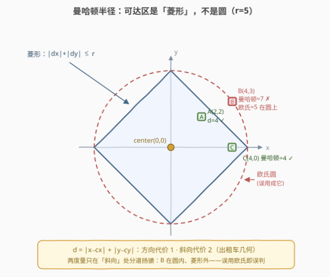
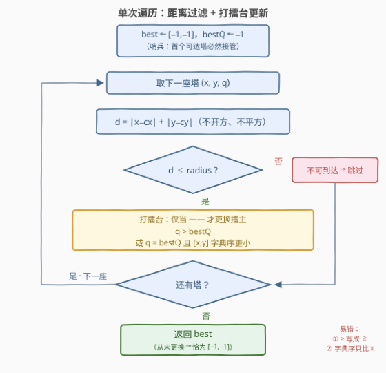

# 最好可到达的塔

- **题目名称**：最好可到达的塔
- **链接**：[3809. 最好可到达的塔](https://leetcode.cn/problems/best-reachable-tower/)
- **难度**：中等
- **标签**：数组

## 1. 题目概述

给你一个二维整数数组 $towers$，其中 $towers[i] = [x_i, y_i, q_i]$ 表示第 $i$ 座塔的坐标 $(x_i, y_i)$ 和**质量因子** $q_i$。另外给你整数数组 $center = [c_x, c_y]$ 表示你的位置，以及整数 $radius$。

若一座塔与 $center$ 之间的**曼哈顿距离**小于或等于 $radius$，则称该塔**可到达**。在所有可到达的塔中：

- 返回**质量因子最大**的塔的坐标；
- 若存在并列的塔，返回坐标**字典序最小**的塔；若无任何塔可到达，返回 $[-1, -1]$。

两点 $(x_i, y_i)$、$(c_x, c_y)$ 之间的曼哈顿距离为 $|x_i - c_x| + |y_i - c_y|$。坐标 $[x_i, y_i]$ 字典序小于 $[x_j, y_j]$ 是指：$x_i < x_j$，或者 $x_i = x_j$ 且 $y_i < y_j$。

**示例 1**：

```text
输入：towers = [[1,2,5],[2,1,7],[3,1,9]], center = [1,1], radius = 2
输出：[3,1]
解释：三座塔的曼哈顿距离分别为 1、1、2，均可到达；最大质量因子 9 对应塔 [3,1]。
```

**示例 2**：

```text
输入：towers = [[1,3,4],[2,2,4],[4,4,7]], center = [0,0], radius = 5
输出：[1,3]
解释：[1,3] 与 [2,2] 的曼哈顿距离均为 4（可到达），[4,4] 距离为 8（不可到达）。
      [1,3] 与 [2,2] 质量因子并列（均为 4），返回字典序较小的 [1,3]。
```

**示例 3**：

```text
输入：towers = [[5,6,8],[0,3,5]], center = [1,2], radius = 1
输出：[-1,-1]
解释：两座塔的曼哈顿距离分别为 8、2，均大于 1，无可到达的塔。
```

**约束条件**：$1 \le towers.length \le 10^5$；$towers[i] = [x_i, y_i, q_i]$；$0 \le x_i, y_i, q_i, c_x, c_y \le 10^5$；$0 \le radius \le 10^5$。

> 💡 **审题关键**：① 距离度量是**曼哈顿距离**而非欧氏距离——$|dx| + |dy| \le r$ 的可达区是**菱形**（旋转 $45°$ 的正方形），不是圆，误用 `sqrt(dx*dx + dy*dy)` 是最常见 WA 原因（见 2.2）；② 并列规则是**两级**的：先 $q_i$ 最大，再坐标字典序最小——字典序必须先比 $x$ 再比 $y$，比较器漏一半必错；③ $q_i \ge 0$ 允许用 $-1$ 做哨兵初值。

---

## 2. 解题思路

### 2.1 暴力思路：过滤 + 排序

最直观的写法分两步：

```python
ok = [t for t in towers
      if abs(t[0] - cx) + abs(t[1] - cy) <= radius]   # 过滤可达塔
ok.sort(key=lambda t: (-t[2], t[0], t[1]))            # q 降序，坐标字典序升序
return ok[0] if ok else [-1, -1]
```

排序键 $(-q_i, x_i, y_i)$ 的最小元恰好就是答案——$q$ 取负把「最大」翻成「最小」，与坐标的「字典序最小」统一成同一个方向。时间 $O(n \log n)$，$n = 10^5$ 时约 $1.7 \times 10^6$ 次比较，能过但**做了多余的功**：我们只需要 top-1，排序却建立了全部 $n$ 座塔的全序。

### 2.2 核心观察：可达区是菱形，top-1 只需一次遍历打擂台



两个关键认知把解法压到 $O(n)$：

**认知一：$|dx| + |dy| \le r$ 的可达区是以 $center$ 为中心、对角线长 $2r$ 的菱形。** 如上图所示：塔 $A(2,2)$ 在菱形内（曼哈顿距离 $4 \le 5$）；塔 $B(4,3)$ 欧氏距离恰为 $5$（在虚线圆周上），但曼哈顿距离 $7 > 5$——**在菱形外**。若误用欧氏距离，$B$ 会被误判为可到达；反过来塔 $C(4,0)$ 曼哈顿距离 $4$ 可达、欧氏距离也是 $4$，两个度量只在「斜向」位置上分道扬镳。**方向代价 1、斜向代价 2**，这正是曼哈顿世界的「出租车几何」：只能横竖移动时的真实步行距离。

**认知二：选 top-1 不需要全序，打擂台足矣。** 维护当前最优 $(bestQ, best)$，每座可达塔与擂主做一次 $O(1)$ 比较：

$$
\text{更换擂主} \iff q > bestQ \;\lor\; \big(q = bestQ \;\land\; [x, y] <_{\text{lex}} best\big)
$$

初值 $bestQ = -1$（$q_i \ge 0$，哨兵保证**首个可达塔必然接管**），$best = [-1, -1]$——若全程无塔接管，返回值恰好就是 $[-1, -1]$，**无需额外标志位**。单次遍历、每塔 $O(1)$，时间 $O(n)$、额外空间 $O(1)$。

> 💡 **比较器的等价元组写法**：把擂台键写成 $(q, -x, -y)$ 取**最大**（或 $(-q, x, y)$ 取最小），三段式比较就塌缩成一次元组比较——「主键降序 + 次键升序」的混合方向正是元组化最擅长的场景，2.1 的排序键 $(-q, x, y)$ 本质相同。

### 2.3 算法流程图



文字版步骤：

| 步骤 | 操作 | 说明 |
|------|------|------|
| ① 初始化 | $best = [-1, -1]$，$bestQ = -1$ | $q_i \ge 0$，哨兵 $-1$ 保证首塔必然接管 |
| ② 取塔 | 依次取 $(x, y, q)$，全部取尽则跳到 ⑤ | 单次遍历，不回头 |
| ③ 距离过滤 | $d = \lvert x - c_x \rvert + \lvert y - c_y \rvert$ | $d > radius$ 直接丢弃，注意**无乘方无开方** |
| ④ 打擂台 | $q > bestQ$，或 $q = bestQ$ 且 $[x,y]$ 字典序更小 → 更新 | 字典序先比 $x$ 再比 $y$ |
| ⑤ 返回 | 返回 $best$ | 从未更新时恰为 $[-1, -1]$ |

### 2.4 示例演算

**官方示例 2** `towers = [[1,3,4],[2,2,4],[4,4,7]], center = [0,0], radius = 5`（专门演练并列 tie-break）：

| 塔 $(x,y,q)$ | $d = \lvert x \rvert + \lvert y \rvert$ | 可达？ | 与擂主 $(bestQ, best)$ 比较 | 结果 |
|------|------|------|------|------|
| $(1,3,4)$ | $1+3 = 4$ | ✔ | $bestQ = -1$，哨兵放行 | $best=[1,3]$，$bestQ=4$ |
| $(2,2,4)$ | $2+2 = 4$ | ✔ | $q = 4 = bestQ$ 并列；$[2,2]$ vs $[1,3]$：$x$ 上 $2 > 1$，字典序**更大** | 不更换 |
| $(4,4,7)$ | $4+4 = 8$ | ✘ $8 > 5$ | —— 跳过 | 不变 |

遍历结束，返回 $best = [1,3]$ ✓。注意第 2 行：**并列时擂主已持有字典序更小的 $[1,3]$，挑战者失败**——若比较器只写 $q \ge bestQ$（把严格大于写成大于等于），此处会被 $[2,2]$ 错误顶替。

**官方示例 3** `towers = [[5,6,8],[0,3,5]], center = [1,2], radius = 1`：两塔距离 $8$、$2$ 均 $> 1$，全程无人接管擂台，$best$ 保持初值 $[-1,-1]$，直接返回 ✓——哨兵初值与返回值「一箭双雕」。

---

## 3. 参考代码

### C++

```cpp
class Solution {
public:
    vector<int> bestTower(vector<vector<int>>& towers, vector<int>& center, int radius) {
        int cx = center[0], cy = center[1];
        vector<int> best = {-1, -1};
        int bestQ = -1;                                  // qi >= 0，哨兵保证首塔接管
        for (auto& t : towers) {
            int x = t[0], y = t[1], q = t[2];
            if (abs(x - cx) + abs(y - cy) > radius) continue;      // 菱形外，丢弃
            if (q > bestQ                                            // 质量因子更大
                || (q == bestQ && (x < best[0]                       // 并列：字典序更小
                    || (x == best[0] && y < best[1])))) {
                bestQ = q;
                best = {x, y};
            }
        }
        return best;                                     // 无人接管时恰为 [-1,-1]
    }
};
```

> 💡 **写法要点**：
> - 坐标与 $q_i$ 均 $\le 10^5$，曼哈顿距离 $\le 2 \times 10^5$、乘不出任何溢出，全程 `int` 安全，**不要画蛇添足开 `long long` 或写平方**；
> - 三段比较条件**短路求值**次序有讲究：先比 $q$（最常分胜负），并列才比坐标——把坐标比较放前面也能对，但白算多数情况；
> - `abs` 在 C++ 中对 `int` 调用的是 `<cstdlib>` 的重载，写 `abs(x - cx)` 即可，勿混用 `fabs`。

### Python

```python
class Solution:
    def bestTower(self, towers: List[List[int]], center: List[int], radius: int) -> List[int]:
        cx, cy = center
        best, best_q = [-1, -1], -1
        for x, y, q in towers:
            if abs(x - cx) + abs(y - cy) > radius:
                continue
            if (q > best_q
                    or (q == best_q
                        and (x < best[0] or (x == best[0] and y < best[1])))):
                best_q, best = q, [x, y]
        return best
```

> 💡 **写法要点**：Python 元组天然按字典序比较，擂台条件可塌缩为一行——维护键 $(-q, x, y)$ 取最小：
>
> ```python
> key = (1, -1, -1)                    # 哨兵：-q ≤ 0 < 1，任何可达塔必然更小；坐标占位 -1
> for x, y, q in towers:
>     if abs(x - cx) + abs(y - cy) <= radius:
>         key = min(key, (-q, x, y))
> _, x, y = key
> return [x, y] if x != -1 else [-1, -1]
> ```
>
> 「$q$ 降序 + 坐标升序」的混合方向由 $-q$ 的取负统一——与 2.1 排序键同源。两种写法均已对拍官方 3 组示例。

---

## 4. 复杂度分析

| 维度 | 复杂度 | 说明 |
|------|--------|------|
| **时间** | $O(n)$ | 单次遍历，每塔一次距离计算 + 一次 $O(1)$ 比较；比过滤+排序的 $O(n \log n)$ 少一个对数因子 |
| **空间** | $O(1)$ | 只维护 $best$ 与 $bestQ$ 两个变量（排序法需 $O(n)$ 存过滤结果） |
| **量级判断** | $n \sim 10^5$ | 数据范围完全不卡常数，$O(n \log n)$ 排序也能过；本题考点是**比较器的完备性**与**曼哈顿度量**，不在复杂度 |

---

## 5. 扩展：曼哈顿几何的 $x+y$ 变换与 top-K 推广

**变换视角**：令 $u = x + y$、$v = x - y$（坐标系旋转 $45°$ 并放缩 $\sqrt{2}$ 倍），则曼哈顿距离 $|dx| + |dy|$ 恰好变为切比雪夫距离 $\max(|du|, |dv|)$——**菱形变正方形**。这一变换是曼哈顿几何的瑞士军刀：[绝对值表达式的最大值](../1101-1200/1131_绝对值表达式的最大值.md) 用「枚举 $\pm$ 符号」把多维绝对值和的最值压成 $2^d$ 个**带符号坐标和**的最大差；求**最大曼哈顿距离点对**同样靠它离线预处理。本题虽用不上（单次查询遍历即可），但若把题面改成「$10^5$ 组在线查询 center」，沿 $u = x + y$、$v = x - y$ 双坐标排序 + 二分/前缀统计的预处理思路就会浮出水面。

**top-K 推广**：若题目改为「返回质量因子最大的 $k$ 座塔」，打擂台升级为容量 $k$ 的最小堆（堆顶是堆内最差者，挑战者胜过堆顶才入堆），复杂度 $O(n \log k)$——[最接近原点的 K 个点](../0901-1000/973_最接近原点的K个点.md) 正是该套路。「维护前 $k$ 优」永远不必对全体排序。

---

## 6. 面试要点

**Q1：为什么不能用欧氏距离？两者何时判定不同？**

> 可达条件是曼哈顿距离 $|dx| + |dy| \le r$，覆盖区为菱形。欧氏距离 $\sqrt{dx^2 + dy^2} \le r$ 的覆盖区为圆。由 $\max(|dx|,|dy|) \le \sqrt{dx^2+dy^2} \le |dx| + |dy|$ 可知**菱形内接于圆**、四顶点 $(\pm r, 0)$、$(0, \pm r)$ 恰在圆周上，顶点之间的四段圆弧是「圆内、菱形外」区域。反例：$center=(0,0)$、$r=5$、塔 $(4,3)$——欧氏恰 $5$（圆周上）但曼哈顿 $7$（菱形外）。因此误用欧氏只会**误纳**弧区塔（假阳性），绝不漏掉真可达的塔（菱形 ⊆ 圆）——WA 样式高度固定：答案多出一个「斜向」位置的高质量塔。

**Q2：打擂台的比较条件怎么写才完备？**

> 三段式：$q > bestQ$（主键，质量因子更大），或 $q = bestQ \land x < best_x$，或 $q = bestQ \land x = best_x \land y < best_y$（次键，坐标字典序更小）。最容易犯的错是把 $>$ 写成 $\ge$——并列时后来的塔会无条件顶替，字典序 tie-break 形同虚设；其次是字典序只比了 $x$ 忘了 $y$。

**Q3：$bestQ$ 初值为什么取 $-1$？$q_i = 0$ 的塔会不会被漏掉？**

> 约束 $q_i \ge 0$，取 $-1$ 后条件 $q > bestQ$ 对任何可达塔（含 $q = 0$）都成立，首个可达塔必然接管；若全程无塔接管，$best$ 保持 $[-1,-1]$ 恰是要求的返回值——**哨兵兼做默认答案**，省掉 found 标志位。若题面允许 $q_i$ 负数，哨兵须换成「是否已初始化」标志。

**Q4：既然排序也能过，打擂台的优势在哪？**

> 功能上只需 top-1，排序建立了多余的全体全序，$O(n \log n)$ vs $O(n)$、$O(n)$ 额外空间 vs $O(1)$；且排序比较器同样要写对双关键字混合方向，出错面一样大。工程上打擂台还支持**流式输入**（塔来一座评一座，无需存全量），这是排序做不到的。

**Q5：曼哈顿距离有哪些常见变形与配套技巧？**

> $\max$ 版（切比雪夫）与 $|dx|+|dy|$ 版（曼哈顿）可通过 $u = x+y$、$v = x-y$ 互换：曼哈顿 $\to$ 切比雪夫（菱形 $\to$ 正方形）；多维推广 $|dx|+|dy|+|dz|$ 的最值问题用「符号枚举 $\pm x \pm y \pm z$ 取 $\max$」。[访问所有点的最小时间](../1201-1300/1266_访问所有点的最小时间.md) 中「对角移动」让度量退化为切比雪夫，是该技巧的入门练习。

> 💡 **一句话总结**：3809 =「**曼哈顿菱形**过滤（不是圆！）」+「双关键字**打擂台**（$q$ 严格更大，或并列且字典序更小）」。两个带走的知识点：$|dx|+|dy| \le r$ 的几何形状与欧氏误用反例；$(-q, x, y)$ 元组键统一混合方向的排序/比较写法。

---

## 7. 同类练习题

- [1779. 找到最近的有相同 X 或 Y 坐标的点](https://leetcode.cn/problems/find-nearest-point-that-has-the-same-x-or-y-coordinate/)（[题解](../1701-1800/1779_找到最近的有相同X或Y坐标的点.md)）：遍历 + 曼哈顿距离 + 最小距离并列取最小编号，几乎同款打擂台
- [1266. 访问所有点的最小时间](https://leetcode.cn/problems/minimum-time-visiting-all-points/)（[题解](../1201-1300/1266_访问所有点的最小时间.md)）：曼哈顿与切比雪夫距离的换算入门，理解两种度量的几何差异
- [973. 最接近原点的 K 个点](https://leetcode.cn/problems/k-closest-points-to-origin/)（[题解](../0901-1000/973_最接近原点的K个点.md)）：打擂台推广到 top-K（小根堆维护前 k 优），距离度量按平方比较避免浮点
- [1131. 绝对值表达式的最大值](https://leetcode.cn/problems/maximum-of-absolute-value-expression/)（[题解](../1101-1200/1131_绝对值表达式的最大值.md)）：曼哈顿几何的 $\pm$ 符号枚举 / $x+y$ 变换进阶，多维最值必刷
