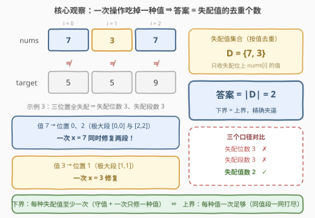
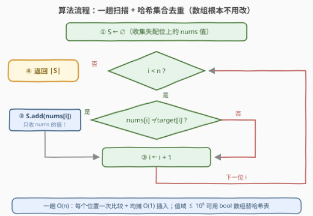

# LeetCode 变成目标数组的最少操作次数 题解

## 1. 题目概述

- **标题 / 题号**：变成目标数组的最少操作次数（#3810，medium）
- **链接**：https://leetcode.cn/problems/minimum-operations-to-reach-target-array/
- **难度**：中等
- **标签**：贪心、数组、哈希表

**题意**：给定两个长度为 $n$ 的整数数组 $nums$ 和 $target$，$nums[i]$ 是下标 $i$ 处的当前值，$target[i]$ 是期望值。每次操作分三步：

1. 选择一个整数值 $x$；
2. 找出**所有**满足 $nums[i] = x$ 的**极大连续段** $[l, r]$（在保持段内全为 $x$ 的前提下无法再向左或向右延伸的段）；
3. 对**每个**这样的段**同时**更新：$nums[l] = target[l],\ nums[l+1] = target[l+1],\ \ldots,\ nums[r] = target[r]$。

返回使 $nums$ 变为 $target$ 的**最少**操作次数。

**示例 1**：

```text
输入：nums = [1,2,3], target = [2,1,3]
输出：2
解释：选 x=1，极大段 [0,0] 更新 → [2,2,3]；选 x=2，极大段 [0,1] 更新 → [2,1,3]。
```

**示例 2**：

```text
输入：nums = [4,1,4], target = [5,1,4]
输出：1
解释：选 x=4，极大段 [0,0] 与 [2,2] 同时更新（nums[2] 设为 target[2]=4 不变）→ [5,1,4]。
```

**示例 3**：

```text
输入：nums = [7,3,7], target = [5,5,9]
输出：2
解释：选 x=7，段 [0,0] 与 [2,2] 同时更新 → [5,3,9]；选 x=3，段 [1,1] 更新 → [5,5,9]。
```

**约束**：$1 \le n = nums.length = target.length \le 10^5$，$1 \le nums[i], target[i] \le 10^5$。

> 💡 **审题关键**：① 「极大连续段」按**当前值 $x$** 划分——同一次操作会把**所有**值为 $x$ 的段一网打尽，哪怕它们互不相邻（示例 2 的两个 4-段、示例 3 的两个 7-段）；② 更新是把段内每个位置设成**它自己的** target 值，本就正确的位置更新后依然正确——**操作永不帮倒忙**。这两点是全题的钥匙。

## 2. 解题思路

### 2.1 暴力思路

两条朴素路线分别对应两个**错误答案**：

- **状态搜索**：把整个 $nums$ 数组视作状态，每步枚举当前出现过的每个 $x$ 做 BFS——状态空间是值组合的天文数字，$n = 10^5$ 完全不可行；
- **逐段修复**：每次只盯着一个失配段修——需要「含失配位的极大段数」次操作。示例 3 中失配段有 3 个（$[0,0]$、$[1,1]$、$[2,2]$），但这浪费了「同值段一次全修」：值 7 的两个段本可被同一次 $x=7$ 同时消灭。

于是一步步收窄口径：失配**位置**数（示例 3 为 3）✗ → 失配**段**数（仍为 3）✗ → 正确答案是**失配值**的去重个数（2）✓。

### 2.2 核心观察：失配值去重——每种值恰好一次操作



称 $nums[i] \ne target[i]$ 的位置为**失配位**。答案只由失配位上的 **nums 值**决定，依据是三条不变量：

1. **不倒退**：操作把段内每个位置设为其 target 值——失配位变正确、已正确的保持正确。**失配集合只减不增**，任何操作都不会产生新失配；
2. **守值**：失配位 $i$ 的当前值在被修复前**保持不变**——它的值只有「被某次操作覆盖」才会改变，而一旦被覆盖就有 $nums[i] = target[i]$，即已修复；
3. **单值性**：操作 $x$ 只会触碰当前值为 $x$ 的位置，因而**只能修复当前值为 $x$ 的失配位**。

记 $D = \{\, nums[i] \mid nums[i] \ne target[i] \,\}$（初始失配值的去重集合），三条不变量夹出精确答案：

- **下界 $\ge |D|$**：任取 $v \in D$，初始值为 $v$ 的失配位由「守值」始终持值 $v$，直到被某次操作修复；由「单值性」，那次操作必是 $x = v$。一次操作只有一个 $x$，不同 $v$ 必须配不同的操作——**每种失配值至少消耗一次操作**；
- **上界 $\le |D|$**：对 $D$ 中每个 $v$ 各操作一次（**任意顺序**）：由「不倒退」不产生新失配；执行 $x = v$ 时，所有当前值为 $v$ 的极大段被同时更新，其中包含每个仍失配、守值 $v$ 的位置——它们全部修复。$|D|$ 次后 $nums = target$。

$$\text{ans} = \big|\{\, nums[i] \mid nums[i] \ne target[i] \,\}\big|$$

> 💡 **顺序无关、不做铺垫**：任选顺序都行（失配集合单调缩小）；选 $x \notin D$ 的操作一个失配位都碰不到（失配位的当前值全在 $D$ 中），纯属浪费——最优解不需要任何「铺垫式」操作。上下界夹逼意味着**答案完全由初始状态决定**，数组一次都不用真的修改。

### 2.3 算法流程图



**文字版步骤**：

| 步骤 | 操作 | 说明 |
|------|------|------|
| ① 初始化 | $S \leftarrow \varnothing$ | 存失配位上的 nums 值 |
| ② 扫描 | $i$ 从 $0$ 到 $n-1$ | 双数组同步遍历（Python 用 `zip`） |
| ③ 判失配 | $nums[i] \ne target[i]$？ | 只比较，无需真的执行操作 |
| ④ 入集合 | `S.add(nums[i])` | 加入的是 **nums[i]**，与 target[i] 的值无关 |
| ⑤ 返回 | $\lvert S \rvert$ | 集合天然去重 |

注意第 ④ 步：入集合的是 **$nums[i]$ 的值**——「要被改成什么」不重要，「现在是什么值」才决定它归哪次操作管。

### 2.4 示例演算

三个官方示例一览：

| 示例 | nums | target | 失配位 $(i,\ nums[i])$ | $D$ | 答案 |
|------|------|--------|------|------|------|
| 1 | [1,2,3] | [2,1,3] | $(0,1),\ (1,2)$ | {1,2} | 2 |
| 2 | [4,1,4] | [5,1,4] | $(0,4)$ | {4} | 1 |
| 3 | [7,3,7] | [5,5,9] | $(0,7),\ (1,3),\ (2,7)$ | {7,3} | 2 |

- **示例 2 的微妙处**：值 4 同时出现在位置 0（失配）与位置 2（已正确）——**已正确位置的值不进集合**，$D = \{4\}$；操作 $x=4$ 时位置 2 所在段也被覆盖，但它被设成 $target[2]=4$，纹丝不动；
- **示例 3 的操作序列**（顺序任取）：$x=7$ → 同时更新段 $[0,0]$ 与 $[2,2]$，$nums$ 变 $[5,3,9]$；$x=3$ → 更新段 $[1,1]$，$nums$ 变 $[5,5,9]$。两次收工；
- **三个口径对比**（示例 3）：失配位数 $= 3$ ✗，失配段数 $= 3$ ✗，失配**值**数 $= 2$ ✓。

## 3. 参考代码

### C++

```cpp
class Solution {
public:
    int minOperations(vector<int>& nums, vector<int>& target) {
        unordered_set<int> s;
        for (int i = 0; i < (int)nums.size(); ++i)
            if (nums[i] != target[i])
                s.insert(nums[i]);
        return (int)s.size();
    }
};
```

> 💡 **写法要点**：入集合的是 `nums[i]` 而非 `target[i]`；值域固定 $[1, 10^5]$，可换 `vector<char> seen(100001)` 计数数组替代哈希表，省哈希开销；全程不修改数组，一趟比较即可。

### Python

```python
class Solution:
    def minOperations(self, nums: List[int], target: List[int]) -> int:
        return len({x for x, y in zip(nums, target) if x != y})
```

> 💡 **写法要点**：`zip` 同步遍历免下标越界；集合推导式一行完成「过滤失配 + 按值去重」。

## 4. 复杂度分析

| 维度 | 复杂度 | 说明 |
|------|--------|------|
| **时间** | $O(n)$ | 单趟扫描，每个位置一次比较 + 均摊 $O(1)$ 的集合插入 |
| **空间** | $O(\min(n, U))$ | $U = 10^5$ 为值域上界，去重集合至多 $\min(n, U)$ 个元素；bool 数组版为 $O(U)$ |
| **量级判断** | $n \sim 10^5$ | 线性一趟轻松通过；连排序都不需要——答案与位置顺序、段结构统统无关 |

## 5. 扩展：如果每次只能更新「一个」极大段？

把题目的「所有极大段**同时**更新」削弱成「任选**一个**极大段更新」，答案会怎样？

- 逐段修复给出上界「含失配位的极大段数」，但它**不再随便取等**——修复一个段可能引发**同值段合并**，改变后续段的结构；
- 反例：$nums = [1,2,1]$，$target = [2,1,2]$。逐段修需要 3 次；而先修 $x=2$ 的段 $[1,1]$（$nums[1] \leftarrow 1$），数组变 $[1,1,1]$，原来分离的两个 1-段**合并**成 $[0,2]$，再一次 $x=1$ 整段全修——2 次收工（且 2 次是最优：任何单段操作都无法一次覆盖全部三个失配位）；
- 操作顺序开始影响答案，问题从「静态计数」退化为真正需要规划的过程问题。

本题的「同时更新所有段」正是**消除顺序依赖**的关键：无论何时执行 $x = v$，它总能吃掉全部值为 $v$ 的失配位，答案由此坍缩为初始状态的函数。「过程题坍缩成静态计数」的同款体验见 [2357. 使数组中所有元素都等于零](https://leetcode.cn/problems/make-array-zero-by-subtracting-equal-amounts/)——每次操作减去最小值，答案 = 正数去重个数。

## 6. 面试要点

**Q1：为什么答案不是「失配位数」也不是「失配段数」？**

> 一次操作 $x$ 会**同时**更新所有值为 $x$ 的极大段，一口气修复全部当前值为 $x$ 的失配位——按**值**计数。示例 3：3 个失配位、3 个失配段，但只有 2 种失配值，答案 2。

**Q2：怎么证明每种失配值至少需要一次操作？**

> 三条不变量：① 更新只会把位置设成自身 target 值，失配集合只减不增；② 失配位的值在修复前保持不变（值一变就意味着被更新、从而已修复）；③ 操作 $x$ 只触碰值为 $x$ 的位置。于是修复值为 $v$ 的失配位必须用 $x = v$，而一次操作只有一个 $x$——不同值必须配不同操作。

**Q3：操作的顺序重要吗？需要「铺垫式」操作吗？**

> 都不需要。任意顺序对 $D$ 中每个值操作一次即可：失配集合单调缩小、同值段总被一网打尽。而 $x \notin D$ 的操作触碰不到任何失配位（失配位的当前值全在 $D$ 中），是纯浪费——最优解没有任何铺垫。

**Q4：这题标签是贪心，「贪」在哪里？**

> 贪在「每种失配值恰操作一次、绝不多做」：下界（每种值至少一次）与上界（每种值一次足够）夹逼出唯一答案。真正的考点是识别「最小操作次数问题坍缩成初始状态的静态计数」——一旦发现不变量，数组都不用修改。

**Q5：实现上有什么细节？**

> 双数组同步遍历（Python 用 `zip`）；入集合的是 $nums[i]$ 的值而非 $target[i]$（示例 2：同值 4 只因位置 0 失配才入集）；值域 $[1,10^5]$ 固定时可用 bool 数组替代哈希表换常数；C++ 返回 `s.size()` 注意向 `int` 收窄。

> 💡 **一句话总结**：3810 =「失配位守值 + 一次操作只修一种值 + 同值段一网打尽」⇒ 答案 = 失配位上 nums 值的去重个数。带走的知识点：见到「最小操作次数」先找不变量，问一句「答案能否只由初始状态决定」。

## 同类练习题

| # | 题目 | 与本题的关联 |
|---|------|-------------|
| 2357 | [使数组中所有元素都等于零](https://leetcode.cn/problems/make-array-zero-by-subtracting-equal-amounts/)（[题解](../2301-2400/2357_使数组中所有元素都等于零.md)） | 每次操作消灭「一种值」，答案 = 正数去重个数——本题的孪生题 |
| 453 | [最小操作次数使数组元素相等](https://leetcode.cn/problems/minimum-moves-to-equal-array-elements/)（[题解](../0401-0500/453_最小操作次数使数组元素相等.md)） | 整体操作的最少次数坍缩成 $\sum - n \cdot \min$ 的静态计数 |
| 2716 | [最小化字符串长度](https://leetcode.cn/problems/minimize-string-length/)（[题解](../2701-2800/2716_最小化字符串长度.md)） | 删除规则再花哨，答案只由「出现过的字符种类」决定 |
| 944 | [删列造序](https://leetcode.cn/problems/delete-columns-to-make-sorted/)（[题解](../0901-1000/944_删列造序.md)） | 各列独立判断后计数，互不干扰的「静态计数」结构 |
