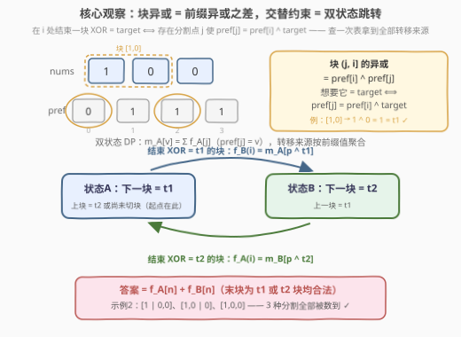
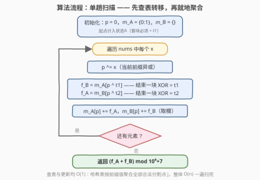

# 交替按位异或分割的数目

- **题目名称**：交替按位异或分割的数目
- **链接**：[3811. 交替按位异或分割的数目](https://leetcode.cn/problems/number-of-alternating-xor-partitions/)
- **难度**：中等
- **标签**：位运算、数组、哈希表、动态规划

## 1. 题目概述

给你一个整数数组 `nums` 以及两个**互不相同**的整数 `target1` 和 `target2`。

`nums` 的一个**分割**是指将其划分为一个或多个**连续且非空**的块，这些块在不重叠的情况下覆盖整个数组。

如果一个分割中各块元素的**按位异或**结果在 `target1` 和 `target2` 之间**交替**出现，且以 `target1` 开始，则称该分割是**有效的**。形式上，对于块 $b_1, b_2, \ldots$：

- $\mathrm{XOR}(b_1) = target1$
- $\mathrm{XOR}(b_2) = target2$（如果存在）
- $\mathrm{XOR}(b_3) = target1$，以此类推。

返回 `nums` 的有效分割方案数，结果对 $10^9 + 7$ 取余。

**注意**：如果单个块的按位异或结果等于 `target1`，则该分割也是有效的。

**示例 1**：

```text
输入：nums = [2,3,1,4], target1 = 1, target2 = 5
输出：1
解释：[2,3] 的异或结果是 1，匹配 target1；剩余块 [1,4] 的异或结果是 5，匹配 target2。
      这是唯一有效的交替分割方案。
```

**示例 2**：

```text
输入：nums = [1,0,0], target1 = 1, target2 = 0
输出：3
解释：[1,0,0]（整块异或 = 1 = target1）、[1] 与 [0,0]（1, 0）、[1,0] 与 [0]（1, 0）均有效。
```

**示例 3**：

```text
输入：nums = [7], target1 = 1, target2 = 7
输出：0
解释：[7] 的异或结果是 7，与 target1 不匹配，因此不存在有效的分割方案。
```

**约束条件**：

- $1 \le nums.length \le 10^5$
- $0 \le nums[i], target1, target2 \le 10^5$
- $target1 \ne target2$

> 💡 **审题关键**：① 交替**以 target1 开始**，但不规定以谁结束——奇数块或偶数块结尾都合法；② 「单块 = target1 也有效」不是特例，只是「块数 = 1」的普通情形；③ $target1 \ne target2$ 保证了两个交替状态不会坍缩。

---

## 2. 解题思路

### 2.1 暴力思路

一个分割等价于在 $n-1$ 个间隙里各选「切 / 不切」，共 $2^{n-1}$ 种分割，每种再 $O(n)$ 验证每块异或是否交替匹配——$O(2^n \cdot n)$，$n = 10^5$ 完全不可行。即使改成 $O(n^2)$ 的分段 DP（枚举最后一块的起点），$10^{10}$ 级操作也会超时：**必须让「一类分割点」一次性整体转移**。

### 2.2 核心观察：前缀异或 + 交替双状态 DP



**第一步：前缀异或把「一块的异或」变成「两个端点值之差」。** 记 $pref[i] = nums[0] \oplus nums[1] \oplus \cdots \oplus nums[i-1]$（$pref[0] = 0$），由异或消去律 $a \oplus a = 0$：

$$\mathrm{XOR}\big((j,\, i]\big) = pref[i] \oplus pref[j]$$

于是「在 $i$ 处结束一块、其异或恰为 $target$」$\iff$「存在分割点 $j < i$ 使 $pref[j] = pref[i] \oplus target$」——**块约束被翻译成对前缀值的一次查询**。

**第二步：交替约束压进两个状态。** 把 DP 状态定义成「**下一块应异或成谁**」：

- $f_A[i]$：前 $i$ 个元素已切成合法交替前缀、下一块应为 $target1$ 的方案数；
- $f_B[i]$：同上，下一块应为 $target2$ 的方案数。

初始 $f_A[0] = 1$（还没切块，第一块必须是 $target1$），$f_B[0] = 0$。转移为在 $i$ 结束一块 $(j, i]$：

$$f_B[i] = \sum_{\substack{j < i \\ pref[j] = pref[i] \oplus target1}} f_A[j], \qquad f_A[i] = \sum_{\substack{j < i \\ pref[j] = pref[i] \oplus target2}} f_B[j]$$

（从状态 A 结束一块 XOR $= target1$ 进入状态 B，反之亦然。）**答案 $= f_A[n] + f_B[n]$**——题目不限以谁结尾，末块是 $target1$ 块或 $target2$ 块均合法；「单块 $= target1$」即 $j = 0$ 的那一步，自然计入 $f_B[n]$。

**第三步：哈希表聚合，把一类分割点一次转移。** 两个转移都只依赖「$pref[j]$ 等于某定值的那些 $j$ 的 $f$ 值之和」。维护两张哈希表 $m_A[v] = \sum f_A[j]\ (pref[j] = v)$、$m_B$ 同理，**先查后登记**，单步 $O(1)$：

$$f_B(i) = m_A\big[p \oplus target1\big], \quad f_A(i) = m_B\big[p \oplus target2\big], \quad m_A[p] \mathrel{+}= f_A(i), \ m_B[p] \mathrel{+}= f_B(i)$$

> 💡 **正确性一句话**：每个分割方案与自动机上的路径一一对应——分割点序列 $0 = j_0 < j_1 < \cdots < j_k = n$ 沿状态 A/B 交替跳转，每条路径恰被数一次，不重不漏。这就是「在自动机上数接受路径」。

### 2.3 算法流程图



| 步骤 | 操作 | 说明 |
|------|------|------|
| ① 初始化 | $m_A\{0:1\}$，$m_B$ 空，$p = 0$ | 起点计入状态 A：首块必须 $= target1$ |
| ② 滚动前缀 | $p \mathrel{\oplus}= x$ | 边扫边维护 $pref[i]$，无需数组 |
| ③ 查表转移 | $f_B = m_A[p \oplus target1]$，$f_A = m_B[p \oplus target2]$ | 一次查表 = 对一整类分割点求和 |
| ④ 就地聚合 | $m_A[p] \mathrel{+}= f_A$，$m_B[p] \mathrel{+}= f_B$ | 当前位置登记进两张表，供后继查用 |
| ⑤ 收尾 | 返回 $(f_A + f_B) \bmod (10^9+7)$ | 末块为 $target1$ 块或 $target2$ 块均合法 |

### 2.4 示例演算

**示例 2** `nums = [1,0,0], target1 = 1, target2 = 0`：$pref = [0, 1, 1, 1]$，初始 $m_A = \{0:1\}$、$m_B = \{\}$：

| $i$ | $p = pref[i]$ | $f_B = m_A[p \oplus 1]$ | $f_A = m_B[p \oplus 0]$ | 更新后 $m_A[1]$ / $m_B[1]$ |
|-----|---------------|--------------------------|--------------------------|-----------------------------|
| 1 | 1 | $m_A[0] = 1$ | $m_B[1] = 0$ | $0$ / $1$ |
| 2 | 1 | $m_A[0] = 1$ | $m_B[1] = 1$ | $1$ / $2$ |
| 3 | 1 | $m_A[0] = 1$ | $m_B[1] = 2$ | $3$ / $3$ |

答案 $= f_A + f_B = 2 + 1 = 3$ ✓。三个方案与终态的对应：$f_A[3] = 2$ 数的是**以 $target2$ 块结尾**的 $[1 \mid 0,0]$、$[1,0 \mid 0]$；$f_B[3] = 1$ 数的是整块 $[1,0,0]$（$j=0$ 直达，异或 $=1=target1$）。

**示例 3** `nums = [7], target1 = 1, target2 = 7`：$p = 7$，$f_B = m_A[7 \oplus 1] = m_A[6] = 0$，$f_A = m_B[7 \oplus 7] = m_B[0] = 0$，答案 $0$ ✓——单块异或 $7 \ne target1$，且不存在更细的切法。

---

## 3. 参考代码

### C++

```cpp
class Solution {
public:
    int alternatingXOR(vector<int>& nums, int target1, int target2) {
        constexpr int MOD = 1'000'000'007;
        constexpr int W = 1 << 17;              // nums[i] 与 target 均 <= 1e5 < 2^17
        vector<int> mA(W), mB(W);               // mA[v]：pref=v 且下一块应为 t1 的方案数（取模）
        mA[0] = 1;                              // 起点计入状态A：首块必须 = target1
        int p = 0, fA = 0, fB = 0;
        for (int x : nums) {
            p ^= x;                             // 滚动维护 pref[i]
            fB = mA[p ^ target1];               // 结束一块 XOR=t1：A -> B
            fA = mB[p ^ target2];               // 结束一块 XOR=t2：B -> A
            mA[p] = (mA[p] + fA) % MOD;         // 先查后登记，供后继转移
            mB[p] = (mB[p] + fB) % MOD;
        }
        return (fA + fB) % MOD;                 // 末块为 t1 块或 t2 块均合法
    }
};
```

> 💡 **写法要点**：
> - $nums[i], target1, target2 \le 10^5 < 2^{17}$，且异或不改变值域上界，故 $pref$ 与查表键 $p \oplus target$ 都落在 $[0, 2^{17})$——**用 131072 长度的数组替代哈希表**，常数远小于 `unordered_map`；
> - 各值均 $< MOD < 2^{30}$，$mA[p] + fA < 2^{31}$ 用 `int` 恰好安全（求稳可换 `long long`）；
> - 「先查后登记」顺序不可颠倒：当前位置 $i$ 的登记不能影响 $i$ 自身的转移查询（$j < i$ 严格小于）。

### Python

```python
class Solution:
    def alternatingXOR(self, nums: List[int], target1: int, target2: int) -> int:
        MOD = 10 ** 9 + 7
        mA = {0: 1}          # pref=v 且下一块应为 t1 的方案数（起点在此）
        mB = {}              # pref=v 且下一块应为 t2 的方案数
        p = 0
        fA = fB = 0
        for x in nums:
            p ^= x
            fB = mA.get(p ^ target1, 0)     # 结束一块 XOR=t1：A -> B
            fA = mB.get(p ^ target2, 0)     # 结束一块 XOR=t2：B -> A
            mA[p] = (mA.get(p, 0) + fA) % MOD
            mB[p] = (mB.get(p, 0) + fB) % MOD
        return (fA + fB) % MOD              # 末块为 t1 块或 t2 块均合法
```

> 💡 **写法要点**：Python 版用 `dict`，对任意值域（如 $target$ 达 $10^9$）依然成立，是更通用的写法；随机小样例已与 $O(2^n \cdot n)$ 暴力对拍 3000 组全部一致。

---

## 4. 复杂度分析

| 维度 | 复杂度 | 说明 |
|------|--------|------|
| **时间** | $O(n)$ | 每个元素：一次异或、两次查表、两次累加取模 |
| **空间** | $O(2^{17})$（数组）或 $O(n)$（哈希表） | 前缀值与查表键的值域 $\le 2^{17}$ |
| **量级判断** | $n \sim 10^5$ | 朴素分段 DP $O(n^2) \approx 10^{10}$ 必超时；聚合后仅 $10^5$ 次查表 |

---

## 5. 扩展

**① 状态口径的辨析。** $f_A[i]$「下一块 $= target1$」等价于「上一块是 $target2$ 块**或还没切过块**」——把起点 $j=0$（尚未切块）自然归入状态 A，无需任何特判；若把状态定义成「上一块是谁」，起点就成了第三个状态，反而啰嗦。这是「按**下一期望**定义状态」优于「按**上一事实**定义」的典型例子。

**② 若 $target1 = target2$ 会怎样？** 题目保证互异。若允许相等，交替约束坍缩为「每块异或都等于同一值」，A/B 两状态合并成单状态，答案 $= m[p \oplus target]$ 的一路累加——状态机退化为 [560. 和为K的子数组](https://leetcode.cn/problems/subarray-sum-equals-k/) 的前缀计数。

**③ 变体练习。**
- 要求**必须以 $target2$ 块结尾**：答案只取 $f_A[n]$（下一块应为 $target1$ ⟺ 上一块恰是 $target2$）；
- 要求块数**恰好为 $k$**：状态加一维块数，$O(nk)$；
- 「子数组异或和 $\ge k$ 的计数」：等值哈希失效（偏序查询），须换 01-Trie 按位批发，见 [3632. 异或至少为K的子数组数目](https://leetcode.cn/problems/subarrays-with-xor-at-least-k/)。

---

## 6. 面试要点

**Q1：为什么用前缀异或？块异或怎么 O(1) 求出？**

> 由 $a \oplus a = 0$ 的消去律，块 $(j, i]$ 的异或 $= pref[i] \oplus pref[j]$。这把「一段的异或」变成「两个端点值之差」，后续才能按端点值用哈希表分组——与 560 前缀和求子数组和完全同构。

**Q2：DP 状态为什么定义成「下一块应异或成谁」？**

> 交替约束的奇偶性被吸收进 A/B 两状态：状态 A 结束一块 $target1$ 进 B，B 结束一块 $target2$ 回 A。起点（还没切块、第一块必须是 $target1$）自然落入状态 A，免特判；答案取两终态之和，因为题目不限以谁结尾。

**Q3：如何把 $O(n^2)$ 的分段 DP 降到 $O(n)$？**

> 转移 $f_B[i] = \sum_{pref[j] = pref[i] \oplus target1} f_A[j]$ 只依赖前缀值等于定值的分割点集合——用哈希表按前缀值聚合「同前缀值的 $f$ 之和」，先查后登记，单步 $O(1)$。这与 560/974 的前缀计数是同一招。

**Q4：「单块 = target1 也有效」这种 corner case 代码里在哪体现？**

> 无需单独处理：它就是 $j = 0$、整块异或 $= target1$ 的转移，要求 $pref[n] \oplus pref[0] = target1$ 即 $pref[n] = target1$，计入 $f_B[n]$，已含在答案求和里。

**Q5：值域上有什么工程优化？溢出有什么坑？**

> $nums[i], target \le 10^5 < 2^{17}$，前缀异或与查表键都在 $[0, 2^{17})$，C++ 可用 `vector<int>(131072)` 代替哈希表提速；值域大就退回 `unordered_map`/`dict`。本题无大乘法，取模加法 $< 2^{31}$，`int` 安全。

> 💡 **一句话总结**：3811 =「前缀异或把块约束翻译成端点差」+「交替约束压成 A/B 双状态」+「哈希表按前缀值聚合一类分割点」。三个带走的知识点：按**下一期望**定义状态让起点免特判；答案=全体接受态之和（不限结尾）；先查后登记的前缀计数模板。

---

## 7. 同类练习题

- [560. 和为K的子数组](https://leetcode.cn/problems/subarray-sum-equals-k/)（[题解](../0501-0600/560_和为K的子数组.md)）：前缀和 + 哈希计数的同构源题，本题 = 它的「异或 + 交替约束」版
- [974. 和可被K整除的子数组](https://leetcode.cn/problems/subarray-sums-divisible-by-k/)（[题解](../0901-1000/974_和可被K整除的子数组.md)）：前缀按余数分组计数，同款「按前缀值聚合」
- [1442. 形成两个异或相等数组的三元组数目](https://leetcode.cn/problems/count-triplets-that-can-form-two-arrays-of-equal-xor/)（[题解](../1401-1500/1442_形成两个异或相等数组的三元组数目.md)）：前缀异或相等配对计数，前缀异或哈希的直接练习
- [1310. 子数组异或查询](https://leetcode.cn/problems/xor-queries-of-a-subarray/)（[题解](../1301-1400/1310_子数组异或查询.md)）：前缀异或快速求任意子数组异或的基础模板
- [1524. 和为奇数的子数组数目](https://leetcode.cn/problems/number-of-sub-arrays-with-odd-sum/)（[题解](../1501-1600/1524_和为奇数的子数组数目.md)）：前缀奇偶两状态配对计数，同款「双状态前缀分组」
