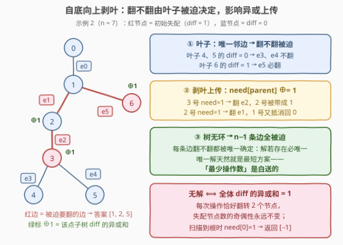
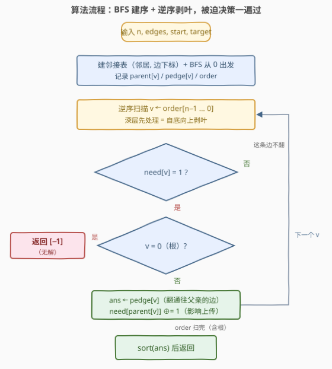

# LeetCode 翻转树上最少边 题解

## 1. 题目概述

- **标题 / 题号**：翻转树上最少边（#3812，hard）
- **链接**：https://leetcode.cn/problems/minimum-edge-toggles-on-a-tree/
- **难度**：困难
- **标签**：树、深度优先搜索、图、拓扑排序、排序

**题意**：给你一棵 $n$ 个节点的**无向树**，由长度为 $n-1$ 的二维数组 `edges` 表示，`edges[i] = [ai, bi]` 是树中一条边。另给两个长度为 $n$ 的**二进制字符串** `start` 和 `target`：`start[x]`、`target[x]` 分别是节点 $x$ 的**初始颜色**与**目标颜色**。

一次操作：选择下标为 $i$ 的一条边 $[u, v]$，把 $u$、$v$ **两个端点的颜色同时取反**（`'0'`↔`'1'`）。

返回一个**边下标数组**（升序），执行这些边对应的操作能把 `start` 变成 `target`；在所有有效序列中取**长度最短**的。无法转换则返回 `[-1]`。

**示例 1**：

```text
输入：n = 3, edges = [[0,1],[1,2]], start = "010", target = "100"
输出：[0]
解释：翻转下标 0 的边（同时翻转节点 0 和 1），"010" → "100"。
```

**示例 2**：

```text
输入：n = 7, edges = [[0,1],[1,2],[2,3],[3,4],[3,5],[1,6]], start = "0011000", target = "0010001"
输出：[1,2,5]
```

**示例 3**：

```text
输入：n = 2, edges = [[0,1]], start = "00", target = "01"
输出：[-1]
```

**约束**：$2 \le n \le 10^5$，`start[i]`、`target[i]` ∈ {'0', '1'}，`edges` 保证构成一棵有效的树。

> 💡 **审题关键**：① 每次操作对两个端点做**异或**——异或满足交换律，操作顺序无关紧要；同一条边翻两次相互抵消，所以任何方案都可规范化为「每条边用 0 或 1 次」的**子集选择**；② 题面强调「长度最短」看似要做优化，但树**无环**会让解**唯一**（见 2.2），最优性是白送的；③ 返回的是**边下标**且须升序——最后别忘了 `sort`。

## 2. 解题思路

### 2.1 暴力思路：枚举边子集

先做**规范化**：由审题关键 ①，一个方案完全由「哪些边被翻了奇数次」决定，即一个子集 $S \subseteq \{0, 1, \dots, n-2\}$。定义**失配标记**

$$diff[x] = start[x] \oplus target[x] \in \{0, 1\}$$

节点 $x$ 最终被翻转的**总次数的奇偶**必须等于 $diff[x]$。于是「$S$ 是合法方案」等价于一组 **GF(2) 异或方程**：

$$\bigoplus_{\text{边 } e \ni x} [\,e \in S\,] = diff[x], \qquad x = 0, 1, \dots, n-1$$

暴力做法：枚举全部 $2^{n-1}$ 个子集、逐个验证 $n$ 个方程，$n \sim 10^5$ 时天文数字。必须利用**树的结构**——方程组的结构本身藏着答案。

### 2.2 核心观察：叶子被迫，逐层上传——解唯一，最短白送



把树**任意选一点作根**（记作 0），思考**自底向上**（从叶子开始）决策：

1. **叶子被迫**：叶子 $v$ 的方程里只有一个变量——它唯一的邻边 $e = (v, parent)$。所以 $e$ 翻不翻**毫无选择**：$e$ 必翻 $\iff diff[v] = 1$；
2. **剥叶上传**：定下 $e$ 后，$e$ 对父亲的影响是「父亲也被翻一次」。把叶子剥掉，等价于把影响异或上传：
   $$need[parent] \mathrel{\oplus}= need[v] \qquad (need[v] \text{ 即 } v \text{ 剥完子树后剩下的失配})$$
   剥掉一个叶子会出现新的叶子，重复即可；
3. **无环 ⟹ 全部被迫**：树没有环，$n-1$ 条边会逐一被"逼"出取值——**解若存在则唯一**。唯一解当然是长度最短的解，**「最少操作数」是白送的**，根本不存在"挑选"；
4. **无解判定**：每次操作恰好翻转 **2 个**节点，所以**失配节点数的奇偶性是不变量**。若 $\bigoplus_x diff[x] = 1$（失配数为奇），任何操作序列都无法达成，返回 $[-1]$。在算法里它表现为：逆序扫描最后处理根，根的 $need = 1$ 却再没有向上的边可用。

> 💡 **树上差分闭式**（归纳可证）：$need(v)$ 恰好等于 $v$ 的**子树内所有 $diff$ 的异或和**。于是「边 $(v, parent)$ 被翻 $\iff$ $v$ 的子树异或和为 1」——整个算法本质是一次**树上前缀差分**。

### 2.3 算法流程图：BFS 建序 + 逆序扫描



| 步骤 | 操作 | 说明 |
|------|------|------|
| ① 建邻接表 | `adj[u] += (v, i)`，`adj[v] += (u, i)` | 元组带上**边下标** $i$，输出要用 |
| ② BFS 定序 | 从 0 出发，记 `parent[v]`、`pedge[v]`、`order` | `order` 天然父先子后 |
| ③ 逆序扫描 | `v = order[n−1 … 0]` | 逆 BFS 序保证**子先于父**处理 = 自底向上剥叶 |
| ④ 被迫决策 | `need[v]=1` 且 `v≠0` → `ans` 记 `pedge[v]`，`need[parent] ⊕= 1` | 叶子先被迫，影响上传 |
| ⑤ 收尾 | 扫到根 `need[0]=1` → `[-1]`；否则 `sort(ans)` 返回 | 边下标升序输出 |

> ⚠️ **不要写递归 DFS**：$n$ 达 $10^5$，链式树深度 $10^5$ 层——Python 默认递归上限 1000 直接 `RecursionError`，C++ 深递归也有爆栈风险。BFS 建序 + 逆序扫描是等价的**迭代**写法（逆 BFS 序中任意节点都排在它的父节点之后），也是本题标签里「拓扑排序」的含义。

### 2.4 示例演算

**官方示例 2** `n = 7, edges = [[0,1],[1,2],[2,3],[3,4],[3,5],[1,6]], start = "0011000", target = "0010001"`。

$diff = [0,0,0,1,0,0,1]$（失配点：3、6，共 2 个、偶数个，有戏）。BFS 序 `order = [0,1,2,6,3,4,5]`，逆序处理：

| 处理节点 | 当时 need | 动作 | 上传影响 |
|---------|-----------|------|----------|
| 5 | 0 | e4 不翻 | — |
| 4 | 0 | e3 不翻 | — |
| 3 | 1 | **翻 e2（记 2）** | need[2]：0→1 |
| 6 | 1 | **翻 e5（记 5）** | need[1]：0→1 |
| 2 | 1 | **翻 e1（记 1）** | need[1]：1→0（两次上传抵消） |
| 1 | 0 | e0 不翻 | — |
| 0 | 0 | 根 need=0，成功 | 输出排序后 `[1,2,5]` ✓ |

## 3. 参考代码

### C++

```cpp
class Solution {
public:
    vector<int> minimumFlips(int n, vector<vector<int>>& edges, string start, string target) {
        vector<vector<pair<int, int>>> adj(n);          // (邻居, 边下标)
        for (int i = 0; i < n - 1; ++i) {
            adj[edges[i][0]].push_back({edges[i][1], i});
            adj[edges[i][1]].push_back({edges[i][0], i});
        }

        vector<int> need(n);                            // 失配标记
        for (int i = 0; i < n; ++i) need[i] = start[i] != target[i];

        vector<int> parent(n, -1), pedge(n, -1), order; // BFS 建序
        order.reserve(n);
        vector<char> vis(n, 0);
        vis[0] = 1;
        order.push_back(0);
        for (size_t k = 0; k < order.size(); ++k) {     // 下标遍历 + 尾追加 = 队列式 BFS
            int v = order[k];
            for (auto [u, id] : adj[v]) if (!vis[u]) {
                vis[u] = 1;
                parent[u] = v;
                pedge[u] = id;
                order.push_back(u);
            }
        }

        vector<int> ans;
        for (int i = n - 1; i >= 0; --i) {              // 逆序 = 自底向上剥叶
            int v = order[i];
            if (!need[v]) continue;                     // 这条父边不用翻
            if (v == 0) return {-1};                    // 根仍失配：无解
            ans.push_back(pedge[v]);                    // 被迫翻父边
            need[parent[v]] ^= 1;                       // 影响上传给父亲
        }
        sort(ans.begin(), ans.end());
        return ans;
    }
};
```

### Python

```python
class Solution:
    def minimumFlips(self, n: int, edges: List[List[int]], start: str, target: str) -> List[int]:
        adj = [[] for _ in range(n)]                    # (邻居, 边下标)
        for i, (a, b) in enumerate(edges):
            adj[a].append((b, i))
            adj[b].append((a, i))

        need = [int(sc) ^ int(tc) for sc, tc in zip(start, target)]

        order, parent, pedge = [0], [-1] * n, [-1] * n  # BFS 建序
        vis = [False] * n
        vis[0] = True
        for v in order:                                 # 遍历中追加 = 队列式 BFS
            for u, eid in adj[v]:
                if not vis[u]:
                    vis[u] = True
                    parent[u], pedge[u] = v, eid
                    order.append(u)

        ans = []
        for v in reversed(order):                       # 逆序 = 自底向上剥叶
            if not need[v]:
                continue
            if v == 0:
                return [-1]                             # 根仍失配：无解
            ans.append(pedge[v])                        # 被迫翻父边
            need[parent[v]] ^= 1                        # 影响上传给父亲
        return sorted(ans)
```

> 💡 **写法要点**：① `order` 既当队列又当访问序列，`for v in order` 边遍历边 `append` 是 Python 的惯用 BFS；② 边下标在建邻接表时**随元组一起存**，避免之后再查找；③ 判无解放在扫描中（`v == 0` 且 `need=1`）而不是单独算异或和——一步到位且少一遍循环。官方三个示例 + 随机小树与 $O(2^{n-1} \cdot n)$ 暴力对拍全部一致。

## 4. 复杂度分析

| 维度 | 复杂度 | 说明 |
|------|--------|------|
| **时间** | $O(n)$（输出排序 $O(k \log k)$，最坏合计 $O(n \log n)$） | 建表、BFS、逆序扫描每个节点/每条边只碰常数次；$k$ 为答案边数 |
| **空间** | $O(n)$ | 邻接表 + `parent` / `pedge` / `order` / `need` |
| **量级判断** | $n \sim 10^5$ | 线性扫描轻松通过；瓶颈反而是输出的排序，可接受 |

## 5. 扩展：一般图上「最少翻转」为什么不再白送

### 5.1 树上差分闭式

归纳证明 $need(v) = \bigoplus_{u \in subtree(v)} diff[u]$：叶子的 $need$ 就是自己的 $diff$；内部节点在儿子全部处理完后，$need = diff \oplus \bigoplus_{\text{儿子 } c} need(c)$，展开即子树异或和。于是答案有闭式：

$$\text{边 } (v, parent) \text{ 被翻} \iff \bigoplus_{u \in subtree(v)} diff[u] = 1$$

这正是**树上差分**——把"点权异或"转成"父边的 0/1"。

### 5.2 有环 ⟹ 解不唯一 ⟹ 优化登场

若图**带环**，环上所有边可以整体各翻一次（每个环上点的度数奇偶不变、却换了一组边），方程组出现 $2^{m-n+1}$ 个解（$m-n+1$ = 独立环数）。此时「最少翻转」等价于**最小权 T-join 问题**（$T$ = 失配点集，要求选出边集的奇度点恰为 $T$ 且总权最小），经典解法是对 $T$ 中点做**最小权完美匹配**，多项式可解但远超面试范围。树无环（$m = n-1$）恰好卡在"解至多一个"的临界点上——**唯一性是树结构送给我们的最优性**。

## 6. 面试要点

**Q1：为什么每条边最多翻一次？操作顺序重要吗？**

> 每次操作对两个端点做异或，异或可交换、可结合，操作顺序无关；同一条边翻两次效果抵消。所以任何方案都能规范化成「每条边用 0/1 次」的子集，问题变成解 GF(2) 异或方程组。

**Q2：自底向上为什么是「被迫」的？凭什么最短？**

> 叶子只有一条邻边，它的方程只含一个变量，翻不翻由叶子自己的 diff 唯一决定；剥掉叶子出现新叶子，如此往复。树无环，$n-1$ 条边逐一被逼出取值——解若存在必唯一，唯一解天然就是最短方案，「最少操作数」不需要任何优化手段。

**Q3：什么时候无解？两个判定为什么等价？**

> 每次操作恰好改变 2 个节点的颜色，失配节点数的奇偶性是**不变量**：$\bigoplus_x diff[x] = 1$（失配数为奇）则必无解。算法中它体现为逆序扫描最后处理根时 $need[0] = 1$——根没有向上的边可用，返回 `[-1]`。两者是同一件事：$need[0]$ 最终等于全体 diff 的异或和。

**Q4：为什么用 BFS 建序 + 逆序扫描，而不递归 DFS？**

> $n$ 达 $10^5$，链式树深 $10^5$ 层，Python 递归直接 `RecursionError`，C++ 也可能爆栈。逆 BFS 序保证任意节点排在父节点之后，逆序扫一遍等价于迭代的**后序遍历**，也是标签「拓扑排序」的来历。

**Q5：这题和树上差分有什么关系？**

> $need(v)$ 恰为 $v$ 子树内 diff 的异或和（归纳可证），所以「翻父边 $\iff$ 子树异或和为 1」是闭式答案。整套流程就是把点上的失配标记差分到父边上，一次线性扫描完成。

> 💡 **一句话总结**：3812 =「操作即异或 → 方案即边子集」+「叶子被迫、剥叶上传的**自底向上唯一决策**」+「无环保证解唯一，最短白送」。带走的知识点：树上奇偶/翻转类问题先想叶子——它只有一条边，决策毫无自由度。

## 同类练习题

| # | 题目 | 与本题的关联 |
|---|------|-------------|
| 995 | [K 连续位的最小翻转次数](https://leetcode.cn/problems/minimum-number-of-k-consecutive-bit-flips/)（[题解](../0901-1000/995_K连续位的最小翻转次数.md)） | 序列版「最左失配位被迫翻转」，同样的强制决策思想从树搬到了数组 |
| 3192 | [使二进制数组全部等于 1 的最少操作次数 II](https://leetcode.cn/problems/minimum-operations-to-make-binary-array-elements-equal-to-one-ii/)（[题解](../3101-3200/3192_使二进制数组全部等于1的最少操作次数II.md)） | 前缀翻转的异或抵消与被迫贪心，本题的数组孪生兄弟 |
| 968 | [监控二叉树](https://leetcode.cn/problems/binary-tree-cameras/)（[题解](../0901-1000/968_监控二叉树.md)） | 自底向上后序决策「叶子与父亲谁买单」的树形贪心经典 |
| 1466 | [重新规划路线](https://leetcode.cn/problems/reorder-routes-to-make-all-paths-lead-to-the-city-zero/)（[题解](../1401-1500/1466_重新规划路线.md)） | 以 0 为根 BFS/DFS 定向统计要改的边，父指针建序的工程写法与本题同款 |
