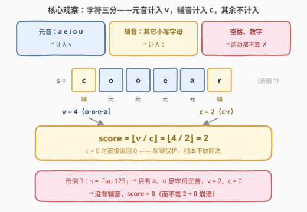
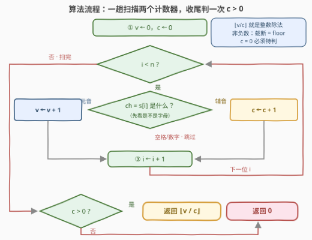

# LeetCode 元音辅音得分 题解

## 1. 题目概述

- **标题 / 题号**：元音辅音得分（#3813，easy）
- **链接**：https://leetcode.cn/problems/vowel-consonant-score/
- **难度**：简单
- **标签**：字符串、模拟

**题意**：给你一个字符串 `s`，由**小写英文字母、空格和数字**组成。令 $v$ 表示 `s` 中**元音字母**的数量，$c$ 表示**辅音字母**的数量。元音字母是 `'a'`、`'e'`、`'i'`、`'o'`、`'u'`，**英文字母表中除元音外的其它字母**均视为辅音。字符串 `s` 的**得分**定义如下：

- 如果 $c > 0$，则 $\text{score} = \lfloor v / c \rfloor$（向下取整到最接近的整数）；
- 否则（$c = 0$），$\text{score} = 0$。

返回一个整数，表示字符串的得分。

**示例 1**：

```text
输入：s = "cooear"
输出：2
解释：v = 4（'o','o','e','a'），c = 2（'c','r'），⌊4 / 2⌋ = 2。
```

**示例 2**：

```text
输入：s = "axeyizou"
输出：1
解释：v = 5（'a','e','i','o','u'），c = 3（'x','y','z'），⌊5 / 3⌋ = 1。
```

**示例 3**：

```text
输入：s = "au 123"
输出：0
解释：不含辅音字母（c = 0），直接得 0。
```

**约束**：$1 \le s.length \le 100$，`s` 仅由小写英文字母、空格和数字组成。

> 💡 **审题关键**：① **空格和数字既不是元音也不是辅音**——只有「英文字母」参与分类，这是本题唯一的陷阱；② $c = 0$ 时**直接返回 0**，既是题意规定，也顺带躲开除零；③ $v$、$c$ 均非负，$\lfloor v/c \rfloor$ 就是整数除法，不需要任何取整函数。

## 2. 解题思路

### 2.1 朴素思路：照题意直译，两趟统计

按定义分两步：第一趟数出 $v$（统计 `'a','e','i','o','u'` 的出现次数），第二趟数出 $c$（统计「是字母但不是元音」的次数），最后按定义算分。$n \le 100$，两趟也是线性，怎么写都能过——**效率不是本题考点**，风险全在**分类顺序**上：

- 若写成「是元音则 $v{+}{+}$，**否则** $c{+}{+}$」——空格和数字会被误计入 $c$。示例 3 恰好侥幸通过（误算成 $v=2$、$c=3$，$\lfloor 2/3 \rfloor = 0$ 碰巧等于正确答案 0），隐蔽性极强；但换个输入如 `s = "ab 1"`：正确分类 $v=1$、$c=1$ 得 1，误分类 $v=1$、$c=3$ 得 0，当场翻车；
- 若忘了 $c = 0$ 特判——整数除以零，C++ 是未定义行为，Python 直接抛 `ZeroDivisionError`。

所以朴素做法「能过」但「写错很常见」：先把「是不是字母」这道门守住，再谈元音 / 辅音。

### 2.2 核心观察：一趟扫描 + 三分类 + 除零保护



三个要点：

1. **三分类**：每个字符恰好落入三个桶之一——元音（计入 $v$）、辅音（计入 $c$）、空格/数字（两边都不算）。判定顺序必须是「**先 `isalpha`，再判元音**」：非字母在门口就被拦下，永远轮不到进辅音桶；
2. **一趟统计**：$v$、$c$ 两个计数器随扫随加，一趟 $O(n)$ 完成，无需两趟、无需容器；
3. **收尾判定**：扫完后若 $c = 0$ 返回 0（除零保护），否则返回整数除法 $v / c$——因 $v$、$c$ 均非负，C++ 的 `/`（向零截断）与 Python 的 `//`（向下取整）结果一致，都等于 $\lfloor v/c \rfloor$。

> 💡 元音集合大小恒为 5：5 次比较、`set` 查询、`str.find`、`switch` 任选，都是 $O(1)$ 且常数极小。

### 2.3 算法流程图



| 步骤 | 操作 | 说明 |
|------|------|------|
| ① 初始化 | `v ← 0`，`c ← 0` | 两个计数器 |
| ② 逐字符分类 | 非字母 → 跳过；元音 → `v++`；辅音 → `c++` | **先过 `isalpha` 这道门** |
| ③ 推进 | `i ← i + 1`，回到 ② | 直到扫完 |
| ④ 收尾判定 | `c > 0` ? 返回 `v / c` : 返回 `0` | 除零保护 |

### 2.4 示例演算

官方示例 2 `s = "axeyizou"`，逐字符分类：

| 字符 | a | x | e | y | i | z | o | u |
|------|---|---|---|---|---|---|---|---|
| 分类 | 元音 | 辅音 | 元音 | 辅音 | 元音 | 辅音 | 元音 | 元音 |
| $v$ | 1 | · | 2 | · | 3 | · | 4 | 5 |
| $c$ | · | 1 | · | 2 | · | 3 | · | · |

扫完得 $v = 5$、$c = 3$，$\text{score} = \lfloor 5/3 \rfloor = 1$ ✓

（示例 3 `s = "au 123"`：`'a'`、`'u'` 是元音，空格和 `'1','2','3'` 不是字母 → $v = 2$、$c = 0$ → 走除零保护分支，返回 0。）

## 3. 参考代码

### C++

```cpp
class Solution {
public:
    int vowelConsonantScore(string s) {
        auto isVowel = [](char ch) {
            return ch == 'a' || ch == 'e' || ch == 'i' || ch == 'o' || ch == 'u';
        };
        int v = 0, c = 0;
        for (char ch : s) {
            if (!isalpha(static_cast<unsigned char>(ch))) continue;  // 空格/数字：门口拦下
            if (isVowel(ch)) ++v;
            else ++c;
        }
        return c == 0 ? 0 : v / c;   // 非负整数除法 = 向下取整
    }
};
```

### Python

```python
class Solution:
    def vowelConsonantScore(self, s: str) -> int:
        vowels = set('aeiou')
        v = c = 0
        for ch in s:
            if not ch.isalpha():
                continue                      # 空格/数字：两边都不算
            if ch in vowels:
                v += 1
            else:
                c += 1
        return v // c if c else 0             # c = 0 防除零
```

> 💡 **写法要点**：① `isalpha` 必须放在元音判断**之前**——顺序反了会把空格/数字计入 $c$，且官方示例测不出来；② C++ 的 `isalpha` 传入 `char` 前转 `unsigned char` 是 `ctype` 家族的卫生习惯（避免负值 UB）；③ Python 一行版：`v = sum(map('aeiou'.__contains__, s))`，`c = sum(map(str.isalpha, s)) - v`，`return v // c if c else 0`——两个条件求和各自独立扫一遍，仍为 $O(n)$。

## 4. 复杂度分析

| 维度 | 复杂度 | 说明 |
|------|--------|------|
| **时间** | $O(n)$ | 每个字符一次分类判定，元音判断 $O(1)$ |
| **空间** | $O(1)$ | 两个计数器 + 恒定大小（5 个元素）的元音集合 |
| **量级判断** | $n \le 100$ | 线性扫描绰绰有余；$O(n)$ 已是下界（至少要读每个字符一次） |

## 5. 扩展：floor、截断与它们分道扬镳的时刻

- **为什么不需专门的 floor**：$v$、$c$ 均非负时，C++ 整数除法 `/` 向零截断 = 向下取整，Python `//` 本身就是 floor，两者天然一致。只在**负数**场合两者才分裂：$-7 / 2$ 截断得 $-3$，floor 得 $-4$——本题不可能出现负数，所以一行整数除法收工；
- **若把 floor 换成四舍五入**：纯整数实现可写 $(2v + c) / (2c)$（即 $\lfloor v/c + 1/2 \rfloor$），套路与本题同源——把取整问题化归为整数除法；
- **若元音不区分大小写**：先 `tolower` 再查表——[966. 元音拼写检查器](https://leetcode.cn/problems/vowel-spellchecker/) 就是这个套路的三连哈希版；
- **若要支持其它字母表**（如带变音符的 `é`）：写死 5 次比较立刻失效，需要查表或正则——本题约束「仅小写英文字母、空格和数字」才敢硬编码。

## 6. 面试要点

**Q1：这题唯一的陷阱是什么？**

> 分类顺序。「空格、数字既不是元音也不是辅音」——必须先 `isalpha` 过滤、再判元音；直接「不是元音就算辅音」会把非字母误计入 $c$，而且示例 3 恰好测不出这个 bug（误算后碰巧仍得 0），写对了才算真懂题。

**Q2：c = 0 为什么要特判？不判会怎样？**

> 题意明确规定 $c = 0$ 时得分为 0；不判就是整数除以零——C++ 未定义行为，Python 抛 `ZeroDivisionError`。示例 3 就是冲着这个边界设计的。

**Q3：⌊v/c⌋ 在 C++ 和 Python 里分别怎么写？**

> 直接整数除法：C++ `v / c`（向零截断，非负时等于 floor），Python `v // c`（本身就是 floor）。两者只在可能出现负数时才需要区分。

**Q4：这题还能更优雅吗？**

> Python 两个条件求和：`v = sum(ch in 'aeiou' for ch in s)`，`c = sum(ch.isalpha() for ch in s) - v`——「辅音数 = 字母数 − 元音数」把三分类压成两个布尔计数，可读性和正确率都不错。

**Q5：还能优化复杂度吗？**

> 不能也不必：得分依赖每个字符的类别，任何算法至少读一遍全部字符，$O(n)$ 时间、$O(1)$ 空间已是下界。

> 💡 **一句话总结**：3813 =「先 `isalpha` 再判元音」的**分类顺序** +「$c = 0$ 返回 0」的**除零保护**。带走的知识点：字符串分类题，先把「不属于任何类」的字符在门口拦下。

## 同类练习题

| # | 题目 | 与本题的关联 |
|---|------|-------------|
| 345 | [反转字符串中的元音字母](https://leetcode.cn/problems/reverse-vowels-of-a-string/)（[题解](../0301-0400/345_反转字符串中的元音字母.md)） | 双指针跳过非元音，同一个「元音判定」的对称用法 |
| 2586 | [统计范围内的元音字符串数](https://leetcode.cn/problems/count-the-number-of-vowel-strings-in-range/)（[题解](../2501-2600/2586_统计范围内的元音字符串数.md)） | 首尾字符都查元音集合，元音判定的区间计数版 |
| 966 | [元音拼写检查器](https://leetcode.cn/problems/vowel-spellchecker/)（[题解](../0901-1000/966_元音拼写检查器.md)） | 大小写归一 + 元音通配成集合，元音判定的哈希加速版 |
| 1641 | [统计字典序元音字符串的数目](https://leetcode.cn/problems/count-sorted-vowel-strings/)（[题解](../1601-1700/1641_统计字典序元音字符串的数目.md)） | 5 个元音上的 DP 计数，从「判定」走向「枚举」 |
| 1220 | [统计元音字母序列的数目](https://leetcode.cn/problems/count-vowels-permutation/)（[题解](../1201-1300/1220_统计元音字母序列的数目.md)） | 元音相邻约束上的路径计数，元音家族的 DP 进阶 |
