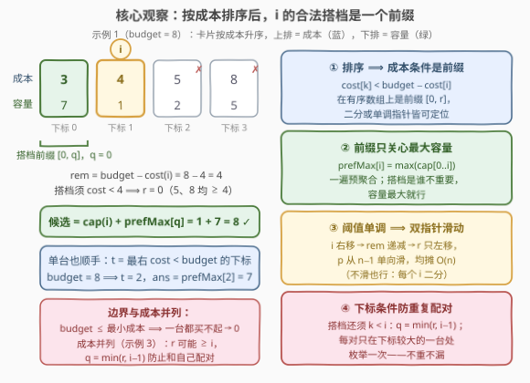
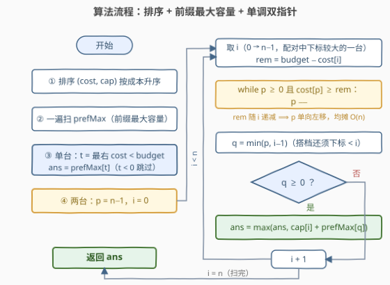

# LeetCode 预算下的最大总容量 题解

## 1. 题目概述

- **标题 / 题号**：预算下的最大总容量（#3814，medium）
- **链接**：https://leetcode.cn/problems/maximum-capacity-within-budget/
- **难度**：中等
- **标签**：数组、排序、双指针、二分查找

**题意**：给你两个长度为 $n$ 的整数数组 `costs` 和 `capacity`，其中 `costs[i]` 表示第 $i$ 台机器的**购买成本**，`capacity[i]` 表示其**性能容量**。同时给定一个整数 `budget`。

你可以选择**最多两台不同的机器**，使得所选机器的**总成本严格小于** `budget`。返回可以实现的**最大总容量**（一台都买不起时为 0）。

**示例 1**：

```text
输入：costs = [4,8,5,3], capacity = [1,5,2,7], budget = 8
输出：8
解释：选 costs[0] = 4 和 costs[3] = 3，总成本 7 < 8，
     总容量 capacity[0] + capacity[3] = 1 + 7 = 8。
```

**示例 2**：

```text
输入：costs = [3,5,7,4], capacity = [2,4,3,6], budget = 7
输出：6
解释：只选 costs[3] = 4 一台，总成本 4 < 7，总容量 6。
```

**示例 3**：

```text
输入：costs = [2,2,2], capacity = [3,5,4], budget = 5
输出：9
解释：选 costs[1] = 2 和 costs[2] = 2，总成本 4 < 5，总容量 5 + 4 = 9。
```

**约束**：$1 \le n \le 10^5$，$1 \le costs[i], capacity[i] \le 10^5$，$1 \le budget \le 2 \times 10^5$。

> 💡 **审题关键**：① 「**最多**两台」= 可选 0/1/2 台——拆成「单台最优」与「两台最优」两个子问题分别求解再取 max；② 是**严格小于** `budget` 而非 $\le$——搭档的成本阈值是 $budget - costs[i]$ 仍要严格小于；③ 两台机器必须**不同**（下标不同），成本相等的两台是合法组合（示例 3）；④ $n \sim 10^5$，$O(n^2)$ 枚举所有对约 $5 \times 10^9$ 次比较必然超时，需要 $O(n \log n)$。

## 2. 解题思路

### 2.1 暴力思路：枚举单台 + 枚举所有对

最直接的做法：遍历每台机器 $i$，若 $costs[i] < budget$ 则单台候选为 $capacity[i]$；再枚举所有有序对 $(i, j)$，$i < j$，若 $costs[i] + costs[j] < budget$ 则候选为 $capacity[i] + capacity[j]$。取所有候选的最大值。

问题是**对的，但太慢**：$n = 10^5$ 时有约 $\binom{n}{2} \approx 5 \times 10^9$ 个对。瓶颈在于「逐对验证」——必须想办法**一次扫一台机器就锁定它的最优搭档**，把 $O(n^2)$ 压成 $O(n \log n)$。

### 2.2 核心观察：排序后合法搭档是一个前缀——prefMax 聚合 + 单调阈值



把机器按**成本升序**排序（容量随行对齐）。现在固定一台机器 $i$，考察它的合法搭档需要满足什么：

1. **成本条件是前缀**：搭档 $k$ 须满足 $costs[k] < budget - costs[i]$（记阈值 $rem = budget - costs[i]$）。在**有序数组**上，「成本 $< rem$」的机器恰好是前缀 $[0, r]$，其中 $r$ 是最后一个成本 $< rem$ 的下标——一次二分（或指针滑动）即可定位；
2. **下标条件还是前缀**：为避免同一对被枚举两次、也避免和自己配对，约定**每对只在「下标较大的一台」处被枚举**，即搭档还须 $k < i$。两个条件取交仍是前缀：$[0, \min(r, i-1)]$，记 $q = \min(r, i-1)$；
3. **前缀只关心最大容量**：搭档具体是谁不重要，只要容量最大——预处理 $prefMax[i] = \max(cap[0..i])$，则机器 $i$ 的最优搭档收益就是 $prefMax[q]$，候选答案为 $cap[i] + prefMax[q]$；
4. **阈值单调 ⟹ 双指针**：$i$ 右移时 $costs[i]$ 不减 ⟹ $rem$ 不增 ⟹ $r$ 单调不增。所以 $r$ 可以用一个从 $n-1$ 出发**只向左滑**的指针 $p$ 均摊 $O(1)$ 地维护，全程总移动 $O(n)$——这就是标签里「双指针」的来历（不想推单调性也可以每个 $i$ 二分，$O(n \log n)$ 同阶）。

> 💡 **为什么不重不漏**：任何无序对 $\{a, b\}$（$a < b$）恰在 $i = b$ 时被考虑——此时 $a \le b - 1$ 且 $costs[a] < rem$ 等价于对的合法性，故 $a$ 落在前缀 $[0, q]$ 内，而 $prefMax[q] \ge capacity[a]$。所以对每个 $i$，「$cap[i] + prefMax[q]$」恰好是以 $i$ 为下标较大一台时的最优对；全部取 max 即全局最优。

**单台**也不另起炉灶：$t$ = 最右一个成本 $< budget$ 的下标（就是 $rem$ 取最大值的那个前缀边界），候选 $= prefMax[t]$；$t = -1$（`budget` 不超过最小成本，如 `budget = 1`）时一台都买不起，返回 0。

### 2.3 算法流程图



| 步骤 | 操作 | 说明 |
|------|------|------|
| ① 排序 | `sorted(zip(costs, capacity))` | 按成本升序，容量随之对齐 |
| ② 前缀聚合 | `prefMax[i] = max(cap[0..i])` | 一遍扫描，「前缀最优搭档」预聚合 |
| ③ 单台 | `t` = 最右 `cost < budget` 下标 | `ans = prefMax[t]`；`t = -1` 跳过 |
| ④ 两台 | `p = n-1`；`i` 从 0 到 $n-1$ | `i` 是配对中**下标较大**的一台 |
| ⑤ 指针左移 | `while p ≥ 0 且 cost[p] ≥ budget − cost[i]: p -= 1` | $rem$ 递减 ⟹ $p$ 单向左移，均摊 $O(1)$ |
| ⑥ 更新 | `q = min(p, i-1)`；`q ≥ 0` 则 `ans = max(ans, cap[i] + prefMax[q])` | 下标条件裁掉 $k \ge i$ 的部分 |

> ⚠️ **`p` 不要在内层重置**：$r(i)$ 关于 $i$ 单调不增，把 `p` 放在循环外、只进不退，才是均摊 $O(n)$；若每个 `i` 都从 `n-1` 重扫就退化回 $O(n^2)$。另一个易错点是忘了 `q = min(p, i-1)` 里的 `i-1`——成本并列时（示例 3）`p` 可能滑到 `i` 右边，不加裁剪会「和自己配对」。

### 2.4 示例演算

**官方示例 1** `costs = [4,8,5,3], capacity = [1,5,2,7], budget = 8`。

排序后 `sc = [3,4,5,8]`，`cap = [7,1,2,5]`，`prefMax = [7,7,7,7]`。

**单台**：$t = 2$（`cost 5 < 8`，`cost 8` 不行），候选 $= prefMax[2] = 7$。

**两台**（`p` 从 3 出发，只左移）：

| $i$ | $(sc[i], cap[i])$ | $rem = 8 - sc[i]$ | `p` 的移动 | $q = \min(p, i-1)$ | 候选 |
|-----|------------------|------------------|-----------|--------------------|------|
| 0 | (3, 7) | 5 | 8≥5、5≥5 → p=1 | $\min(1, -1) = -1$ | — |
| 1 | (4, 1) | 4 | 4≥4 → p=0 | $\min(0, 0) = 0$ | $1 + 7 = \mathbf{8}$ |
| 2 | (5, 2) | 3 | 3≥3 → p=−1 | −1 | — |
| 3 | (8, 5) | 0 | 已是 −1 | −1 | — |

答案 $= \max(7, 8) = 8$ ✓——选中 $(cost\ 3, cap\ 7)$ 与 $(cost\ 4, cap\ 1)$，总成本 $7 < 8$。

**官方示例 3**（成本并列）`costs = [2,2,2], capacity = [3,5,4], budget = 5`：$i = 2$ 时 $rem = 3$，$p$ 停在 2（所有成本 $2 < 3$），但 $q = \min(2, 1) = 1$——搭档只能在前缀 $[0,1]$ 里选，$prefMax[1] = 5$，候选 $4 + 5 = 9$ ✓。若忘了 `i-1` 裁剪，会拿 $cap[2] = 4$ 与自己相加得出错误答案。

## 3. 参考代码

### C++

```cpp
class Solution {
public:
    int maxCapacity(vector<int>& costs, vector<int>& capacity, int budget) {
        int n = costs.size();
        vector<pair<int, int>> m(n);                     // (成本, 容量)
        for (int i = 0; i < n; ++i) m[i] = {costs[i], capacity[i]};
        sort(m.begin(), m.end());                        // 按成本升序

        vector<int> prefMax(n);                          // 前缀最大容量
        for (int i = 0; i < n; ++i)
            prefMax[i] = i ? max(prefMax[i - 1], m[i].second) : m[i].second;

        int ans = 0;

        int t = n - 1;                                   // 单台：成本 < budget 的最右下标
        while (t >= 0 && m[t].first >= budget) --t;
        if (t >= 0) ans = max(ans, prefMax[t]);

        int p = n - 1;                                   // r(i)：成本 < budget − cost(i) 的最右下标
        for (int i = 0; i < n; ++i) {                    // i = 配对中下标较大的一台
            int rem = budget - m[i].first;
            while (p >= 0 && m[p].first >= rem) --p;     // rem 随 i 递减 → p 单调左移
            int q = min(p, i - 1);                       // 搭档还须下标 < i
            if (q >= 0) ans = max(ans, m[i].second + prefMax[q]);
        }
        return ans;
    }
};
```

### Python

```python
class Solution:
    def maxCapacity(self, costs: List[int], capacity: List[int], budget: int) -> int:
        m = sorted(zip(costs, capacity))            # 按成本升序，容量对齐
        n = len(m)
        sc = [c for c, _ in m]
        cap = [p for _, p in m]

        pref_max = [0] * n                          # 前缀最大容量
        for i, c in enumerate(cap):
            pref_max[i] = c if i == 0 else max(pref_max[i - 1], c)

        ans = 0
        t = n - 1                                   # 单台：成本 < budget 的最右下标
        while t >= 0 and sc[t] >= budget:
            t -= 1
        if t >= 0:
            ans = max(ans, pref_max[t])

        p = n - 1                                   # r(i)：成本 < budget − sc[i] 的最右下标
        for i in range(n):                          # i = 配对中下标较大的一台
            rem = budget - sc[i]
            while p >= 0 and sc[p] >= rem:
                p -= 1                              # rem 随 i 递减 → p 单调左移
            q = min(p, i - 1)                       # 搭档还须下标 < i
            if q >= 0:
                ans = max(ans, cap[i] + pref_max[q])
        return ans
```

> 💡 **写法要点**：① `zip` 成对排序，成本与容量天然对齐，不必排下标再回查；② 单台与两台共用 `prefMax`，`t` 与 `p` 是两支独立的下行指针；③ 数值上界：容量和 $\le 2 \times 10^5$、成本和 $\le 2 \times 10^5$，`int` 均安全。官方三个示例 + 2 万组随机小规模数据与 $O(n^2)$ 暴力对拍全部一致。

## 4. 复杂度分析

| 维度 | 复杂度 | 说明 |
|------|--------|------|
| **时间** | $O(n \log n)$ | 排序主导；`prefMax` 一遍 $O(n)$，两台扫描中 `p` 只左移、总移动 $\le n$，均摊 $O(n)$ |
| **空间** | $O(n)$ | 排序后的 $(cost, cap)$ 数组与 `prefMax` |
| **量级判断** | $n \sim 10^5$ | $O(n \log n) \approx 1.7 \times 10^6$，轻松通过；$O(n^2) \approx 5 \times 10^9$ 必超时 |

## 5. 扩展：二分写法 & 为什么 1099 式「两边夹」不能直接搬

### 5.1 二分写法

不想推指针单调性，可对每个 $i$ 直接二分：$r(i) = $ `bisect_left(sc, budget - sc[i]) - 1`（最后一个成本严格小于 $rem$ 的下标），再 $q = \min(r, i-1)$。总体 $O(n \log n)$，与排序同阶，工程上更直白、也更易推广到**多次查询**场景（`budget` 每次不同时阈值不再单调，指针失效，二分照样能用）。

### 5.2 与 1099「两边夹」的本质区别

[1099. 小于 K 的两数之和](https://leetcode.cn/problems/two-sum-less-than-k/)的经典双指针是 `i` 从左、`j` 从右向中间夹：**它最大化的是「和」本身**，`nums[i] + nums[j]` 关于两指针单调，所以端点即最优、夹一步丢一边。本题**最大化的是 capacity——一个与排序键（成本）无关的另一维度**：固定 $i$ 时最优搭档不是某个端点，而是「成本达标的前缀里容量最大的那台」。所以必须先用 `prefMax` 把前缀最优**预聚合**，再配合单调阈值扫一遍。「阈值卡前缀 + 前缀聚合另一维度的最大值」是这类题的通用骨架，[826. 安排工作以达到最大收益](https://leetcode.cn/problems/most-profit-assigning-work/)（能力阈值内最大化利润）是同一模式。

## 6. 面试要点

**Q1：为什么排序后机器 $i$ 的合法搭档是一个前缀？**

> 搭档须满足成本 $costs[k] < budget - costs[i]$。数组按成本升序后，「成本小于某阈值」的元素恰好构成前缀 $[0, r]$；再交上「下标 $< i$」（避免重复枚举与自配对）仍是前缀 $[0, \min(r, i-1)]$。前缀的最优搭档就是容量前缀最大值 $prefMax[q]$。

**Q2：如何保证每对机器不重不漏地被枚举？**

> 约定每对只在「下标较大的一台」处枚举：对 $\{a, b\}$（$a < b$），在 $i = b$ 时 $a$ 必落在合法前缀内，且 $prefMax[q] \ge capacity[a]$；反过来前缀里的任何机器与 $i$ 组合都合法。所以每个 $i$ 的候选就是以它为「较大下标」的最优对，全局取 max 即可。

**Q3：双指针 `p` 为什么是均摊 O(n)？什么时候必须退回二分？**

> $i$ 右移 ⟹ $costs[i]$ 不减 ⟹ 阈值 $rem$ 不增 ⟹ $r(i)$ 单调不增，所以 `p` 从 `n-1` 出发只左移、全程总移动不超过 $n$。若 `budget` 是每次查询不同的参数（多次询问），阈值关于扫描顺序不再单调，指针复用失效，应对每个 $i$ 二分。

**Q4：「严格小于」和「最多两台」分别怎么落地？**

> 严格小于：搭档条件写成 $costs[k] < budget - costs[i]$（不是 $\le$），指针条件 `cost[p] >= rem` 才左移；$rem \le 0$ 时无搭档。最多两台：单台分支（`t` 指针）与两台分支分别求最优再取 max；初始 `ans = 0` 已涵盖「零台」；又因容量为正，合法对的和必大于其中任何单台，取 max 自动覆盖「能选两台时不会更差」。

**Q5：成本相等的机器（示例 3）有什么坑？**

> 成本并列时 $r(i)$ 可能 $\ge i$——阈值允许「和自己一样的成本」，但搭档必须是**另一台**。`q = min(p, i-1)` 里的 `i-1` 把前缀裁到严格小于 $i$ 的下标，既防自配对，也保证每对只在下标较大处枚举一次。漏掉这步会得到 $4 + 4 = 8$ 这类错误答案（示例 3 的正确答案是 9）。

> 💡 **一句话总结**：3814 =「排序把成本约束坍缩成前缀」+「prefMax 预聚合前缀最优搭档」+「阈值单调让前缀边界单向滑动」。带走的知识点：当最优化的维度（容量）与排序的维度（成本）不同时，先聚合前缀最值，再用单调阈值双指针扫描。

## 同类练习题

| # | 题目 | 与本题的关联 |
|---|------|-------------|
| 1099 | [小于 K 的两数之和](https://leetcode.cn/problems/two-sum-less-than-k/)（[题解](../1001-1100/1099_小于K的两数之和.md)） | 首尾「两边夹」双指针原版——最大化「和」本身所以端点即最优，对照理解本题为何要加 prefMax |
| 2824 | [统计和小于目标的下标对数目](https://leetcode.cn/problems/count-pairs-whose-sum-is-less-than-target/)（[题解](../2801-2900/2824_统计和小于目标下标对数目.md)） | 排序 + 双指针统计「和严格小于目标」的对数，本题约束的计数版 |
| 2563 | [统计公平数对的数目](https://leetcode.cn/problems/count-the-number-of-fair-pairs/)（[题解](../2501-2600/2563_统计公平数对的数目.md)） | 排序 + 双指针统计和落在区间内的对数，把「单侧阈值」推广成「双侧区间」 |
| 826 | [安排工作以达到最大收益](https://leetcode.cn/problems/most-profit-assigning-work/)（[题解](../0801-0900/826_安排工作以达到最大收益.md)） | 能力阈值内最大化「利润」——阈值卡前缀 + 前缀聚合另一维度最大值的同款骨架 |
