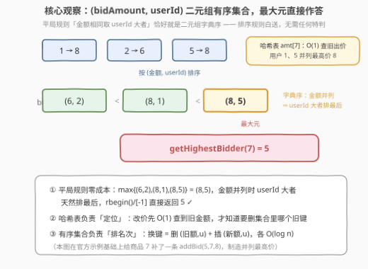
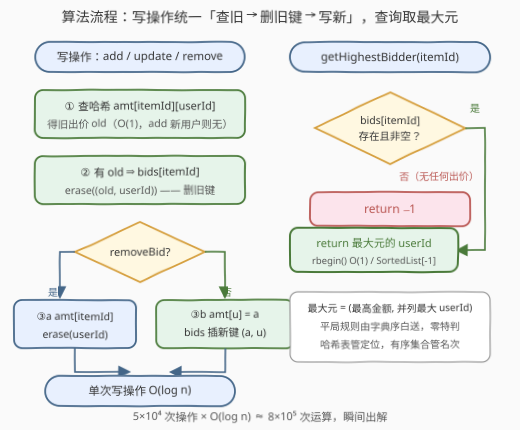

# 设计拍卖系统

- **题目名称**：设计拍卖系统
- **链接**：[3815. Design Auction System](https://leetcode.cn/problems/design-auction-system/)
- **难度**：中等
- **标签**：设计、哈希表、有序集合

## 1. 题目概述

请你设计一个拍卖系统，实时管理来自多个用户的出价。每条出价由三元组 `(userId, itemId, bidAmount)` 描述。实现 `AuctionSystem` 类：

- `AuctionSystem()`：初始化对象。
- `void addBid(int userId, int itemId, int bidAmount)`：为 `itemId` 添加 `userId` 的一条出价，金额为 `bidAmount`。如果同一个 `userId` 已经对 `itemId` 出过价，则**用新的 `bidAmount` 替换**原有出价。
- `void updateBid(int userId, int itemId, int newAmount)`：将 `userId` 对 `itemId` 的已有出价更新为 `newAmount`。题目**保证**此出价一定存在。
- `void removeBid(int userId, int itemId)`：移除 `userId` 对 `itemId` 的出价。题目**保证**此出价一定存在。
- `int getHighestBidder(int itemId)`：返回对 `itemId` 出价最高的用户 `userId`。若有多个用户出价**相同且最高**，返回 `userId` 较大的用户；若该商品没有任何出价，返回 `-1`。

**示例 1**：

```text
输入：
["AuctionSystem","addBid","addBid","getHighestBidder","updateBid","getHighestBidder","removeBid","getHighestBidder","getHighestBidder"]
[[],[1,7,5],[2,7,6],[7],[1,7,8],[7],[2,7],[7],[3]]

输出：
[null, null, null, 2, null, 1, null, 1, -1]

解释：
AuctionSystem obj = new AuctionSystem();
obj.addBid(1, 7, 5);        // 商品 7：用户 1 出价 5
obj.addBid(2, 7, 6);        // 商品 7：用户 2 出价 6
obj.getHighestBidder(7);    // 最高价 6 → 用户 2
obj.updateBid(1, 7, 8);     // 用户 1 改价为 8
obj.getHighestBidder(7);    // 最高价 8 → 用户 1
obj.removeBid(2, 7);        // 移除用户 2 的出价
obj.getHighestBidder(7);    // 只剩用户 1 → 1
obj.getHighestBidder(3);    // 商品 3 无出价 → -1
```

**约束条件**：

- $1 \le userId, itemId \le 5 \times 10^4$
- $1 \le bidAmount, newAmount \le 10^9$
- 最多调用 $5 \times 10^4$ 次 `addBid`、`updateBid`、`removeBid` 和 `getHighestBidder`
- 输入保证 `updateBid` 和 `removeBid` 操作给定的出价一定有效

> 💡 **审题关键**：① 「同用户对同商品同时至多一条出价」——`addBid` 是 **upsert**（存在则替换），这与 `updateBid` 实现完全同构；② 平局规则是「金额相同取 **userId 大者**」，注意不是小者；③ `getHighestBidder` 可能查从未出价的商品，须返回 `-1`；④ 出价金额到 $10^9$，但全程只比较、不累加，`int` 足够，无溢出风险。

---

## 2. 解题思路

### 2.1 暴力思路：哈希表存出价，查询线性扫

每个商品维护一个哈希表 `{userId: bidAmount}`：`addBid`/`updateBid`/`removeBid` 都是 `O(1)` 的哈希读写；`getHighestBidder` 扫描该商品全部出价取最大（并列取 `userId` 大者）：

```python
best = max(self.d[itemId].items(), key=lambda kv: (kv[1], kv[0]))[0]
```

单次查询 $O(k)$（$k$ 为该商品出价人数）。最坏情形 $5 \times 10^4$ 次查询 × $5 \times 10^4$ 条出价 ≈ $2.5 \times 10^9$ 次比较——C++ 勉强贴线、Python 必然超时。瓶颈只有一处：**最大值被反复重算**。出路：让「当前最高出价者」随时可查——有序集合动态维护名次。

### 2.2 核心观察：哈希表 + (bidAmount, userId) 有序集合



**观察一：平局规则被二元组字典序「白送」。** 把每条出价编码成二元组 `(bidAmount, userId)`，按**字典序**比较：金额不等比金额，金额相等比 `userId`。于是**有序集合的最大元恰好 = （最高金额，并列最高者中 userId 最大）**——题目要求的平局规则与排序规则严丝合缝，`rbegin()` / `[-1]` 直接作答，零特判。这不是巧合：并列取大者 ⟺ 第二关键字升序放队尾，凡是「主键优先、平局看次键」的取最值问题都能这样编码。

**观察二：改价 = 换键，换键前必须先查旧值。** 有序集合不提供「按 `userId` 修改」的接口——改价只能**删旧键 `(oldAmount, userId)` + 插新键 `(newAmount, userId)`**。要删旧键就得先知道 `oldAmount`，这靠第二张表：哈希表 `amt[itemId][userId] = bidAmount` 负责 `O(1)` 定位旧值。

**观察三：`addBid` 与 `updateBid` 实现完全相同。** `addBid` 是 upsert：有旧值走「删旧插新」，无旧值纯插入；`updateBid` 保证存在，是前者删旧插新路径的特例。两者共用一个 `setBid` 模板即可。

两个数据结构分工：

| 数据结构 | 职责 | 单次操作 |
|---------|------|---------|
| 哈希表 `amt[itemId][userId] = amount` | `O(1)` 查旧出价（定位待删旧键） | `O(1)` |
| 有序集合 `bids[itemId] = {(amount, userId)}` | 维护名次，最大元即时可取 | 增删 `O(\log n)`，取最大 `O(1)` |

> 💡 **一句话总结**：哈希表管「定位」，有序集合管「排名次」；`(金额, userId)` 的字典序让平局规则零成本。$5 \times 10^4$ 次操作 × $O(\log n)$ ≈ $8 \times 10^5$ 次运算，瞬间出解。

### 2.3 算法流程图



**逻辑执行步骤**：

| 步骤 | 操作 | 说明 |
|------|------|------|
| ① 查旧 | `amt[itemId]` 查 `userId` 的旧出价 `old` | 哈希表 `O(1)`；`addBid` 遇新用户时无旧值 |
| ② 删旧键 | `bids[itemId].erase((old, userId))` | 只有存在 `old` 才执行；有序集合 `O(log n)` |
| ③ 写新 | add/update：`amt[u]=a`，插新键 `(a, u)`；remove：`amt` 删 `u` | 三种写操作在②③处分叉，模板统一 |
| ④ 查询 | `bids[itemId]` 空 → `-1`；否则返回最大元的 `userId` | C++ `rbegin()` `O(1)`，Python `SortedList[-1]` |

> ⚠️ **顺序不能反**：必须先删旧键再插新键。若用户改价前后金额相同（`(a,u) → (a,u)`），「先删后插」依然正确（删 1 个插 1 个）；但若写成「先插后删」，会把刚插入的新键当旧键删掉，集合凭空丢数据——**删除条件依赖旧值时，旧值查询必须先行**。

### 2.4 示例演算

以示例 1 全流程走一遍（只跟踪商品 7 的两个结构）：

| 操作 | amt[7]（哈希表） | bids[7]（有序集合） | getHighestBidder |
|------|------------------|---------------------|------------------|
| `addBid(1,7,5)` | `{1:5}` | `{(5,1)}` | — |
| `addBid(2,7,6)` | `{1:5, 2:6}` | `{(5,1), (6,2)}` | — |
| `getHighestBidder(7)` | | 最大元 `(6,2)` | **2** ✓ |
| `updateBid(1,7,8)` | `{1:8, 2:6}` | 删 `(5,1)` 插 `(8,1)` → `{(6,2), (8,1)}` | — |
| `getHighestBidder(7)` | | 最大元 `(8,1)` | **1** ✓ |
| `removeBid(2,7)` | `{1:8}` | 删 `(6,2)` → `{(8,1)}` | — |
| `getHighestBidder(7)` | | 最大元 `(8,1)` | **1** ✓ |
| `getHighestBidder(3)` | 无此商品 | 空 | **-1** ✓ |

与期望输出 `[null, null, null, 2, null, 1, null, 1, -1]` 逐项一致 ✓。若再执行 `addBid(5,7,8)`：集合变 `{(8,1), (8,5)}`，最大元 `(8,5)` → 返回 5——金额并列时 `userId` 大者胜，正是 2.2 观察一的直接体现。

---

## 3. 参考代码

### C++

```cpp
class AuctionSystem {
    unordered_map<int, unordered_map<int, int>> amt;  // amt[itemId][userId] -> bidAmount
    unordered_map<int, set<pair<int, int>>> bids;     // bids[itemId] = {(amount, userId)} 升序

    // 三种写操作共用：把 (userId, itemId) 的出价设为 newAmount（无则新增）
    void setBid(int userId, int itemId, int newAmount) {
        auto it = amt[itemId].find(userId);
        if (it != amt[itemId].end()) {
            bids[itemId].erase({it->second, userId});   // 删旧键
            it->second = newAmount;
        } else {
            amt[itemId].emplace(userId, newAmount);
        }
        bids[itemId].insert({newAmount, userId});       // 插新键
    }

  public:
    void addBid(int userId, int itemId, int bidAmount) {
        setBid(userId, itemId, bidAmount);
    }

    void updateBid(int userId, int itemId, int newAmount) {
        setBid(userId, itemId, newAmount);
    }

    void removeBid(int userId, int itemId) {
        auto it = amt[itemId].find(userId);
        bids[itemId].erase({it->second, userId});       // 删旧键
        amt[itemId].erase(it);
    }

    int getHighestBidder(int itemId) {
        auto it = bids.find(itemId);
        if (it == bids.end() || it->second.empty()) return -1;
        return it->second.rbegin()->second;             // 最大元 = (最高额, 并列最大 userId)
    }
};
```

> 💡 **写法要点**：
> - `set<pair<int,int>>` 按 `(amount, userId)` 字典序升序，`rbegin()` 恰是「最高金额、并列取大」——平局规则零代码；
> - `addBid`/`updateBid` 合并为 `setBid`，语义上前者是 upsert、后者是保证存在的 update，实现同构；
> - `getHighestBidder` 先判「不存在或为空」，从未出价的商品（`bids.find` 失败）与出价被清空的商品统一返回 `-1`。

### Python

```python
from sortedcontainers import SortedList
from collections import defaultdict


class AuctionSystem:
    def __init__(self):
        self.amt = defaultdict(dict)                  # itemId -> {userId: bidAmount}
        self.bids = defaultdict(SortedList)           # itemId -> SortedList[(amount, userId)]

    def _set_bid(self, userId: int, itemId: int, newAmount: int) -> None:
        cur = self.amt[itemId]
        old = cur.get(userId)
        if old is not None:
            self.bids[itemId].remove((old, userId))   # 删旧键
        cur[userId] = newAmount
        self.bids[itemId].add((newAmount, userId))    # 插新键

    def addBid(self, userId: int, itemId: int, bidAmount: int) -> None:
        self._set_bid(userId, itemId, bidAmount)

    def updateBid(self, userId: int, itemId: int, newAmount: int) -> None:
        self._set_bid(userId, itemId, newAmount)

    def removeBid(self, userId: int, itemId: int) -> None:
        old = self.amt[itemId].pop(userId)
        self.bids[itemId].remove((old, userId))

    def getHighestBidder(self, itemId: int) -> int:
        s = self.bids.get(itemId)
        if not s:
            return -1
        return s[-1][1]                               # 最大元 = (最高额, 并列最大 userId)
```

> 💡 **写法要点**：
> - LeetCode Python 环境自带 `sortedcontainers`，`SortedList` 增删 `O(log n)`、取末元素即答案；
> - `getHighestBidder` 用 `bids.get(itemId)` 而非 `bids[itemId]`——后者会在 `defaultdict` 里凭空建空列表，白白泄漏内存（查询次数多达 $5 \times 10^4$）；
> - 不想依赖第三方库？第 5 节给出懒删除堆版，两份代码均已用示例 + 随机对拍（暴力核对 300 轮）验证通过。

---

## 4. 复杂度分析

| 维度 | 复杂度 | 说明 |
|------|--------|------|
| 写操作时间（add/update/remove） | $O(\log n)$ | $n$ 为该商品当前出价数：哈希 `O(1)` + 有序集合删/插各 $O(\log n)$ |
| `getHighestBidder` 时间 | $O(1)$（C++）/ $O(\log n)$（Python） | C++ `set::rbegin()` 恒定；`SortedList` 索引 $O(\log n)$ |
| 空间 | $O(q)$ | $q$ 为操作总数，任意时刻活跃出价数不超过其上界 $5 \times 10^4$ |

> - 总时间 $O(q \log q)$ ≈ $8 \times 10^5$ 次基本运算；
> - 对比暴力：最坏 $2.5 \times 10^9$ 次比较，慢三个数量级——差距全部来自「名次动态维护，最值免重扫」。

---

## 5. 扩展：无 `sortedcontainers` 时的懒删除堆

Python 标准库没有有序集合，可以退而求其次：**每个商品挂一个大根堆 + 懒删除**。写操作只管往堆里塞 `(-amount, -userId)`（取负变「金额大、并列 userId 大」优先），同时更新哈希表 `cur[itemId][userId] = amount`；`getHighestBidder` 时检查堆顶——若堆顶记录的金额与该用户**当前**哈希表中的金额不一致（改过价）或用户已删号（`cur` 查无此人），说明是陈旧条目，弹出后继续：

```python
class AuctionSystem:
    def __init__(self):
        self.cur = defaultdict(dict)   # itemId -> {userId: amount}（唯一事实来源）
        self.hp = defaultdict(list)    # itemId -> [(-amount, -userId)] 候选堆

    def addBid(self, userId, itemId, bidAmount):
        self.cur[itemId][userId] = bidAmount
        heapq.heappush(self.hp[itemId], (-bidAmount, -userId))

    def updateBid(self, userId, itemId, newAmount):
        self.cur[itemId][userId] = newAmount
        heapq.heappush(self.hp[itemId], (-newAmount, -userId))

    def removeBid(self, userId, itemId):
        del self.cur[itemId][userId]

    def getHighestBidder(self, itemId):
        cur, hp = self.cur.get(itemId), self.hp[itemId]
        if not cur:
            return -1
        while hp:
            a, u = -hp[0][0], -hp[0][1]
            if cur.get(u) == a:        # 与当前哈希表一致 → 是有效条目
                return u
            heapq.heappop(hp)          # 陈旧条目，弹掉
        return -1
```

要点有三：① 哈希表是**唯一事实来源**，堆只是候选池，判定「堆顶是否有效」只看金额是否对得上；② 用户改价 $5 \to 8 \to 5$ 会留下两条 `(5,u)` 同值候选——两者都「有效」，取谁答案都一样，无害；③ 每条堆条目至多被弹出一次，写操作 $O(\log n)$、查询**均摊** $O(\log n)$。这套「堆 + 懒删除 + 哈希对账」是纯标准库实现动态最值的万能模板（同款见 2034 股票价格波动）。

**变体速查**：若平局改取 `userId` **小**者，键改为 `(amount, -userId)` 即可；若 `addBid` 允许同一用户挂多条出价（出价历史），键 `(amount, userId)` 不再唯一，需追加流水号 `(amount, seq, userId)` 保证可删；若要 Top-K 出价者，堆版天然顺手，有序集合版需倒序遍历。

---

## 6. 面试要点

**Q1：为什么有序集合里存 `(amount, userId)` 二元组，而不是只存 amount 或只存 userId？**

> 单存 `amount` 无法定位「要删谁的条目」；单存 `userId` 则排序与金额无关。二元组一石二鸟：**键的唯一性**由 `userId` 保证（同用户同商品至多一条出价），**排序语义**由 `(amount, userId)` 字典序保证——最大元恰好满足「金额最高、并列取 userId 大者」。凡「主键优先、平局看次键」的取最值题，都应把两个关键字一起编码进有序结构。

**Q2：为什么必须有哈希表 `amt`？只用一个有序集合行不行？**

> 不行。改价/撤价都要**删旧键**，而旧键 `(oldAmount, userId)` 中的 `oldAmount` 只有哈希表能 `O(1)` 给出——只有有序集合的话，得按 `userId` 部分匹配扫全集合 `O(n)`。哈希表管「定位」，有序集合管「排名次」，双结构各司其职，这与 2353（食物评分）的 `rating→set` + 哈希表组合完全同构。

**Q3：`addBid` 和 `updateBid` 有什么区别？实现上如何统一？**

> 语义上 `addBid` 是 **upsert**（存在则替换、不存在则插入），`updateBid` 是保证存在的更新。但「替换」与「更新」落到有序集合上是同一件事：查旧值 → 删旧键 → 插新键。所以实现上统一为一个 `setBid` 模板，`updateBid` 只是其中删旧键分支必然命中的特例。识别「接口不同、实现同构」能砍掉一半代码。

**Q4：`getHighestBidder` 的复杂度到底是多少？**

> C++ `std::set` 的 `rbegin()` 是 `O(1)`（树最右节点有指针直通）。Python `SortedList[-1]` 是 $O(\log n)$（定位叶子层）。两者都不影响总量级 $O(q \log q)$。若面试官追问：堆 + 懒删除版查询是**均摊** $O(\log n)$——陈旧条目每个至多弹一次，代价摊给产生它的写操作。

**Q5：先插新键再删旧键行不行？**

> 危险。若改价前后金额相同，`(a,u)` 先插后删会把**新键**当作旧键删掉（集合里已无该元素时 `erase` 静默失败更糟——Python `SortedList.remove` 直接抛 `ValueError`）。「删除依赖旧值查询，旧值查询必须先行」是换键类模板的铁律，同款陷阱见 3391 的「删旧键插新键」。

> 💡 **一句话总结**：3815 = 哈希表定位 + `(金额, userId)` 字典序有序集合 + 统一「查旧删旧写新」模板。带走的三个关键：平局规则编码进排序键、双结构分工（定位 vs 名次）、先删旧后插新的换键顺序。

---

## 7. 同类练习题

- [2353. 设计食物评分系统](https://leetcode.cn/problems/design-a-food-rating-system/)：同款双结构——哈希表管「烹饪法 → 食物评分」定位、有序集合管名次，改评分同样是删旧键插新键
- [2034. 股票价格波动](https://leetcode.cn/problems/stock-price-fluctuation/)：本文第 5 节懒删除堆的出处——哈希表对账 + 大小顶堆弹陈旧条目，纯标准库维护动态最值
- [729. 我的日程安排表 I](https://leetcode.cn/problems/my-calendar-i/)：有序集合（`TreeMap`/`std::map`）维护区间端点，查询靠「前驱后继」——有序结构另一类用法
- [855. 考场就座](https://leetcode.cn/problems/exam-seat/)：有序集合维护已占座位，插入删除 + 按位置找最大间隔，考察有序集合的邻位查询
- [981. 基于时间的键值存储](https://leetcode.cn/problems/time-based-key-value-store/)：设计题对照——「输入天然有序」时降级为有序数组 + 二分，与本题的平衡树选择互为镜像
