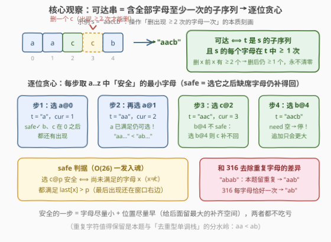
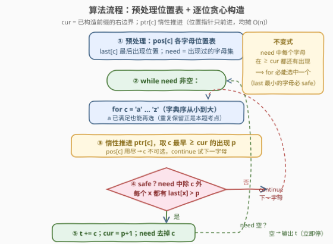

# 删除重复字符后的字典序最小字符串

- **题目名称**：删除重复字符后的字典序最小字符串
- **链接**：[3816. 删除重复字符后的字典序最小字符串](https://leetcode.cn/problems/lexicographically-smallest-string-after-deleting-duplicate-characters/)
- **难度**：困难
- **标签**：贪心、字符串、栈、哈希表、单调栈

## 1. 题目概述

给你一个字符串 `s`，它由小写英文字母组成。你可以进行如下操作**任意次**（可能为零次）：

- 选择当前字符串 `s` 中**至少出现两次**的任意一个字母，并删除其中的**一次出现**。

返回可以通过这种方式形成的**字典序最小**的结果字符串。

**示例 1**：

```text
输入: s = "aaccb"
输出: "aacb"
解释: 可以形成 "acb"、"aacb"、"accb" 和 "aaccb"，其中 "aacb" 字典序最小。
```

**示例 2**：

```text
输入: s = "z"
输出: "z"
解释: 无法进行任何操作。
```

**约束条件**：$1 \le s.length \le 10^5$，`s` 仅包含小写英文字母。

> 💡 **审题关键**：① 删除的前提是「出现**至少两次**」——任何一个字母的**最后一次出现永远删不掉**（删一个前必有 ≥2 个，删后仍剩 ≥1 个），所以结果串必须**保留每个出现过的字母至少一次**；② 删除不改变剩余字符的相对顺序，结果必是 `s` 的**子序列**；③ 字典序比较中**前缀更小**——这决定了「该停就停」（见 2.2）。

---

## 2. 解题思路

### 2.1 暴力思路：枚举所有可达串

最直接的枚举有两种，都指数级：

1. **枚举子序列**：枚举 $s$ 的所有 $2^n$ 个子序列，筛出「包含全部出现过的字母」的，取字典序最小；
2. **BFS 可达状态**：从 $s$ 出发，每次删一个「出现 ≥2 次」字母的一次出现，扩展所有可达串取最小——状态数同样是指数级。

$n \sim 10^5$ 下两者都不可行，必须找到可达串的**结构刻画**再贪心。

### 2.2 核心观察：可达 ⟺ 保全部字母的子序列 → 逐位贪心



**第一步：把操作翻译成结构**。可达字符串恰好是满足以下两条的 $t$：

$$t \text{ 可达} \iff t \text{ 是 } s \text{ 的子序列} \;\wedge\; s \text{ 的每个不同字母在 } t \text{ 中出现} \ge 1 \text{ 次}$$

- （⟹）删除保持相对顺序 ⟹ 子序列；「删前 ≥2 ⟹ 删后 ≥1」⟹ 字母出现次数永不清零；
- （⟐）给定这样的 $t$，把**被删位置从右往左删**：删位置 $q$ 的字母 $x$ 时，$x$ 在 $t$ 中还有 ≥1 次出现（位置都未被删），加上 $q$ 本身这一次，当前串中 $x$ 出现 ≥2 次——删除合法。归纳可得 $t$ 可达。

于是问题变为：**求字典序最小的「保全部字母」子序列**。

**第二步：逐位贪心**。设已构造前缀的右边界为 $cur$（下一个字符只能取下标 $\ge cur$），尚未在结果中出现过的字母集合为 $need$。每一步**从 `'a'` 到 `'z'`** 依次尝试字母 $c$，取它在 $\ge cur$ 的**最早出现位置** $p$，检查是否**安全（safe）**：

$$\text{safe}(c, p) \iff \forall x \in need \setminus \{c\}:\ last[x] > p$$

其中 $last[x]$ 是字母 $x$ 的**最后出现位置**——只要 $x$ 的最后一次出现还在 $p$ 右边，$x$ 之后必能补上。选第一个 safe 的字母追加，$cur \leftarrow p+1$，并把它从 $need$ 中移除。

三个关键结论：

1. **选最早出现位置不亏**：位置越靠左，$cur$ 越小，留给后续补齐 $need$ 字母的空间越大——固定字母下最早出现严格占优；
2. **$need$ 空了立即停**：当前前缀已是合法答案，而任何字符串都是自己真前缀的「更大者」（前缀更小），追加任何字符只会让字典序变大；
3. **重复字符值得保留**：`'a'` 已在结果里也照样可以再选——`"abab"` 的答案是 `"aab"`（两个 `a` 都留）而不是 `"ab"`。这正是本题与 316「去除重复字母」的分水岭（详见第 5 节）。

> ⚠️ **别急着套单调栈**：316 的单调栈写法依赖「每个字母恰好保留一次」，会把 `"aaccb"` 的第二个 `a` 拒之门外，得到 `"acb"`——而正确答案是 `"aacb"`。约束从「恰好一次」放宽到「至少一次」后，贪心的形态从「栈上弹栈」变成了「逐位构造」。

### 2.3 算法流程图：位置表 + 惰性指针



| 步骤 | 操作 | 说明 |
|------|------|------|
| ① 预处理 | `pos[c]` 收集每个字母的出现下标；`last[c]` = 最后出现；`need` = 出现过的字母集合 | 一次线性扫描 |
| ② 循环 | `while need 非空` | $need$ 每步至多变小的集合，最多清空 26 个字母 |
| ③ 找位置 | 对 $c = $ `'a'`…`'z'`：惰性推进 `ptr[c]` 跳过 $< cur$ 的下标，得最早 $p \ge cur$ | `pos[c]` 用尽则 $c$ 不可选，试下一字母 |
| ④ safe 判定 | $need \setminus \{c\}$ 中每个 $x$ 都有 $last[x] > p$？ | 否 → continue 下一字母；是 → 选中 |
| ⑤ 提交 | `t += c`；`cur = p+1`；`ptr[c]++`；$need$ 去掉 $c$ | 回到 ② |
| ⑥ 收尾 | $need$ 空 → 立即输出 `t` | 停止即最优，绝不追加 |

> 💡 **终止性（不会死循环）**：贪心维持不变式「$need$ 中每个字母在 $\ge cur$ 都有出现」。此时取 $need$ 中 $last$ 最小的字母 $c^*$，其最早可用位置 $p \le last[c^*] \le last[x]$（$\forall x \in need$），且 $p \ne last[x]$（不同字母位置不同）⟹ $last[x] > p$ 恒成立，$c^*$ **必 safe**——`for` 循环每轮必选中一个字母，$need$ 单调缩小，循环必然终止。

### 2.4 示例演算

官方示例 1 `s = "aaccb"`（下标 0–4），`pos: a=[0,1], c=[2,3], b=[4]`，`last: a=1, c=3, b=4`：

| 步 | cur | 候选尝试 | safe 检查（$need\setminus\{c\}$ 的 last） | 决策 | t |
|----|-----|----------|------------------------------------------|------|-----|
| 1 | 0 | **a**@0 | $b:4>0$ ✓，$c:3>0$ ✓ | 选 a@0 | `"a"` |
| 2 | 1 | **a**@1（a 已满足仍可选） | $b:4>1$ ✓，$c:3>1$ ✓ | 选 a@1 | `"aa"` |
| 3 | 2 | b@4 ✗（$c:3 \le 4$，选 b@4 则 c 补不回）→ **c**@2 | $b:4>2$ ✓ | 选 c@2 | `"aac"` |
| 4 | 3 | **b**@4 | $need\setminus\{b\}=\varnothing$ | 选 b@4 | `"aacb"` |

$need$ 清空，立即停止，输出 `"aacb"` ✓。注意步 2 保留了重复的 `a`（`"aa…"` < `"ac…"`）、步 3 拒绝了更靠后的 `b`（保住 `c` 的最后一次出现）——两个关键决策各出现一次。

---

## 3. 参考代码

### C++

```cpp
class Solution {
public:
    string lexSmallestAfterDeletion(string s) {
        int n = s.size();
        vector<vector<int>> pos(26);          // 每个字母的出现下标（升序）
        vector<int> last(26, -1);             // 每个字母的最后出现位置
        for (int i = 0; i < n; ++i) {
            int c = s[i] - 'a';
            pos[c].push_back(i);
            last[c] = i;
        }
        vector<int> ptr(26, 0);               // 惰性指针：pos[c] 中下一个可用下标
        int needMask = 0;                     // 尚未满足的字母位掩码
        for (char ch : s) needMask |= 1 << (ch - 'a');

        string res;
        int cur = 0;                          // 已构造前缀的右边界
        while (needMask) {
            for (int c = 0; c < 26; ++c) {    // 字典序从小到大尝试
                auto& ps = pos[c];
                while (ptr[c] < (int)ps.size() && ps[ptr[c]] < cur) ++ptr[c];
                if (ptr[c] == (int)ps.size()) continue;      // c 再无可用出现
                int p = ps[ptr[c]];                          // 最早 >= cur 的出现
                bool ok = true;                              // safe 检查
                for (int x = 0; x < 26 && ok; ++x)
                    if ((needMask >> x & 1) && x != c && last[x] <= p) ok = false;
                if (!ok) continue;
                res += 'a' + c;
                cur = p + 1;
                ++ptr[c];
                needMask &= ~(1 << c);       // c 已满足（但仍可再选）
                break;
            }
        }
        return res;                           // need 空 = 立即停，追加只会更大
    }
};
```

### Python

```python
class Solution:
    def lexSmallestAfterDeletion(self, s: str) -> str:
        n = len(s)
        pos = [[] for _ in range(26)]
        last = [-1] * 26
        for i, ch in enumerate(s):
            c = ord(ch) - 97
            pos[c].append(i)
            last[c] = i
        ptr = [0] * 26
        need_mask = 0
        for ch in set(s):
            need_mask |= 1 << (ord(ch) - 97)

        # need 中 last 最小/次小：把 safe 检查压到 O(1)
        m1c, m1v, m2v = -1, n, n

        def refresh():                        # need 变化时重算（至多 26 次）
            nonlocal m1c, m1v, m2v
            m1c, m1v, m2v = -1, n, n
            for c in range(26):
                if need_mask >> c & 1:
                    if last[c] < m1v:
                        m2v, m1v, m1c = m1v, last[c], c
                    elif last[c] < m2v:
                        m2v = last[c]

        refresh()
        res = []
        cur = 0
        while need_mask:
            for c in range(26):
                plist = pos[c]
                q = ptr[c]
                while q < len(plist) and plist[q] < cur:   # 惰性推进
                    q += 1
                if q == len(plist):
                    ptr[c] = q
                    continue
                p = plist[q]
                bit = 1 << c
                # need \ {c} 的最小 last：m1c==c 时用次小，否则用最小
                thr = (m2v if m1c == c else m1v) if (need_mask & bit) else m1v
                if p < thr:                                # safe
                    res.append(chr(97 + c))
                    cur = p + 1
                    ptr[c] = q + 1
                    if need_mask & bit:
                        need_mask &= ~bit
                        refresh()
                    break
                ptr[c] = q
        return ''.join(res)
```

> 💡 **写法要点**：① `ptr[c]` 惰性推进——$cur$ 单调递增，每个指针总计只前进 $\le |pos[c]|$ 步，均摊 $O(n)$；② C++ 版 safe 检查直接扫 26 位（最坏 $O(26^2 |t|) \approx 6.8 \times 10^7$，几毫秒）；Python 版维护 $need$ 中 **last 最小/次小**，把每步检查压成 $O(26)$ 扫描 + $O(1)$ 判定（实测 $n = 10^5$ 约 0.06s）；③ 循环条件只有 `need_mask`——**need 空即停**是正确性的一部分，不是偷懒。

---

## 4. 复杂度分析

| 维度 | 复杂度 | 说明 |
|------|--------|------|
| **时间** | $O(n + 26 \cdot \lvert t \rvert)$（Python 优化版；C++ 为 $O(n + 26^2 \cdot \lvert t \rvert)$） | 预处理线性；每步 26 个候选，指针推进均摊总计 $O(n)$；$\lvert t \rvert \le n$ |
| **空间** | $O(n)$ | `pos` 位置表共 $n$ 个下标 + `last` / `ptr` / 位掩码常数个 |
| **量级判断** | $n \sim 10^5$ | $26 \lvert t \rvert \le 2.6 \times 10^6$ 量级的循环，两种语言都轻松通过 |

---

## 5. 扩展：与 316「去除重复字母」——一词之差，两套算法

本题题面几乎是 316 的镜像升级，但约束从「每个字母**恰好一次**」变成「**至少一次**」，最优解法随之换轨：

| | 316 去除重复字母 | 3816 本题 |
|---|---|---|
| 目标 | 每字母恰好一次的最小子序列 | 每字母至少一次的最小子序列 |
| `"aaccb"` | `"acb"`（去重） | `"aacb"`（两个 `a` 都留） |
| `"abab"` | `"ab"` | `"aab"` |
| 解法 | **单调栈**：栈顶更大且后文还会出现就弹 | **逐位构造贪心**：每步取最小 safe 字母 |
| 判停 | 所有字母都入过栈 | $need$ 清空即停（前缀 < 延伸） |

单调栈在 316 里依赖的交换性质是「栈顶弹出后仍可在后文补回**恰好一次**」；本题允许重复后，弹出的代价无法这样局部衡量——比如 `"aaccb"` 中把第二个 `a`「弹掉/拒收」直接丢掉最优解。逐位贪心换成了全局视角：每一步只在「**保证缺席字母仍补得回**」的前提下取最小字母，重复保留（`need` 里没有它也照选）与拒收大字母（safe 检查失败）都自然涌现。这一家族还有 [402. 移掉 K 位数字](https://leetcode.cn/problems/remove-k-digits/) 的「栈顶更大就弹」与 [2375. 根据模式串构造最小数字](https://leetcode.cn/problems/construct-smallest-number-from-di-string/) 的「构造时尽量小」——**字典序最优 = 逐位贪心**是共同灵魂，具体形态随约束变化。

---

## 6. 面试要点

**Q1：操作的可达集合怎么刻画？为什么要双向证明？**

> 可达串 ⟺「$s$ 的子序列」∧「$s$ 每个不同字母出现 ≥1 次」。⟹ 方向：删除保序 ⟹ 子序列；删 $x$ 前出现 ≥2 ⟹ 删后 ≥1，次数永不清零。⟐ 方向：把被删位置**从右往左**删——删位置 $q$ 的 $x$ 时，$x$ 在保留部分还有 ≥1 次，加上 $q$ 自身这次，当前出现 ≥2 次，操作合法。两个方向合上，操作题才真正变成结构化的子序列题。

**Q2：safe 判据为什么只看 $last[x]$？选最早出现位置为什么不亏？**

> 「选 $c@p$ 后 $x$ 仍补得回」⟺ $x$ 在 $p$ 右边还有出现 ⟺ $last[x] > p$——一次比较替代整段扫描。最早位置让 $cur = p+1$ 最小，后续可选项是「更晚位置对应选项」的超集，可行性只增不减，所以固定字母下最早出现严格占优。

**Q3：need 空了为什么立刻停？多保留字符不是信息更多吗？**

> 字典序里**前缀小于其任何延伸**。当前前缀已含全部字母、本身就是合法答案；任何继续追加的结果串以它为前缀，必然更大。所以「停」不是启发式，是硬正确性——同理步 2 里保留重复的 `a` 也只服务于「当前位最小」。

**Q4：怎么保证 for 循环每轮一定选中一个字母（不会死循环）？**

> 贪心维持不变式：$need$ 中每个字母在 $\ge cur$ 仍有出现（初始成立，每次 safe 选择后由 $last[x] > p$ 保持）。取 $need$ 中 $last$ 最小的字母 $c^*$，其最早可用位置 $p \le last[c^*]$，而其他 $need$ 字母的 $last$ 都 $\ge last[c^*] \ge p$ 且 $\ne p$（不同字母不同位置），故全大于 $p$——$c^*$ 必 safe。

**Q5：为什么单调栈（316 套路）在这题会错？**

> 316 的弹栈依据「栈顶字母后文还会出现，弹了也能补回，且只能补一次」，配合每个字母只入栈一次。本题允许重复保留：`"aaccb"` 里第二个 `a` 必须留在结果中（`"aacb"` < `"acb"`），单调栈的「去重入栈」逻辑会直接把它拒掉。约束从「恰好一次」变「至少一次」，局部交换论证失效，改用全局逐位贪心。

> 💡 **一句话总结**：3816 =「操作可达 ⟺ 保全部字母的子序列」的**双向刻画** +「每步取最小 safe 字母」的**逐位构造贪心** +「need 空即停」。带走的知识点：字典序最优问题先想逐位贪心，可行性判定（safe 检查）配 $last$ 数组一发入魂；遇到「至少一次 vs 恰好一次」的措辞差异要立刻警觉解法可能换轨。

---

## 7. 同类练习题

- [316. 去除重复字母](https://leetcode.cn/problems/remove-duplicate-letters/)（[题解](../0301-0400/316_去除重复字母.md)）：本题的孪生兄弟——「每个字母恰好一次」版，单调栈解法；对照体会「至少一次」为何逼出另一套贪心
- [1081. 不同字符的最小子序列](https://leetcode.cn/problems/smallest-subsequence-of-distinct-characters/)（[题解](../1001-1100/1081_不同字符的最小子序列.md)）：与 316 完全同款的去重型单调栈，适合先练再回看本题
- [402. 移掉 K 位数字](https://leetcode.cn/problems/remove-k-digits/)：「栈顶更大就弹」的字典序贪心家族成员，体会局部交换论证的适用边界
- [2375. 根据模式串构造最小数字](https://leetcode.cn/problems/construct-smallest-number-from-di-string/)（[题解](../2301-2400/2375_根据模式串构造最小数字.md)）：构造满足约束的字典序最小串，同样是「逐位取最小 + 可行性兜底」的套路
