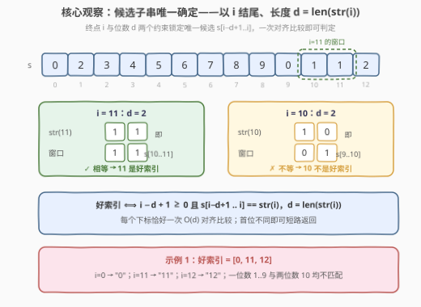
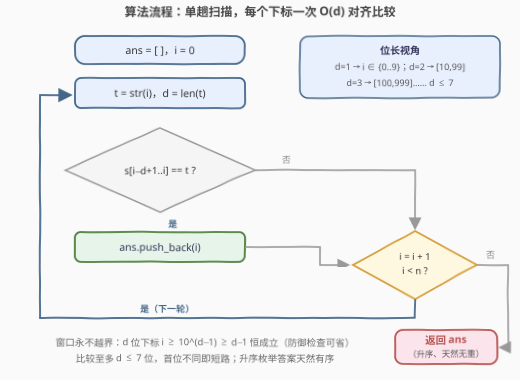

# 数字字符串中的好索引

- **题目名称**：数字字符串中的好索引
- **链接**：[3817. 数字字符串中的好索引](https://leetcode.cn/problems/good-indices-in-a-digit-string/)
- **难度**：中等
- **标签**：字符串、枚举、模拟

## 1. 题目概述

> ⚠️ 本题为 LeetCode 付费题，题意描述根据官方示例用例与 hints 重建，可能与官方题面有出入。

给定一个仅由数字字符组成的字符串 `s`，其下标从 0 开始。

对于每个下标 $i$，记 $\mathrm{str}(i)$ 为 $i$ 的**十进制表示**（如 $\mathrm{str}(11) = \text{"11"}$、$\mathrm{str}(0) = \text{"0"}$），记 $d = \big|\mathrm{str}(i)\big|$ 为其位数。

如果 `s` 中**以位置 $i$ 结尾、长度恰为 $d$** 的子串 $s[i-d+1..i]$ 与 $\mathrm{str}(i)$ 完全相同，则称 $i$ 为**好索引**。

返回 `s` 中所有好索引构成的列表（升序）。

**示例 1**：

```text
输入：s = "0234567890112"
输出：[0, 11, 12]
解释：i=0  → "0"  == s[0..0]   = "0"  ✓
      i=11 → "11" == s[10..11] = "11" ✓
      i=12 → "12" == s[11..12] = "12" ✓
      其余下标均不匹配，如 i=10 → "10" ≠ s[9..10] = "01"。
```

**示例 2**：

```text
输入：s = "01234"
输出：[0, 1, 2, 3, 4]
解释：每个一位数下标 i 处的字符恰为 str(i)，全部匹配。
```

**示例 3**：

```text
输入：s = "12345"
输出：[]
解释：s[0]='1' ≠ "0"、s[1]='2' ≠ "1"…… 无任何匹配。
```

**约束条件**（付费题原文不可见，按题意推定）：

- $1 \le s.length \le 10^5$（推定）
- `s` 仅由数字 `'0'`–`'9'` 组成

> 💡 **审题关键**：① 合法子串必须**恰好以 $i$ 结尾**——同样的内容出现在别处不算数；② 子串长度由 $i$ 的**十进制位数**决定，$i = 0$ 视作 `"0"`（1 位）；③ 于是每个下标的待检子串**唯一**，不存在多个候选。示例 2/3 的设计（全匹配 vs 全不匹配）也印证下标从 0 开始——若按 1 开始，两例会得到完全相同的答案 `[1,2,3,4]`。

---

## 2. 解题思路

### 2.1 暴力思路

最直接的想法：对每个下标 $i$，把 `s` 的**所有**子串都拿出来与 $\mathrm{str}(i)$ 比一遍，看是否存在「以 $i$ 结尾、且等于 $\mathrm{str}(i)$」的那个——$O(n^2)$ 个子串、每个比较 $O(d)$，总量 $O(n^2 \cdot d) \approx 10^{11}$，$n = 10^5$ 时远超时限。

但这里 99% 的功夫是白费的：与 $i$ 相关的约束（**终点 $i$ + 长度 $d$**）已经把要看的子串**唯一锁定**了。

### 2.2 核心观察：候选子串唯一确定，一次对齐比较即可



把两个约束拼起来：

- **终点固定**：合法子串必须以 $i$ 结尾——右端点就是 $i$；
- **长度固定**：它必须等于 $\mathrm{str}(i)$，故长度恰为 $d = \big|\mathrm{str}(i)\big|$。

左端点 $i - d + 1$ 随之唯一确定，于是候选子串**只有一个**：$s[i-d+1..i]$。

$$i \text{ 是好索引} \iff s[i-d+1..i] = \mathrm{str}(i)$$

一次 $O(d)$ 的对齐比较即可判定，无需任何匹配算法。

**位长分组视角**：$d$ 只随 $i$ 的位数跳变——

| $d$ | $i$ 的范围 | 备注 |
|-----|-----------|------|
| 1 | $\{0\} \cup [1, 9]$ | $\mathrm{str}(0) = $ "0" |
| 2 | $[10, 99]$ | |
| 3 | $[100, 999]$ | |
| … | … | $n \le 10^6$ 时 $d \le 7$ |

还有一个漂亮的性质：**窗口永不越界**。$d$ 位下标满足 $i \ge 10^{d-1} \ge d - 1$（归纳易证 $10^{d-1} \ge d-1$ 对一切 $d \ge 1$ 成立），故 $i - d + 1 \ge 0$ 恒真；又 $i \le n-1$，右端点天然合法。代码里的越界检查只是防御式编程，逻辑上永远不触发。

> 💡 **对应官方 hints**：①「合法子串必须恰在 $i$ 结尾」→ 终点固定；②「子串由 $i$ 的十进制数位决定」→ 长度固定；③「把 $i$ 的字符串形式与以 $i$ 结尾、等长的子串比较」→ 唯一候选的一次比较。三条 hints 就是在把人往「唯一候选」上引。

### 2.3 算法流程图



| 步骤 | 操作 | 说明 |
|------|------|------|
| ① 初始化 | `ans = []`，`i = 0` | 升序枚举保证答案有序 |
| ② 构造模式串 | `t = str(i)`，`d = len(t)` | `to_string` / `str()` 直接得 |
| ③ 对齐比较 | `s[i-d+1 .. i] == t ?` | 唯一候选，$O(d)$ 次，首位不同即短路 |
| ④ 记录 | 相等则 `ans.push_back(i)` | 只在相等时动手 |
| ⑤ 推进 | `i = i + 1`，直到 `i = n` | 单趟完成，返回 `ans` |

### 2.4 示例演算

**示例 1** `s = "0234567890112"`（$n = 13$）：

| $i$ | $d$ | $\mathrm{str}(i)$ | 窗口 $s[i-d+1..i]$ | 好索引？ |
|-----|-----|------------------|--------------------|----------|
| 0 | 1 | "0" | "0" | ✓ |
| 1 | 1 | "1" | "2" | ✗ |
| 2 | 1 | "2" | "3" | ✗ |
| 3 | 1 | "3" | "4" | ✗ |
| 4 | 1 | "4" | "5" | ✗ |
| 5 | 1 | "5" | "6" | ✗ |
| 6 | 1 | "6" | "7" | ✗ |
| 7 | 1 | "7" | "8" | ✗ |
| 8 | 1 | "8" | "9" | ✗ |
| 9 | 1 | "9" | "0" | ✗ |
| 10 | 2 | "10" | "01" | ✗ |
| 11 | 2 | "11" | "11" | ✓ |
| 12 | 2 | "12" | "12" | ✓ |

答案 $= [0, 11, 12]$ ✓。注意 $i = 9$ 处 `s[9] = '0'`：虽然 `'0'` 是 "10" 的首字符，但 "10" 的对齐**终点**必须是位置 10，而 $s[9..10] = $ "01" ≠ "10"——**终点约束**正是本题最容易被看漏的地方。

---

## 3. 参考代码

### C++

```cpp
class Solution {
public:
    vector<int> goodIndices(string s) {
        int n = s.size();
        vector<int> ans;
        for (int i = 0; i < n; ++i) {
            string t = to_string(i);
            int d = t.size();
            if (i - d + 1 >= 0 && s.compare(i - d + 1, d, t) == 0) {
                ans.push_back(i);
            }
        }
        return ans;
    }
};
```

> 💡 **写法要点**：`s.compare(pos, len, t)` 一步完成「取窗口 + 比较」，不产生子串临时拷贝；`i - d + 1 >= 0` 由 2.2 的证明恒真，保留纯属防御式编程。

### Python

```python
class Solution:
    def goodIndices(self, s: str) -> List[int]:
        return [i for i in range(len(s)) if s[i - len(str(i)) + 1 : i + 1] == str(i)]
```

> 💡 **写法要点**：Python 切片自带越界截断，何况窗口本就永不越界；`str(i)` 出现两次，竞赛可拆一个变量接住，此处保留一行流优先可读性。

---

## 4. 复杂度分析

| 维度 | 复杂度 | 说明 |
|------|--------|------|
| **时间** | $O(n \cdot L)$，$L = \lfloor \log_{10} n \rfloor + 1$ | 每个下标一次 $O(d)$ 比较；$n \le 10^5$ 时 $L \le 6$，总量 $\le 6 \times 10^5$ 次字符比较 |
| **空间** | $O(1)$（不计输出） | 仅需模式串 `t`，至多 7 字节 |
| **量级判断** | $n \sim 10^5$ | 全子串枚举 $O(n^2 d) \approx 10^{11}$ 必超时；锁定唯一候选后仅一个线性趟 |

严格地说，总代价是 $\sum_{i=0}^{n-1} \big|\mathrm{str}(i)\big| = \Theta(n \log_{10} n)$；但 $L \le 7$ 是有界小常数，工程视角说「总体线性、每个下标至多 7 次比较」更准确。

---

## 5. 扩展

**① 计数版本。** 若只问好索引的个数，同样单趟统计；输出列表本就要求扫一遍，两者渐近相同。

**② 好索引有多稀疏？** 对均匀随机的数字串，长度 $d$ 的窗口全匹配概率为 $10^{-d}$。$i \ge 10$ 后 $d \ge 2$，期望密度不足 1%；$i \ge 100$ 后 $d = 3$，密度不足 0.1%。只有当 `s` 恰与「$0,1,2,\ldots$ 的拼接串」（Champernowne 型串）局部重合时，好索引才会大面积出现——本质是 `s` 与下标序列的自相似。

**③ 若 $n$ 大到 $10^7$ 级。** 逐个 `to_string` 的常数会成为瓶颈。可按位长 $d$ 分块：块内 $i$ 递增时其十进制串**只有末几位变化**，对模式串做增量维护；或对 `s` 预处理字符串哈希把每次比较降为 $O(1)$——整体仍是 $O(n)$，但常数更优。

**④ 变体练习。**
- 「以 $i$ **开头**、长度为 $d$ 的子串等于 $\mathrm{str}(i)$」：窗口改为 $s[i..i+d-1]$，此时**会**越界（$i + d - 1 \ge n$ 需要判断），对称但不等价；
- 「$\mathrm{str}(i)$ 出现在 `s` 中**任意位置**即算」：退化为 $n$ 个模式的多模式匹配，需 Aho-Corasick 自动机，与本题完全不同。

---

## 6. 面试要点

**Q1：为什么每个下标只有一个待检子串？**

> 两个约束正交：终点 $i$ 钉死右端点，位数 $d = \big|\mathrm{str}(i)\big|$ 钉死长度，左端点 $i-d+1$ 随之唯一。一次 $O(d)$ 比较即判定——这正是官方三条 hints 逐步引导的结论。

**Q2：窗口会越界吗？$i = 0$ 怎么处理？**

> 不会。$d$ 位下标满足 $i \ge 10^{d-1} \ge d-1$，故 $i-d+1 \ge 0$ 恒真；右端 $i \le n-1$ 天然合法。$i = 0$ 的十进制表示是 `"0"`（1 位），与 $s[0]$ 比较即可，无需特判。

**Q3：复杂度该说 $O(n \log n)$ 还是 $O(n)$？**

> 精确量是 $\sum_i \big|\mathrm{str}(i)\big| = \Theta(n \log_{10} n)$；但 $L \le 7$ 是有界小常数，说「每个下标至多 7 次字符比较、总体线性」更能传达规模直觉。两种说法都对，关键是说清口径。

**Q4：这题需要 KMP / 字符串哈希吗？**

> 不需要。模式串随 $i$ 逐个变化，KMP「一次预处理、多次匹配」的优势消失；而每趟只比至多 7 位、首位不同即短路，朴素比较就是最优做法。若改成「固定模式在 `s` 中所有出现位置」，才轮到 KMP / Z 函数（见同类练习 28 题）。

**Q5：输出为什么天然升序且无重复？**

> 按下标从 0 到 $n-1$ 依次判定、命中即追加，顺序即升序；每个 $i$ 至多判定一次，天然无重——不需要排序与去重的后处理。

> 💡 **一句话总结**：3817 =「终点固定 + 长度固定 $\Rightarrow$ 候选子串唯一」+「单趟对齐比较」。两个带走的知识点：把分散约束拼成**唯一候选**再动手；用 $10^{d-1} \ge d-1$ 一行不等式证明**窗口永不越界**。

---

## 7. 同类练习题

- [28. 找出字符串中第一个匹配项的下标](https://leetcode.cn/problems/find-the-index-of-the-first-occurrence-in-a-string/)（[题解](../0001-0100/28_找出字符串中第一个匹配项的下标.md)）：固定模式的子串匹配（KMP 模板题），对照本题「模式随下标变化、无需匹配算法」的差异
- [415. 字符串相加](https://leetcode.cn/problems/add-strings/)（[题解](../0401-0500/415_字符串相加.md)）：数字字符串的十进制逐位处理，同款「把数当串」的基本功
- [2283. 判断一个数的数字计数是否等于数位的值](https://leetcode.cn/problems/check-if-number-has-equal-digit-count-and-digit-value/)（[题解](../2201-2300/2283_判断一个数的数字计数是否等于数位的值.md)）：下标/数位与字符串内容互证的自指型题，审题套路相同
- [1946. 子字符串突变后可能得到的最大整数](https://leetcode.cn/problems/largest-number-after-mutating-substring/)（[题解](../1901-2000/1946_子字符串突变后可能得到的最大整数.md)）：数字串上按位长/位值做子串决策，同样是「数位 + 子串」的组合
