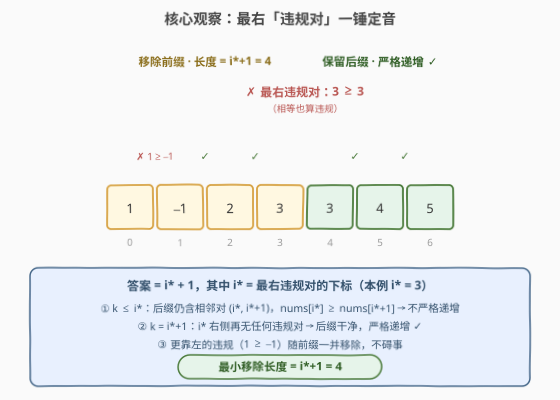
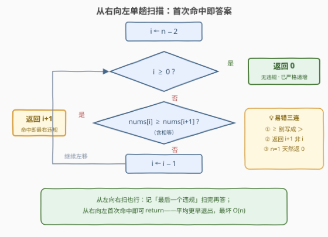

# LeetCode 移除前缀使数组严格递增 题解

## 1. 题目概述

- **标题 / 题号**：移除前缀使数组严格递增（#3818，medium）
- **链接**：https://leetcode.cn/problems/minimum-prefix-removal-to-make-array-strictly-increasing/
- **难度**：中等
- **标签**：数组、一次遍历

**题意**：给你一个整数数组 `nums`。

你需要从 `nums` 中**恰好**移除一个前缀（可以为空）。

返回一个整数，表示被移除的前缀的**最小**长度，使得剩余的数组**严格递增**。

数组的**前缀**是从数组的起始位置开始，一直延伸到任意位置的子数组。如果一个数组的每个元素都严格大于它的前一个元素（若存在），则称该数组**严格递增**。

**示例 1**：

```text
输入：nums = [1,-1,2,3,3,4,5]
输出：4
解释：移除前缀 prefix = [1, -1, 2, 3] 后，剩余数组为 [3, 4, 5]，严格递增。
```

**示例 2**：

```text
输入：nums = [4,3,-2,-5]
输出：3
解释：移除前缀 prefix = [4, 3, -2] 后，剩余数组为 [-5]，严格递增。
```

**示例 3**：

```text
输入：nums = [1,2,3,4]
输出：0
解释：数组 nums = [1, 2, 3, 4] 已经是严格递增的，因此移除空前缀即可。
```

**约束**：

- $1 \le nums.length \le 10^5$
- $-10^9 \le nums[i] \le 10^9$

> 💡 **审题关键**：① 移除的是**前缀** ⟹ 保留的必然是一个**后缀** `nums[k:]`；② 前缀**可以为空**——数组本身严格递增时答案为 0；③ 「严格」递增：相邻**相等**也算违规（示例 1 的两个 3）；④ 移除长度最多 $n-1$ 即可（只留最后一个元素必然严格递增），答案一定存在。

## 2. 解题思路

### 2.1 暴力思路

枚举移除长度 $k = 0, 1, \ldots, n-1$，对每个 $k$ 从头检查 `nums[k:]` 是否严格递增，返回首个可行的 $k$。单次检查 $O(n)$，总体 $O(n^2)$；$n = 10^5$ 时最坏约 $10^{10}$ 次比较，必然超时。

浪费是明显的：检查 $k$ 与 $k+1$ 时，后缀 `nums[k+1:]` 里的相邻对被反复比较。而「每个起点的后缀干不干净」这件事，一次**从右向左**的扫描就能全部刻画出来。

### 2.2 核心观察：最右「违规对」一锤定音



定义**违规对**：下标 $i$ 满足 $nums[i] \ge nums[i+1]$（**相等也是违规**）。设 $i^*$ 为**最右**违规对的下标，则：

$$\text{后缀 } nums[k:] \text{ 严格递增} \iff k > i^*$$

三句话证明：

1. **$k \le i^*$ 必无效**：后缀完整包含相邻对 $(i^*,\, i^*+1)$，而 $nums[i^*] \ge nums[i^*+1]$ 破坏严格递增；
2. **$k = i^*+1$ 必有效**：$i^*$ 是最右违规，其右侧所有相邻对都满足 $<$，后缀干净；
3. **最小性**：$k$ 越小保留越多，$i^*+1$ 已是可行的下界。

$$ans = \begin{cases} i^* + 1, & \text{存在违规对} \\ 0, & \text{整个数组已严格递增} \end{cases}$$

> 💡 注意：比 $i^*$ 更靠左的违规对（如示例 1 的 $1 \ge -1$）**不需要关心**——它们落在被移除的前缀里，随切割一并消失。真正卡住切点的只有**最右**那一个。

### 2.3 算法流程图



| 步骤 | 操作 | 说明 |
|------|------|------|
| ① 初始化 | $i \leftarrow n-2$ | 从倒数第二格开始（$n=1$ 时循环体不执行） |
| ② 判违规 | 检查 $nums[i] \ge nums[i+1]$？ | 注意 $\ge$：相等也算违规 |
| ③ 命中即返 | 是 ⟹ 返回 $i+1$ | 从右向左首个命中 = 最右违规 $i^*$ |
| ④ 左移 | 否 ⟹ $i \leftarrow i-1$，回到 ② | |
| ⑤ 扫完无违规 | $i < 0$ ⟹ 返回 $0$ | 整个数组已严格递增，移空前缀即可 |

### 2.4 示例演算

**示例 1** `nums = [1,-1,2,3,3,4,5]`，从右向左检查相邻对：

| 检查的对 | 比较 | 结果 |
|----------|------|------|
| $(5,6)$：$4$ vs $5$ | $4 < 5$ | ✓ 继续 |
| $(4,5)$：$3$ vs $4$ | $3 < 4$ | ✓ 继续 |
| $(3,4)$：$3$ vs $3$ | $3 \ge 3$ | ✗ **命中！返回 $3+1=4$** |

注意 $(0,1)$ 处 $1 \ge -1$ 同样是违规对，但它更靠左、会被前缀带走，扫描根本走不到那里。**示例 2** `[4,3,-2,-5]` 从右向左第一步就命中 $(-2,-5)$，返回 $3$；**示例 3** `[1,2,3,4]` 全程无违规，返回 $0$。

## 3. 参考代码

### C++

```cpp
class Solution {
public:
    int minimumPrefixLength(vector<int>& nums) {
        for (int i = (int)nums.size() - 2; i >= 0; --i) {
            if (nums[i] >= nums[i + 1]) return i + 1;  // 命中最右违规对
        }
        return 0;  // 无任何违规：空前缀即可
    }
};
```

### Python

```python
class Solution:
    def minimumPrefixLength(self, nums: List[int]) -> int:
        for i in range(len(nums) - 2, -1, -1):
            if nums[i] >= nums[i + 1]:
                return i + 1      # 命中最右违规对
        return 0                  # 无任何违规：空前缀即可
```

> 💡 **写法要点**：
> - 判断必须用 $\ge$ 而非 $>$——严格递增要求相邻**不等**，示例 1 的 $(3,3)$ 正是靠它拦下；
> - $n = 1$ 时 Python 的 `range(-1, -1, -1)` 为空、C++ 循环条件直接不成立，天然返回 0，无需特判；
> - 首次命中即 `return`：平均情况提前终止；最坏情况（已严格递增）也只扫满一趟 $O(n)$。

## 4. 复杂度分析

| 维度 | 复杂度 | 说明 |
|------|--------|------|
| **时间** | $O(n)$ | 单趟从右向左扫描，命中即返回 |
| **空间** | $O(1)$ | 只用下标 $i$，原地判断 |
| **量级判断** | $n \sim 10^5$ | 暴力 $O(n^2) \approx 10^{10}$ 必超时；一趟扫描仅 $10^5$ 次比较 |

## 5. 扩展

**① 换成移除「后缀」呢？** 保留的变成前缀 `nums[0..k]`，对称地由**最左**违规对 $i_{\min}$ 决定：前缀不能越过 $i_{\min}+1$，最长保留到下标 $i_{\min}$，答案 $= n - 1 - i_{\min}$，无违规则为 $0$。「删前缀看最右、删后缀看最左」互为镜像。

**② 换成移除「至多一个元素」呢？** 即 [1909. 删除一个元素使数组严格递增](https://leetcode.cn/problems/remove-one-element-to-make-the-array-strictly-increasing/)：破坏点相邻纠缠，需按「删 $i-1$ / 删 $i$ / 删 $i+1$」分类讨论，仍是 $O(n)$ 但 corner case 明显变多——对照体会「删前缀」约束的特殊性：切割自由度只剩一个标量 $k$，才让最右违规一锤定音。

**③ 本题的「对偶量」。** 答案 $= i^*+1$，反过来说**最长严格递增后缀**的长度 $= n - (i^*+1) = n - ans$。本题等价于先求最长严格递增后缀、再取其补集——把「最小化移除」翻译成「最大化保留」，是很多题第一步的转化。

**④ 放宽为「不减」。** 若只要求剩余数组非递减，把违规对的定义换成 $nums[i] > nums[i+1]$ 即可，其余框架原封不动——**先定「什么叫坏」，再找「最右的坏」**，是这类线性扫描题的通用骨架。

## 6. 面试要点

**Q1：为什么保留的一定是后缀？问题是如何转化的？**

> 移除前缀 $\iff$ 保留后缀 `nums[k:]`。后缀是否严格递增只由**它内部的相邻对**决定，与被切掉的部分无关——把「枚举 $k$ 再验证」反转成「一趟扫描刻画所有 $k$ 的公共结构」，才能一步到位。

**Q2：为什么最右违规对决定答案？**

> 双向夹逼：$k \le i^*$ 的后缀必含坏对 $(i^*, i^*+1)$，无效；$k = i^*+1$ 时其右侧再无坏对，有效。可行集是 $\{i^*+1, \ldots, n-1\}$，最小元即 $i^*+1$。

**Q3：有哪些边界情况？**

> ① $n=1$：单元素天然严格递增，返回 0（循环体不执行，免特判）；② 相邻相等：严格递增要求 $<$，判断必须写 $\ge$；③ 已整体严格递增：返回 0（空前缀）。

**Q4：从右向左扫和从左向右扫，孰优？**

> 正确性等价：从左向右须记住「最后一个违规下标」，扫完统一返回；从右向左**首次命中即最右违规**，可以直接 `return`，代码更短、平均提前退出。二者都是 $O(n)/O(1)$。

**Q5：和暴力相比，到底省在哪里？**

> 暴力对每个 $k$ 重复检查后缀的相邻对；一次从右向左的扫描把「每个起点 $k$ 的后缀是否干净」全部刻画——后缀干净 $\iff k$ 位于最右违规之后。这与前缀和「一趟扫描预刻画所有区间量」的思想同源。

> 💡 **一句话总结**：3818 =「删前缀 ⟹ 保后缀」+「后缀严格递增 $\iff$ 切点在最右违规之后」+「从右向左首次命中即答案」。带走三个点：相等也算违规（判 $\ge$）；更左的违规随前缀消失、只有最右的卡切点；最小化移除 = 最大化保留的对偶转化。

## 同类练习题

| # | 题目 | 与本题的关联 |
|---|------|-------------|
| 1909 | [删除一个元素使数组严格递增](https://leetcode.cn/problems/remove-one-element-to-make-the-array-strictly-increasing/)（[题解](../1901-2000/1909_删除一个元素使数组严格递增.md)） | 同为「修复严格递增」，从删前缀换成删单个元素，需分类讨论 |
| 896 | [单调数列](https://leetcode.cn/problems/monotonic-array/)（[题解](../0801-0900/896_单调数列.md)） | 一次线性扫描判定单调性的基础模板 |
| 941 | [有效的山脉数组](https://leetcode.cn/problems/valid-mountain-array/)（[题解](../0901-1000/941_有效的山脉数组.md)） | 线性扫描 + 相邻符号判断的进阶练习 |
| 2210 | [统计数组中峰和谷的数量](https://leetcode.cn/problems/count-hills-and-valleys-in-an-array/)（[题解](../2201-2300/2210_统计数组中峰和谷的数量.md)） | 相邻对比较驱动的一次遍历计数 |
| 300 | [最长递增子序列](https://leetcode.cn/problems/longest-increasing-subsequence/)（[题解](../0201-0300/300_最长递增子序列.md)） | 递增性从「连续后缀」放宽到「子序列」的经典 DP |
